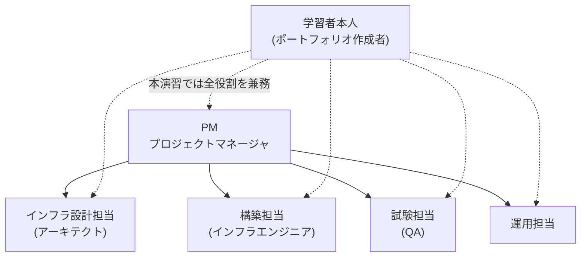
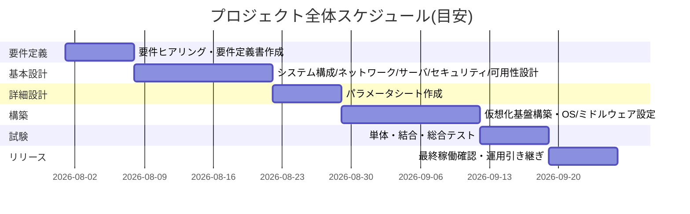

# DOC-01 プロジェクト概要書

> **📘 学習ポイント**
> この文書は、システム開発の一番最初に作る「なぜこのプロジェクトをやるのか」をまとめた文書です。実務では、いきなりサーバーの設定を考え始めることはありません。まず発注者(お客様)が抱えている課題を整理し、プロジェクトの目的・ゴール・やること/やらないこと(スコープ)・体制・スケジュールを関係者全員で合意してから、初めて設計に着手します。この文書は、後続のDOC-02(要件定義書)以降すべての設計判断の「土台」となるものであり、面接では「なぜこの構成にしたのですか?」と聞かれた際に立ち返って説明できる場所でもあります。

## 改訂履歴

| 版数 | 日付 | 内容 | 作成者 |
|---|---|---|---|
| v0.1 | 2026年8月1日 | 初版作成(発注者ヒアリング内容をもとにドラフト作成) | 〇〇 〇〇 |
| v1.0 | 2026年8月20日 | スコープ・体制・スケジュールを確定し正式版として発行 | 〇〇 〇〇 |

## 文書情報

| 項目 | 内容 |
|---|---|
| 文書番号 | DOC-01 |
| 文書名 | プロジェクト概要書 |
| 作成日 | 2026年8月1日 |
| 最終改訂日 | 2026年8月20日 |
| バージョン | v1.0 |
| 作成者 | 〇〇 〇〇 |
| レビュー者 | （レビュー者名を記入） |

## 目次

1. [発注者概要](#1-発注者概要)
2. [現状の課題](#2-現状の課題)
3. [プロジェクトの背景と目的](#3-プロジェクトの背景と目的)
4. [プロジェクトゴール](#4-プロジェクトゴール)
5. [スコープ(対象/対象外)](#5-スコープ対象対象外)
6. [学習環境と本番環境の対応](#6-学習環境と本番環境の対応)
7. [プロジェクト体制](#7-プロジェクト体制)
8. [全体スケジュール概要](#8-全体スケジュール概要)
9. [関連文書一覧](#9-関連文書一覧)

---

## 1. 発注者概要

本プロジェクトの発注者は、架空企業である**株式会社サンプル物産**である。実在する企業ではなく、ポートフォリオ演習のために設定した想定顧客である。

| 項目 | 内容 |
|---|---|
| 商号 | 株式会社サンプル物産(架空企業) |
| 設立 | 1985年4月(演習用の想定設定) |
| 所在地 | 東京都内(本社1拠点) |
| 従業員数 | 60名 |
| 事業内容 | 食品・日用雑貨の卸売業 |
| 主要取引先 | 都内近郊の中小小売店・飲食店 |
| 情報システム管理体制 | 専任のIT部門はなく、総務部担当者1名がIT業務を兼務している |

株式会社サンプル物産は中堅の卸売企業であり、社内の情報システムは長年、最低限の投資で運用されてきた。専任のIT部門を持たず、総務担当者が片手間でサーバーやPCの面倒を見ているという状態は、中小・中堅企業では非常によくあるパターンであり、本演習ではこの「よくある現場」を題材にしている。

---

## 2. 現状の課題

発注者へのヒアリングにより、以下の4つの課題領域が明らかになった。

| No | 課題領域 | 現状 | 放置した場合のリスク |
|---|---|---|---|
| 1 | ファイル共有基盤 | 老朽化したWindows Server 2012の共有フォルダのみで全社データを運用している | OSのサポートが既に終了しており脆弱性が放置される。ハードウェア故障時に全社の業務データにアクセスできなくなる |
| 2 | アカウント管理 | 社内アカウントが各PCのローカルアカウントとしてバラバラに管理されている | 誰がどのPCにどんな権限でログインできるか一元的に把握できない。異動・退職時のアカウント削除漏れが発生しやすく、情報漏えいの温床になる |
| 3 | サーバの死活監視 | サーバが正常に稼働しているかを監視する仕組みが存在しない | 障害の発生に「業務が止まってから」気づくことになり、原因調査・復旧までの時間が余計にかかる |
| 4 | バックアップ運用 | 手動でUSB HDDにコピーするのみで、世代管理(何日前のデータかを複数世代残す仕組み)がされていない | 誤操作・機器故障・ランサムウェア被害などでデータが失われた場合、直近の正しい状態まで復旧できない可能性が高い |

> **💡 なぜこう設計するのか**
> 課題を「機能が足りない」ではなく「〇〇という領域にリスクがある」という切り口で整理しているのは、実務の設計書でよく使われる書き方だからです。単に「共有フォルダが古い」で終わらせず、「なぜそれが問題なのか(リスク)」まで言語化しておくことで、後の章で立てる「プロジェクトゴール」との対応関係が明確になり、採用担当者にも「課題→目的→ゴール」の筋道がわかりやすくなります。

---

## 3. プロジェクトの背景と目的

### 3.1 背景

株式会社サンプル物産では、事業規模の拡大とともに社内で扱うデータ量・取引先とのやり取りが増加している。しかし情報システム基盤への投資は長年後回しにされてきており、前章で整理した4つの課題が同時に存在する状態となっていた。

老朽化したファイルサーバの更新時期が近づいていることを機に、単なるハードウェアのリプレースにとどまらず、認証基盤・監視・バックアップまでを含めた社内ITインフラ全体を刷新するプロジェクトとして企画された。これが本プロジェクトの背景である。

### 3.2 目的

本プロジェクトの目的は、以下のとおりである。

- 老朽化したファイル共有基盤を刷新し、部門ごとのアクセス制御を実現できる仕組みに置き換える
- バラバラに管理されている社内アカウントを、認証基盤(LDAP。Lightweight Directory Access Protocolの略で、ユーザーアカウントなどの情報を一元管理するためのディレクトリサービスの通信プロトコル)(※用語集(12_用語集.md)参照)により統合管理する
- 将来的に稼働させる社内向け業務ポータル(Webアプリケーション)のための基盤を整備する
- サーバの稼働状況を常時把握できる監視体制を整備する
- 世代管理された定期バックアップ体制を整備し、データ消失リスクに備える
- 以上のすべてを、ネットワークセグメントを分離した安全な設計のもとで実現する

---

## 4. プロジェクトゴール

プロジェクトゴールは、定性面・定量面の両方で定義する。

### 4.1 定性ゴール(何を実現するか)

| No | ゴール | 対応する主要サーバ・仕組み |
|---|---|---|
| 1 | 部門別アクセス制御付きファイル共有基盤の刷新 | srv-file01(Samba 4.19、LDAP連携認証) |
| 2 | 社内アカウントの統合管理(認証基盤の構築) | srv-ldap01(OpenLDAP 2.6) |
| 3 | 社内向け業務ポータル(Webアプリ)を稼働させる基盤整備 | srv-web01(Apache/PHP)、srv-db01(MariaDB) |
| 4 | サーバ監視体制の整備 | srv-mon01(Zabbix Server/Web 6.4) |
| 5 | 定期バックアップ体制の整備 | srv-bk01(rsync、cron) |
| 6 | 安全なネットワーク設計の実現 | gw-fw01(ファイアウォール/ルーティング)、VLANによるセグメント分離 |

### 4.2 定量ゴール(達成度合いをどう測るか)

| 指標 | 目標値 | 補足 |
|---|---|---|
| RPO(目標復旧時点。障害発生時にどの時点の状態までデータを復旧できることを目標とするかを表す指標)(※用語集(12_用語集.md)参照) | 24時間以内 | 詳細はDOC-07 基本設計書_可用性バックアップ設計編を参照 |
| RTO(目標復旧時間。障害発生からシステムを復旧させるまでにかけてよい許容時間を表す指標)(※用語集(12_用語集.md)参照) | 4時間以内 | 同上 |
| バックアップ世代数 | 4世代保持 | 日次差分(23:00)+週次フル(日曜23:00) |
| 対象サーバ台数 | 9台(仮想マシン) | 詳細はDOC-05 基本設計書_サーバ設計編を参照 |
| ネットワークセグメント数 | 5セグメント(WAN/管理LAN/サーバLAN/内部LAN/DMZ) | 詳細はDOC-04 基本設計書_ネットワーク設計編を参照 |
| 定例パッチ適用サイクル | 月次(第1月曜) | dnf updateによる定例適用。詳細はDOC-11 運用保守設計書を参照 |

> **💡 なぜこう設計するのか**
> ゴールを「定性(何を実現するか)」と「定量(どこまで達成できたら成功と言えるか)」の両方で書くのは、実務のプロジェクトマネジメントの基本です。「監視体制を整備する」だけでは、それが完成したのかどうかを誰も判断できません。RPO・RTOのように数値で測れる基準を用意しておくことで、試験工程(DOC-10)で「合格・不合格」を客観的に判定できるようになります。

---

## 5. スコープ(対象/対象外)

### 5.1 対象システム一覧

本プロジェクトの対象は、株式会社サンプル物産の社内ITインフラ(オンプレミス想定の仮想サーバ群)である。対象サーバは以下の9台であり、値はDOC-05 基本設計書_サーバ設計編に定める正式なサーバ一覧と完全に一致させている。

| No | ホスト名 | 役割 | 設置セグメント | IPアドレス | OS | 主要ミドルウェア | スペック(vCPU/メモリ/ディスク) |
|---|---|---|---|---|---|---|---|
| 1 | gw-fw01 | ゲートウェイ/ファイアウォール(セグメント間ルーティング・NAT) | 全セグメントに接続(マルチホーム) | 各セグメントの.1 | AlmaLinux 9.4 | firewalld, nftables | 2vCPU/2GBメモリ/20GBディスク |
| 2 | mgmt-pc01 | 管理端末(踏み台サーバ) | 管理LAN | 192.168.10.11 | AlmaLinux 9.4 | OpenSSH | 2vCPU/2GBメモリ/20GBディスク |
| 3 | srv-dns01 | DNS/DHCPサーバ(社内NTPサーバも兼務) | サーバLAN | 192.168.20.11 | AlmaLinux 9.4 | BIND 9.18, Kea DHCP 2.4, chrony | 2vCPU/2GBメモリ/20GBディスク |
| 4 | srv-ldap01 | 認証統合サーバ | サーバLAN | 192.168.20.12 | AlmaLinux 9.4 | OpenLDAP 2.6 | 2vCPU/4GBメモリ/30GBディスク |
| 5 | srv-web01 | 社内業務ポータルWebサーバ | サーバLAN | 192.168.20.13 | AlmaLinux 9.4 | Apache HTTP Server 2.4, PHP 8.2 | 2vCPU/4GBメモリ/40GBディスク |
| 6 | srv-db01 | データベースサーバ | サーバLAN | 192.168.20.14 | AlmaLinux 9.4 | MariaDB 10.11 | 4vCPU/8GBメモリ/60GBディスク |
| 7 | srv-file01 | ファイル共有サーバ | サーバLAN | 192.168.20.15 | AlmaLinux 9.4 | Samba 4.19(LDAP連携認証) | 4vCPU/8GBメモリ/200GBディスク |
| 8 | srv-mon01 | 監視サーバ | サーバLAN | 192.168.20.16 | AlmaLinux 9.4 | Zabbix Server/Web 6.4, 各サーバにZabbix Agent2 | 2vCPU/4GBメモリ/50GBディスク |
| 9 | srv-bk01 | バックアップサーバ | サーバLAN | 192.168.20.17 | AlmaLinux 9.4 | rsync, cron | 2vCPU/4GBメモリ/500GBディスク(バックアップ保存用) |

ネットワークについても、以下のセグメント設計を対象とする(詳細はDOC-04 基本設計書_ネットワーク設計編を参照)。

| セグメント名 | VLAN ID | CIDR | 用途 | GW(ゲートウェイ)IP |
|---|---|---|---|---|
| WAN | - | 203.0.113.0/24 | インターネット接続用(演習では疑似) | 203.0.113.1(ISP側) |
| 管理LAN | VLAN10 | 192.168.10.0/24 | サーバ管理・SSH踏み台用 | 192.168.10.1 |
| サーバLAN | VLAN20 | 192.168.20.0/24 | 各種業務サーバ設置用 | 192.168.20.1 |
| 内部LAN | VLAN30 | 192.168.30.0/24 | 社員PC・クライアント端末用 | 192.168.30.1 |
| DMZ | VLAN40 | 192.168.40.0/24 | 将来の外部公開用(本演習では未使用領域として設計のみ行う) | 192.168.40.1 |

※WANセグメントのCIDR「203.0.113.0/24」は、RFC5737で「文書・例示専用アドレス(TEST-NET-3)」として定められているアドレス帯である。実在するIPアドレスと衝突しない安全な例示用アドレスとして、設計書のサンプルなどで一般的に用いられる。

### 5.2 対象/対象外の明確化

| 区分 | 内容 |
|---|---|
| **対象** | 社内向けファイル共有基盤(srv-file01)の刷新、認証統合基盤(srv-ldap01)の構築、社内業務ポータルの「稼働基盤」(srv-web01/srv-db01、Webアプリそのものの開発は含まない)、監視基盤(srv-mon01)の構築、バックアップ基盤(srv-bk01)の構築、上記を支えるネットワーク設計(VLANセグメント分離、gw-fw01によるルーティング・NAT・ファイアウォール制御) |
| **対象外** | EC(電子商取引)サイトなど、社外に公開するサービス全般(DMZセグメントは将来の外部公開用として設計のみ行い、本演習では実際にサーバを設置・構築しない) |
| **対象外** | 業務ポータルの画面・機能そのもののアプリケーション開発(本プロジェクトはあくまで「動かすための基盤」の整備までを担当する) |
| **対象外** | 物理サーバの調達・データセンターとの契約など、本番環境特有の実作業(本演習は学習環境(VirtualBox)上での実施を前提とする) |
| **対象外** | 社員向けのITリテラシー教育、業務マニュアル整備などの人的な運用ルール策定 |

> **💡 なぜこう設計するのか**
> 実務のプロジェクトでは「何をやるか」と同じくらい「何をやらないか」を明確にすることが重要です。スコープを曖昧にしたまま進めると、途中で「ついでにこれもやってほしい」という要望が際限なく増える、いわゆる「スコープクリープ」が発生します。特に本演習ではDMZ(非武装地帯。外部公開用に社内ネットワークから隔離して設ける領域)(※用語集(12_用語集.md)参照)とEC機能をあえて対象外とすることで、「社内インフラの基礎を固める」という第一段階に集中しています。これは実際の現場でもよく採られる、スコープを絞って段階的にシステムを拡張していく考え方(フェーズ分割)そのものです。

---

## 6. 学習環境と本番環境の対応

本プロジェクトはポートフォリオ演習であるため、実際の物理サーバやデータセンターを用意することはできない。そのため、学習環境と本番想定環境を以下のように対応づけて設計する。

| 区分 | 学習環境(本演習で実際に構築する環境) | 本番想定環境(実際の企業導入であればこうなる、という対応) |
|---|---|---|
| 仮想化基盤 | 自宅PC1台の上に VirtualBox 7.x をインストールし、その上に仮想マシン(VM)として9台のサーバを構築する | オンプレミスの物理サーバ2台を用意し、VMware ESXiによるサーバ仮想化(1台の物理サーバ上で複数の仮想サーバを動かす技術)(※用語集(12_用語集.md)参照)基盤を構築、2台構成で冗長性を持たせる |
| ネットワーク機器 | 仮想ネットワーク(VirtualBoxの内部ネットワーク機能)でVLANセグメントを模擬 | 実機のL3スイッチ・ルータでVLANを構成 |
| インターネット接続 | 疑似的な扱い(WANセグロメントは設計上のみで実接続はしない) | 実際のISP回線に接続 |

> **💡 なぜこう設計するのか**
> 面接でよく聞かれるのが「自宅の1台のPCで、本当に企業のサーバー構築の練習になるのか」という点です。答えは「なる」です。重要なのは物理的に何台のマシンを使うかではなく、役割ごとにサーバーを分離し、ネットワークセグメントを分けて設計する「考え方」を身につけることにあります。VirtualBoxで9台の仮想マシンを個別のサーバーとして構築することで、本番でESXi上に構築する場合とほぼ同じ設計・構築・検証のプロセスを体験できます。この「学習環境→本番環境への読み替え」を自分の言葉で説明できることが、未経験者にとって最大のアピールポイントになります。

---

## 7. プロジェクト体制

### 7.1 本演習における体制

本演習はポートフォリオ作成のための個人学習であるため、実際には**学習者本人が全工程(要件定義・設計・構築・試験)を一人で兼務する**。ただし、実務さながらの進め方を体験するため、各工程では「今どの役割の立場で作業しているか」を意識しながら文書を作成している。

### 7.2 実務における一般的な体制

実際の中堅企業向けインフラ構築プロジェクトでは、以下のように役割が分担されるのが一般的である。

| 役割 | 実務での主な責任範囲 | 本演習での対応 |
|---|---|---|
| PM(プロジェクトマネージャ) | 予算・スケジュール管理、発注者との折衝、リスク管理、全体進捗の統括 | 学習者本人が兼務(DOC-01〜DOC-02を中心に担当する立場と想定) |
| インフラ設計担当(アーキテクト) | 要件定義、基本設計・詳細設計の作成、技術方式の決定 | 学習者本人が兼務(DOC-03〜DOC-08を担当する立場と想定) |
| 構築担当(インフラエンジニア) | サーバ構築、ネットワーク構築、ミドルウェアインストール・設定 | 学習者本人が兼務(DOC-09を担当する立場と想定) |
| 試験担当(QA/テスト担当) | テスト仕様の策定、試験実施、品質評価 | 学習者本人が兼務(DOC-10を担当する立場と想定) |
| 運用担当 | 監視対応、定例パッチ適用、障害対応、日次バックアップの確認 | 学習者本人が兼務(DOC-11で運用設計のみ行い、実運用は範囲外) |

> **💡 なぜこう設計するのか**
> 未経験者が現場に入ってすぐに「一人で何でもやる」ことはまずありません。むしろ実務では設計者と構築者、構築者と試験担当が別人であることが一般的です。これは「一人だと見落としがちなミスを、役割を分けることでお互いにチェックし合える」ためです(この考え方を「相互チェック」や「レビュー」と呼びます)。本演習ではあえて実務の役割分担を明示したうえで「今は自分がどの役割の視点で作業しているか」を意識して取り組んでいます。これにより、単に手順を覚えるだけでなく、各工程で何を確認すべきかを役割の観点から理解できるようになります。

---

## 8. 全体スケジュール概要

本プロジェクトは、要件定義から基本設計・詳細設計・構築・試験・リリースまでを、以下の工程で進める。期間はいずれも目安であり、実際の進捗に応じて調整する。

| 工程 | 内容 | 期間目安 | 主な成果物(対応文書) |
|---|---|---|---|
| ①要件定義 | 発注者ヒアリング、現状課題の整理、要求事項の合意 | 1週間 | DOC-02 要件定義書 |
| ②基本設計 | システム構成・ネットワーク・サーバ・セキュリティ・可用性/バックアップの各設計 | 2週間 | DOC-03〜DOC-07 |
| ③詳細設計 | IPアドレス・ポート番号・ユーザ名などの具体的な値を確定するパラメータシート作成 | 1週間 | DOC-08 詳細設計書_パラメータシート |
| ④構築 | 仮想化基盤(VirtualBox)構築、OS/ミドルウェアインストール、各種設定投入 | 2週間 | DOC-09 構築手順書 |
| ⑤試験 | 単体テスト・結合テスト・総合テストの実施と結果記録 | 1週間 | DOC-10 テスト仕様書 |
| ⑥リリース | 学習環境における最終稼働確認、運用体制への引き継ぎ | 1週間 | DOC-11 運用保守設計書 |

なお、本文書群の最終改訂日である2026年8月20日は、上記スケジュールでいうと②基本設計工程の終盤にあたる。基本設計フェーズの中で、複数の設計書(DOC-03〜DOC-07)を横断してレビュー・整合性確認を行い、v1.0として正式発行した。

> **💡 なぜこう設計するのか**
> 「要件定義→基本設計→詳細設計→構築→試験→リリース」という順番で工程を進めるやり方を「ウォーターフォール型」と呼びます。特に注目してほしいのが、③詳細設計を②基本設計とあえて別工程・別文書(DOC-08)に分けている点です。基本設計では「どういう考え方でネットワークを分けるか」「どういう役割のサーバを置くか」という方針を決め、詳細設計では「実際のIPアドレスは何番か」「ポート番号は何番を開けるか」といった具体的な値を確定します。この2つを最初から混ぜて考えてしまうと、方針の議論と細かい数値の議論が同時に発生して収拾がつかなくなります。方針を先に固めてから細部を詰める、という順番自体が設計の基本です。

---

## 9. 関連文書一覧

本プロジェクトで作成する設計書一式は、以下の13文書で構成される。各文書は必要に応じて相互参照する。

| 文書番号 | ファイル名 | 内容 |
|---|---|---|
| DOC-01 | 01_プロジェクト概要書.md | 本文書。プロジェクトの目的・ゴール・スコープ・体制・スケジュール |
| DOC-02 | 02_要件定義書.md | 発注者要求を機能要件・非機能要件として整理 |
| DOC-03 | 03_基本設計書_システム構成編.md | システム全体構成、仮想化基盤の構成方針 |
| DOC-04 | 04_基本設計書_ネットワーク設計編.md | VLANセグメント設計、ルーティング・NAT方針 |
| DOC-05 | 05_基本設計書_サーバ設計編.md | サーバ一覧、役割・スペック・OS/ミドルウェア方針 |
| DOC-06 | 06_基本設計書_セキュリティ設計編.md | ファイアウォールポリシー、SSH認証方針、パッチ運用方針 |
| DOC-07 | 07_基本設計書_可用性バックアップ設計編.md | RPO/RTO、バックアップ方式・世代管理方針 |
| DOC-08 | 08_詳細設計書_パラメータシート.md | IPアドレス、ポート番号、ユーザ・グループ等の具体的な設定値一覧 |
| DOC-09 | 09_構築手順書.md | サーバ構築・ミドルウェア設定の実施手順 |
| DOC-10 | 10_テスト仕様書.md | 単体・結合・総合テストの項目と合否基準 |
| DOC-11 | 11_運用保守設計書.md | 監視・バックアップ・パッチ適用など運用時の設計 |
| DOC-12 | 12_用語集.md | 本文書群で用いる専門用語の解説集 |
| DOC-13 | 13_学習ガイド.md | 本ポートフォリオの学習の進め方・振り返り |

以降の設計・構築・試験に関する詳細は、それぞれDOC-02以降の各文書を参照されたい。専門用語の意味を確認したい場合は、随時DOC-12 用語集を参照すること。
