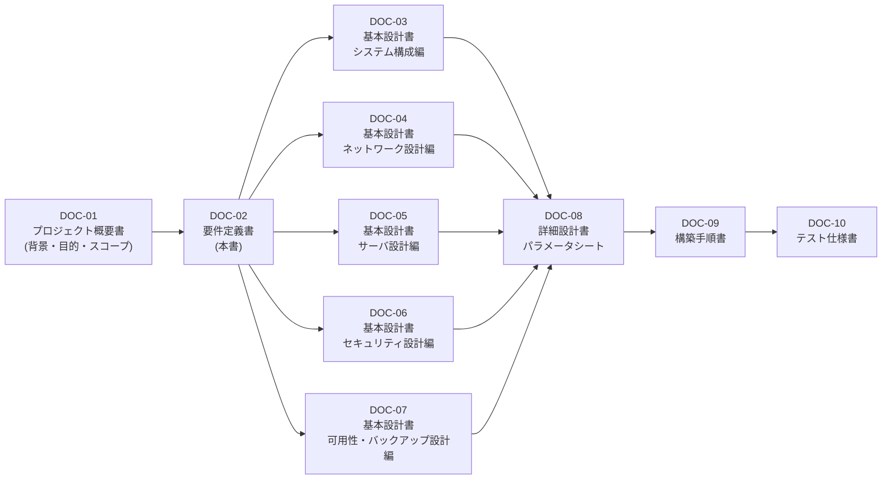
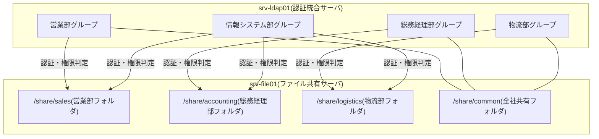

# 要件定義書

**DOC-02｜02_要件定義書.md**

> 📘 **学習ポイント**
> 要件定義とは、「発注者が何に困っていて、何ができるようになれば満足するか」を、開発側の言葉ではなく業務側の言葉で明文化する工程です。ここで決めた内容が、この後に作る基本設計書(DOC-03〜07)・詳細設計書(DOC-08)・構築手順書(DOC-09)・テスト仕様書(DOC-10)すべての「正解の基準」になります。実務では、要件定義が曖昧なまま設計・構築を始めてしまうと、後工程で「言った/言わない」のトラブルや大幅な手戻りが発生するため、最初に最も時間をかけるべき工程とされています。本書では、株式会社サンプル物産の業務要件・機能要件・非機能要件を整理し、後続の設計書へどうつながるかまで示します。

## 改訂履歴

| 版数 | 日付 | 内容 | 作成者 |
|---|---|---|---|
| v0.1 | 2026-08-01 | 初版ドラフト作成(業務要件・機能要件の骨子整理) | 〇〇 〇〇 |
| v1.0 | 2026-08-20 | レビュー指摘反映のうえ初版確定(非機能要件表・要件一覧表を追加) | 〇〇 〇〇 |

## 文書情報

| 項目 | 内容 |
|---|---|
| 文書番号 | DOC-02 |
| ファイル名 | 02_要件定義書.md |
| 作成日 | 2026年8月1日 |
| 最終改訂日 | 2026年8月20日 |
| バージョン | v1.0 |
| 作成者 | 〇〇 〇〇 |
| レビュー者 | 〇〇 〇〇 |
| 前工程文書 | DOC-01 01_プロジェクト概要書.md |
| 後続文書 | DOC-03〜07(基本設計書)、DOC-12 用語集.md |

---

## 1. 文書の目的と位置づけ

### 1.1 目的

本書は、株式会社サンプル物産(以下「発注者」という)における社内ITインフラ刷新プロジェクトについて、発注者が業務上必要とする要件を「業務要件」「機能要件」「非機能要件」の3層に整理し、後続の基本設計工程(DOC-03〜07)における設計判断の根拠とすることを目的とする。

> 💡 **なぜこう設計するのか**
> 要件を「業務要件→機能要件→非機能要件」の3層に分けるのは、現場で広く使われる整理方法である。業務要件は「誰が何をしたいか」という利用者目線の要求、機能要件はそれを実現するために「システムが何をするか」という実装目線の要求、非機能要件は「どのくらいの品質・信頼性で動くべきか」という性能・可用性・セキュリティ面の要求である。この3層を混在させたまま設計を始めると、「使いたい機能」と「守るべき品質」の優先順位が曖昧になり、限られた予算・工数の配分を誤りやすい。層を分けて整理することで、DOC-03(システム構成)・DOC-05(サーバ設計)は主に機能要件を、DOC-06(セキュリティ設計)・DOC-07(可用性・バックアップ設計)は主に非機能要件を根拠にする、という対応関係が明確になる。

### 1.2 ドキュメント体系における位置づけ

本書は、DOC-01(プロジェクト概要書)で示したプロジェクトの背景・目的・スコープを受けて、それを具体的な「要件」というレベルまで分解する文書である。本書で定義した要件は、DOC-03〜07の基本設計書群において、それぞれ「どの要件を満たすためにこの設計にしたか」という形で参照される。

各基本設計書が本書のどの要件に対応するかは「7. 要件定義書から基本設計書への展開」で整理する。

### 1.3 想定読者

- 発注者(株式会社サンプル物産)側の業務担当者・情報システム担当者
- 本プロジェクトを担当するサーバー構築エンジニア(本演習では学習者本人)
- 本書をポートフォリオとして閲覧する採用担当者・面接官

---

## 2. 前提となる現状課題

DOC-01で整理した現状課題を、要件定義の前提として簡潔に再掲する。

| No | 現状の課題 | 影響 |
|---|---|---|
| 1 | Windows Server 2012の共有フォルダのみで運用しており老朽化・サポート切れのリスクがある | セキュリティパッチが提供されず脆弱性が放置される |
| 2 | アカウントが各PCのローカル管理でバラバラ | 入退社時のアカウント管理が煩雑、退職者アカウントの削除漏れリスク |
| 3 | サーバの死活監視の仕組みがない | 障害発生に気づくのが遅れ、業務停止時間が長期化する |
| 4 | バックアップが手動でUSB HDDにコピーのみ、世代管理なし | 誤操作・災害時にデータを復旧できない、または古い世代しか戻せない |

本書における業務要件・機能要件・非機能要件は、すべてこれら4つの課題を解消することを起点として整理している。

---

## 3. 業務要件

業務要件とは、「どの部門の、どの立場の人が、何をできるようになれば業務上の目的を達成できるか」を定義するものである。

> 💡 **なぜこう設計するのか**
> いきなり「LDAPサーバを立てる」「Sambaでファイル共有をする」と機能から考え始めると、技術に業務を合わせる本末転倒な設計になりがちである。まず「営業部の資料を経理部から見えないようにしたい」という業務側の要求を明文化し、その後で「では部門ごとにアクセス制御(利用者や部門ごとにファイル・フォルダへの読み書き権限を制御する仕組み。※用語集(12_用語集.md)参照)ができるファイル共有基盤が必要だ」という機能要件に落とし込む、という順序を踏むことが重要である。

### 3.1 部門別の利用シーンと要求

株式会社サンプル物産は従業員60名の卸売業であり、本書では代表的な部門として以下を想定する。

| 部門 | 現状の課題 | 要求される利用シーン | 主に関連するシステム(サーバ一覧No) |
|---|---|---|---|
| 営業部 | 見積書・提案資料が個人PCやUSBメモリに散在し、検索・共有に時間がかかる | 営業部専用の共有フォルダに資料を集約し、他部門から不用意に閲覧・上書きされないようにしたい | srv-file01(No.7)、srv-ldap01(No.4) |
| 総務・経理部 | 給与明細や契約書などの機密情報が、誰でもアクセスできる共有フォルダに置かれている | 経理部員のみがアクセスできる機密フォルダを用意し、部外者の閲覧を確実に防ぎたい | srv-file01(No.7)、srv-ldap01(No.4) |
| 物流・倉庫部 | 在庫状況や出荷連絡が口頭・紙ベースで属人化しており、担当者不在時に情報が止まる | 社内業務ポータルで在庫連絡・日報を共有し、誰でも最新状況を確認できるようにしたい | srv-web01(No.5)、srv-db01(No.6) |
| 情報システム担当(兼務1〜2名) | サーバの死活監視の仕組みがなく障害に気づくのが遅れる。バックアップが手動のUSBコピーのみで世代管理もない | サーバの稼働状況を自動監視し、異常時に把握できるようにしたい。バックアップを自動化し、複数世代を保持したい | srv-mon01(No.8)、srv-bk01(No.9) |
| 全社員共通 | PCごとにローカルアカウントが個別管理されており、入退社時の設定漏れが起きやすい | 1つの社員アカウントで社内システムにログインできるようにし、アカウントを一元管理したい | srv-ldap01(No.4) |

### 3.2 部門ごとのアクセス分離のイメージ

部門をまたいだ不要な閲覧・編集を防ぐという業務要件を、ファイルサーバ上のフォルダ構成のイメージとして図示する(実際のディレクトリ構成・パーミッション設計はDOC-05で確定する)。

> 💡 **なぜこう設計するのか**
> アクセス制御を各PCのローカル設定ではなく、認証統合サーバ(srv-ldap01)側の「グループ」で一元管理するのは、最小権限の原則(業務に必要な最小限の権限だけを与えるという考え方)に基づく。ユーザーごとに個別設定すると人数分の設定作業と管理コストがかかるが、部門グループ単位で権限を管理すれば、入社・異動・退職の都度「グループへの所属を変更するだけ」で済み、運用負荷とヒューマンエラーの両方を抑えられる。

---

## 4. 機能要件

機能要件とは、業務要件を実現するために「システムが具体的に何を行うか」を定義するものである。サーバー構築案件では、多くの場合サーバ一覧の各役割(サーバの担当業務)にそのまま対応する形で整理すると、設計書との対応が取りやすい。

### 4.1 機能要件とサーバ一覧の対応

以下は、本プロジェクトで構築する全サーバの一覧である(マスター仕様の正となる一覧。台数・役割・IP・スペックは変更しない)。

| No | ホスト名 | 役割 | 設置セグメント | IPアドレス | OS | 主要ミドルウェア | スペック(vCPU/メモリ/ディスク) |
|---|---|---|---|---|---|---|---|
| 1 | gw-fw01 | ゲートウェイ/ファイアウォール(セグメント間ルーティング・NAT) | 全セグメントに接続(マルチホーム) | 各セグメントの.1 | AlmaLinux 9.4 | firewalld, nftables | 2vCPU/2GBメモリ/20GBディスク |
| 2 | mgmt-pc01 | 管理端末(踏み台サーバ) | 管理LAN | 192.168.10.11 | AlmaLinux 9.4 | OpenSSH | 2vCPU/2GBメモリ/20GBディスク |
| 3 | srv-dns01 | DNS/DHCPサーバ(社内NTPサーバも兼務) | サーバLAN | 192.168.20.11 | AlmaLinux 9.4 | BIND 9.18, Kea DHCP 2.4, chrony | 2vCPU/2GBメモリ/20GBディスク |
| 4 | srv-ldap01 | 認証統合サーバ | サーバLAN | 192.168.20.12 | AlmaLinux 9.4 | OpenLDAP 2.6 | 2vCPU/4GBメモリ/30GBディスク |
| 5 | srv-web01 | 社内業務ポータルWebサーバ | サーバLAN | 192.168.20.13 | AlmaLinux 9.4 | Apache HTTP Server 2.4, PHP 8.2 | 2vCPU/4GBメモリ/40GBディスク |
| 6 | srv-db01 | データベースサーバ | サーバLAN | 192.168.20.14 | AlmaLinux 9.4 | MariaDB 10.11 | 4vCPU/8GBメモリ/60GBディスク |
| 7 | srv-file01 | ファイル共有サーバ | サーバLAN | 192.168.20.15 | AlmaLinux 9.4 | Samba 4.19(LDAP連携認証) | 4vCPU/8GBメモリ/200GBディスク |
| 8 | srv-mon01 | 監視サーバ | サーバLAN | 192.168.20.16 | AlmaLinux 9.4 | Zabbix Server/Web 6.4, 各サーバにZabbix Agent2 | 2vCPU/4GBメモリ/50GBディスク |
| 9 | srv-bk01 | バックアップサーバ | サーバLAN | 192.168.20.17 | AlmaLinux 9.4 | rsync, cron | 2vCPU/4GBメモリ/500GBディスク(バックアップ保存用) |

> 💡 **なぜこう設計するのか**
> 機能要件を「1機能=1サーバ(役割)」で対応させているのは、単一障害点(1台の故障がシステム全体に影響する箇所)の切り分けと、権限・ログの管理をシンプルにするためである。もし1台のサーバにDNS・認証・Web・DBをすべて同居させると、負荷やセキュリティ設定が複雑に絡み合い、障害調査や権限設計が難しくなる。役割ごとにサーバを分けることで、「このサーバが落ちても影響範囲はここまで」という説明が採用担当者・面接官にも伝わりやすい設計になる。なお本演習ではVirtualBox上の仮想マシンとしてサーバごとに1台を用意するが、本番のオンプレミス物理サーバ2台+VMware ESXiによる仮想化基盤でも、この「役割単位の仮想マシン分割」という考え方自体は変わらない。

### 4.2 機能要件の詳細

#### 4.2.1 ファイル共有・アクセス制御機能(srv-file01)

- 部門別(営業部・総務経理部・物流部・情報システム部)に共有フォルダを分け、所属部門に応じたアクセス権限(読み取り・書き込み・アクセス不可)を設定できること。
- 全社共有フォルダを設け、部門を問わず参照可能な情報を格納できること。
- ファイルサーバへのログインは、各PCのローカルアカウントではなく、認証統合サーバ(srv-ldap01)のアカウント情報を用いた認証(LDAP連携認証)で行うこと。
- 対象ミドルウェア: Samba 4.19(LDAP連携認証)。詳細な共有設定・権限マトリクスはDOC-05(サーバ設計編)およびDOC-06(セキュリティ設計編)で定義する。

#### 4.2.2 認証統合機能(srv-ldap01)

- 全社員のアカウント情報(ユーザーID、氏名、所属部門グループ等)を1箇所で一元管理できること。
- LDAP(Lightweight Directory Access Protocol: ネットワーク上でユーザー情報などを一元管理するための通信プロトコル。※用語集(12_用語集.md)参照)により、ファイル共有サーバ(srv-file01)など他のシステムから認証を参照できること。
- 部門ごとのグループを定義し、3.2節で示したアクセス制御の基盤となること。
- 対象ミドルウェア: OpenLDAP 2.6。

#### 4.2.3 社内業務ポータル機能(srv-web01、srv-db01)

- Webブラウザから社内業務ポータル(在庫連絡・日報などの業務情報を掲示・共有するWebアプリケーション)にアクセスできること。
- ポータルの業務データ(在庫連絡、日報等)をデータベースサーバに保存・参照できること。
- 対象ミドルウェア: Apache HTTP Server 2.4、PHP 8.2(srv-web01)、MariaDB 10.11(srv-db01)。
- 具体的な画面・業務ロジックの設計は本演習のスコープ外とし、基盤(サーバ・DB・Webサーバの稼働環境)の整備までを対象とする(DOC-01のスコープ定義に準拠)。

#### 4.2.4 監視機能(srv-mon01)

- 全サーバ(No.1〜9)の死活状態(サーバが正常に稼働しているかどうかの状態)、および主要なリソース(CPU・メモリ・ディスク使用率等)を定期的に収集・可視化できること。
- 異常検知時に管理者へ通知できる仕組みを持つこと。
- 対象ミドルウェア: Zabbix Server/Web 6.4(監視サーバ側)、各サーバにZabbix Agent2(監視対象側)を導入すること。

#### 4.2.5 バックアップ機能(srv-bk01)

- ファイル共有サーバ(srv-file01)の共有データ、データベースサーバ(srv-db01)のDBダンプ、認証統合サーバ(srv-ldap01)のLDAPデータを、定期的にバックアップサーバへ転送・保存できること。
- 日次差分バックアップ(前回のフルバックアップ以降に変更されたデータのみを保存する方式。※用語集(12_用語集.md)参照)と週次フルバックアップを組み合わせ、複数世代を保持できること。
- 対象ツール: rsync、cron。具体的なスケジュール・世代数は「5. 非機能要件」および DOC-07(可用性・バックアップ設計編)で定義する。

#### 4.2.6 名前解決・時刻同期・IPアドレス払い出し機能(srv-dns01)

- 内部ドメイン(sample-trading.local)における全サーバ・全端末の名前解決(DNS)を提供できること。
- 内部LAN(社員PC)に対し、DHCP(Dynamic Host Configuration Protocol: 端末にIPアドレスを自動的に割り当てる仕組み。※用語集(12_用語集.md)参照)による動的なIPアドレス払い出しができること。
- 全サーバの時刻をNTP(Network Time Protocol: サーバ間で時刻を同期する仕組み。※用語集(12_用語集.md)参照)により同期できること。
- 対象ミドルウェア: BIND 9.18(DNS)、Kea DHCP 2.4(DHCP)、chrony(NTP)。

#### 4.2.7 ネットワーク境界制御機能(gw-fw01)

- 管理LAN・サーバLAN・内部LAN・DMZ・WANの各セグメント間の通信を制御し、業務上必要な通信のみを許可できること。
- セグメント間のルーティングおよびNAT(アドレス変換)機能を提供できること。
- 対象ミドルウェア: firewalld、nftables。詳細な許可・拒否ルールはDOC-06(セキュリティ設計編)で定義する。

> 💡 **なぜこう設計するのか**
> ネットワーク境界の制御(gw-fw01)を独立した機能要件として扱うのは、「多層防御(1つの防御策が破られても被害が広がらないよう、複数の防御層を重ねる考え方)」の第一層にあたるためである。仮にファイル共有サーバのアクセス制御(4.2.1)が正しく機能していても、ネットワーク自体が無防備であれば外部や別セグメントから直接サーバへアクセスされてしまう。ネットワークレベルでの制御(セグメント分離)と、アプリケーションレベルでの制御(部門別アクセス権限)を両方備えることで、片方が突破されてももう片方で被害を防げる設計になる。

---

## 5. 非機能要件

非機能要件とは、「どのくらいの品質・信頼性・使いやすさで動作すべきか」を定義するものであり、可用性・性能・セキュリティ・保守性・運用性の5観点で整理する。

> 💡 **なぜこう設計するのか**
> 非機能要件は画面や機能のように目に見えないため、要件定義の段階で明文化しないまま設計・構築が進んでしまうことが多い。しかし「バックアップを取っていたのに、いざという時に24時間以上前のデータしか戻せなかった」「監視していたつもりが、異常発生から気づくまでに何日もかかった」といった問題は、非機能要件を先に数値で定義していなかったことが原因であるケースがほとんどである。RPO・RTOのような指標を要件定義の段階で数値化しておくことで、DOC-07(可用性・バックアップ設計編)でのバックアップ間隔・世代数の設計根拠が明確になる。

| 観点 | 要件内容 | 具体的な指標・基準 |
|---|---|---|
| 可用性 | 主稼働時間帯において、業務に必要なサーバ群が継続稼働していること。障害発生時も定めた時間内に復旧できること | 主稼働時間帯:平日9:00〜19:00(演習では常時稼働として扱う)。RPO(目標復旧時点:障害発生時にどの時点までのデータ復旧を許容するかを示す指標。※用語集(12_用語集.md)参照):24時間。RTO(目標復旧時間:障害発生からシステム復旧までに許容される時間の指標。※用語集(12_用語集.md)参照):4時間 |
| 性能 | 部門利用規模(従業員60名)に対して、ファイル共有・ポータル利用時に業務を阻害しない応答性能を確保すること | 同時アクセスユーザー数60名規模を想定した設計とする(詳細な性能目標値はDOC-05で定義) |
| セキュリティ | 最小権限の原則・多層防御の考え方に基づき、不正アクセス・情報漏えいのリスクを抑えること | SSHはパスワード認証を禁止し公開鍵認証のみとする。rootログイン禁止、sudoによる権限昇格運用とする。各サーバのfirewalldで必要最小限のポートのみ開放する(詳細はDOC-06) |
| 保守性 | パッチ適用やソフトウェア更新を計画的に実施できる体制であること | OSパッチ適用(dnf update)を月次定例(第1月曜)で実施する |
| 運用性 | 障害の早期検知、および定型運用作業(バックアップ・監視確認)が過度な手作業に依存しないこと | Zabbixによる自動監視・自動通知を行う。バックアップはrsync+cronにより自動実行する(手動USBコピーからの脱却) |

### 5.1 可用性要件の背景にあるネットワークセグメント設計

非機能要件のうち可用性・セキュリティの土台となるネットワークセグメント設計は、以下の通り全文書で共通のものを用いる(詳細な通信制御ルールはDOC-04・DOC-06で定義する)。

| セグメント名 | VLAN ID | CIDR | 用途 | GW(ゲートウェイ)IP |
|---|---|---|---|---|
| WAN | - | 203.0.113.0/24 | インターネット接続用(演習では疑似) | 203.0.113.1(ISP側) |
| 管理LAN | VLAN10 | 192.168.10.0/24 | サーバ管理・SSH踏み台用 | 192.168.10.1 |
| サーバLAN | VLAN20 | 192.168.20.0/24 | 各種業務サーバ設置用 | 192.168.20.1 |
| 内部LAN | VLAN30 | 192.168.30.0/24 | 社員PC・クライアント端末用 | 192.168.30.1 |
| DMZ | VLAN40 | 192.168.40.0/24 | 将来の外部公開用(本演習では未使用領域として設計のみ行う) | 192.168.40.1 |

> 💡 **なぜこう設計するのか**
> WANセグメントに実在のグローバルIPアドレスではなく203.0.113.0/24を用いているのは、これがRFC5737で「TEST-NET-3」として定義された、文書・例示専用のアドレス範囲だからである。設計書やポートフォリオに実在の企業・組織が使用しているIPアドレスを誤って記載すると、意図せずその組織の情報を示唆してしまう可能性がある。演習・例示用の設計書では、必ずこうした予約済みの例示用アドレスを使うのが安全かつ一般的な作法である。

---

## 6. 要件一覧表

区分(機能要件・非機能要件)・優先度(必須・推奨)を明記した要件一覧を以下に示す。優先度は、老朽化したWindows Server 2012環境からの脱却という緊急性の高い課題(2章参照)を解消するために必須のものを「必須」、業務効率・拡張性の観点から望ましいものを「推奨」としている。

| 要件ID | 区分 | 要件内容 | 優先度 |
|---|---|---|---|
| REQ-001 | 機能 | 部門ごとにアクセス権限を分離したファイル共有ができること(srv-file01) | 必須 |
| REQ-002 | 機能 | 全社員の認証情報をLDAPで一元管理できること(srv-ldap01) | 必須 |
| REQ-003 | 機能 | Webブラウザから利用できる社内業務ポータルを提供すること(srv-web01, srv-db01) | 必須 |
| REQ-004 | 機能 | 各サーバの死活状態をリアルタイムに監視し、異常時に検知できること(srv-mon01) | 必須 |
| REQ-005 | 機能 | 重要データ(共有データ・DBダンプ・LDAPデータ)を日次・週次でバックアップし世代管理できること(srv-bk01) | 必須 |
| REQ-006 | 機能 | 社内の名前解決・IPアドレス払い出し・時刻同期を一元的に行えること(srv-dns01) | 必須 |
| REQ-007 | 機能 | セグメント間通信をゲートウェイで制御し、必要な通信のみ許可すること(gw-fw01) | 必須 |
| REQ-008 | 機能 | 管理者は踏み台サーバ(mgmt-pc01)経由でのみ各サーバにSSH接続できること | 必須 |
| REQ-009 | 機能 | 社内業務ポータルは認証基盤(srv-ldap01)と連携し、部門に応じた利用ができること | 推奨 |
| REQ-010 | 非機能 | RPO24時間・RTO4時間を満たすバックアップ・復旧体制であること | 必須 |
| REQ-011 | 非機能 | 主稼働時間帯(平日9:00〜19:00)において継続稼働できる可用性を確保すること | 必須 |
| REQ-012 | 非機能 | SSHはパスワード認証を禁止し、公開鍵認証のみとすること | 必須 |
| REQ-013 | 非機能 | rootログインを禁止し、sudoによる権限昇格運用とすること | 必須 |
| REQ-014 | 非機能 | 各サーバのfirewalldで必要最小限のポートのみ開放すること | 必須 |
| REQ-015 | 非機能 | 月次(第1月曜)でOSパッチ適用(dnf update)を実施できる運用体制であること | 推奨 |
| REQ-016 | 非機能 | 将来の外部公開(DMZ)を見据えた拡張性のあるネットワーク設計であること | 推奨 |

---

## 7. 要件定義書から基本設計書への展開

本書で定義した要件は、以下の対応関係で基本設計書群(DOC-03〜07)に展開される。採用担当者・面接官が設計の一貫性を確認する際は、この対応表を起点に各設計書を参照するとわかりやすい。

| 要件領域(本書の章) | 主な該当要件ID | 展開先の基本設計書 |
|---|---|---|
| 全体構成・役割分担(4.1) | REQ-001〜REQ-009 | DOC-03 基本設計書_システム構成編 |
| ネットワーク境界制御(4.2.7)、可用性の土台となるセグメント設計(5.1) | REQ-007, REQ-016 | DOC-04 基本設計書_ネットワーク設計編 |
| 各機能要件のサーバ実装方式(4.2.1〜4.2.6) | REQ-001〜REQ-006, REQ-009 | DOC-05 基本設計書_サーバ設計編 |
| セキュリティ関連の非機能要件(5章)、アクセス制御(3.2, 4.2.1) | REQ-008, REQ-012〜REQ-015 | DOC-06 基本設計書_セキュリティ設計編 |
| 可用性・バックアップの非機能要件(5章) | REQ-004, REQ-005, REQ-010, REQ-011 | DOC-07 基本設計書_可用性・バックアップ設計編 |

> 💡 **なぜこう設計するのか**
> このような「要件ID→設計書」の対応表を作っておくと、設計書をレビューする側(現場であれば上長やお客様、ポートフォリオであれば採用担当者)が「この設計は何のために存在するのか」を要件からたどれるようになる。逆に言えば、この対応表に載らない設計(要件に紐づかない設計)が出てきた場合は、それが本当に必要な設計なのか、あるいは要件定義に漏れがあったのかを見直すきっかけにもなる。要件定義書は「作って終わり」ではなく、後工程を通じて繰り返し参照される基準文書として位置づけることが重要である。

DOC-08(詳細設計書_パラメータシート)以降は、DOC-03〜07で決定した設計方針をもとに、実際のOS設定値・パラメータ・構築コマンド・テスト項目へとさらに具体化していく工程であり、本書の要件が直接参照されることは少なくなるが、「なぜその設定値なのか」を遡って説明する必要が生じた際には、最終的に本書の要件に立ち返ることになる。

---

## 8. 用語集・関連文書

本書で使用した専門用語の詳細な解説は、DOC-12 12_用語集.md を参照すること。特に以下の用語は本書で頻出するため、あわせて確認することを推奨する。

- LDAP、DHCP、DNS、NTP、VLAN、firewalld
- RPO、RTO、差分バックアップ、フルバックアップ、世代管理
- アクセス制御(ACL)、最小権限の原則、多層防御、踏み台サーバ

---

## 9. 次工程

本書で定義した要件をもとに、以下の順序で基本設計を進める。

1. DOC-03 基本設計書_システム構成編:サーバ・ネットワークを含めたシステム全体構成の確定
2. DOC-04 基本設計書_ネットワーク設計編:セグメント設計・ルーティング・NAT方式の確定
3. DOC-05 基本設計書_サーバ設計編:各サーバのOS・ミドルウェア構成の確定
4. DOC-06 基本設計書_セキュリティ設計編:ファイアウォールルール・認証・権限設計の確定
5. DOC-07 基本設計書_可用性・バックアップ設計編:バックアップ方式・監視方式の確定

各基本設計書のレビュー時には、必ず本書(DOC-02)の該当要件IDに立ち返り、要件が漏れなく満たされているかを確認することとする。
