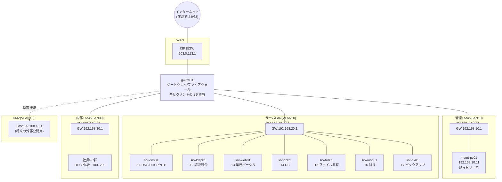
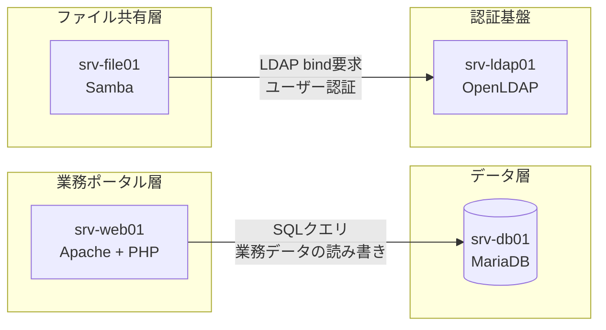

# 基本設計書(システム構成編)

> ### 📘 学習ポイント
> 基本設計書とは、要件定義書(DOC-02 02_要件定義書.md)で決めた「何を実現するか」を受けて、「その実現方法をどのような構成で実現するか」を定義する文書です。要件定義書が発注者(株式会社サンプル物産)向けの合意文書であるのに対し、基本設計書は構築を担当するエンジニア同士が目線を合わせるための技術文書という位置づけになります。本文書(システム構成編)は、そのなかでも最上位にあたる「全体像」を担当し、ネットワークの詳細はDOC-04、サーバ個別の設計はDOC-05、セキュリティの詳細はDOC-06、可用性・バックアップの詳細はDOC-07に橋渡しします。実務では、この1枚の構成図と一覧表があるだけで、新しく参加したメンバーやレビューアが「このシステムはどんなサーバが何台あり、どうつながっているか」を数分で把握できるようになるため、設計書一式の中でも特に読まれる頻度が高い文書です。

---

**改訂履歴**

| 版数 | 日付 | 内容 | 作成者 |
|---|---|---|---|
| v0.1 | 2026-08-01 | 初版ドラフト作成(全体構成・サーバ一覧の骨子を作成) | 〇〇 〇〇 |
| v1.0 | 2026-08-20 | レビュー指摘反映、システム間連携図・ソフトウェア構成表を追記し正式版として発行 | 〇〇 〇〇 |

**文書情報**

| 項目 | 内容 |
|---|---|
| 文書番号 | DOC-03 |
| 文書名 | 基本設計書(システム構成編) |
| 作成日 | 2026年8月1日 |
| 最終改訂日 | 2026年8月20日 |
| バージョン | v1.0 |
| 作成者 | 〇〇 〇〇 |
| レビュー者 | (記入欄) |
| 関連文書 | DOC-02(要件定義書)、DOC-04〜07(基本設計書 各編)、DOC-08(パラメータシート)、DOC-12(用語集) |

---

## 目次

1. 本書の目的とスコープ
2. システム全体構成
3. 仮想化基盤
4. サーバ一覧
5. ソフトウェア構成
6. システム間連携
7. 他文書との関連
8. 用語集への参照

---

## 1. 本書の目的とスコープ

本書は、株式会社サンプル物産向け社内ITインフラ刷新プロジェクトにおいて、システム全体の論理構成・使用する仮想化基盤・構築するサーバの一覧・導入するソフトウェア・システム間の連携方式を定義するものである。要件定義書(DOC-02)が「部門別アクセス制御付きファイル共有基盤の実現」「社内アカウントの統合管理」「業務ポータルの稼働」「監視体制の整備」「バックアップ体制の整備」といった機能要件・非機能要件を定義したのに対し、本書はそれらを実現するための技術的な骨組み(どのサーバを何台配置し、どのソフトウェアを載せ、どうつなぐか)を定義する。

基本設計書(システム構成編)としての本書のスコープは以下の範囲に限定し、詳細は各編に譲る。

| 検討事項 | 本書での扱い | 詳細を扱う文書 |
|---|---|---|
| ネットワークセグメント構成・ルーティング・VLAN設計の詳細 | 概要のみ記載 | DOC-04(ネットワーク設計編) |
| 各サーバのディスクパーティション・OS初期設定の詳細 | 概要のみ記載 | DOC-05(サーバ設計編) |
| firewalldのゾーン設計・ポート開放ルール | 概要のみ記載 | DOC-06(セキュリティ設計編) |
| バックアップ・監視の運用ルール詳細 | 概要のみ記載 | DOC-07(可用性・バックアップ設計編)、DOC-11(運用保守設計書) |
| IPアドレス・パラメータの最終値一覧 | 一覧を掲載(値は本書がマスターと整合) | DOC-08(詳細設計書_パラメータシート) |

> ### 💡 なぜこう設計するのか
> 設計書を「全体構成」「ネットワーク」「サーバ」「セキュリティ」「可用性・バックアップ」に分けて作成するのは、1つの文書に全部を詰め込むと後から読み返すときに目的の情報を探しにくくなるためです。現場でも「関心事ごとに文書を分ける(関心の分離)」という考え方が使われており、ネットワーク担当者はDOC-04だけ、セキュリティレビュー担当者はDOC-06だけを見れば必要な情報にたどり着けるようにしておくと、レビューや引き継ぎの効率が大きく変わります。

---

## 2. システム全体構成

本プロジェクトでは、ネットワークを役割ごとに5つのセグメント(区画。※用語集(12_用語集.md)参照)に分割し、その中心にゲートウェイ/ファイアウォール(gw-fw01)を置くことで、セグメント間の通信をすべて1台の機器で制御できるようにしている。以下に論理構成図(物理的な配線ではなく、機器やネットワークの役割・接続関係を模式的に表した図。※用語集(12_用語集.md)参照)を示す。

ネットワークセグメントの一覧は以下のとおりである(値はマスター仕様のネットワークセグメント表をそのまま転記したものであり、本プロジェクトの全設計書で共通して使用する)。

| セグメント名 | VLAN ID | CIDR | 用途 | GW(ゲートウェイ)IP |
|---|---|---|---|---|
| WAN | - | 203.0.113.0/24 | インターネット接続用(演習では疑似) | 203.0.113.1(ISP側) |
| 管理LAN | VLAN10 | 192.168.10.0/24 | サーバ管理・SSH踏み台用 | 192.168.10.1 |
| サーバLAN | VLAN20 | 192.168.20.0/24 | 各種業務サーバ設置用 | 192.168.20.1 |
| 内部LAN | VLAN30 | 192.168.30.0/24 | 社員PC・クライアント端末用 | 192.168.30.1 |
| DMZ | VLAN40 | 192.168.40.0/24 | 将来の外部公開用(本演習では未使用領域として設計のみ行う) | 192.168.40.1 |

なお、WANセグメントのCIDR「203.0.113.0/24」は、RFC5737で「文書・例示専用」として予約されているTEST-NET-3という特別なアドレス範囲である。実在の企業や組織が使用している可能性のあるIPアドレスを設計書に記載してしまうと、誤解や不要なトラブルにつながりかねないため、本プロジェクトのようなポートフォリオ・演習用の設計書では、この種の「例示専用アドレス」を意図的に選んで使用することが望ましい。ネットワークセグメントの詳細(サブネット設計の考え方、VLANタグの割り当て方針など)はDOC-04(ネットワーク設計編)で扱う。

> ### 💡 なぜこう設計するのか
> ネットワークを1つの大きな区画にせず、役割ごとに5つのセグメントへ分割しているのは、「もし社員PCの1台がウイルスに感染しても、サーバ側まで被害が及ばないようにする」という多層防御の考え方に基づいています。さらに、すべてのセグメント間通信をgw-fw01という1台に集約しているのは、通信の出入り口を一本化することで、「どの通信を許可し、どれを拒否するか」のルールを1か所で一元管理できるようにするためです。管理ポイントが分散していると、ルール変更の際に漏れが生じやすくなります。

---

## 3. 仮想化基盤

本プロジェクトでは、学習環境と本番想定環境とで異なる仮想化基盤(ハイパーバイザー。物理サーバ上に複数の仮想マシンを動かすための基盤ソフトウェア。※用語集(12_用語集.md)参照)を用いる。ポートフォリオとして提示する際は、この対応関係を明確に説明できることが重要である。

| 項目 | 学習環境(本演習で実際に構築) | 本番想定環境(実際の企業導入を想定) |
|---|---|---|
| 仮想化基盤 | VirtualBox 7.x | VMware ESXi(および管理にvCenter Serverを想定) |
| 物理ホスト | 自宅PC 1台 | オンプレミス物理サーバ 2台(冗長化・負荷分散を考慮) |
| 仮想マシン数 | 9台(サーバ一覧のとおり) | 9台(同一構成をESXi上に展開) |
| ネットワーク分離の実現方法 | 内部ネットワーク(Internal Network)/ホストオンリーアダプターを用いてセグメントごとに仮想スイッチを分離 | 物理スイッチのVLANタグ付け(トランクポート)+ ESXi仮想スイッチ(vSwitch)のポートグループでVLANを対応させる |
| コスト | 無償(個人PCのみで再現可能) | 物理サーバ・ライセンス費用が発生(ESXi無償版または有償版を選定) |

学習環境ではVirtualBoxの標準機能だけでは物理スイッチのようなVLANタグ付け(1本の配線に複数のネットワークの通信を識別可能な形で流す技術)を再現できないため、セグメントごとに独立した仮想ネットワークを作成することで、疑似的にVLAN分割相当の分離を実現している。本番環境では、物理スイッチとESXiのポートグループでVLAN IDを一致させることで、より実運用に近い形でセグメントを分離することになる。この違いは、環境の制約によるものであり、設計思想(セグメントを役割ごとに分離するという考え方)そのものは学習環境・本番環境で変わらない。

> ### 💡 なぜこう設計するのか
> 学習環境と本番想定環境の対応関係をあえて明記しているのは、面接官が知りたいのは「自宅のPCで動かせること」自体ではなく、「その構成が実務の物理サーバ・ESXi環境に置き換わったときに何が変わり、何が変わらないかを理解しているか」だからです。仮想化の基本(1台の物理ハードウェアの上で複数の独立したサーバを動かす、という考え方)はVirtualBoxもESXiも共通しており、演習で学んだ知識はそのまま本番寄りの環境にも応用できることを、この対応表で示しています。

---

## 4. サーバ一覧

本プロジェクトで構築するサーバは全9台であり、その一覧は以下のとおりである。この一覧は本プロジェクトの設計書全体を通じて共通のマスター情報であり、台数・IPアドレス・スペックなどの値は他のいずれの設計書でも変更しない。

| No | ホスト名 | 役割 | 設置セグメント | IPアドレス | OS | 主要ミドルウェア | スペック(vCPU/メモリ/ディスク) | 初心者向け一言メモ |
|---|---|---|---|---|---|---|---|---|
| 1 | gw-fw01 | ゲートウェイ/ファイアウォール(セグメント間ルーティング・NAT) | 全セグメントに接続(マルチホーム) | 各セグメントの.1(2章表参照) | AlmaLinux 9.4 | firewalld, nftables | 2vCPU/2GBメモリ/20GBディスク | ネットワークの「玄関」。全通信がここを通るため最重要。 |
| 2 | mgmt-pc01 | 管理端末(踏み台サーバ) | 管理LAN | 192.168.10.11 | AlmaLinux 9.4 | OpenSSH | 2vCPU/2GBメモリ/20GBディスク | 管理者がSSHで最初に入る唯一の入口。 |
| 3 | srv-dns01 | DNS/DHCPサーバ(社内NTPサーバも兼務) | サーバLAN | 192.168.20.11 | AlmaLinux 9.4 | BIND 9.18, Kea DHCP 2.4, chrony | 2vCPU/2GBメモリ/20GBディスク | 「名前解決」「IP自動配布」「時刻合わせ」の3役を兼任。 |
| 4 | srv-ldap01 | 認証統合サーバ | サーバLAN | 192.168.20.12 | AlmaLinux 9.4 | OpenLDAP 2.6 | 2vCPU/4GBメモリ/30GBディスク | 社員アカウントを一元管理する「名簿」役。 |
| 5 | srv-web01 | 社内業務ポータルWebサーバ | サーバLAN | 192.168.20.13 | AlmaLinux 9.4 | Apache HTTP Server 2.4, PHP 8.2 | 2vCPU/4GBメモリ/40GBディスク | 社員が日常的に使う社内サイトの本体。 |
| 6 | srv-db01 | データベースサーバ | サーバLAN | 192.168.20.14 | AlmaLinux 9.4 | MariaDB 10.11 | 4vCPU/8GBメモリ/60GBディスク | ポータルが扱うデータの保管庫。 |
| 7 | srv-file01 | ファイル共有サーバ | サーバLAN | 192.168.20.15 | AlmaLinux 9.4 | Samba 4.19(LDAP連携認証) | 4vCPU/8GBメモリ/200GBディスク | 部門別フォルダのアクセス制御を担う、本プロジェクトの本丸。 |
| 8 | srv-mon01 | 監視サーバ | サーバLAN | 192.168.20.16 | AlmaLinux 9.4 | Zabbix Server/Web 6.4, 各サーバにZabbix Agent2 | 2vCPU/4GBメモリ/50GBディスク | 全サーバの「生死・調子」を見張る役。 |
| 9 | srv-bk01 | バックアップサーバ | サーバLAN | 192.168.20.17 | AlmaLinux 9.4 | rsync, cron | 2vCPU/4GBメモリ/500GBディスク(バックアップ保存用) | 万一に備えたデータの避難先。 |

**全サーバ共通事項(マスター仕様どおり)**

- NTP(ネットワークを介して時刻を同期する仕組み。※用語集(12_用語集.md)参照)はsrv-dns01(chrony)を参照する。
- タイムゾーンはすべてAsia/Tokyoに統一する。
- DNS参照先はすべてsrv-dns01(192.168.20.11)に統一する。
- SSHは公開鍵認証のみとし、パスワード認証・rootログインは全サーバで禁止する。
- ホスト名は命名規則「srv-<役割略称>01.sample-trading.local」(管理端末のみ「mgmt-pc01.sample-trading.local」)に従う。内部ドメインは sample-trading.local である。

> ### 💡 なぜこう設計するのか
> 1台の高性能サーバにDNSもDBもファイル共有もすべて同居させることも技術的には可能ですが、本設計ではあえて9台に役割を分割しています。理由は大きく2つあります。1つ目は「単一責任」で、1台のサーバが担う役割を絞ることで、障害発生時の影響範囲を特定しやすくなること。2つ目は「セキュリティ境界」で、Webサーバのように外部からのアクセスを受け付ける可能性があるサーバと、DBのように機密データを保持するサーバを分離しておくことで、片方が侵害されてももう片方への影響を抑えられることです。台数が増える分、構築や管理の手間は増えますが、実務の設計ではこのトレードオフを踏まえたうえで分割するのが一般的です。

---

## 5. ソフトウェア構成

本プロジェクトで導入するソフトウェアは、OSも含めてすべてOSS(Open Source Software、ソースコードが公開されており無償で利用できるソフトウェア。※用語集(12_用語集.md)参照)である。ライセンス費用が発生しないため、ポートフォリオとして個人が無償で再現・公開できる構成になっている。

| No | 製品名 | バージョン | 主な用途 | ライセンス種別 | 導入対象サーバ |
|---|---|---|---|---|---|
| 1 | AlmaLinux | 9.4 | サーバOS(RHEL互換の無償ディストリビューション) | OSS(GPLv2ほか、RHEL互換の無償再配布ディストリビューション) | 全9台共通 |
| 2 | firewalld / nftables | OS標準同梱 | ホスト型ファイアウォール(パケットフィルタリング) | OSS(GPLv2) | 全9台共通 |
| 3 | OpenSSH | OS標準同梱 | リモート管理用SSH接続 | OSS(BSDライセンス系) | 全9台共通 |
| 4 | BIND | 9.18 | DNS(名前解決) | OSS(MPL 2.0) | srv-dns01 |
| 5 | Kea DHCP | 2.4 | DHCP(IPアドレス自動払い出し) | OSS(MPL 2.0) | srv-dns01 |
| 6 | chrony | OS標準同梱 | NTP(時刻同期) | OSS(GPLv2) | srv-dns01(参照元。全台がクライアントとして利用) |
| 7 | OpenLDAP | 2.6 | 認証統合(ディレクトリサービス) | OSS(OpenLDAP Public License) | srv-ldap01 |
| 8 | Apache HTTP Server | 2.4 | Webサーバ | OSS(Apache License 2.0) | srv-web01 |
| 9 | PHP | 8.2 | Webアプリケーション実行環境 | OSS(PHP License 3.01) | srv-web01 |
| 10 | MariaDB | 10.11 | データベース | OSS(GPLv2) | srv-db01 |
| 11 | Samba | 4.19 | ファイル共有(Windows互換プロトコル対応) | OSS(GPLv3) | srv-file01 |
| 12 | Zabbix Server/Web | 6.4 | 統合監視 | OSS(GPLv2) | srv-mon01 |
| 13 | Zabbix Agent2 | 6.4 | 監視エージェント(監視対象に常駐し情報を送信) | OSS(GPLv2) | 全9台(監視対象として) |
| 14 | rsync | OS標準同梱 | ファイル差分同期(バックアップ転送) | OSS(GPLv3) | srv-bk01(全バックアップ対象との間で使用) |
| 15 | cron(cronie) | OS標準同梱 | ジョブスケジューラ(定期実行) | OSS(MITライセンス系) | srv-bk01 ほか定期処理を行う各サーバ |

> ### 💡 なぜこう設計するのか
> 全ソフトウェアをOSSに統一しているのは、単に「無償だから」という理由だけではありません。ソースコードが公開されているOSSは、世界中の技術者による検証・改善が継続的に行われており、実績のあるOSSはセキュリティや安定性の面でも十分に業務利用に耐えると評価されています。加えて、株式会社サンプル物産のような中堅企業にとってライセンス費用の削減は現実的なメリットであり、コストと信頼性のバランスを考えた選定であることを説明できると、面接でも説得力が増します。ただし実務ではOSSであっても製品ごとにライセンス条件(GPL・MPL・Apacheなど)が異なるため、利用前に必ずライセンス文面を確認する必要がある点は覚えておくとよいでしょう。

---

## 6. システム間連携

各サーバは単独で動作しているのではなく、互いに連携することで1つの業務基盤として機能する。特に重要なのは、業務ポータル(srv-web01)とデータベース(srv-db01)の連携、およびファイル共有(srv-file01)と認証統合サーバ(srv-ldap01)の連携である。

上記のアプリケーションレベルの連携に加えて、DNS参照・監視エージェント登録・バックアップ転送のように「全サーバ対1台」という形の連携が複数存在する。これらは個別に図示すると見づらくなるため、一覧表として整理する。

| No | 連携元 | 連携先 | 連携内容 | 方式・プロトコル | 備考 |
|---|---|---|---|---|---|
| 1 | srv-web01 | srv-db01 | 業務ポータルが扱うデータの読み書き | SQL(MariaDB接続) | ポート等の詳細はDOC-08(パラメータシート)参照 |
| 2 | srv-file01 | srv-ldap01 | ファイル共有アクセス時のユーザー認証(LDAP連携認証) | LDAP(bind認証) | 部門別アクセス制御の要。詳細はDOC-06(セキュリティ設計編) |
| 3 | 全9台 | srv-dns01 | 名前解決(ホスト名→IP変換)、および時刻同期(NTP) | DNS / NTP | 全サーバ共通事項(4章参照) |
| 4 | 全9台(mgmt-pc01含む) | srv-mon01 | 死活監視・リソース監視のためのエージェント登録 | Zabbix Agent2 | 監視項目の詳細はDOC-11(運用保守設計書) |
| 5 | srv-file01, srv-db01, srv-ldap01 | srv-bk01 | バックアップデータの転送 | rsync(SSH経由) | 日次差分23:00・週次フル(日曜23:00)・4世代保持。詳細はDOC-07(可用性・バックアップ設計編) |

> ### 💡 なぜこう設計するのか
> ファイル共有サーバ(srv-file01)がユーザー情報を自分自身で持たず、認証統合サーバ(srv-ldap01)に問い合わせる構成にしているのは、要件定義書(DOC-02)のゴールである「社内アカウントの統合管理」を実現するためです。もし各サーバがそれぞれ個別にユーザー情報を持っていたら、社員の入退社や部署異動のたびに全サーバの設定を個別に変更する必要があり、更新漏れや情報の不整合が発生しやすくなります。認証情報を1か所(srv-ldap01)に集約し、他のサーバはそこへ問い合わせる形にすることで、変更点を1か所に絞り込め、運用の手間とミスの両方を減らすことができます。

---

## 7. 他文書との関連

本書はシステム構成の全体像を示す文書であり、各要素の詳細は以下の文書で個別に定義する。設計書一式を通読する際は、本書を起点として各編に読み進めるとよい。

| 文書番号 | 文書名 | 本書との関係 |
|---|---|---|
| DOC-02 | 要件定義書 | 本書が実現しようとしている要件の根拠 |
| DOC-04 | 基本設計書_ネットワーク設計編 | 2章のセグメント構成をルーティング・VLANレベルで詳細化 |
| DOC-05 | 基本設計書_サーバ設計編 | 4章のサーバ一覧を個々のOS設定・パーティション設計まで詳細化 |
| DOC-06 | 基本設計書_セキュリティ設計編 | 6章の連携内容をfirewalldのゾーン・ポート単位で詳細化 |
| DOC-07 | 基本設計書_可用性バックアップ設計編 | 6章のバックアップ連携をRPO/RTO・世代管理の観点で詳細化 |
| DOC-08 | 詳細設計書_パラメータシート | 5章のソフトウェア構成に対応する実際の設定パラメータ値 |
| DOC-09 | 構築手順書 | 本書の構成を実際に構築する際の作業手順 |
| DOC-11 | 運用保守設計書 | 6章の監視連携を日常運用の観点で詳細化 |
| DOC-12 | 用語集 | 本書中で(※用語集参照)と付記した専門用語の解説 |
| DOC-13 | 学習ガイド | 本プロジェクト全体を学習素材として読み解くための補助資料 |

---

## 8. 用語集への参照

本書で扱った専門用語(VLAN、セグメント、LDAP、ハイパーバイザー、OSSなど)は、初出時に簡潔な説明を括弧書きで添えたうえで、DOC-12(用語集)を参照するよう付記している。用語の理解に不安がある場合は、まずDOC-12を通読してから本書に戻ることを推奨する。特に初心者がつまずきやすいのは、「セグメント」と「VLAN」の違い(セグメントは論理的な区画、VLANはそれを物理スイッチ上で実現する技術)や、「認証」と「認可」の違いといった、似ているが意味が異なる用語であるため、用語集ではこれらの対比も含めて整理している。
