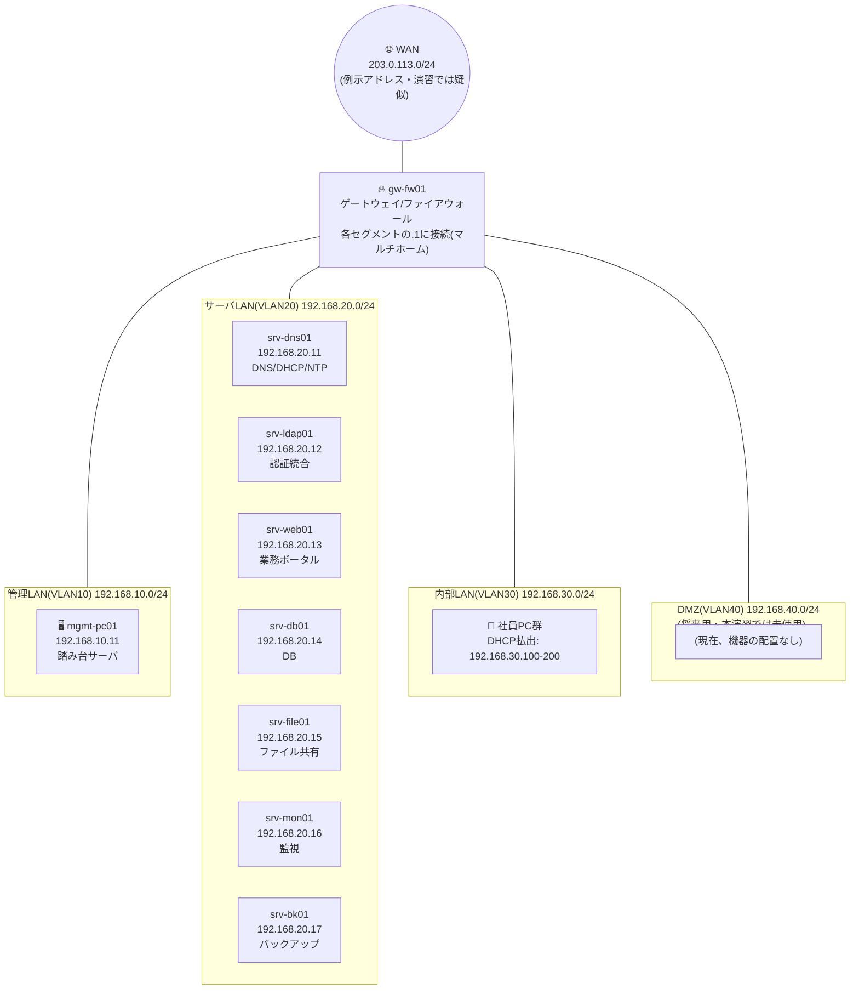

# 基本設計書(ネットワーク設計編)

**文書番号:** DOC-04
**文書名:** 04_基本設計書_ネットワーク設計編.md
**プロジェクト名:** 中堅卸売企業向け社内ITインフラ刷新プロジェクト(サーバー構築エンジニア ポートフォリオ用 基礎演習案件)
**発注者:** 株式会社サンプル物産

> ### 📘 学習ポイント
>
> この文書は、社内ネットワークを「どのセグメントに、何を、どのIPアドレスで配置するか」を決める設計書です。実務では、サーバやアプリケーションを構築する前に必ずこの工程を行い、後続のサーバ設計(DOC-05)・セキュリティ設計(DOC-06)・構築手順書(DOC-09)の土台になります。ネットワーク設計に誤りがあると、後工程すべてに影響が及ぶため、インフラエンジニアが最も慎重に取り組む工程のひとつです。この文書を通じて、「なぜセグメントを分けるのか」「なぜIPアドレスを固定するのか」といった設計の“理由”を理解しながら読み進めてください。

## 改訂履歴

| 版数 | 日付 | 内容 | 作成者 |
|---|---|---|---|
| v0.1 | 2026-08-01 | 初版作成。ネットワークセグメント設計・IPアドレス割当案を作成 | 〇〇 〇〇 |
| v0.5 | 2026-08-10 | ルーティング方針・NAT方針を追記。レビュー用ドラフトとして共有 | 〇〇 〇〇 |
| v1.0 | 2026-08-20 | レビュー指摘事項を反映し最終版として確定 | 〇〇 〇〇 |

## 文書管理情報

| 項目 | 内容 |
|---|---|
| 文書番号 | DOC-04 |
| 作成日 | 2026年8月1日 |
| 最終改訂日 | 2026年8月20日 |
| バージョン | v1.0 |
| 作成者 | 〇〇 〇〇(本ポートフォリオ作成者氏名を記入) |
| レビュー者 | (記入欄) |
| 関連文書 | DOC-02 要件定義書 / DOC-03 基本設計書_システム構成編 / DOC-05 基本設計書_サーバ設計編 / DOC-06 基本設計書_セキュリティ設計編 / DOC-08 詳細設計書_パラメータシート / DOC-12 用語集 |

---

## 目次

1. 本書の目的と位置づけ
2. ネットワークセグメント設計
3. ネットワーク構成図
4. IPアドレス割当
5. サブネットマスクとCIDRの考え方(初心者向け解説)
6. ルーティング方針
7. NAT(アドレス変換)方針
8. DNS参照関係
9. 学習環境と本番環境の対応
10. 関連文書

---

## 1. 本書の目的と位置づけ

本書は、DOC-03「基本設計書_システム構成編」で定義したシステム全体構成を踏まえ、ネットワークセグメント(通信の到達範囲をグループ分けした単位。※用語集(12_用語集.md)参照)の分割方針、IPアドレスの割当、セグメント間のルーティング(経路制御)方針、およびNAT(アドレス変換。※用語集(12_用語集.md)参照)方針を定義するものである。

本書で定義した内容は、以下の後続文書の前提条件となる。

- DOC-05 基本設計書_サーバ設計編(各サーバのOS・ミドルウェア設計)
- DOC-06 基本設計書_セキュリティ設計編(firewalldによるゾーン間通信制御の詳細)
- DOC-08 詳細設計書_パラメータシート(各サーバのネットワークインターフェース設定値)
- DOC-09 構築手順書(実際の構築作業手順)

> 💡 **なぜこの順番で設計するのか**
> ネットワークは「土地の区画整理」に例えられます。区画(セグメント)と番地(IPアドレス)を先に決めておかないと、その上に建てる家(サーバ)の設計や、家同士の行き来のルール(セキュリティ)を決めることができません。だからこそ、ネットワーク設計はシステム構成の直後、サーバ個別設計より先に行うのが定石です。

---

## 2. ネットワークセグメント設計

本プロジェクトでは、通信を用途ごとに分離するため、VLAN(Virtual LAN。1台の物理スイッチや1つのネットワーク機器上で、論理的に複数の独立したネットワークを作る技術。※用語集(12_用語集.md)参照)によってネットワークを5つのセグメントに分割する。セグメント間の通信はすべてgw-fw01(ゲートウェイ/ファイアウォールサーバ)を経由させ、直接到達させない構成とする。

### 2.1 ネットワークセグメント一覧

以下はマスター仕様に定義されたセグメント一覧であり、値を変更せずそのまま転記する。

| セグメント名 | VLAN ID | CIDR | 用途 | GW(ゲートウェイ)IP |
|---|---|---|---|---|
| WAN | - | 203.0.113.0/24(例示用アドレス、RFC5737 TEST-NET-3使用 ※1) | インターネット接続用(演習では疑似) | 203.0.113.1(ISP側) |
| 管理LAN | VLAN10 | 192.168.10.0/24 | サーバ管理・SSH踏み台用 | 192.168.10.1 |
| サーバLAN | VLAN20 | 192.168.20.0/24 | 各種業務サーバ設置用 | 192.168.20.1 |
| 内部LAN | VLAN30 | 192.168.30.0/24 | 社員PC・クライアント端末用 | 192.168.30.1 |
| DMZ | VLAN40 | 192.168.40.0/24 | 将来の外部公開用(本演習では未使用領域として設計のみ行う) | 192.168.40.1 |

※1 実在のグローバルIPアドレスではなく、設計書での例示専用に予約されたアドレスを使用している。理由は本文書末尾の「コラム: なぜ実在しないIPアドレス(203.0.113.0/24)を使うのか」を参照。

### 2.2 各セグメントの役割

- **WAN**: インターネット側との境界。演習環境では実際のISP回線は存在しないため疑似的な扱いとするが、設計上は本番同様にgw-fw01の外側インターフェースとして定義する。
- **管理LAN(VLAN10)**: サーバ管理者がSSHで各サーバへ接続する際に経由する専用セグメント。踏み台サーバ(バスチョンホスト。管理対象サーバへ直接アクセスさせず、一度経由させることで管理経路を一本化する中継サーバ。※用語集(12_用語集.md)参照)であるmgmt-pc01のみを設置する。
- **サーバLAN(VLAN20)**: 業務サーバ(DNS/DHCP、認証、Web、DB、ファイル共有、監視、バックアップ)を集約する、本プロジェクトの中核セグメント。
- **内部LAN(VLAN30)**: 社員が利用するクライアントPC用のセグメント。DHCP(動的にIPアドレスを配布する仕組み。※用語集(12_用語集.md)参照)によりIPアドレスを自動払い出しする。
- **DMZ(VLAN40)**: 将来、社外向けにサービスを公開する場合に備えて予約したセグメント。本演習では機器を配置せず、設計のみを行う「空のセグメント」として扱う。

> 💡 **なぜこう設計するのか(セグメント分割の理由)**
> すべての機器を1つのネットワークに置いてしまうと、社員PCがウイルスに感染した場合、そこから直接データベースサーバやファイルサーバに攻撃が及ぶ危険があります。これを「セグメントを分けていないことによる被害の拡大」と呼びます。セグメントを分け、セグメント間の通信をgw-fw01でコントロールすることで、「万が一どこかが突破されても、被害を他のセグメントに広げない」という多層防御(1つの対策が破られても被害を最小化できるよう、複数の防御層を重ねる考え方)の思想を実現しています。これは「最小権限の原則」(必要な人に、必要な範囲だけアクセス権を与える考え方)とあわせて、本プロジェクトのセキュリティ方針の土台になっています(詳細はDOC-06 基本設計書_セキュリティ設計編を参照)。

---

## 3. ネットワーク構成図

セグメントとgw-fw01、各サーバの配置関係を以下に示す。

> 💡 **なぜこう設計するのか(集中管理点としてのgw-fw01)**
> 図の通り、5つのセグメントはすべてgw-fw01を経由してのみ相互接続されており、セグメント同士を直接つなぐ経路は存在しません。これにより、「どの通信を通し、どの通信を止めるか」の判断ポイントを1か所(gw-fw01)に集約でき、通信ルールの管理・監査がしやすくなります。本番環境では、この役割を物理ファイアウォールアプライアンスやL3スイッチのACL(アクセス制御リスト)が担うことが多いですが、思想は同じです。

---

## 4. IPアドレス割当

マスター仕様のサーバ一覧(9台)に基づき、各機器のIPアドレスとネットワーク設定を以下に定める。値はマスター仕様のサーバ一覧表の記載をそのまま用いる。

### 4.1 IPアドレス割当表

| No | ホスト名 | 役割 | 設置セグメント | IPアドレス | サブネットマスク | デフォルトゲートウェイ |
|---|---|---|---|---|---|---|
| 1 | gw-fw01 | ゲートウェイ/ファイアウォール(セグメント間ルーティング・NAT) | 全セグメント(マルチホーム) | 192.168.10.1 / 192.168.20.1 / 192.168.30.1 / 192.168.40.1 / 203.0.113.x(WAN側、ISP割当を想定) | 255.255.255.0(/24、全インターフェース共通) | ― (自身がゲートウェイのため) |
| 2 | mgmt-pc01 | 管理端末(踏み台サーバ) | 管理LAN(VLAN10) | 192.168.10.11 | 255.255.255.0(/24) | 192.168.10.1 |
| 3 | srv-dns01 | DNS/DHCPサーバ(社内NTPサーバ兼務) | サーバLAN(VLAN20) | 192.168.20.11 | 255.255.255.0(/24) | 192.168.20.1 |
| 4 | srv-ldap01 | 認証統合サーバ | サーバLAN(VLAN20) | 192.168.20.12 | 255.255.255.0(/24) | 192.168.20.1 |
| 5 | srv-web01 | 社内業務ポータルWebサーバ | サーバLAN(VLAN20) | 192.168.20.13 | 255.255.255.0(/24) | 192.168.20.1 |
| 6 | srv-db01 | データベースサーバ | サーバLAN(VLAN20) | 192.168.20.14 | 255.255.255.0(/24) | 192.168.20.1 |
| 7 | srv-file01 | ファイル共有サーバ | サーバLAN(VLAN20) | 192.168.20.15 | 255.255.255.0(/24) | 192.168.20.1 |
| 8 | srv-mon01 | 監視サーバ | サーバLAN(VLAN20) | 192.168.20.16 | 255.255.255.0(/24) | 192.168.20.1 |
| 9 | srv-bk01 | バックアップサーバ | サーバLAN(VLAN20) | 192.168.20.17 | 255.255.255.0(/24) | 192.168.20.1 |
| ― | 社員PC群 | クライアント端末 | 内部LAN(VLAN30) | 192.168.30.100〜192.168.30.200(DHCP動的払出) | 255.255.255.0(/24) | 192.168.30.1 |

※gw-fw01は複数のセグメントに接続されるマルチホーム構成(1台の機器が複数のネットワークセグメントに同時に接続され、複数のIPアドレスを持つ構成。※用語集(12_用語集.md)参照)であり、セグメントの数だけネットワークインターフェース(NIC)を持つ。各インターフェースの詳細な設定値(インターフェース名等)はDOC-08 詳細設計書_パラメータシートで定義する。

### 4.2 IPアドレス割当の方針

- サーバLAN・管理LANの機器はすべて**固定IPアドレス**を割り当てる。理由は本項末尾の💡コラムを参照。
- 内部LAN(社員PC)は**DHCP動的払出**とし、Kea DHCPサーバ(srv-dns01が兼務)が192.168.30.100〜192.168.30.200の範囲から払い出す(払出数上限101台。将来の増員余地を残した設計)。
- ホスト名は命名規則`srv-<役割略称>01.sample-trading.local`に従う(管理端末のみ`mgmt-pc01.sample-trading.local`)。内部ドメインは`sample-trading.local`である。

> 💡 **なぜこう設計するのか(固定IPとDHCPの使い分け)**
> サーバは「他の機器から常に決まった場所で見つけられる」ことが重要です。DNS登録やアプリケーションの接続先設定、監視サーバからの死活監視、firewalldの通信許可ルールなど、あらゆる設定がIPアドレス(またはそれに紐づくホスト名)を前提にしているため、サーバのIPアドレスが勝手に変わってしまうと、全ての設定が連鎖的に壊れてしまいます。そのためサーバ・管理端末には固定IPを割り当てます。一方、社員PCは台数が変動し、また「どのPCが何のIPか」を個別に管理するコストの方が大きいため、DHCPによる自動払い出しで運用負荷を下げています。「変わっては困るものは固定、変わっても困らないものは自動化する」という考え方は、サーバ設計全般に共通する基本方針です。

---

## 5. サブネットマスクとCIDRの考え方(初心者向け解説)

本項では、IPアドレス設計を理解するために不可欠な「サブネットマスク」と「CIDR表記」について、初心者向けに解説する。

IPアドレス(例: `192.168.20.11`)は32ビットの数値であり、「ネットワーク部」と「ホスト部」の2つに分かれる。ネットワーク部は「どのネットワーク(セグメント)に属するか」を、ホスト部は「そのネットワーク内のどの機器か」を表す。

サブネットマスク(IPアドレスのうち、どこまでがネットワーク部でどこからがホスト部かを区切るための32ビットの値。※用語集(12_用語集.md)参照)は、このネットワーク部とホスト部の境界を示す。本プロジェクトでは全セグメントで`255.255.255.0`(先頭24ビットがネットワーク部)を採用しており、これをCIDR表記(Classless Inter-Domain Routing。「/24」のようにネットワーク部のビット数で表記する簡潔な記法。※用語集(12_用語集.md)参照)では`/24`と表す。

例えば`192.168.20.0/24`というセグメントでは、次のようになる。

| 区分 | 内容 |
|---|---|
| ネットワークアドレス | 192.168.20.0(このセグメント自体を指すアドレス。機器には割り当てない) |
| 利用可能なホストアドレス範囲 | 192.168.20.1 〜 192.168.20.254(254個) |
| ブロードキャストアドレス | 192.168.20.255(セグメント内全機器への一斉送信用。機器には割り当てない) |
| ゲートウェイアドレス(本設計での慣例) | 192.168.20.1(= gw-fw01のこのセグメント側インターフェース) |

本プロジェクトでは、「各セグメントの`.1`をゲートウェイに、`.11`以降をサーバに割り当てる」という命名の一貫性を持たせている。これは、設計書を読む人(自分自身も含む)が、IPアドレスを見ただけで大まかな役割を推測できるようにするための工夫である。

> 💡 **なぜこう設計するのか(すべてのセグメントを/24で統一する理由)**
> セグメントごとにサブネットマスクの長さ(例えば/24と/28が混在する等)を変えることも技術的には可能ですが、本プロジェクトの規模(社員60名、サーバ9台程度)では、そこまで細かくアドレスを節約する必要がありません。むしろ全セグメントを/24で統一した方が、「254個まで機器を収容できる」という枠組みがどのセグメントでも同じになり、設計・運用のルールがシンプルになります。初心者のうちは、まず「/24=255.255.255.0=最後の1オクテットがホスト部」という最も基本的なパターンを確実に理解することが重要です。

---

## 6. ルーティング方針

ルーティング(送信元から宛先までの通信経路を決定する処理。※用語集(12_用語集.md)参照)に関する方針を以下に定める。

### 6.1 基本方針

- セグメント間の通信は、**すべてgw-fw01を経由する**。各セグメントのスイッチ(演習環境ではVirtualBoxの仮想ネットワーク)は、他セグメントへの直接経路を持たない。
- gw-fw01はマルチホーム構成であり、5つのセグメント(WAN含む)それぞれに1つずつネットワークインターフェースを持つ。各セグメントの機器は、自セグメント外への通信をすべて`.1`(gw-fw01の該当インターフェース)へデフォルトゲートウェイとして送出する。
- gw-fw01上では、firewalld/nftablesのポリシー(ゾーンベースの通信制御)に基づき、セグメント間で許可する通信のみを転送する。ポート単位の詳細な許可/拒否ルールはDOC-06 基本設計書_セキュリティ設計編で定義する。

### 6.2 セグメント間到達性の方針(概要)

| 送信元セグメント | 宛先セグメント | 到達可否(概要) | 備考 |
|---|---|---|---|
| 管理LAN(VLAN10) | サーバLAN(VLAN20) | 許可(SSH管理通信のみ) | mgmt-pc01からのSSH踏み台経由のサーバ管理に限定 |
| サーバLAN(VLAN20) | 管理LAN(VLAN10) | 原則拒否 | サーバ側から管理LANへ能動的に通信を開始する必要がないため |
| 内部LAN(VLAN30) | サーバLAN(VLAN20) | 許可(業務に必要な通信のみ) | 社員PCからのWebポータル閲覧・ファイル共有アクセス等、必要最小限のポートのみ |
| 内部LAN(VLAN30) | 管理LAN(VLAN10) | 拒否 | 一般社員PCからサーバ管理経路への到達は不要かつ危険なため直接到達させない |
| サーバLAN(VLAN20) | 内部LAN(VLAN30) | 原則拒否(応答通信を除く) | サーバから社員PCへ能動的に接続する業務要件がないため |
| いずれか | DMZ(VLAN40) | 拒否(未使用) | 機器未配置のため通信自体が発生しない。将来利用時に個別設計 |
| サーバLAN・管理LAN | WAN | 許可(NAT経由、必要最小限) | dnf updateによるパッチ適用等、外部リポジトリ接続に必要な範囲のみ |
| 内部LAN | WAN | 許可(NAT経由) | 一般的なインターネット利用を想定(演習では疑似) |
| WAN | いずれのLANも | 原則拒否(内側から開始した通信の戻りのみ許可) | 外部から内部への新規接続は許可しない(DMZが将来の公開用として設計されているのみ) |

> 💡 **なぜこう設計するのか(直接到達させない設計)**
> 表の中で特に重要なのは、「内部LAN(社員PC)から管理LANへは直接到達させない」という点です。もし社員PCから管理LANのmgmt-pc01やサーバへ自由にアクセスできてしまうと、社員PCがマルウェアに感染した際に、そのまま管理用の経路を悪用されるリスクが生まれます。管理LANへのアクセスは「サーバ管理者が使うmgmt-pc01からのみ」という一本の経路に絞ることで、万が一の侵入経路を最小化しています。これは「経路を減らすほど、守るべき場所も減る」という、ネットワークセキュリティの基本的な考え方です。

---

## 7. NAT(アドレス変換)方針

NAT(Network Address Translation。プライベートIPアドレスとグローバルIPアドレスを相互変換する技術。※用語集(12_用語集.md)参照)に関する方針を以下に定める。

### 7.1 方針概要

- gw-fw01は、社内の各セグメント(管理LAN・サーバLAN・内部LAN)からWAN(インターネット)方向への通信について、**送信元NAT(Source NAT / IPマスカレード)**を行う。
- 具体的には、各セグメントのプライベートIPアドレス(192.168.x.x)を、gw-fw01のWAN側インターフェースのアドレスに変換して送出する。これにより、社内の詳細なネットワーク構成(何台のサーバがあり、どのIPを使っているか)を外部から隠蔽できる。
- 本演習ではDMZ(VLAN40)に公開サーバを設置しないため、外部からの着信を内部サーバへ転送する宛先NAT(Destination NAT / ポートフォワーディング)は**設定しない**。将来DMZにサーバを公開する場合は、本文書を改訂し宛先NATルールを追加設計する。

### 7.2 NATの適用範囲

| 通信の方向 | NAT種別 | 適用 | 用途例 |
|---|---|---|---|
| 社内セグメント → WAN | 送信元NAT(マスカレード) | 適用する | dnf updateによるパッケージ取得、時刻同期(上位NTPサーバがある場合)等 |
| WAN → DMZ | 宛先NAT(ポートフォワーディング) | 適用しない(本演習では未使用) | 将来、外部公開Webサービス等を設置する場合に追加設計 |
| セグメント間(社内同士) | NATなし(ルーティングのみ) | ― | 管理LAN・サーバLAN・内部LAN相互間はプライベートIPのままルーティングする |

> 💡 **なぜこう設計するのか(NATを使う理由)**
> 会社が契約できるグローバルIPアドレス(インターネット上で一意に使える住所)の数は限られています。社内の全PC・全サーバに1つずつグローバルIPを持たせるのは非現実的です。NATを使うことで、社内では自由にプライベートIPアドレス(192.168.x.xのような、インターネットには直接ルーティングされない予約されたアドレス範囲)を使いながら、外部と通信するときだけ代表の1つのアドレスに変換して送り出せます。副次的な効果として、外部から見ると社内の機器構成が直接は見えなくなるため、セキュリティ上のメリットもあります。

---

## 8. DNS参照関係

DNS(Domain Name System。ホスト名とIPアドレスを対応づける仕組み。※用語集(12_用語集.md)参照)の参照関係を以下に定める。

- 社内の全サーバ・全クライアント端末は、DNS参照先として**srv-dns01(192.168.20.11)のみ**を設定する。フォワーダ(上位DNSサーバ)は演習では設定せず、名前解決はすべて内部ドメイン`sample-trading.local`に閉じる想定とする。
- srv-dns01はDHCPサーバ(Kea)も兼務しているため、内部LAN(VLAN30)にDHCPで払い出されるクライアント端末にも、DHCPオプションによって自動的にDNSサーバ情報(192.168.20.11)が配布される。
- 全サーバのタイムゾーンはAsia/Tokyo(日本標準時)に統一し、時刻同期(NTP)についても同じくsrv-dns01(chronyサービス)を参照する。DNSサーバとNTPサーバを同一機に集約しているのは、本プロジェクトの規模において管理対象サーバ台数を抑えるためである(詳細はDOC-05 基本設計書_サーバ設計編を参照)。

### 8.1 ホスト名(FQDN)一覧

| ホスト名(短縮) | FQDN | IPアドレス |
|---|---|---|
| gw-fw01 | gw-fw01.sample-trading.local | 各セグメントの.1 |
| mgmt-pc01 | mgmt-pc01.sample-trading.local | 192.168.10.11 |
| srv-dns01 | srv-dns01.sample-trading.local | 192.168.20.11 |
| srv-ldap01 | srv-ldap01.sample-trading.local | 192.168.20.12 |
| srv-web01 | srv-web01.sample-trading.local | 192.168.20.13 |
| srv-db01 | srv-db01.sample-trading.local | 192.168.20.14 |
| srv-file01 | srv-file01.sample-trading.local | 192.168.20.15 |
| srv-mon01 | srv-mon01.sample-trading.local | 192.168.20.16 |
| srv-bk01 | srv-bk01.sample-trading.local | 192.168.20.17 |

> 💡 **なぜこう設計するのか(DNSを1か所に集約する理由)**
> もしサーバごとに「参照するDNSサーバ」がバラバラだと、あるサーバでは`srv-db01`という名前を解決できるのに、別のサーバでは解決できない、といった不整合が発生します。名前解決の基準点(信頼できる情報源)を1つに統一しておくことで、「IPアドレスが変わってもホスト名で通信先を指定していれば設定変更が1か所で済む」というメリットも得られます。これは冗長化されていない環境における単一障害点(SPOF)にもなり得るため、本番のような可用性が求められる環境では、DNSサーバの二重化も検討対象になります(本演習ではRTO 4時間の範囲で許容する設計とし、詳細はDOC-07 基本設計書_可用性バックアップ設計編を参照)。

---

## 9. 学習環境と本番環境の対応

本プロジェクトは自宅PC1台で再現できる学習環境として構築するが、本番環境ではどう変わるかを併記することで、実務との橋渡しを意識した設計とする。

| 項目 | 学習環境(本演習) | 本番想定 |
|---|---|---|
| 仮想化基盤 | VirtualBox 7.x(自宅PC1台上に全VMを構築) | オンプレミス物理サーバ2台 + VMware ESXiによるサーバ仮想化 |
| セグメント分離の実現方法 | VirtualBoxの内部ネットワーク機能(セグメントごとに独立した仮想ネットワークを作成し、gw-fw01に複数の仮想NICを割り当てて相互接続) | 物理/仮想スイッチでのVLANタグ付け(IEEE 802.1Q)によるセグメント分離。ESXi上の仮想スイッチ(vSwitch)でVLAN IDを設定 |
| ゲートウェイ/ファイアウォール | gw-fw01(AlmaLinux 9.4 + firewalld/nftables)を1台の仮想マシンとして構築 | 同様にAlmaLinuxベースのソフトウェアルータとして構築するか、専用ファイアウォールアプライアンスを併用する構成も選択肢となる |
| WANとの接続 | 疑似的な扱い(実際のISP回線には接続しない。203.0.113.0/24は設計書上の例示のみ) | 実際のISP回線・グローバルIPアドレスに接続 |

> 💡 **なぜこう設計するのか(学習環境でも本番と同じ設計思想を貫く理由)**
> 「自宅の1台のPCで動かせる規模だから、セグメント分割やルーティングの設計は簡略化してよい」と考えることもできますが、本演習ではあえて本番同様の5セグメント構成・ルーティング方針を採用しています。理由は、実務で評価されるのは「動くものを作れるか」だけでなく「なぜそう設計したかを説明できるか」だからです。VirtualBoxの内部ネットワーク機能で疑似的にVLANを再現する経験は、そのままオンプレミス環境やクラウド環境(VPCのサブネット設計等)にも応用できる普遍的なスキルになります。

---

## 10. 関連文書

| 文書番号 | 文書名 | 本文書との関係 |
|---|---|---|
| DOC-02 | 要件定義書 | 本設計の前提となるシステム要件・非機能要件を定義 |
| DOC-03 | 基本設計書_システム構成編 | システム全体構成、サーバの役割分担の前提 |
| DOC-05 | 基本設計書_サーバ設計編 | 各サーバのOS・ミドルウェア設計(IPアドレス設計を前提とする) |
| DOC-06 | 基本設計書_セキュリティ設計編 | firewalldによるゾーン間通信制御の詳細ルールを定義 |
| DOC-07 | 基本設計書_可用性バックアップ設計編 | セグメント構成を前提としたバックアップ経路・RPO/RTO設計 |
| DOC-08 | 詳細設計書_パラメータシート | 各サーバのネットワークインターフェース設定値(IPアドレス、DNS等)の詳細 |
| DOC-09 | 構築手順書 | 本設計に基づくVirtualBoxネットワーク構築・gw-fw01構築手順 |
| DOC-12 | 用語集 | 本文書中の専門用語の定義一覧 |

---

### コラム: なぜ実在しないIPアドレス(203.0.113.0/24)を使うのか

> ✏️ **コラム(ですます調)**
>
> この設計書のWANセグメントでは、`203.0.113.0/24`というIPアドレスを使用しています。これは実在するインターネット上のIPアドレスではなく、**RFC5737**という技術文書で「文書・例示専用」として予約された3つのアドレス範囲のうちの1つ(TEST-NET-3)です。
>
> | 用途 | 予約範囲 | 備考 |
> |---|---|---|
> | TEST-NET-1 | 192.0.2.0/24 | 文書・例示専用 |
> | TEST-NET-2 | 198.51.100.0/24 | 文書・例示専用 |
> | TEST-NET-3 | 203.0.113.0/24 | 文書・例示専用(本設計書で使用) |
>
> 実務の設計書やトレーニング資料、書籍のサンプルなどでインターネット側のIPアドレスを示す必要がある場合、実在する企業や個人が使っている本物のグローバルIPアドレスを勝手に書いてしまうと、誤解を招いたり、最悪の場合その実在のIPアドレス宛てに誤った通信や攻撃が発生してしまうリスクがあります。RFC5737で予約された例示用アドレスを使うことで、「これは説明のためのダミーであり、実在の通信先ではない」ということを誰が読んでも明確にできます。
>
> これは些細に見えるかもしれませんが、「設計書の中で使う数値ひとつにも、意味と裏付けがある」ということを体現する良い例です。実務でも、資料作成の際にサンプルとしてIPアドレスを書く場面では、このRFC5737の例示用アドレス(または192.168.0.0/16などのプライベートアドレス)を使うのが一般的なマナーとなっています。

---

*(本文書はDOC-04として、プロジェクト内の他文書と共通のヘッダ情報・改訂履歴フォーマットを使用している。表記や数値に相違がある場合は、DOC-03 基本設計書_システム構成編およびマスター仕様を正とする。)*
