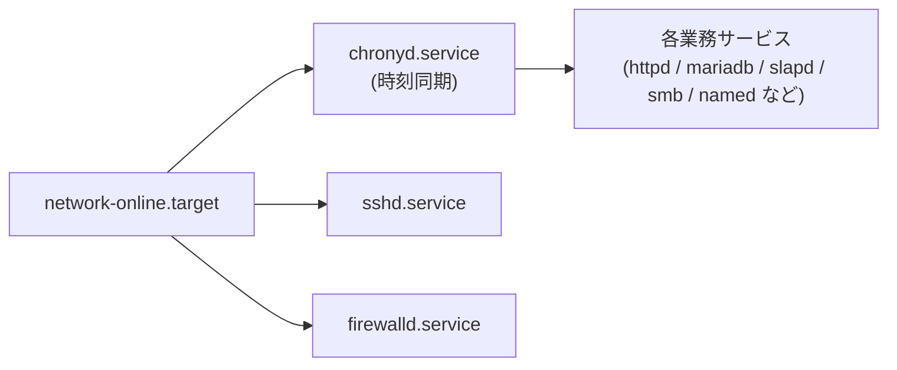
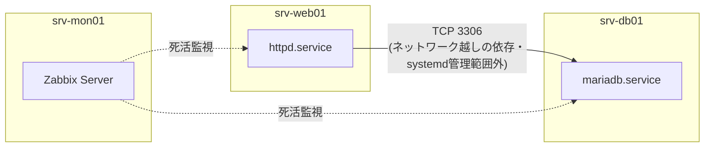

# 基本設計書(サーバ設計編)

> **📘 学習ポイント**
> この文書は、株式会社サンプル物産向けインフラ刷新プロジェクトで構築する9台のサーバそれぞれについて、「どんなスペックで、どんなOS・ミドルウェアを載せ、ディスクをどう区切り、サービスをどう自動起動させるか」を具体的に定義するものです。実務では、この文書をもとに構築担当者が実際のサーバ(仮想マシン)を作成し、パラメータシート(DOC-08)や構築手順書(DOC-09)へと内容が展開されていきます。「なぜこのスペックにしたのか」「なぜこの区切り方にしたのか」という設計根拠まで理解しておくと、面接で技術的な質問を受けた際にも自分の言葉で説明できるようになります。

## 改訂履歴

| 版数 | 日付 | 内容 | 作成者 |
|---|---|---|---|
| v0.1 | 2026-08-01 | 初版作成。サーバ一覧の転記、スペック・OS・ミドルウェアの整理まで実施 | 〇〇 〇〇 |
| v1.0 | 2026-08-20 | パーティション設計、systemd起動設定方針、サイジングの考え方の章を追記し確定版とした | 〇〇 〇〇 |

## 文書情報

| 項目 | 内容 |
|---|---|
| 文書番号 | DOC-05 |
| 文書名 | 基本設計書(サーバ設計編) |
| バージョン | v1.0 |
| 作成日 | 2026年8月1日 |
| 最終改訂日 | 2026年8月20日 |
| 作成者 | 〇〇 〇〇 |
| レビュー者 | |
| 関連文書 | DOC-03(システム構成編)、DOC-04(ネットワーク設計編)、DOC-06(セキュリティ設計編)、DOC-07(可用性・バックアップ設計編)、DOC-08(詳細設計書_パラメータシート)、DOC-09(構築手順書)、DOC-11(運用保守設計書)、DOC-12(用語集) |

## 目次

1. 本書の位置づけと目的
2. サーバ一覧
3. サイジングの考え方
4. OS共通設定方針
5. サーバ別設計
6. まとめと他文書との関連

---

## 1. 本書の位置づけと目的

本書は、DOC-03(基本設計書_システム構成編)およびDOC-04(基本設計書_ネットワーク設計編)で定義したシステム全体構成・ネットワーク構成を踏まえ、個々のサーバ単位での設計(スペック、OS、ミドルウェア、ディスク構成、サービス起動方針)を定義するものである。本書で定めた内容は、DOC-08(詳細設計書_パラメータシート)でパラメータレベルまで具体化され、DOC-09(構築手順書)の実作業に落とし込まれる。

対象読者は、実際に手を動かして構築を行う学習者本人と、その成果物を評価する採用担当者・面接官の双方を想定している。そのため、単に結論(スペックや設定値)を並べるだけでなく、その根拠を「💡 なぜこう設計するのか」として随所に補足する構成とした。

> **📘 学習ポイント**
> サーバ設計書は「値を決める文書」であると同時に、「なぜその値にしたかを説明できるようにする文書」でもあります。現場の設計レビューでは「このディスクサイズの根拠は?」「このスワップサイズはどう決めた?」と必ず質問されます。丸暗記ではなく、判断基準を理解しておくことが実務でもポートフォリオでも評価につながります。

---

## 2. サーバ一覧

以下は、本プロジェクトにおける正となるサーバ一覧である。台数・役割・IPアドレス・OS・ミドルウェア・スペックは、マスター仕様書の値を一切変更せずそのまま転記している。他の設計書(DOC-03〜DOC-11)も本表と矛盾しないよう作成されている。

| No | ホスト名 | 役割 | 設置セグメント | IPアドレス | OS | 主要ミドルウェア | スペック(vCPU/メモリ/ディスク) |
|---|---|---|---|---|---|---|---|
| 1 | gw-fw01 | ゲートウェイ/ファイアウォール(セグメント間ルーティング・NAT) | 全セグメントに接続(マルチホーム) | 各セグメントの.1 | AlmaLinux 9.4 | firewalld, nftables | 2vCPU/2GBメモリ/20GBディスク |
| 2 | mgmt-pc01 | 管理端末(踏み台サーバ) | 管理LAN | 192.168.10.11 | AlmaLinux 9.4 | OpenSSH | 2vCPU/2GBメモリ/20GBディスク |
| 3 | srv-dns01 | DNS/DHCPサーバ(社内NTPサーバも兼務) | サーバLAN | 192.168.20.11 | AlmaLinux 9.4 | BIND 9.18, Kea DHCP 2.4, chrony | 2vCPU/2GBメモリ/20GBディスク |
| 4 | srv-ldap01 | 認証統合サーバ | サーバLAN | 192.168.20.12 | AlmaLinux 9.4 | OpenLDAP 2.6 | 2vCPU/4GBメモリ/30GBディスク |
| 5 | srv-web01 | 社内業務ポータルWebサーバ | サーバLAN | 192.168.20.13 | AlmaLinux 9.4 | Apache HTTP Server 2.4, PHP 8.2 | 2vCPU/4GBメモリ/40GBディスク |
| 6 | srv-db01 | データベースサーバ | サーバLAN | 192.168.20.14 | AlmaLinux 9.4 | MariaDB 10.11 | 4vCPU/8GBメモリ/60GBディスク |
| 7 | srv-file01 | ファイル共有サーバ | サーバLAN | 192.168.20.15 | AlmaLinux 9.4 | Samba 4.19(LDAP連携認証) | 4vCPU/8GBメモリ/200GBディスク |
| 8 | srv-mon01 | 監視サーバ | サーバLAN | 192.168.20.16 | AlmaLinux 9.4 | Zabbix Server/Web 6.4, 各サーバにZabbix Agent2 | 2vCPU/4GBメモリ/50GBディスク |
| 9 | srv-bk01 | バックアップサーバ | サーバLAN | 192.168.20.17 | AlmaLinux 9.4 | rsync, cron | 2vCPU/4GBメモリ/500GBディスク(バックアップ保存用) |

全サーバ共通事項として、NTPはsrv-dns01(chrony)を参照する。タイムゾーンはAsia/Tokyo。DNS参照先はすべてsrv-dns01(192.168.20.11)。SSHは公開鍵認証のみとし、rootログインは禁止する。詳細な理由・設定値はDOC-06(セキュリティ設計編)を参照のこと。

---

## 3. サイジングの考え方

サイジングとは、サーバに割り当てるvCPU(仮想CPU。物理CPUのコアやスレッドを仮想マシンごとに分割して割り当てたもの。※用語集(12_用語集.md)参照)・メモリ・ディスクの量を、役割に応じて過不足なく決定する作業である。本節では「なぜこの9台にこのスペックを割り振ったのか」という考え方を整理する。

### 3.1 3つの要素とサーバ性能の関係

| 要素 | 主に効いてくる場面 | 過小だとどうなるか | 過大だとどうなるか |
|---|---|---|---|
| vCPU | 同時処理数が多い(多数のクライアントからの同時アクセス、SQLクエリの並列実行など) | 処理待ちが発生し応答が遅延する | 物理ホスト全体のCPUを無駄に予約してしまう |
| メモリ | データをキャッシュして高速化する処理(DBのバッファプール、ファイルシステムキャッシュなど) | ディスクI/Oが頻発し極端に遅くなる、OOM(メモリ不足によるプロセス強制終了)のリスクが上がる | 他の仮想マシンに割り当てられるメモリが減る |
| ディスク | 実データの保存量(共有ファイル、DBデータ、バックアップデータ) | 容量不足でサービス停止に至る | ホストディスクを無駄に消費し、バックアップ時間も伸びる |

> **💡 なぜこう設計するのか**
> スペックは「多ければ多いほど良い」わけではありません。本番想定ではESXi(VMware社の仮想化基盤ソフトウェア。1台の物理サーバ上に複数の仮想マシンを同時に稼働させる仕組み。※用語集参照)上で複数の仮想マシンが物理リソースを分け合うため、1台に必要以上のスペックを割り当てると、他のサーバの分が圧迫されます(この「物理リソースの合計より多くの仮想リソースを割り当てて運用する」考え方をオーバーコミットと呼びます。※用語集参照)。だからこそ「その役割に本当に必要な量は何か」を1台ずつ考えて割り振ることが設計の腕の見せ所になります。

### 3.2 高スペック組と標準スペック組

サーバ一覧を役割ごとのスペックで見直すと、明確に2つのグループに分かれる。

| グループ | 該当サーバ | スペックの特徴 | 高くしている理由 |
|---|---|---|---|
| 高スペック組 | srv-db01(4vCPU/8GB/60GB)、srv-file01(4vCPU/8GB/200GB) | vCPU・メモリ・ディスクいずれも他より高い | 後述のとおり、実データの処理量・保存量が他サーバと桁違いに大きい |
| 標準スペック組 | gw-fw01、mgmt-pc01、srv-dns01(いずれも2vCPU/2GB/20GB)、srv-ldap01、srv-web01、srv-mon01、srv-bk01(いずれも2vCPU/4GB) | 必要最小限に抑えている | 処理内容が軽量、または保存するのは設定情報や履歴データが中心でDBやファイルほど巨大にならない |

**srv-db01(データベースサーバ)を高スペックにする理由**

MariaDB(本プロジェクトで使用するデータベース製品)は、ディスク上のデータをできるだけメモリ上にキャッシュ(InnoDB(MariaDBの標準ストレージエンジン)がデータをメモリ上のバッファプールと呼ばれる領域にキャッシュし、ディスクアクセスを減らして高速化する仕組みを持つ。※用語集参照)することで応答速度を稼ぐ。メモリが少ないと毎回ディスクへ読みに行くことになり、業務ポータル全体が遅くなる。また、複数の利用者から同時に検索・更新のクエリが飛んでくることを想定すると、これを並列にさばくためのCPUコア数も必要になる。ディスクは、業務データの蓄積とログ(トランザクションログ)の増加を見込んで60GBを確保した。

**srv-file01(ファイル共有サーバ)を高スペックにする理由**

ファイルサーバは「実際に社員が保存する業務データそのもの」を格納するサーバであり、9台の中で最も大きなディスク容量(200GB)を必要とする。またSamba(Linux上でWindowsのファイル共有プロトコルであるSMB/CIFSを実現するソフトウェア。※用語集参照)は複数クライアントから同時にファイルを読み書きされることが常態であり、同時接続数の多さに耐えるためのメモリ(OSのファイルキャッシュとして働く)とCPUを確保している。

**標準スペック組を抑えている理由**

一方、gw-fw01(ゲートウェイ)やsrv-dns01(DNS/DHCP)は、1回あたりの処理が軽く(パケット転送、名前解決の応答など)、大量のデータを蓄積するわけでもない。mgmt-pc01(踏み台)は管理者のSSH接続を中継するだけの役割であり、常時大きな負荷はかからない。srv-ldap01(認証統合)やsrv-mon01(監視)、srv-bk01(バックアップ)はメモリを4GBとやや高めにしているが、これは同時多数の認証要求のキャッシュや、監視データ・バックアップ処理のバッファとして最低限必要な余裕を見ているためであり、DBやファイルサーバほどの規模は不要と判断した。

### 3.3 9台の合計リソースと本番構成への対応

9台の仮想マシンをすべて起動した場合の合計リソースは以下のとおりである。

| 項目 | 合計値 |
|---|---|
| vCPU合計 | 22 vCPU |
| メモリ合計 | 38 GB |
| ディスク合計 | 940 GB |

> **💡 なぜこう設計するのか**
> 本番想定では、この合計量を「オンプレミス物理サーバ2台+VMware ESXi」で受け止めます。DOC-03(システム構成編)で示すとおり、9台の仮想マシンを2台の物理ホストに分散配置し、片方の物理サーバに障害が起きても重要サービスが完全には止まらないよう考慮します(詳細はDOC-07 可用性・バックアップ設計編)。一方、学習環境ではVirtualBox 7.x上に自宅PC1台ですべて再現する構成を想定しています。もし手元のPCが38GBものメモリを積んでいない場合は、ディスクを可変サイズ(実際に使った分だけホストディスクを消費する方式)で作成する、普段は使う数台だけ起動しておき検証時だけ全台起動するなど、実務でも行われる工夫で対応するとよいでしょう。設計書の値(本番想定のスペック)と、実際に手元で動かす環境の値が異なっていても構いません。「設計としてはこう考えた」という説明ができることが重要です。

---

## 4. OS共通設定方針

9台すべてのサーバはAlmaLinux 9.4で統一する。AlmaLinuxは商用ディストリビューションであるRed Hat Enterprise Linux(RHEL)とバイナリ互換を持つ無償のディストリビューションであり、実務で広く使われるRHEL系の知識・コマンド体系をそのまま学べる利点がある。

以下は、9台すべてに共通して適用する基本方針である。個別サーバごとの差分は「5. サーバ別設計」で扱う。

| 項目 | 共通方針 |
|---|---|
| ホスト名/FQDN(完全修飾ドメイン名。ホスト名にドメイン名を連結した、ネットワーク上で一意になる名前。※用語集参照) | `srv-<役割略称>01.sample-trading.local` 形式で統一(管理端末のみ `mgmt-pc01.sample-trading.local`)。`hostnamectl set-hostname` で設定する |
| タイムゾーン | Asia/Tokyo(`timedatectl set-timezone Asia/Tokyo`) |
| 時刻同期 | 全サーバがsrv-dns01(192.168.20.11)のchrony(NTP(Network Time Protocol。ネットワーク越しにサーバ間の時刻を同期させるプロトコル)を実装するLinux用ソフトウェア。※用語集参照)をNTPサーバとして参照する。srv-dns01自身の同期方針は5.3節で扱う |
| DNS参照 | 全サーバの名前解決先はsrv-dns01(192.168.20.11)に統一する |
| SSHログイン方式 | 公開鍵認証のみ許可、パスワード認証禁止、rootでの直接ログイン禁止。管理者はsudoで権限昇格する運用とする(詳細はDOC-06) |
| パッチ適用 | `dnf update` を月次定例(第1月曜)で実施する(詳細はDOC-11 運用保守設計書) |
| ファイアウォール | 全サーバでfirewalldを有効化し、役割ごとに必要最小限のポートのみ開放する(詳細はDOC-06) |

### 4.1 パーティション設計の共通ルール

ディスクパーティション(1つの物理・仮想ディスクを複数の独立した領域に区切ること。※用語集参照)は、以下の共通ルールに沿って各サーバごとに設計する。

- **/boot を分離する**: カーネルの更新に失敗しても、システム全体を巻き込まずに復旧しやすくするため、/bootは1GBの独立領域として確保する。
- **swap(スワップ。物理メモリが不足した際に、ディスクの一部を一時的にメモリの代わりとして使う仕組み。※用語集参照)のサイズルール**: メモリが4GB以下のサーバはメモリと同量、メモリが8GBのサーバはメモリの半量とする。
- **用途別に増加しやすい領域を分離する**: ログやデータベース、共有ファイル、バックアップデータなど、運用中に肥大化しやすい領域は/var・/data・/backupのように分離し、万一容量を使い切っても/(ルート)を圧迫してOS自体が止まる事態を避ける。
- **LVM(論理ボリュームマネージャ。複数のディスク領域を柔軟に統合・拡張できるようにする仕組み。※用語集参照)は今回は使用しない**: 台数・規模が小さく、将来の拡張要件も限定的であるため、まずは標準パーティションでシンプルに構成する。ディスク拡張が本格的に必要になった場合はLVM導入を再検討する、というスコープの割り切りである。

> **💡 なぜこう設計するのか**
> 「/(ルート)1本にまとめてしまえば楽なのでは」と考える方も多いと思います。実際、小規模な検証環境ではそれでも動きます。しかし現場でこの割り切りをすると、たとえばログが暴走して/var以下を埋め尽くした瞬間に、OS起動に必要な/自体も一杯になってサーバ全体が応答しなくなる、という事故につながります。用途ごとに"壊れても被害範囲を限定できる"単位でディスクを区切っておくことが、初心者のうちから身につけておきたい設計習慣です。

### 4.2 スワップサイズの決め方

| メモリ量 | swapサイズ | 考え方 |
|---|---|---|
| 2GB(gw-fw01, mgmt-pc01, srv-dns01) | 2GB | メモリが少ないサーバほど、一時的なメモリ不足の影響を受けやすいため、メモリと同量を安全弁として確保する |
| 4GB(srv-ldap01, srv-web01, srv-mon01, srv-bk01) | 4GB | 同上の考え方をそのまま適用 |
| 8GB(srv-db01, srv-file01) | 4GB(メモリの半量) | メモリが十分にあるサーバでは、swapは「常用」ではなく「非常時の保険」の意味合いが強くなるため、同量までは確保せず半量にとどめてディスクを無駄にしない |

---

## 5. サーバ別設計

本章では、9台それぞれについて、役割・スペック・OS・主要ミドルウェア・パーティション設計・systemd(Linuxにおいてサービスの起動・停止・依存関係を管理する仕組み。旧来のinitに代わる現在の標準機構。※用語集参照)起動設定方針を定義する。

### 5.1 gw-fw01(ゲートウェイ/ファイアウォール)

| 項目 | 内容 |
|---|---|
| 役割 | 全セグメント間のルーティングおよびNAT(アドレス変換)、外部との境界にあたるファイアウォール |
| 設置セグメント | 全セグメントに接続(マルチホーム構成) |
| IPアドレス | 各セグメントの.1(WAN・管理LAN・サーバLAN・内部LAN・DMZそれぞれのゲートウェイIP) |
| OS | AlmaLinux 9.4 |
| 主要ミドルウェア | firewalld, nftables |
| スペック | 2vCPU/2GBメモリ/20GBディスク |

**パーティション設計**

| マウントポイント | サイズ目安 | 用途 |
|---|---|---|
| /boot | 1GB | カーネル・ブートローダ |
| swap | 2GB | メモリ不足時の安全弁 |
| / | 17GB(残り全て) | OS本体・firewalld設定ファイル等 |

**systemd起動設定方針**

| サービス | 起動設定 | 依存関係・備考 |
|---|---|---|
| firewalld.service | 自動起動を有効化(enable) | AlmaLinux 9系の既定バックエンドはnftablesであり、firewalldが内部でnftablesのルールを直接操作する。nftables.serviceを別途有効化するとルールが競合する可能性があるため、有効化しない |
| sshd.service | 自動起動を有効化 | 管理LANからのみ接続許可(DOC-06参照) |
| chronyd.service | 自動起動を有効化 | srv-dns01を時刻同期元として参照 |

また、セグメント間のルーティングを実現するため、`net.ipv4.ip_forward=1` をsysctl設定として`/etc/sysctl.d/`配下に恒久化する(これはsystemdサービスではなくカーネルパラメータであり、network系サービスの起動と合わせて反映されるよう設定する)。詳細なルーティング・NAT設計はDOC-04(ネットワーク設計編)を参照。

> **💡 なぜこう設計するのか**
> 「firewalldとnftables、両方サービスを有効にした方が安全では」と考えがちですが、実際には逆効果です。firewalldはnftablesを"操作するための管理ツール"であり、両者を別々に有効化すると同じパケットフィルタの仕組みに二重に命令を出すことになり、意図しない通信断や設定の食い違いを引き起こします。「何が何を管理しているのか」という依存関係を理解しておくことが、思わぬ障害を防ぐ第一歩です。

### 5.2 mgmt-pc01(管理端末/踏み台サーバ)

| 項目 | 内容 |
|---|---|
| 役割 | 管理者が社内サーバへSSH接続する際の踏み台(バスティオンホスト)。直接インターネットからも各サーバLANからも到達できない位置に管理者の入口を一本化する |
| 設置セグメント | 管理LAN(VLAN10) |
| IPアドレス | 192.168.10.11 |
| OS | AlmaLinux 9.4 |
| 主要ミドルウェア | OpenSSH |
| スペック | 2vCPU/2GBメモリ/20GBディスク |

**パーティション設計**

| マウントポイント | サイズ目安 | 用途 |
|---|---|---|
| /boot | 1GB | カーネル・ブートローダ |
| swap | 2GB | メモリ不足時の安全弁 |
| /home | 2GB | 管理者アカウントのSSH鍵・known_hosts等の個人領域 |
| / | 15GB(残り全て) | OS本体 |

**systemd起動設定方針**

| サービス | 起動設定 | 依存関係・備考 |
|---|---|---|
| sshd.service | 自動起動を有効化 | 本サーバの生命線となるサービス。公開鍵認証のみ許可し、rootログイン禁止(DOC-06参照) |
| firewalld.service | 自動起動を有効化 | 許可元IPを社内の管理者端末に限定する想定(演習では簡略化) |
| chronyd.service | 自動起動を有効化 | srv-dns01を時刻同期元として参照 |

> **💡 なぜこう設計するのか**
> mgmt-pc01だけ/homeを独立させているのは、この1台が"踏み台"という特別な役割を持つためです。管理者のSSH設定や既知ホスト情報といった個人領域を/とは別領域にしておくと、万一OS部分を再構築することになっても、/homeだけ残せば管理者の作業環境を失わずに済みます。他の8台は特定の個人が常用ログインする前提ではないため、/homeを分離するメリットが小さく、あえて分けていません。「全部同じルールで統一する」のではなく「その台の役割に合わせて必要な箇所だけ変える」ことも設計の一部です。

### 5.3 srv-dns01(DNS/DHCP/NTPサーバ)

| 項目 | 内容 |
|---|---|
| 役割 | 社内ドメイン(sample-trading.local)の名前解決(DNS)、内部LANのクライアントへのIP自動払い出し(DHCP)、社内NTPサーバを兼務 |
| 設置セグメント | サーバLAN(VLAN20) |
| IPアドレス | 192.168.20.11 |
| OS | AlmaLinux 9.4 |
| 主要ミドルウェア | BIND 9.18, Kea DHCP 2.4, chrony |
| スペック | 2vCPU/2GBメモリ/20GBディスク |

**パーティション設計**

| マウントポイント | サイズ目安 | 用途 |
|---|---|---|
| /boot | 1GB | カーネル・ブートローダ |
| swap | 2GB | メモリ不足時の安全弁 |
| /var | 4GB | BINDのゾーンファイル、Kea DHCPのリース情報(払い出し履歴)、各種ログ |
| / | 13GB(残り全て) | OS本体 |

**systemd起動設定方針**

| サービス | 起動設定 | 依存関係・備考 |
|---|---|---|
| named.service(BIND) | 自動起動を有効化 | After=network-online.target(ネットワークが使える状態になってから起動する) |
| kea-dhcp4.service | 自動起動を有効化 | 内部LAN(192.168.30.100〜192.168.30.200)へIPを動的払い出し |
| chronyd.service | 自動起動を有効化 | 他8台に対してはNTPサーバとして動作する。srv-dns01自身の上位同期先は下記コラム参照 |

> **💡 なぜこう設計するのか**
> 「NTPはsrv-dns01を参照する」という共通ルールがありますが、これは「他の8台がsrv-dns01を見る」という意味であり、srv-dns01自身がどこにも時刻を合わせなくてよい、という意味ではありません。本番構成では、srv-dns01はさらに上位のインターネット上の公開NTPサーバ(NTPプールなど)と同期し、社内全体の時刻の"正しさ"の根拠を外部に持ちます。一方、本演習ではWANセグメント(203.0.113.0/24)は疑似的なものであり実際のインターネット接続を持たないため、srv-dns01はローカルクロック(自ホストの時計)を基準として動作させる設計とします。「本番ではこうなる」という対応関係を理解した上で、演習用の割り切りをしていることが説明できると評価されます。

### 5.4 srv-ldap01(認証統合サーバ)

| 項目 | 内容 |
|---|---|
| 役割 | 社内アカウントを一元管理する認証基盤。LDAP(Lightweight Directory Access Protocol。ユーザーやグループなどの情報を階層構造で管理・検索するためのディレクトリサービスの通信プロトコル。※用語集参照)により、各サーバ・各サービスが同じアカウント情報を参照できるようにする |
| 設置セグメント | サーバLAN(VLAN20) |
| IPアドレス | 192.168.20.12 |
| OS | AlmaLinux 9.4 |
| 主要ミドルウェア | OpenLDAP 2.6 |
| スペック | 2vCPU/4GBメモリ/30GBディスク |

**パーティション設計**

| マウントポイント | サイズ目安 | 用途 |
|---|---|---|
| /boot | 1GB | カーネル・ブートローダ |
| swap | 4GB | メモリ不足時の安全弁 |
| /var | 8GB | OpenLDAPのデータベース本体(/var/lib/ldap)。アカウント情報・グループ情報を格納 |
| / | 17GB(残り全て) | OS本体 |

**systemd起動設定方針**

| サービス | 起動設定 | 依存関係・備考 |
|---|---|---|
| slapd.service(OpenLDAP) | 自動起動を有効化 | After=network-online.target |
| firewalld.service | 自動起動を有効化 | LDAP用ポート(TCP 389/636)をサーバLANからのみ許可 |
| chronyd.service | 自動起動を有効化 | srv-dns01を参照 |

> **💡 なぜこう設計するのか**
> 老朽化した現行環境では「アカウントは各PCローカル管理でバラバラ」という課題がありました。srv-ldap01を導入する目的は、この状態を解消し、社員1人につき1つのアカウントで、ファイルサーバへのログインもWebポータルへのログインも共通化することです。srv-file01(ファイルサーバ)やsrv-web01(業務ポータル)がこのサーバを参照する構成にすることで、退職者のアカウント削除も1箇所で完結し、削除漏れによるセキュリティリスクを減らせます。「認証を1箇所に集約する」という考え方自体が、この案件のゴールの中核であることを理解しておくとよいでしょう。

### 5.5 srv-web01(社内業務ポータルWebサーバ)

| 項目 | 内容 |
|---|---|
| 役割 | 社員が日常的に利用する社内業務ポータル(Webアプリケーション)を稼働させる |
| 設置セグメント | サーバLAN(VLAN20) |
| IPアドレス | 192.168.20.13 |
| OS | AlmaLinux 9.4 |
| 主要ミドルウェア | Apache HTTP Server 2.4, PHP 8.2 |
| スペック | 2vCPU/4GBメモリ/40GBディスク |

**パーティション設計**

| マウントポイント | サイズ目安 | 用途 |
|---|---|---|
| /boot | 1GB | カーネル・ブートローダ |
| swap | 4GB | メモリ不足時の安全弁 |
| /var | 10GB | Webコンテンツ(/var/www)およびアクセスログ・エラーログ |
| / | 25GB(残り全て) | OS本体、PHP実行環境 |

**systemd起動設定方針**

| サービス | 起動設定 | 依存関係・備考 |
|---|---|---|
| httpd.service(Apache) | 自動起動を有効化 | After=network-online.target |
| php-fpm.service | 自動起動を有効化 | ApacheからmodProxyFcgi等を通してPHPの実行を委譲する構成を想定 |
| chronyd.service | 自動起動を有効化 | srv-dns01を参照 |

srv-web01上の業務ポータルはsrv-db01(MariaDB)とネットワーク越しに通信してデータを読み書きし、認証にはsrv-ldap01を利用する想定である。

> **💡 なぜこう設計するのか**
> srv-web01はsrv-db01がなければまともに動作しませんが、この依存関係を「systemdのAfter=で待たせる」ことはできません。なぜなら、systemdが管理できるのは同じサーバ内のサービス起動順序だけであり、ネットワークの向こう側にある別サーバの状態までは面倒を見てくれないからです。この種の"サーバをまたいだ依存関係"は、アプリケーション側の再接続処理(接続に失敗しても一定間隔でリトライする)と、srv-mon01による死活監視・アラートの仕組みで補うのが現実的な設計です。「同じホスト内の依存」と「ホストをまたぐ依存」は、対処の仕方がまったく違うということを覚えておいてください。

### 5.6 srv-db01(データベースサーバ)

| 項目 | 内容 |
|---|---|
| 役割 | 業務ポータルが利用するデータベースを稼働させる |
| 設置セグメント | サーバLAN(VLAN20) |
| IPアドレス | 192.168.20.14 |
| OS | AlmaLinux 9.4 |
| 主要ミドルウェア | MariaDB 10.11 |
| スペック | 4vCPU/8GBメモリ/60GBディスク |

**パーティション設計**

| マウントポイント | サイズ目安 | 用途 |
|---|---|---|
| /boot | 1GB | カーネル・ブートローダ |
| swap | 4GB(メモリの半量) | メモリ不足時の安全弁 |
| /var | 40GB | MariaDBのデータ本体(/var/lib/mysql)。テーブルデータ・トランザクションログ |
| / | 15GB(残り全て) | OS本体 |

**systemd起動設定方針**

| サービス | 起動設定 | 依存関係・備考 |
|---|---|---|
| mariadb.service | 自動起動を有効化 | After=network-online.target |
| firewalld.service | 自動起動を有効化 | DB用ポート(TCP 3306)をサーバLAN内の必要な通信元のみ許可 |
| chronyd.service | 自動起動を有効化 | srv-dns01を参照。DBのタイムスタンプ整合性のためにも時刻同期は重要 |

> **💡 なぜこう設計するのか**
> /var(MariaDBのデータ本体)を60GB中40GBという最大割合で確保しているのは、9台の中でこのサーバが最もディスクI/Oとデータ増加の影響を受けやすいためです。バックアップ設計(DOC-07)では、srv-db01のDBダンプ(データベースの内容をファイルとして書き出したもの)を日次差分・週次フルでsrv-bk01へ転送する方針としています。ダンプ出力時には一時的にディスク使用量が増えるため、データ本体だけでなく余裕を持ったサイジングが必要になる点も、実務では見落としやすいポイントです。

### 5.7 srv-file01(ファイル共有サーバ)

| 項目 | 内容 |
|---|---|
| 役割 | 部門別アクセス制御付きの社内ファイル共有基盤。現行のWindows Server 2012による老朽化した共有フォルダを置き換える中核サーバ |
| 設置セグメント | サーバLAN(VLAN20) |
| IPアドレス | 192.168.20.15 |
| OS | AlmaLinux 9.4 |
| 主要ミドルウェア | Samba 4.19(LDAP連携認証) |
| スペック | 4vCPU/8GBメモリ/200GBディスク |

**パーティション設計**

| マウントポイント | サイズ目安 | 用途 |
|---|---|---|
| /boot | 1GB | カーネル・ブートローダ |
| swap | 4GB(メモリの半量) | メモリ不足時の安全弁 |
| /data | 180GB | Sambaが公開する共有データ本体。部門別フォルダをこの配下に構成 |
| / | 15GB(残り全て) | OS本体 |

**systemd起動設定方針**

| サービス | 起動設定 | 依存関係・備考 |
|---|---|---|
| sssd.service(LDAP連携) | 自動起動を有効化 | srv-ldap01と連携し、LDAP上のアカウント情報をOS上のユーザー/グループとして解決する |
| smb.service(Samba) | 自動起動を有効化 | After=sssd.service(先にLDAP連携が確立してから共有サービスを起動する) |
| nmb.service | 自動起動を有効化 | Windowsクライアントからの名前解決補助用 |
| chronyd.service | 自動起動を有効化 | srv-dns01を参照 |

> **💡 なぜこう設計するのか**
> 現行環境の課題は「アカウントは各PCローカル管理でバラバラ」でした。もしsrv-file01が独自にローカルアカウントを持つ設計にしてしまうと、この課題を引き継いでしまいます。そこでSambaをsrv-ldap01と連携させ(sssdを介してLDAP上のアカウントをOSのユーザーとして扱えるようにする)、部門別アクセス制御をLDAP上のグループ情報に基づいて行う設計としています。smb.serviceの起動をsssd.serviceの後にする(After=)のも、認証の裏付けとなる仕組みが立ち上がる前に共有サービスだけ先に動いてしまう状態を避けるためです。

### 5.8 srv-mon01(監視サーバ)

| 項目 | 内容 |
|---|---|
| 役割 | 全サーバの死活監視・リソース監視を行う。現行環境で存在しなかった「サーバの死活監視の仕組み」を新設する |
| 設置セグメント | サーバLAN(VLAN20) |
| IPアドレス | 192.168.20.16 |
| OS | AlmaLinux 9.4 |
| 主要ミドルウェア | Zabbix Server/Web 6.4, 各サーバにZabbix Agent2 |
| スペック | 2vCPU/4GBメモリ/50GBディスク |

**パーティション設計**

| マウントポイント | サイズ目安 | 用途 |
|---|---|---|
| /boot | 1GB | カーネル・ブートローダ |
| swap | 4GB | メモリ不足時の安全弁 |
| /var | 4GB | Zabbix Serverのログ・設定ファイル |
| / | 41GB(残り全て) | OS本体、Zabbix Web(フロントエンド)実行環境 |

**systemd起動設定方針**

| サービス | 起動設定 | 依存関係・備考 |
|---|---|---|
| zabbix-server.service | 自動起動を有効化 | After=network-online.target。監視データの保存先であるsrv-db01のMariaDBへネットワーク経由で接続する |
| zabbix-agent2.service | 自動起動を有効化 | srv-mon01自身の状態も自己監視対象とする |
| httpd.service(Zabbix Web) | 自動起動を有効化 | Zabbixの管理画面を提供 |
| chronyd.service | 自動起動を有効化 | srv-dns01を参照 |

> **💡 なぜこう設計するのか**
> 監視データの保存先について、本設計ではsrv-mon01にDBを個別に持たせず、既存のsrv-db01(データベースサーバ)上のMariaDBを共有して利用する方針としました。理由は2つあります。1つ目は、データベース運用のノウハウ(バックアップ、パッチ適用、権限管理)を1箇所に集約できること。2つ目は、DOC-07のバックアップ方針で既にsrv-db01のDBダンプがバックアップ対象に含まれているため、Zabbixの監視履歴も追加のバックアップ経路を新設せずに自然と保護対象に含められることです。このように、新しいサーバを1台追加するたびに何でも自己完結させるのではなく、既存の仕組みに乗せられるものは乗せる、という判断も設計の一部です。

### 5.9 srv-bk01(バックアップサーバ)

| 項目 | 内容 |
|---|---|
| 役割 | 各サーバの重要データを日次・週次で収集し、世代管理して保存する。現行環境の「手動でUSB HDDにコピーしているだけで世代管理もされていない」という課題を解消する |
| 設置セグメント | サーバLAN(VLAN20) |
| IPアドレス | 192.168.20.17 |
| OS | AlmaLinux 9.4 |
| 主要ミドルウェア | rsync, cron |
| スペック | 2vCPU/4GBメモリ/500GBディスク(バックアップ保存用) |

**パーティション設計**

| マウントポイント | サイズ目安 | 用途 |
|---|---|---|
| /boot | 1GB | カーネル・ブートローダ |
| swap | 4GB | メモリ不足時の安全弁 |
| /backup | 480GB | バックアップデータ本体(4世代分の日次差分・週次フルを保存) |
| / | 15GB(残り全て) | OS本体 |

**systemd起動設定方針**

| サービス | 起動設定 | 依存関係・備考 |
|---|---|---|
| crond.service | 自動起動を有効化 | 日次差分バックアップ(毎日23:00)・週次フルバックアップ(日曜23:00)のジョブをこのサービスがスケジュール実行する |
| sshd.service | 自動起動を有効化 | rsyncの転送経路としてSSHを利用するため、対向サーバへの接続に必要 |
| chronyd.service | 自動起動を有効化 | srv-dns01を参照。バックアップの取得時刻・世代管理の整合性を保つ上で時刻同期が特に重要 |

バックアップ対象・世代管理・取得タイミングの詳細方針(RPO/RTOを含む)はDOC-07(可用性・バックアップ設計編)を参照のこと。

> **💡 なぜこう設計するのか**
> rsyncを常駐のデーモン(ポート873で待ち受ける「rsyncd」サービス)として動かす方式もありますが、本設計ではあえて採用していません。代わりに、srv-bk01からcronでスケジュール起動したrsyncが、SSH経由で各サーバ(srv-file01, srv-db01, srv-ldap01)へ接続しに行く「SSH越しのrsync」方式を採用しています。これは全サーバ共通のSSH公開鍵認証の仕組みをそのまま流用でき、rsyncd専用の別認証を増やさずに済むためです。「セキュリティ方針(公開鍵認証への統一)」と「バックアップの転送方式」がここでつながっている、という点に気づけると設計の一貫性が見えてきます。

### 5.10 サービス起動の全体像

各サーバのサービスは、まず自ホスト内でのOS起動順序に従い(network-online.target → chronyd → 各業務サービスという順)、その上でサーバをまたいだ依存関係(例:srv-web01からsrv-db01への接続)はネットワーク越しの通信として扱われ、systemdの管理範囲外となる。

サーバをまたいだ依存関係は、以下のようにアプリケーション側の再接続処理とsrv-mon01の監視・アラートによって補完する。

> **💡 なぜこう設計するのか**
> 初心者がよく誤解するポイントの1つが「systemdのAfter=やRequires=を使えば、別サーバにあるサービスの起動を待てるのでは」という点です。実際にはsystemdが管理できるのは同一ホスト内のプロセスだけであり、別サーバの状態はネットワーク通信を試みて初めて分かります。だからこそ、複数サーバで構成されるシステムでは「起動順序をきっちり揃える」ことよりも「一時的につながらなくても自動的に回復できる(リトライする)」「つながらない状態を検知して人に知らせる(監視する)」という設計の方が現実的で壊れにくくなります。srv-mon01の存在意義は、まさにこの"サーバをまたいだ依存関係"を人間の目の代わりに見張ることにあります。

---

## 6. まとめと他文書との関連

本書では、9台のサーバそれぞれについて、役割に応じたスペック(vCPU・メモリ・ディスク)、OS共通設定方針、ディスクパーティション設計、systemd起動設定方針を定義した。特に、srv-db01・srv-file01を高スペックとした判断根拠、swapサイズの決定ルール、サーバをまたいだ依存関係をsystemdではなく監視とリトライで補う設計思想は、実務でも問われやすいポイントである。

本書の内容は、以下の文書へと展開される。

| 文書番号 | 文書名 | 本書との関係 |
|---|---|---|
| DOC-03 | 基本設計書_システム構成編 | 9台のサーバがシステム全体でどう連携するかの全体像 |
| DOC-04 | 基本設計書_ネットワーク設計編 | 各サーバの設置セグメント・IPアドレスの設計根拠 |
| DOC-06 | 基本設計書_セキュリティ設計編 | 各サーバのfirewalld許可ポート、SSH認証方式の詳細 |
| DOC-07 | 基本設計書_可用性バックアップ設計編 | srv-bk01によるバックアップ対象・世代管理・RPO/RTOの詳細 |
| DOC-08 | 詳細設計書_パラメータシート | 本書で定めたパーティション・サービス起動設定を具体的な設定値・コマンドレベルまで落とし込んだもの |
| DOC-09 | 構築手順書 | 本書の設計内容をもとにした実際の構築作業手順 |
| DOC-11 | 運用保守設計書 | 月次パッチ適用など、構築後の運用フェーズでの取り扱い |
| DOC-12 | 用語集 | 本書で登場した専門用語の解説 |

> **📘 学習ポイント**
> 設計書は1文書だけで完結するものではなく、上位文書(要件定義・システム構成)からの要求を受け止め、下位文書(パラメータシート・構築手順書)へ橋渡しする役割を持っています。ポートフォリオとして提示する際は、この文書だけを見せるのではなく「DOC-02の要件がDOC-05でこう具体化され、DOC-08・DOC-09でこう実装されていった」という一連の流れを説明できると、単なる暗記ではなく設計の考え方そのものを理解していることが伝わります。
