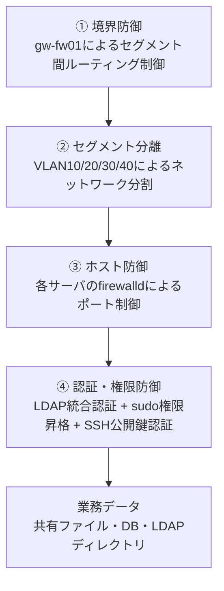

# 基本設計書(セキュリティ設計編)

> 📘 **学習ポイント**
>
> この文書は、株式会社サンプル物産様向けインフラ刷新プロジェクトにおける「セキュリティ設計」をまとめたものです。実務の現場では、ネットワーク構成やサーバ構成が決まった後、必ず「誰が・どこから・何にアクセスできるか」を明文化する工程があり、この文書がその役割を担います。採用面接では「なぜそのポートを開けたのか」「なぜその通信を拒否したのか」を自分の言葉で説明できるかが評価されるポイントになるため、本書では結論(ルール表)だけでなく、その背後にある考え方もあわせて記載しています。DOC-04(ネットワーク設計編)・DOC-05(サーバ設計編)で決めた構成に対して、本書がセキュリティの観点から具体的な通信ルールと運用ルールを与える、という位置づけで読み進めてください。

## 改訂履歴

| 版数 | 日付 | 内容 | 作成者 |
|---|---|---|---|
| v0.1 | 2026-08-01 | 初版ドラフト作成(セキュリティ方針・ファイアウォール設計の骨子を作成) | 〇〇 〇〇 |
| v1.0 | 2026-08-20 | レビュー指摘を反映し、ゾーン間通信許可表・サーバ別firewalld方針表・認証/ログ/脆弱性対応方針を確定 | 〇〇 〇〇 |

## 文書情報

| 項目 | 内容 |
|---|---|
| 文書番号 | DOC-06 |
| 文書名 | 基本設計書(セキュリティ設計編) |
| ファイル名 | 06_基本設計書_セキュリティ設計編.md |
| 作成日 | 2026年8月1日 |
| 最終改訂日 | 2026年8月20日 |
| バージョン | v1.0 |
| 作成者 | 〇〇 〇〇 |
| レビュー者 | (記入欄) |

---

## 目次

1. 本書の目的と位置づけ
2. セキュリティ設計の基本方針
3. 前提条件(ネットワーク構成・サーバ構成の再掲)
4. ファイアウォール設計(ゾーン間通信制御)
5. 各サーバのfirewalld設計(ホストベースフィルタリング)
6. 認証・アカウント管理方針
7. ログ管理方針
8. 脆弱性対応方針(パッチマネジメント)
9. まとめ及び他文書との関連

---

## 1. 本書の目的と位置づけ

### 1.1 目的

本書は、DOC-03(基本設計書_システム構成編)・DOC-04(基本設計書_ネットワーク設計編)・DOC-05(基本設計書_サーバ設計編)で定義したシステム構成に対し、セキュリティの観点から「どの通信を許可し、どの通信を拒否するか」「誰がどのように認証・権限管理されるか」「ログと脆弱性対応をどう運用するか」を具体化することを目的とする。

老朽化した現行環境(Windows Server 2012・アカウントは各PCローカル管理・死活監視なし・手動バックアップ)が抱える課題のうち、本書は特に「アカウント管理がバラバラで統制が効いていない」「サーバへの通信経路が管理されておらず不正アクセスのリスクが高い」という2点の解消を担う。

### 1.2 対象読者

本書は次の2種類の読者を想定して記述する。

- 未経験からサーバー構築エンジニアを目指す学習者(本設計書一式の作成者本人)
- 転職活動においてポートフォリオを確認する採用担当者・面接官

そのため、専門用語には初出時に簡潔な説明を付し、各章の要所に「なぜそう設計するのか」という設計意図の解説を挟んでいる。丸暗記ではなく理由から理解することを狙いとする。

### 1.3 関連文書

| 文書番号 | 文書名 | 本書との関係 |
|---|---|---|
| DOC-03 | 基本設計書_システム構成編 | システム全体構成・仮想化基盤の前提 |
| DOC-04 | 基本設計書_ネットワーク設計編 | VLAN構成・ルーティング設計の詳細(本書のFW設計の土台) |
| DOC-05 | 基本設計書_サーバ設計編 | 各サーバのOS・ミドルウェア構成の詳細 |
| DOC-07 | 基本設計書_可用性バックアップ設計編 | バックアップの世代管理・RPO/RTOの詳細 |
| DOC-08 | 詳細設計書_パラメータシート | firewalld/nftablesの実コマンド・設定値 |
| DOC-09 | 構築手順書 | セキュリティ設定の実際の構築手順 |
| DOC-11 | 運用保守設計書 | パッチ適用・ログ確認などの日常運用手順 |
| DOC-12 | 用語集 | 本書で用いる専門用語の解説 |

---

## 2. セキュリティ設計の基本方針

### 2.1 最小権限の原則

最小権限の原則(Least Privilege:利用者やプロセスには、業務上必要な最小限の権限だけを与えるという考え方)(※用語集(12_用語集.md)参照)を、本プロジェクトの全レイヤーで一貫して適用する。具体的には以下のように現れる。

- ネットワーク層: サーバLANへの通信は、業務上必要なポートのみを開放し、それ以外は拒否する(第4章・第5章)
- OS層: SSHはrootログインを禁止し、作業者ごとの個人アカウント+sudoで必要な時だけ権限を昇格する(第6章)
- アプリ層: srv-db01(データベース)への接続はsrv-web01からのみ許可し、社員PCから直接接続させない(第5章)
- 自動化アカウント層: バックアップ用の接続は、バックアップに必要な操作だけができるよう範囲を絞る(第5.3節)

> 💡 **なぜこう設計するのか**
>
> 「とりあえず全部開けておけば動く」という設計は、学習初期にはよくある失敗です。しかし現場では、必要な通信だけを許可し、残りはすべて拒否するのが基本姿勢です。理由はシンプルで、「開けたポートの数だけ攻撃者の入り口が増える」からです。最小権限の原則は難しい概念に見えますが、要は「今それ、本当に必要?」と一つひとつの通信・権限に問い直す習慣のことだと考えると理解しやすくなります。

### 2.2 多層防御(Defense in Depth)

多層防御(Defense in Depth:単一の防御策だけに頼らず、複数の防御層を重ねることで、一つが突破されても被害を最小限に留める考え方)(※用語集(12_用語集.md)参照)を採用する。本プロジェクトでは次の4層を重ねる。



- ① 境界防御: gw-fw01が全セグメントの出入口となり、セグメントをまたぐ通信を制御する(第4章)
- ② セグメント分離: 管理LAN・サーバLAN・内部LAN・DMZをVLANで分離し、万一1セグメントが侵害されても他セグメントへ即座に波及しない構造にする(詳細はDOC-04参照)
- ③ ホスト防御: たとえ同じサーバLAN内であっても、各サーバは自身のfirewalldで必要なポートのみ受け付ける(第5章)
- ④ 認証・権限防御: 通信経路を通過できても、認証と権限がなければデータには到達できない(第6章)

> 💡 **なぜこう設計するのか**
>
> 「境界のファイアウォールさえ強固にすればよい」という考え方は、現在の設計思想では古いとされています。もし境界防御が突破された場合(あるいは内部の1台のPC・サーバが乗っ取られた場合)に、そこから他の全サーバへ自由に到達できてしまっては被害が一気に拡大します。本設計では、サーバLAN内のサーバ同士の通信であっても、各サーバのfirewalldで個別に許可・拒否を判断させています。「境界」だけでなく「内部」にも壁を作るのが多層防御の核心です。

### 2.3 本プロジェクトにおける適用範囲

本演習では、学習環境(VirtualBox 7.x・自宅PC1台構成)上で上記の考え方を実装し、疑似的にインターネット(WANセグメント)を含めた環境を再現する。本番環境を想定する場合は、オンプレミス物理サーバ2台+VMware ESXiによる仮想化基盤上に同様のVLAN構成・ファイアウォール構成を実装することになり、境界のgw-fw01は専用のUTM(統合脅威管理)アプライアンスや冗長構成のファイアウォールに置き換わる可能性がある。いずれの場合も、本書で定義する「ゾーンごとの通信許可方針」「ホストごとの最小権限方針」という設計思想自体は変わらない。

---

## 3. 前提条件(ネットワーク構成・サーバ構成の再掲)

本章では、DOC-04・DOC-05で定義済みの構成情報のうち、本書のファイアウォール設計に直接関わる部分をそのまま引用する。数値・IPアドレスは一切変更していない。

### 3.1 ネットワークセグメント構成

| セグメント名 | VLAN ID | CIDR | 用途 | GW(ゲートウェイ)IP |
|---|---|---|---|---|
| WAN | - | 203.0.113.0/24 (例示用アドレス、RFC5737 TEST-NET-3を使用。実在のIPを使わない安全な設計書用例示アドレス) | インターネット接続用(演習では疑似) | 203.0.113.1(ISP側) |
| 管理LAN | VLAN10 | 192.168.10.0/24 | サーバ管理・SSH踏み台用 | 192.168.10.1 |
| サーバLAN | VLAN20 | 192.168.20.0/24 | 各種業務サーバ設置用 | 192.168.20.1 |
| 内部LAN | VLAN30 | 192.168.30.0/24 | 社員PC・クライアント端末用 | 192.168.30.1 |
| DMZ | VLAN40 | 192.168.40.0/24 | 将来の外部公開用(本演習では未使用領域として設計のみ行う) | 192.168.40.1 |

RFC5737(実運用では使用されない、ドキュメント・設計例示専用に予約されたIPアドレス範囲を定めた技術文書)(※用語集(12_用語集.md)参照)で定められたTEST-NET-3(203.0.113.0/24)を使用することで、本設計書が実在のインターネット上のアドレスと衝突しない安全な例示になっている。

### 3.2 サーバ一覧

| No | ホスト名 | 役割 | 設置セグメント | IPアドレス | OS | 主要ミドルウェア | スペック(vCPU/メモリ/ディスク) |
|---|---|---|---|---|---|---|---|
| 1 | gw-fw01 | ゲートウェイ/ファイアウォール(セグメント間ルーティング・NAT) | 全セグメントに接続(マルチホーム) | 各セグメントの.1(上表参照) | AlmaLinux 9.4 | firewalld, nftables | 2vCPU/2GBメモリ/20GBディスク |
| 2 | mgmt-pc01 | 管理端末(踏み台サーバ) | 管理LAN | 192.168.10.11 | AlmaLinux 9.4 | OpenSSH | 2vCPU/2GBメモリ/20GBディスク |
| 3 | srv-dns01 | DNS/DHCPサーバ(社内NTPサーバも兼務) | サーバLAN | 192.168.20.11 | AlmaLinux 9.4 | BIND 9.18, Kea DHCP 2.4, chrony | 2vCPU/2GBメモリ/20GBディスク |
| 4 | srv-ldap01 | 認証統合サーバ | サーバLAN | 192.168.20.12 | AlmaLinux 9.4 | OpenLDAP 2.6 | 2vCPU/4GBメモリ/30GBディスク |
| 5 | srv-web01 | 社内業務ポータルWebサーバ | サーバLAN | 192.168.20.13 | AlmaLinux 9.4 | Apache HTTP Server 2.4, PHP 8.2 | 2vCPU/4GBメモリ/40GBディスク |
| 6 | srv-db01 | データベースサーバ | サーバLAN | 192.168.20.14 | AlmaLinux 9.4 | MariaDB 10.11 | 4vCPU/8GBメモリ/60GBディスク |
| 7 | srv-file01 | ファイル共有サーバ | サーバLAN | 192.168.20.15 | AlmaLinux 9.4 | Samba 4.19(LDAP連携認証) | 4vCPU/8GBメモリ/200GBディスク |
| 8 | srv-mon01 | 監視サーバ | サーバLAN | 192.168.20.16 | AlmaLinux 9.4 | Zabbix Server/Web 6.4, 各サーバにZabbix Agent2 | 2vCPU/4GBメモリ/50GBディスク |
| 9 | srv-bk01 | バックアップサーバ | サーバLAN | 192.168.20.17 | AlmaLinux 9.4 | rsync, cron | 2vCPU/4GBメモリ/500GBディスク(バックアップ保存用) |

全サーバ共通事項として、NTPはsrv-dns01(chrony)を参照し、タイムゾーンはAsia/Tokyo、DNS参照先はすべてsrv-dns01(192.168.20.11)、SSHは公開鍵認証のみ・rootログイン禁止とする。この共通事項は本書のセキュリティ設計の前提そのものであり、第6章で詳細を扱う。

### 3.3 学習環境と本番環境の対応

学習環境ではVirtualBoxの内部ネットワーク機能を使い、1台のPC上で上記5セグメントを仮想的に再現する。本番環境を想定する場合、物理サーバ2台にVMware ESXiを導入し、ESXi側の仮想スイッチ(vSwitch)でVLANタグ付けを行うことで同様のセグメント分離を実現する。gw-fw01の役割についても、学習環境では仮想マシン1台で実装するが、本番では可用性を考慮して冗長化されたファイアウォールアプライアンス、あるいは物理スイッチのL3機能と組み合わせた構成に置き換わることが一般的である。いずれの場合も、本書で定義するゾーンごとの通信許可方針(第4章)はそのまま踏襲される設計思想である。

---

## 4. ファイアウォール設計(ゾーン間通信制御)

### 4.1 設計方針

gw-fw01は全セグメントに接続するマルチホーム構成であり、セグメントをまたぐ通信はすべてgw-fw01を経由する。gw-fw01はnftables(Linuxカーネルに組み込まれたパケットフィルタリング機能。firewalldの内部エンジンとしても使われる)(※用語集(12_用語集.md)参照)を用いて、セグメント間の通信を制御する。

基本方針は「デフォルト拒否(暗黙のdeny)」である。すなわち、明示的に許可(許可)と定義されていない通信は、すべて拒否(拒否)として扱う。これにより、設計時に想定していなかった通信は自動的に遮断される安全側の設計となる。

> 💡 **なぜこう設計するのか**
>
> ファイアウォール設計には大きく2つの考え方があります。「基本は全部通す。危険なものだけ止める(ブラックリスト方式)」と、「基本は全部止める。必要なものだけ通す(ホワイトリスト方式)」です。本設計は後者を採用しています。理由は、ブラックリスト方式では「未知の危険な通信」を防げない一方、ホワイトリスト方式では設計者が把握していない通信は自動的に止まるため、想定外の通信=まず疑うべき通信、という安全側の運用ができるからです。最初は許可ルールを作る手間がかかりますが、事故が起きにくい設計になります。

### 4.2 gw-fw01 ゾーン間通信許可表

送信元セグメントから宛先セグメントへの通信について、許可するポート・プロトコルを以下に定義する。ここに定義のない組み合わせ・ポートはすべて拒否とする。なお、ここでいう「許可」は新規接続(コネクション確立)の方向を指し、許可された通信の応答パケットはステートフルインスペクション(接続の状態を追跡し、許可した通信の戻りパケットだけを自動的に通す仕組み)(※用語集(12_用語集.md)参照)により自動的に通過するため、逆方向の許可ルールを別途定義する必要はない。

| 送信元セグメント | 宛先セグメント | ポート・プロトコル | 許可可否 | 用途 |
|---|---|---|---|---|
| WAN | 管理LAN | 全ポート | 拒否 | インターネットから管理LAN(踏み台)への直接アクセスは全面禁止 |
| WAN | サーバLAN | 全ポート | 拒否 | 外部から社内サーバへの直接アクセスを遮断(本演習では外部公開サービスなし) |
| WAN | 内部LAN | 全ポート | 拒否 | 外部から社員PCへの直接アクセスを遮断 |
| WAN | DMZ | 全ポート | 拒否(未使用) | 将来の外部公開用に予約された未使用セグメント。現時点で通信要件なし |
| 管理LAN | サーバLAN | TCP/22(SSH) | 許可 | mgmt-pc01から各サーバへの運用管理(公開鍵認証、第6.3節) |
| 管理LAN | サーバLAN | TCP/80, TCP/443(HTTP/HTTPS) | 許可 | Zabbix監視画面(srv-mon01)・社内ポータル(srv-web01)の管理確認 |
| 管理LAN | WAN | TCP/443 | 許可 | mgmt-pc01のパッケージ取得・情報収集用(演習では疑似) |
| 管理LAN | 内部LAN | 全ポート | 拒否 | 管理LANから社員PCへの通信は業務上不要のため遮断 |
| 管理LAN | DMZ | 全ポート | 拒否(未使用) | 未使用セグメント |
| サーバLAN | 管理LAN | 全ポート | 拒否 | サーバから管理端末への通信を遮断し、万一サーバが侵害されても踏み台側へ波及させない |
| サーバLAN | WAN | TCP/80, TCP/443 | 許可(最小限) | dnf updateによる月次パッチ適用時のリポジトリアクセス(第8章) |
| サーバLAN | 内部LAN | 全ポート | 拒否 | サーバから社員PCへ能動的に接続する要件はないため遮断 |
| サーバLAN | DMZ | 全ポート | 拒否(未使用) | 未使用セグメント |
| 内部LAN | サーバLAN | TCP/80(HTTP) | 許可 | 社員PCから社内業務ポータル(srv-web01)への通常アクセス |
| 内部LAN | サーバLAN | TCP/445(SMB) | 許可 | 社員PCからファイル共有サーバ(srv-file01)への接続 |
| 内部LAN | サーバLAN | TCP/53, UDP/53(DNS) | 許可 | 社員PCの名前解決(srv-dns01への問い合わせ) |
| 内部LAN | サーバLAN | UDP/123(NTP) | 許可 | 社員PCの時刻同期(srv-dns01を参照) |
| 内部LAN | サーバLAN | UDP/67(DHCP) | 許可 | DHCPリレー経由の払い出し要求(第4.3節) |
| 内部LAN | サーバLAN | 上記以外(TCP/22, TCP/389, TCP/3306, TCP/10050等) | 拒否 | SSH管理・LDAP直接問い合わせ・DB直接接続・監視エージェント通信は社員PCから不要のため遮断 |
| 内部LAN | 管理LAN | 全ポート | 拒否 | 社員PCから管理LANへの侵入経路を遮断 |
| 内部LAN | WAN | TCP/80, TCP/443 | 許可 | 社員PCの一般的なインターネット閲覧(演習では想定のみ) |
| 内部LAN | DMZ | 全ポート | 拒否(未使用) | 未使用セグメント |
| DMZ | 全セグメント | 全ポート | 拒否(未使用) | 将来の外部公開機能追加まで通信ルール自体を定義しない |

> 💡 **なぜこう設計するのか**
>
> 表の中で「サーバLAN → 管理LAN は拒否」としている点に注目してください。管理LANはSSHで各サーバに接続できる特別な区画なので、一見「管理LANとサーバLANは両方向で自由に通信できたほうが便利」に思えるかもしれません。しかし、もしサーバLAN側の1台(例えばWebサーバ)が乗っ取られたとき、そこから踏み台(mgmt-pc01)へ逆方向に到達できてしまうと、攻撃者は踏み台を足がかりに他の全サーバへ侵入できてしまいます。「管理する側からは繋げるが、管理される側からは繋げない」という一方向の設計にすることで、被害の連鎖を断ち切っています。

### 4.3 DHCPリレーに関する補足

内部LAN(VLAN30)の社員PCは、Kea DHCP(srv-dns01・192.168.20.11、サーバLANに設置)からIPアドレスの払い出しを受ける(払い出し範囲は192.168.30.100〜192.168.30.200)。DHCPのクライアント要求はブロードキャストであり、通常はセグメントを越えて届かないため、gw-fw01がDHCPリレーエージェントとして動作し、内部LANで受信したDHCP要求(UDP/67)をサーバLANのsrv-dns01宛てにユニキャストで中継する構成とする。ルーティングそのものの設定詳細はDOC-04(基本設計書_ネットワーク設計編)を参照。

---

## 5. 各サーバのfirewalld設計(ホストベースフィルタリング)

### 5.1 設計方針

前章のgw-fw01によるゾーン間制御に加え、各サーバ自身もfirewalld(Red Hat系Linuxで標準的に使われる、ゾーンという単位で通信を管理するファイアウォール管理ツール)(※用語集(12_用語集.md)参照)により、自分宛ての通信を個別にフィルタリングする。

具体的には、firewalldの初期状態として提供される「public」ゾーンよりも制限が厳しい「drop」ゾーン(デフォルトで全ての着信を破棄するゾーン)(※用語集(12_用語集.md)参照)を基準とし、そのサーバの役割上必要なサービス・ポートだけをホワイトリスト形式で明示的に追加する方針とする。firewalldの実際の設定コマンド(firewall-cmd)はDOC-08(詳細設計書_パラメータシート)に記載する。

### 5.2 サーバ別 開放ポート・サービス一覧

| No | ホスト名 | 開放ポート・サービス | 許可する送信元 | 備考 |
|---|---|---|---|---|
| 1 | gw-fw01 | TCP/22(SSH) | 管理LAN(192.168.10.0/24) | セグメント間ルーティングそのものはfirewalldのゾーン間転送設定・nftablesで実施(第4章) |
| 2 | mgmt-pc01 | TCP/22(SSH) | 管理者の作業元(演習では管理LAN内に限定) | 唯一の踏み台端末。全サーバへのSSH接続はここを経由する(第6.3節) |
| 3 | srv-dns01 | TCP/UDP 53(DNS)<br>UDP/67, UDP/68(DHCP)<br>UDP/123(NTP)<br>TCP/22(SSH) | DNS: 全セグメント(社内)<br>DHCP: 内部LAN(gw-fw01のリレー経由)<br>NTP: 全セグメント(社内)<br>SSH: 管理LAN | 社内の名前解決・IP払い出し・時刻同期を一手に担う基盤サーバ。停止時の影響範囲が広いため優先度の高い監視対象(DOC-11参照) |
| 4 | srv-ldap01 | TCP/389(LDAP)<br>TCP/22(SSH) | LDAP: サーバLAN内の認証連携サーバ(srv-file01, srv-web01)のみ<br>SSH: 管理LAN | 現状は平文LDAP(389番)を使用。将来的にはSTARTTLSまたはLDAPS(636番)化を検討課題とする(第6.1節) |
| 5 | srv-web01 | TCP/80(HTTP)<br>TCP/22(SSH) | HTTP: 内部LAN・管理LAN<br>SSH: 管理LAN | 社内限定ポータルのためHTTPのみで許容。社外公開する場合はTLS化(443番)が必須となる(第9章) |
| 6 | srv-db01 | TCP/3306(MariaDB)<br>TCP/22(SSH) | 3306: srv-web01(192.168.20.13)のみ<br>SSH: 管理LAN | DBへの接続元をアプリケーションサーバ1台に限定し、社員PCや他サーバからの直接接続を一切許可しない |
| 7 | srv-file01 | TCP/445(SMB)<br>TCP/22(SSH) | SMB: 内部LAN・管理LAN<br>SSH: 管理LAN | Samba経由でsrv-ldap01と連携認証を行うため、srv-ldap01へのアウトバウンド(389番)も必要(第6.1節) |
| 8 | srv-mon01 | TCP/80, TCP/443(Zabbix Web)<br>TCP/10051(Zabbix Server受信)<br>TCP/22(SSH) | Web: 管理LAN<br>10051: サーバLAN内の各Zabbix Agent2<br>SSH: 管理LAN | 各サーバへは10050番でポーリングしにいく側(アウトバウンド)であり、逆に各サーバのfirewalldで10050番をsrv-mon01からのみ許可する必要がある(下表参照) |
| 9 | srv-bk01 | TCP/22(SSH、待受は最小限)<br>(アウトバウンドのSSH/rsyncが主) | 管理LANからの通常管理のみ着信を許可 | srv-bk01は各サーバへ「取りに行く」側(pull型)。バックアップ用の詳細はDOC-07・第5.3節を参照 |

上記に加え、監視対象となる全9台のサーバには共通して以下のルールを追加する。

| 項目 | 内容 |
|---|---|
| Zabbix Agent2(TCP/10050) | srv-mon01(192.168.20.16)からの着信のみ許可。それ以外の送信元からは拒否 |
| SSH(TCP/22) | 管理LAN(192.168.10.0/24、実質はmgmt-pc01の192.168.10.11)からの着信のみ許可。パスワード認証は無効、rootログインは禁止(第6.3節) |

> 💡 **なぜこう設計するのか**
>
> 「サーバLAN内は同じセグメントだから安全」と考えたくなりますが、本設計ではあえてサーバLAN内のサーバ同士の通信(例:srv-web01→srv-db01、srv-file01→srv-ldap01)も、必要な相手・必要なポートだけに絞っています。これは第2.2節で説明した多層防御の実践です。特にsrv-db01は「srv-web01からの3306番だけ許可」としていますが、これにより万一srv-file01やsrv-mon01が乗っ取られても、そこからデータベースへ直接アクセスすることはできません。1台が破られても被害が横に広がりにくい設計、これが「セグメントを分けたから終わり」ではなく「サーバ単位でも絞る」ことの意味です。

### 5.3 バックアップ通信における最小権限適用例

srv-bk01は、srv-file01(共有データ)・srv-db01(DBダンプ)・srv-ldap01(LDAPデータ)に対してrsync(差分のみを効率よく転送するファイル同期コマンド)(※用語集(12_用語集.md)参照)をSSH経由(rsync over ssh)で実行し、日次差分・週次フルのバックアップを取得する(スケジュール・世代管理の詳細はDOC-07を参照)。

この際、次の最小権限設計を適用する。

- バックアップ処理はsrv-bk01側のcronから開始し、srv-bk01が各対象サーバへ能動的に接続しにいく(pull型)構成とする。これにより、バックアップ対象サーバ側には他サーバへの発信権限を持たせる必要がなくなる。
- srv-bk01は、通常のSSH管理用とは別に、バックアップ専用のSSH鍵ペアを用いる。
- バックアップ対象の3サーバ(srv-file01, srv-db01, srv-ldap01)は、通常は管理LANからのSSHのみを許可しているが、上記バックアップ専用鍵に限り、送信元をsrv-bk01(192.168.20.17)のIPアドレスに限定した上で追加許可する。
- 可能な範囲で、バックアップ専用アカウントの実行コマンドをrsync関連コマンドのみに制限する(authorized_keysのcommand=オプション等によるコマンド制限)。

> 💡 **なぜこう設計するのか**
>
> 「バックアップだから」といって、他の管理アクセスと同じ強い権限を使い回すのは危険です。もしバックアップ専用の鍵が万一漏えいしても、その鍵でできることがrsyncによるデータ取得だけに制限されていれば、被害は限定的です。これは「人間の管理者」だけでなく、「自動化されたプログラム・バッチ処理のアカウント」にも最小権限の原則を適用する、という実務でよくある考え方です。自動化するほど、そのアカウントの権限範囲に気を配る必要があります。

---

## 6. 認証・アカウント管理方針

### 6.1 LDAPによる認証統合

現行環境では各PCがローカルアカウントで個別管理されており、退職者アカウントの削除漏れやパスワードポリシーのばらつきが課題となっている。本設計では、srv-ldap01(OpenLDAP 2.6)を社内の認証統合基盤とし、LDAP(Lightweight Directory Access Protocol:ユーザーアカウントやグループなどの情報を一元管理するディレクトリサービスの通信プロトコル)(※用語集(12_用語集.md)参照)によってアカウント情報を一箇所に集約する。

- srv-file01(Samba)は、ファイル共有へのログイン認証をsrv-ldap01に問い合わせる形で行う(部門別アクセス制御の詳細はDOC-05・DOC-08を参照)
- 将来的にsrv-web01(社内業務ポータル)のログイン機能を実装する場合も、同じくsrv-ldap01を参照する想定とする
- アカウントの作成・削除・パスワードリセットはsrv-ldap01上で一元的に行い、退職者や異動者の権限変更を1箇所で完結させる

現状の通信はLDAP平文(389番ポート)としているが、将来的な拡張としてSTARTTLSまたはLDAPS(636番)による暗号化を検討課題とする(第9章参照)。

> 💡 **なぜこう設計するのか**
>
> 現状の「各PCにローカルアカウントがバラバラに存在する」状態の一番の問題は、退職者が出たときに「どのPCに、そのアカウントが残っているか」を全部洗い出さないと削除しきれないことです。LDAPでアカウントを一元化しておけば、退職時にLDAP側で1つのアカウントを無効化するだけで、ファイル共有を含めた全てのアクセス権限を一括で止められます。これは「便利だから」ではなく、「アカウント管理の抜け漏れという事故を構造的に防ぐため」の設計です。

### 6.2 sudoによる権限昇格運用

全サーバ共通で、SSHによるrootログインを禁止する。管理者は個人に割り当てられたアカウントでSSHログインし、管理者権限が必要な操作はsudo(一般ユーザーが一時的に管理者権限でコマンドを実行できるようにする仕組み)(※用語集(12_用語集.md)参照)を用いて実行する。

- rootの直接ログインを禁止することで、「誰が」操作したかを個人アカウント単位で追跡できるようにする
- sudo実行時のコマンドはログに記録され、監査証跡として利用する(第7章)
- sudoを許可するグループ(例:wheelグループ)を定義し、必要な運用担当者のみをそのグループに所属させる

> 💡 **なぜこう設計するのか**
>
> rootアカウントは全ての権限を持つため非常に強力ですが、複数人でrootを共有すると「誰が何をしたか」が分からなくなります。個人アカウント+sudoにしておけば、「誰が」「いつ」「何のコマンドを」実行したかが記録に残ります。これはトラブル発生時の原因調査だけでなく、「不正な操作を思いとどまらせる」抑止効果も持っています。

### 6.3 SSH公開鍵認証と踏み台運用

全サーバで、SSHのパスワード認証を禁止し、公開鍵認証(暗号学的な鍵ペア(秘密鍵・公開鍵)を用いて、パスワードに頼らずに本人確認を行う認証方式)(※用語集(12_用語集.md)参照)のみを許可する。

管理者は原則としてmgmt-pc01(踏み台サーバ)を経由して各サーバにSSH接続する。


- 各サーバの`sshd_config`にて `PasswordAuthentication no`、`PermitRootLogin no` を設定する(具体的な設定値はDOC-08参照)
- 秘密鍵は各サーバには置かず、管理者の端末またはmgmt-pc01側で保管する
- サーバLANの各サーバは、SSH着信を管理LAN(実質mgmt-pc01)からのみ許可し、内部LANや他セグメントからの直接SSH接続は一切許可しない(第4章・第5章)

> 💡 **なぜこう設計するのか**
>
> パスワード認証は、総当たり攻撃(ブルートフォース)や、使い回されたパスワードの漏えいによって突破されるリスクが常につきまといます。公開鍵認証であれば、秘密鍵という「その人しか持っていないファイル」がなければログインできないため、パスワードを当てずっぽうで試す攻撃がそもそも成立しません。加えて、SSHの入り口をmgmt-pc01の1台に絞ることで、「攻撃者から見て狙うべき箇所」を減らし、逆に「守る側から見て監視すべき箇所」も1箇所に集約できるというメリットがあります。

### 6.4 パスワードポリシー

LDAP上で管理する社内アカウントについて、以下のパスワードポリシーを適用する(OpenLDAPのppolicyオーバーレイ:パスワードの複雑さや有効期限などのポリシーをディレクトリサーバ側で強制する追加機能)(※用語集(12_用語集.md)参照)を利用する)。

| 項目 | 設定値 | 補足 |
|---|---|---|
| 最小文字数 | 12文字以上 | 短いパスワードは総当たり攻撃に弱いため |
| 文字種 | 英大文字・英小文字・数字・記号のうち3種類以上を組み合わせる | 単純な辞書攻撃への耐性を高めるため |
| アカウントロック | 5回連続でログイン失敗した場合、一定時間アカウントをロック | 総当たり攻撃を試行段階で止めるため |
| パスワード有効期限 | 90日ごとの変更を推奨 | 長期間の使い回しによる漏えいリスクを軽減するため |
| 初期パスワード | アカウント発行時に仮パスワードを設定し、初回ログイン時に変更を必須とする | 管理者が把握したままのパスワードを使い続けさせないため |

なお、SSHについては本節のパスワードポリシーではなく前節(6.3)の公開鍵認証を用いる。これはLDAPアカウント(業務アプリ・ファイル共有向け)とSSH管理アカウント(サーバ運用向け)の用途が異なるためであり、両者を混同しない設計としている。

---

## 7. ログ管理方針

### 7.1 現状(本演習範囲)のログ管理

本演習の範囲では、各サーバがそれぞれ自分自身のログをローカルに保存する構成とする。

| ログ種別 | 保存先(例) | 主な用途 |
|---|---|---|
| OS標準ログ(認証・sudo実行など) | 各サーバの `/var/log/secure` 等(journald経由) | 誰がいつログインし、どの操作をsudoで行ったかの追跡 |
| firewalld/nftablesログ | 各サーバのシステムログ | 拒否された通信(想定外のアクセス試行)の検知 |
| Apacheアクセスログ・エラーログ | srv-web01 | 社内ポータルへのアクセス状況・障害調査 |
| Sambaログ(接続・認証ログ) | srv-file01 | ファイル共有への接続状況・認証失敗の把握 |
| MariaDBログ | srv-db01 | クエリエラー・接続状況の把握 |
| Zabbix監視ログ・アラート履歴 | srv-mon01 | サーバ死活監視・リソース監視の記録(DOC-11参照) |

各サーバではlogrotate(ログファイルを一定のサイズや期間ごとに区切り、世代管理・自動削除するLinuxの仕組み)(※用語集(12_用語集.md)参照)を用いて、ログの肥大化によるディスク圧迫を防ぐ。保存期間の目安は90日とし、詳細な設定値はDOC-08(詳細設計書_パラメータシート)、日常の確認手順はDOC-11(運用保守設計書)に記載する。

### 7.2 将来の拡張方向性(監視サーバへのログ集約)

現状では各サーバのログはローカル保存にとどめているが、サーバ台数が増えた場合や、より高度なインシデント調査を行いたい場合には、ログを1箇所に集約して横断的に検索・分析できる仕組みが有効になる。将来の拡張案として以下を想定する。

- srv-mon01(Zabbixサーバ)は現状「死活監視・リソース監視」が主目的だが、Zabbixのログ監視アイテム機能を使えば、特定のログパターン(例:SSH認証失敗の連続発生)を検知してアラートを上げることも技術的には可能である
- より本格的なログ集約を行う場合は、各サーバからrsyslog等でログを転送し、集約・検索専用の基盤(例:Loki、Elasticsearch等)を別途構築することが将来的な選択肢となる

> 💡 **なぜこう設計するのか**
>
> 「最初から全部やろう」とすると、学習の難易度も構築の手間も跳ね上がってしまいます。本演習では、まずは「各サーバでログをきちんと残し、保存期間を管理する」という基礎を固めることを優先し、ログ集約基盤の構築は将来の拡張として明記するにとどめています。実務でも、まず土台(各サーバの基本的なログ運用)を固めてから、必要性に応じて集約基盤に投資する、という段階的な進め方はよく見られます。「今回やらないこと」を明記しておくことも、設計書の重要な役割です。

---

## 8. 脆弱性対応方針(パッチマネジメント)

### 8.1 月次定例パッチ適用

全サーバに対して、OS・ミドルウェアのパッチ適用(`dnf update`)を月次定例(毎月第1月曜日)に実施する。

```bash
# パッチ適用の基本コマンド例(実際の運用手順・実行順序はDOC-09/DOC-11を参照)
sudo dnf check-update
sudo dnf update -y
```

実際の実行手順・対象サーバの適用順序・記録方法はDOC-09(構築手順書)およびDOC-11(運用保守設計書)に定める。

### 8.2 適用時の考慮事項

| 項目 | 方針 |
|---|---|
| 適用タイミング | 毎月第1月曜日を定例日とする。CVE(Common Vulnerabilities and Exposures:発見された脆弱性を一意に識別するための共通の番号)(※用語集(12_用語集.md)参照)による深刻度の高い脆弱性が公表された場合は、定例日を待たず随時適用する |
| 適用順序 | 業務影響の小さいサーバ(例:srv-mon01、srv-bk01)から先行適用し、問題がないことを確認した上で、業務影響の大きいサーバ(srv-db01、srv-file01等)へ展開する |
| 事前確認 | 学習環境ではVirtualBoxのスナップショット機能を用いて、パッチ適用前の状態を保存しておき、問題発生時に切り戻せるようにする(本番環境ではVMware ESXiのスナップショット、または冗長構成上での段階適用に相当する) |
| 適用記録 | 誰が・いつ・どのサーバに・何を適用したかを記録として残す(監査証跡・障害時の切り分け材料とするため) |
| 再起動要否の確認 | カーネル更新など再起動が必要なパッチの場合は、業務影響を考慮し、主稼働時間帯(平日9:00-19:00)を避けて適用する |

> 💡 **なぜこう設計するのか**
>
> パッチ適用の頻度は「多すぎても少なすぎても」問題があります。毎日適用すると検証が追いつかず予期せぬ不具合を業務中に持ち込むリスクが上がり、逆に何ヶ月も放置すると既知の脆弱性を突かれるリスクが上がります。月次という頻度は、この2つのリスクのバランスを取った現実的な折衷案です。また「影響の小さいサーバから先に適用する」のは、万一パッチに問題があった場合の影響範囲を小さく抑えるためであり、これも一種のリスク管理の考え方です。

---

## 9. まとめ及び他文書との関連

本書では、株式会社サンプル物産様向けインフラ刷新プロジェクトにおけるセキュリティ設計として、次の4点を定義した。

1. 最小権限の原則・多層防御という2つの基本方針(第2章)
2. gw-fw01によるゾーン間通信許可表、および各サーバのfirewalld方針(第4章・第5章)
3. LDAP統合認証・sudo運用・SSH公開鍵認証・パスワードポリシーによる認証統制(第6章)
4. ログ管理方針および月次パッチ適用による脆弱性対応方針(第7章・第8章)

これらは単独で機能するものではなく、DOC-04(ネットワーク設計編)のVLAN構成、DOC-05(サーバ設計編)のサーバ構成、DOC-07(可用性バックアップ設計編)のバックアップ設計と一体になって初めて意味を持つ。実際のコマンドレベルの設定値はDOC-08(詳細設計書_パラメータシート)、構築の実作業手順はDOC-09(構築手順書)、本設計が正しく機能しているかの確認はDOC-10(テスト仕様書)、日常運用への落とし込みはDOC-11(運用保守設計書)を参照されたい。

将来の拡張課題として、本書では以下を明記しておく。

- srv-ldap01のLDAP通信のSTARTTLS/LDAPS化(現状は平文389番、第6.1節)
- srv-web01のHTTPS化(現状は社内限定HTTP、第5.2節)
- ログ集約基盤の導入検討(第7.2節)
- DMZセグメントを用いた外部公開機能の具体設計(現状は未使用領域として予約のみ、第4.2節)

これらを「今回はやらない」と明記した上で設計することも、現場の設計書としては重要な意味を持つ。すべてを一度に実現しようとせず、優先度をつけて段階的に強化していく姿勢が、実務におけるセキュリティ設計の基本的な進め方である。
