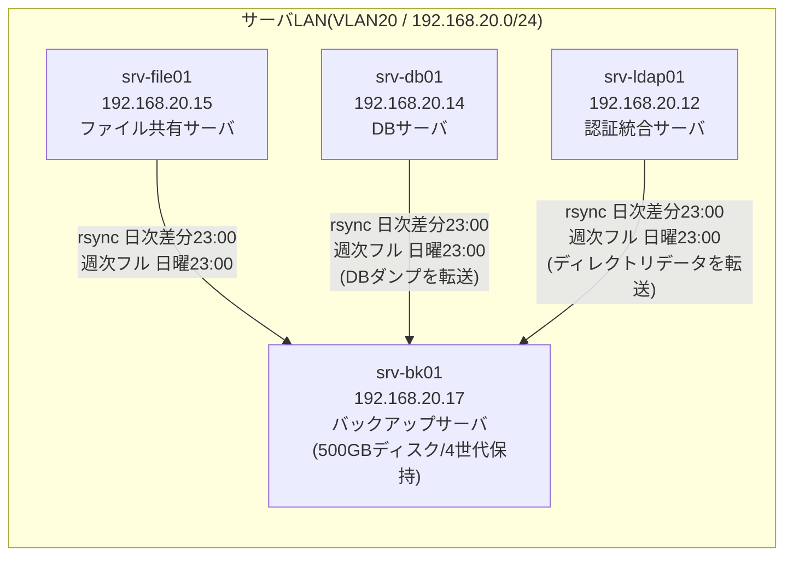
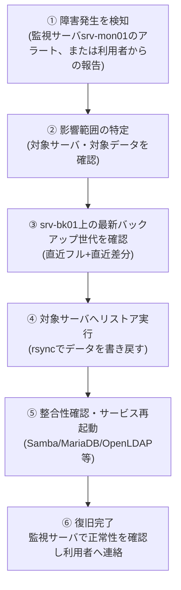

# DOC-07 基本設計書(可用性・バックアップ設計編)

> **📘 学習ポイント**
> この文書は「サーバが壊れたとき、会社の業務をどれだけ止めずに、どれだけデータを失わずに復旧できるか」を設計するものです。実務では、可用性設計は「絶対に壊れない仕組みを作る」ことではなく、「壊れる前提で、許容できる被害の範囲をあらかじめ数値で合意しておく」ことが本質になります。この数値の合意(RTO/RPO)が、バックアップ方式・監視設計・運用手順のすべての土台になるため、採用担当者や面接官が設計書を見るときにも「根拠を持って数値を決められる人か」が特に見られるポイントです。本書では、RTO/RPOの基礎から、実際のバックアップ対象・スケジュール・リストアの考え方までを、理由とセットで解説します。

## 改訂履歴

| 版数 | 日付 | 内容 | 作成者 |
|---|---|---|---|
| v0.1 | 2026-08-01 | 初版ドラフト作成。RTO/RPOの暫定値とバックアップ対象の洗い出しを実施 | 〇〇 〇〇 |
| v1.0 | 2026-08-20 | レビュー指摘を反映し正式版として発行(バックアップ対象範囲の根拠説明を追記) | 〇〇 〇〇 |

## 文書情報

| 項目 | 内容 |
|---|---|
| 文書番号 | DOC-07 |
| 文書名 | 基本設計書(可用性・バックアップ設計編) |
| 作成日 | 2026年8月1日 |
| 最終改訂日 | 2026年8月20日 |
| バージョン | v1.0 |
| 作成者 | 〇〇 〇〇(要記入) |
| レビュー者 | (要記入) |

---

## 1. 本書の目的と位置づけ

本書は、株式会社サンプル物産向け社内ITインフラ刷新プロジェクトにおける可用性(かようせい。システムが止まらずに使い続けられる度合いのこと。(※用語集(12_用語集.md)参照))設計およびバックアップ設計を定義するものである。対象範囲は、DOC-05 基本設計書_サーバ設計編で定義した全9台のサーバのうち、業務データを保持するサーバに対する障害対策・データ保全対策とする。

本書はDOC-02 要件定義書で定められたRPO・RTOの目標値を出発点とし、それを実現するための具体的なバックアップ対象・方式・スケジュールを設計する。冗長化構成(クラスタ、負荷分散等)については本演習の範囲外とし、7章にて「発展課題」として実務での対策を紹介するに留める。

**関連文書**

| 文書番号 | 文書名 | 本書との関係 |
|---|---|---|
| DOC-02 | 要件定義書 | RPO/RTO目標値の要件定義元 |
| DOC-05 | 基本設計書_サーバ設計編 | バックアップ対象サーバのスペック・役割定義 |
| DOC-08 | 詳細設計書_パラメータシート | rsync・cronの具体的な設定値 |
| DOC-09 | 構築手順書 | バックアップジョブの構築手順 |
| DOC-11 | 運用保守設計書 | リストア手順の詳細、監視との連携運用 |
| DOC-12 | 用語集 | 本書で使用する専門用語の定義 |

---

## 2. 可用性設計の基本的な考え方

### 2.1 なぜ「壊れる前提」で設計するのか

サーバは、どれだけ品質の高い機器を使っても、ディスク故障・電源障害・ソフトウェア不具合・人為的ミスなどにより、いつか必ず停止する可能性がある。可用性設計とは、この「いつか壊れる」という前提に立ち、①壊れたときに業務への影響をどこまで抑えるか、②壊れたときにどれだけ過去のデータまで戻せるか、をあらかじめ数値で決めておく作業である。

数値で決めておかないと、障害発生時に「とにかく急いで直す」以外の判断基準がなくなり、復旧の優先順位や、どこまでの手間・コストをかけるべきかが現場の勘に依存してしまう。これは未経験者が特に見落としがちな点であり、逆に言えば、この考え方を理解しているかどうかが設計者としての基礎力を示す部分でもある。

### 2.2 RTOとRPOの基礎知識

可用性設計の中心となる指標が、RTO(Recovery Time Objective、目標復旧時間。障害発生から、業務を再開できる状態まで復旧させるのにかけてよい最大時間のこと。(※用語集(12_用語集.md)参照))と、RPO(Recovery Point Objective、目標復旧時点。障害発生時に、どの時点の状態までデータを戻すことを許容するかを示す指標のこと。(※用語集(12_用語集.md)参照))の2つである。

この2つは似ているようで、意味している「時間軸」がまったく異なる。混同しやすいため、以下の例で整理する。

> 💡 **なぜこう設計するのか(RTOとRPOの違い)**
>
> RTOは「止まっている時間」の話、RPOは「失われるデータの範囲」の話です。たとえるなら、RTOは「停電が起きてから電気が復旧するまでの時間」、RPOは「停電の前、最後にセーブしてから何分前のゲームデータまで戻ってもあきらめられるか」に近い感覚です。この2つを分けて考えられるようになると、「復旧を早くする工夫」と「データ損失を減らす工夫」がまったく別の対策(前者はサーバ構成・手順の速さ、後者はバックアップ頻度)であることが自然に理解できます。

**具体例:「もし srv-file01(ファイル共有サーバ)が壊れたら」**

1. 2026年8月26日(水)23:00 に、その日の差分バックアップが正常に完了した。
2. 翌8月27日(木)10:00 に、srv-file01のディスク故障で共有フォルダにアクセスできなくなった(=障害発生)。
3. この時点で最新のバックアップは前日23:00時点のものであるため、8月27日9:00〜10:00の1時間分の更新データは失われる可能性がある。これが「データ損失の範囲」であり、RPOの考え方そのものである。
4. 情報システム担当者が障害を検知し、srv-bk01(バックアップサーバ)から前日23:00時点のデータをリストア(restore。バックアップからデータを復元し、元の状態に戻すこと。(※用語集(12_用語集.md)参照))し、13:30に共有フォルダへのアクセスが復旧した。障害検知(10:00)から復旧(13:30)までの3時間30分が「復旧にかかった時間」であり、RTOの考え方そのものである。

この例では、データ損失は最大1時間程度、復旧時間は3時間30分であり、後述する本プロジェクトの目標値(RPO24時間・RTO4時間)の範囲内に収まっていることになる。

### 2.3 稼働時間帯の定義

株式会社サンプル物産の主要な業務時間は、平日9:00〜19:00である。受発注業務や在庫確認などの基幹業務は、この時間帯に集中して発生する。夜間・休日は原則として業務が発生しないため、システムへの負荷が低く、バックアップ等のメンテナンス作業を行う適切な時間帯となる。

なお、本演習(学習用のVirtualBox環境)では、業務時間の有無によってサーバを起動・停止する運用は行わず、常時稼働として扱ってよいものとする。ただし、バックアップの実行時刻は本番運用を想定し、あえて業務時間外の23:00に設定している(詳細は4章)。

| 項目 | 内容 |
|---|---|
| 主稼働時間帯 | 平日 9:00〜19:00 |
| 夜間・休日の扱い | 業務発生なし(バックアップ等の保守作業に充当) |
| 演習環境での扱い | サーバは常時稼働として扱う(業務時間による起動・停止制御は行わない) |

### 2.4 本プロジェクトのRPO/RTO目標値と根拠

本プロジェクトでは、以下の値をRPO/RTOの目標値として定義する。

| 指標 | 目標値 | 意味 |
|---|---|---|
| RPO(目標復旧時点) | 24時間 | 障害発生時、最大でも24時間前の状態までのデータ復旧を許容する |
| RTO(目標復旧時間) | 4時間 | 障害発生から、業務を再開できる状態まで最大4時間以内に復旧させる |

**根拠(なぜこの数値なのか)**

- **RPO=24時間とした根拠**:バックアップは日次(1日1回)で取得する設計とする(詳細は4章)。日次バックアップである以上、理論上失われうるデータの最大幅は「前回バックアップから次の障害発生まで」であり、最大でも24時間分となる。株式会社サンプル物産は従業員60名規模の卸売業であり、受発注データや共有ファイルの更新頻度はミッションクリティカルな金融系システムほど高くない。1日分の再入力・再作成で業務継続が可能と判断し、コストのかからない日次バックアップ運用でRPO24時間を許容値とした。
- **RTO=4時間とした根拠**:主稼働時間帯である9:00〜19:00の間に障害が発生した場合でも、半日(4時間)以内に復旧できれば、その日の業務への致命的な影響(受発注の完全停止による顧客対応不能など)を避けられると判断した。また、情報システム担当者が専任ではなく兼任である中堅企業の体制を踏まえ、「深夜対応前提の即時復旧(RTO数十分単位)」は体制上現実的ではなく、一方で「翌営業日まで放置(RTO十数時間以上)」は業務影響が大きすぎるため、その中間である4時間を現実的な目標値とした。

> 💡 **なぜこう設計するのか(数値は「技術力の限界」ではなく「業務影響とコストのバランス」で決める)**
>
> 未経験のうちは「RTOは短ければ短いほど良い、RPOは0に近いほど良い」と考えがちですが、実務ではそうとは限りません。RTOを限りなく短くしようとすると、待機系サーバの二重持ちや自動フェイルオーバー(failover。稼働中のサーバに障害が発生した際、待機系のサーバへ自動的に処理を切り替える仕組みのこと。(※用語集(12_用語集.md)参照))の仕組みが必要になり、コストと運用の複雑さが跳ね上がります。RPOを0に近づけようとすると、リアルタイムでデータを複製するレプリケーション(replication。データベース等のデータを別サーバへリアルタイムまたは短い間隔で複製し、常に同じ内容を保つ仕組みのこと。(※用語集(12_用語集.md)参照))のような仕組みが必要になります。中堅卸売企業の予算・体制に見合った現実解として、「日次バックアップ+半日以内の手動復旧」を選んだ、という判断の流れそのものが設計書に書けると、面接でも説得力のある説明ができます。

---

## 3. バックアップ対象と方式

### 3.1 サーバ一覧(参考)

バックアップ対象を検討する前提として、DOC-05で定義した全9台のサーバ一覧を以下に転記する(値はマスター仕様のまま変更していない)。

| No | ホスト名 | 役割 | 設置セグメント | IPアドレス | OS | 主要ミドルウェア | スペック(vCPU/メモリ/ディスク) |
|---|---|---|---|---|---|---|---|
| 1 | gw-fw01 | ゲートウェイ/ファイアウォール(セグメント間ルーティング・NAT) | 全セグメントに接続(マルチホーム) | 各セグメントの.1 | AlmaLinux 9.4 | firewalld, nftables | 2vCPU/2GBメモリ/20GBディスク |
| 2 | mgmt-pc01 | 管理端末(踏み台サーバ) | 管理LAN | 192.168.10.11 | AlmaLinux 9.4 | OpenSSH | 2vCPU/2GBメモリ/20GBディスク |
| 3 | srv-dns01 | DNS/DHCPサーバ(社内NTPサーバも兼務) | サーバLAN | 192.168.20.11 | AlmaLinux 9.4 | BIND 9.18, Kea DHCP 2.4, chrony | 2vCPU/2GBメモリ/20GBディスク |
| 4 | srv-ldap01 | 認証統合サーバ | サーバLAN | 192.168.20.12 | AlmaLinux 9.4 | OpenLDAP 2.6 | 2vCPU/4GBメモリ/30GBディスク |
| 5 | srv-web01 | 社内業務ポータルWebサーバ | サーバLAN | 192.168.20.13 | AlmaLinux 9.4 | Apache HTTP Server 2.4, PHP 8.2 | 2vCPU/4GBメモリ/40GBディスク |
| 6 | srv-db01 | データベースサーバ | サーバLAN | 192.168.20.14 | AlmaLinux 9.4 | MariaDB 10.11 | 4vCPU/8GBメモリ/60GBディスク |
| 7 | srv-file01 | ファイル共有サーバ | サーバLAN | 192.168.20.15 | AlmaLinux 9.4 | Samba 4.19(LDAP連携認証) | 4vCPU/8GBメモリ/200GBディスク |
| 8 | srv-mon01 | 監視サーバ | サーバLAN | 192.168.20.16 | AlmaLinux 9.4 | Zabbix Server/Web 6.4, 各サーバにZabbix Agent2 | 2vCPU/4GBメモリ/50GBディスク |
| 9 | srv-bk01 | バックアップサーバ | サーバLAN | 192.168.20.17 | AlmaLinux 9.4 | rsync, cron | 2vCPU/4GBメモリ/500GBディスク(バックアップ保存用) |

### 3.2 バックアップ対象の選定

全9台のうち、バックアップ対象とするのは **srv-file01(ファイル共有サーバ)・srv-db01(データベースサーバ)・srv-ldap01(認証統合サーバ)** の3台である。

| サーバ | 対象データ | 方式 | 世代数 |
|---|---|---|---|
| srv-file01(192.168.20.15) | 部門別共有フォルダ配下の全データ(業務ファイル一式) | rsync(日次差分/週次フル) | 4世代 |
| srv-db01(192.168.20.14) | MariaDBのDBダンプ(mysqldump等により出力したバックアップファイル) | rsync(日次差分/週次フル) | 4世代 |
| srv-ldap01(192.168.20.12) | OpenLDAPのディレクトリデータ(ldapsearch/スレーブDB出力等によるエクスポートファイル) | rsync(日次差分/週次フル) | 4世代 |

> 💡 **なぜこの3台だけが対象なのか**
>
> バックアップ対象を選ぶときの考え方は、「その他の方法では再現できない、固有のデータを持っているかどうか」です。srv-file01は社員が作成した業務ファイルそのもの、srv-db01は業務システムの記録データ、srv-ldap01は社員アカウント情報という、いずれも「一度失うと同じものを作り直せない」データを持っています。一方で、srv-dns01やgw-fw01の設定は構築手順書(DOC-09)どおりに再構築すれば復元でき、srv-web01のポータルアプリ本体もソースやインストール手順から再構築可能です(ただしWebアプリが独自に保存する業務データがある場合は別途検討が必要になります)。srv-mon01の監視履歴は失われても業務そのものは止まりませんが、あれば復旧作業の振り返りに役立つため、余力があれば対象に含める判断も実務ではあり得ます。このように「壊れたときに何が二度と戻らないか」で対象を絞り込むことが、限られたディスク容量とコストを有効に使う設計の基本になります。

### 3.3 バックアップ方式(フルバックアップと差分バックアップ)

バックアップの取得方式には、大きく分けてフルバックアップ(full backup。対象データの全体を毎回まるごと複製する方式のこと。(※用語集(12_用語集.md)参照))と、差分バックアップ(differential backup。直近のフルバックアップ以降に変更・追加されたデータのみを複製する方式のこと。(※用語集(12_用語集.md)参照))がある。

本プロジェクトでは、週に1回のフルバックアップと、それ以外の日の差分バックアップを組み合わせる方式を採用する。転送・保存にはrsync(rsync。差分のみを効率的に転送できるファイル同期用コマンド。(※用語集(12_用語集.md)参照))を使用し、srv-bk01上のcron(cron。指定した時刻にコマンドを自動実行するLinuxの仕組みのこと。(※用語集(12_用語集.md)参照))によりジョブを定期実行する。

> 💡 **なぜこう設計するのか(フル+差分の組み合わせ)**
>
> 毎日フルバックアップを取れば復旧はシンプルですが、srv-file01だけで200GBのディスクを毎日まるごとコピーするのは、転送時間・保存容量の両面で無駄が大きくなります。逆に差分だけを永遠に取り続けると、リストア時に「フルバックアップ+その後の差分を全部順番に適用する」必要が出てきて、復旧作業が複雑になり、RTO(4時間)の達成が難しくなります。そこで「週1回のフルで基準点を作り、その間は差分で更新分だけ効率よく保存する」という折衷案を取ることで、保存容量を抑えつつ、リストア作業も「直近のフル+直近の差分1回分」で済むようにしています。この考え方はバックアップ設計の定番パターンであり、理由とセットで覚えておくと応用が利きます。

具体的なrsyncコマンドのオプション、cronの設定内容、保存先ディレクトリ構成などのパラメータは、DOC-08 詳細設計書_パラメータシートで定義する。

---

## 4. バックアップスケジュール設計

### 4.1 スケジュール

| 項目 | 内容 |
|---|---|
| 日次差分バックアップ | 毎日23:00に実行(srv-file01・srv-db01・srv-ldap01 → srv-bk01) |
| 週次フルバックアップ | 毎週日曜23:00に実行(srv-file01・srv-db01・srv-ldap01 → srv-bk01) |
| 保持世代数 | 4世代(古い世代は自動的にローテーション削除、詳細はDOC-08) |
| 実行時間帯の選定理由 | 主稼働時間帯(9:00〜19:00)を避け、業務への影響(ネットワーク帯域・ディスクI/O負荷)を最小化するため |

> 💡 **なぜこう設計するのか(23:00という時刻の選び方)**
>
> バックアップの実行時刻は、「業務が動いていない時間帯の中でも、なるべく早い時刻」を選ぶのが基本です。19:00に主業務が終わっても、残業対応や日次の締め作業が完全に終わるまでには数時間の余裕を見ておいたほうが安全です。23:00であれば、当日の業務データがほぼ確定した状態でバックアップを取得でき、かつ翌朝の始業(9:00)までに十分な余裕があるため、万一バックアップジョブが長時間化しても業務時間に影響しません。「なぜその時刻か」を説明できることは、単に「23:00に設定しました」と書くだけの設計書との差になります。

### 4.2 バックアップ処理の全体構成

上図のとおり、バックアップ対象3台からsrv-bk01への通信はいずれもサーバLAN内で完結する。これは、外部ネットワークやDMZを経由しない構成とすることで、通信経路上のリスクを最小限にする設計である(セグメント間の通信許可設計の詳細はDOC-06 基本設計書_セキュリティ設計編を参照)。

### 4.3 週間スケジュールのイメージ

| 曜日 | 実行内容 | 実行時刻 |
|---|---|---|
| 月曜 | 日次差分バックアップ | 23:00 |
| 火曜 | 日次差分バックアップ | 23:00 |
| 水曜 | 日次差分バックアップ | 23:00 |
| 木曜 | 日次差分バックアップ | 23:00 |
| 金曜 | 日次差分バックアップ | 23:00 |
| 土曜 | 日次差分バックアップ | 23:00 |
| 日曜 | **週次フルバックアップ** | 23:00 |

### 4.4 保持世代とディスク容量の考え方

srv-bk01のディスクは500GB(バックアップ保存専用)を割り当てている。バックアップ対象3台の元データ容量は、srv-file01(200GBディスク)・srv-db01(60GBディスク)・srv-ldap01(30GBディスク)を合わせても最大290GB程度であり、フルバックアップを1世代分保存しても500GBの範囲に収まる。差分バックアップは変更分のみを保存するため、実際の使用容量はさらに小さくなる。

> 💡 **なぜこう設計するのか(4世代保持という数字の意味)**
>
> 「バックアップを取っていれば安心」ではなく、「何世代残っているか」も重要です。仮に保持世代数が1世代(直近の1回分)しかない場合、バックアップ取得後にウイルス感染やファイル破損に気づかないまま次のバックアップが上書きされてしまうと、正常だったデータそのものが失われてしまいます。4世代(おおよそ直近4回分の基準点)を保持しておくことで、「数日前まで遡って正常な状態を探す」余地を残せます。世代数を増やすほど安全性は高まりますが、その分ディスク容量を消費するため、srv-bk01の500GBという容量とのバランスで4世代という数字を設定しています。具体的な世代管理(ローテーション)の実装方法はDOC-08で定義する。

---

## 5. リストア(復旧)の基本方針

### 5.1 リストアの基本的な流れ(概要)

障害発生時のリストア作業は、大きく以下の流れで行う。詳細な手順(コマンド、確認項目、担当者の役割分担、エスカレーションフロー等)はDOC-11 運用保守設計書で定義するものとし、本書では設計上の基本方針のみを示す。

### 5.2 RTO達成のための設計上の配慮

- バックアップは常にsrv-bk01という単一の場所に集約しており、リストア時に複数サーバへ問い合わせに行く必要がない構成とした。これにより、障害発生時の切り分け・作業時間を短縮する。
- 差分バックアップに加え週次でフルバックアップを取得しているため、リストア時に適用すべき差分の数が最大でも6日分(月〜土)に限定される。これにより、リストア作業の複雑さと所要時間を一定の範囲に抑えている。
- リストア対象・手順・確認項目はDOC-11にチェックリスト形式で整理し、担当者が焦っている状況でも手順どおりに進めれば4時間以内に完了できることを目指す。

> 💡 **なぜこう設計するのか(リストア手順を「事前に」書いておく理由)**
>
> 障害はほぼ必ず「予定外のタイミング」で起こります。そのときになって初めて「どうやって戻すんだっけ」と手順を調べ始めると、それだけでRTO(4時間)の大部分を使い切ってしまいます。だからこそ、平常時のうちにリストア手順を文書化し、可能であれば訓練(リストアの練習)をしておくことが、RTOという「目標値」を「絵に描いた餅」で終わらせないための最も重要な設計要素です。設計書に数値を書くだけでなく、その数値を達成するための手順書とセットで用意する、という発想が実務では欠かせません。

---

## 6. 冗長化構成についての発展課題

### 6.1 本演習が単一構成である理由

DOC-05のサーバ一覧を見てわかるとおり、本プロジェクトのサーバ構成は各役割につき1台のみの単一構成(冗長化されていない構成)である。これは、以下の理由による意図的な設計判断である。

- **学習環境の制約**:本演習は自宅PC1台上のVirtualBoxで再現できる構成を前提としており、冗長化構成(サーバの二重化)を組むにはリソース(CPU・メモリ)が不足する。
- **企業規模とのバランス**:従業員60名規模の中堅卸売企業において、初期段階からフル冗長化構成を組むことは、コストに対して過剰投資になりやすい。まずは単一構成で基本的な業務基盤(認証統合・ファイル共有・ポータル・監視・バックアップ)を整備し、RPO/RTOという数値目標をバックアップ運用でカバーする、という段階的なアプローチを取っている。
- **単一障害点(SPOF)の可視化が先決**:冗長化を検討する前に、まず「どこが壊れたら何が止まるか」(単一障害点。Single Point of Failure。その一箇所が故障するとシステム全体が停止してしまう箇所のこと。(※用語集(12_用語集.md)参照))を明確にしておくことが設計の第一歩であり、本プロジェクトはその段階に位置づけられる。

### 6.2 実務における冗長化の代表的手法

将来的にサーバ台数や業務規模が拡大した場合、あるいはより高い可用性(RTOを分単位に短縮するなど)が求められる場合には、以下のような冗長化手法の導入を検討する。

| 対策 | 概要 | 主に効果がある指標 | 本演習での位置づけ |
|---|---|---|---|
| RAID(ディスク冗長化。複数のディスクを組み合わせて、1台が故障してもデータを保持・稼働継続できるようにする仕組みのこと。(※用語集(12_用語集.md)参照)) | サーバ内の複数ディスクにデータを分散・複製して記録し、ディスク1台の故障ではデータを失わないようにする | RPO・RTOの両方(ディスク故障単体では無停止・無損失にできる) | 本演習は仮想ディスク1枚構成のため未実装。本番想定ではESXiホストのストレージ層でRAID1/RAID5等の構成を行う |
| クラスタリング(cluster。複数台のサーバを一つのまとまりとして構成し、1台に障害が起きても残りのサーバで処理を継続させる仕組みのこと。(※用語集(12_用語集.md)参照)) | 複数サーバで役割を共有し、1台が停止した場合に自動的に別の1台へ処理を引き継ぐ(フェイルオーバー) | RTO(自動切替により大幅短縮) | 本演習では未実装。本番運用でサービス停止が許容できない場合、srv-ldap01やsrv-db01を優先的に検討 |
| 負荷分散(ロードバランシング。複数のサーバに処理を振り分けて、性能と可用性を両立させる仕組みのこと。(※用語集(12_用語集.md)参照)) | 複数のWebサーバやDBサーバへアクセスを振り分け、1台への負荷集中や単体障害の影響を軽減する | 可用性全般・性能 | 本演習ではsrv-web01が1台のみのため未実装。利用者数の増加や可用性要件の高まりに応じて検討 |
| レプリケーション | データベースやディレクトリのデータを、リアルタイムまたは短い間隔で別サーバへ複製する | RPO(限りなく0に近づけられる) | 本演習ではsrv-db01・srv-ldap01ともに単一構成。日次/週次バックアップによりRPO24時間を確保するに留める |

### 6.3 本番想定構成における位置づけ

マスター仕様上、本番運用ではオンプレミス物理サーバ2台+VMware ESXiによるサーバ仮想化を想定している。物理サーバを2台に分けることで、片方の物理サーバに障害が起きても、もう一方の物理サーバ上で重要な仮想マシン(例:srv-ldap01、srv-db01)を稼働させ続けられるよう仮想マシンを分散配置する、といった検討が可能になる。本演習(VirtualBox・自宅PC1台)ではこの物理的な冗長化は再現できないが、「本番ではこう対応する」という前提を理解した上で単一構成を選択している、という点が設計上のポイントである。

> 💡 **なぜこう設計するのか(いきなり冗長化構成を組まない判断)**
>
> インフラ設計を学び始めると、「冗長化していないのはダメな設計では」と感じてしまうことがあります。しかし実務では、冗長化にはサーバ台数・ライセンス・運用の複雑さといったコストが伴うため、「その企業の規模・予算・業務影響度に見合った可用性を選ぶ」ことこそが設計者の腕の見せどころです。本プロジェクトでは、RPO24時間・RTO4時間という現実的な目標値を、コストの低いバックアップ運用で達成する設計を選び、冗長化は「次のステップとしてどう考えるか」を発展課題として整理しました。この「段階を踏んで考えられる」姿勢は、未経験からのポートフォリオであっても、実務経験者に近い視点として評価されやすいポイントです。

---

## 7. まとめ

本書では、RPO=24時間・RTO=4時間という目標値の意味と根拠、srv-file01・srv-db01・srv-ldap01を対象とした日次差分(23:00)+週次フル(日曜23:00)・4世代保持のバックアップ設計、およびリストアの基本方針を定義した。また、本演習が単一構成である理由と、実務における冗長化の代表的な選択肢(RAID・クラスタリング・負荷分散・レプリケーション)を整理した。

具体的なコマンド・パラメータの設計はDOC-08 詳細設計書_パラメータシートへ、構築手順はDOC-09 構築手順書へ、障害発生時の詳細なリストア手順・運用フローはDOC-11 運用保守設計書へ、それぞれ引き継ぐ。

**参照文書一覧**

| 文書番号 | 文書名 |
|---|---|
| DOC-02 | 02_要件定義書.md |
| DOC-05 | 05_基本設計書_サーバ設計編.md |
| DOC-06 | 06_基本設計書_セキュリティ設計編.md |
| DOC-08 | 08_詳細設計書_パラメータシート.md |
| DOC-09 | 09_構築手順書.md |
| DOC-11 | 11_運用保守設計書.md |
| DOC-12 | 12_用語集.md |
