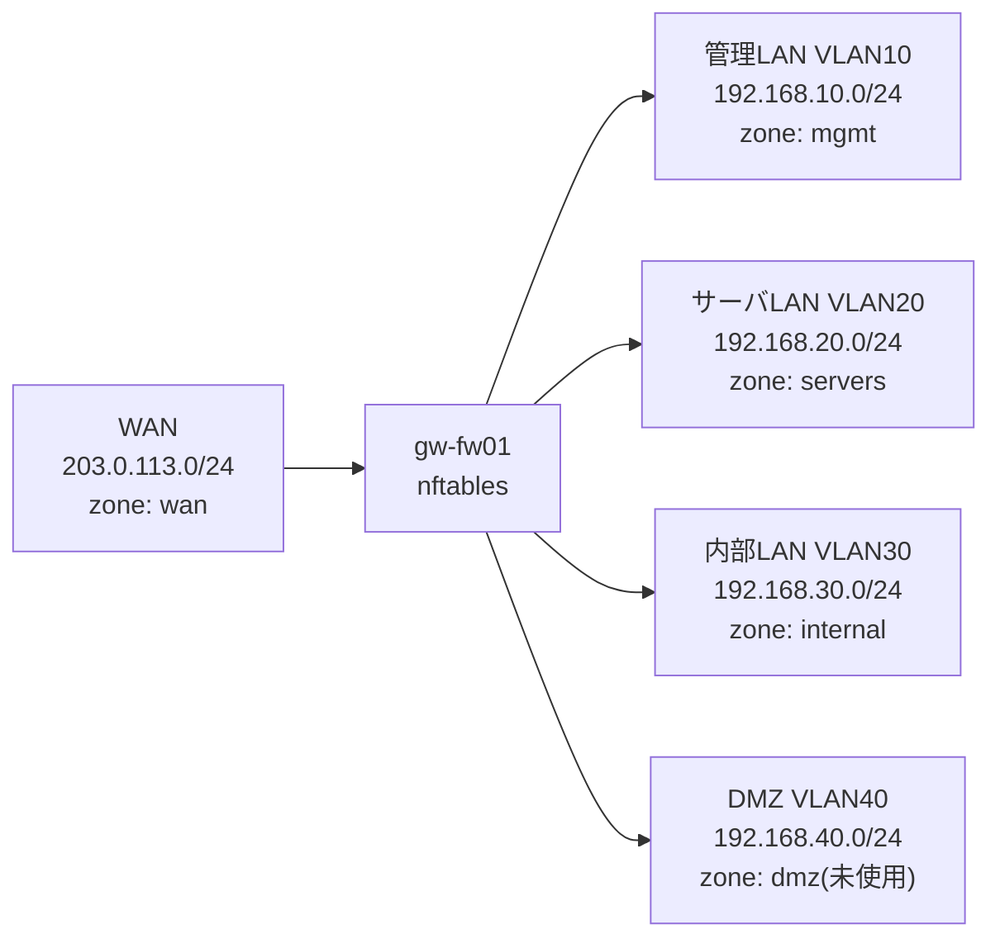

# DOC-08 詳細設計書(パラメータシート)

> **📘 学習ポイント**
>
> この文書は「詳細設計書」と呼ばれる種類の設計書で、DOC-05(基本設計書_サーバ設計編)などで決めた「方針・考え方」を、実際にサーバへ打ち込める「具体的な値」にまで落とし込んだものです。基本設計書が「何を・なぜそうするか」を説明する文書であるのに対し、詳細設計書は「どの値を・どの設定ファイルの・どの項目に書くか」が読み手によってブレなく一意に定まるレベルまで記述する点が最大の違いです。実務ではこの文書に書かれた値をそのまま構築手順書(DOC-09)のコマンドや設定ファイルへ転記して作業するため、この文書の値の誤りはそのまま構築ミス・障害に直結します。そのため現場では複数人によるレビュー(ダブルチェック)を経てから確定させるのが一般的な運用です。未経験の方は、まずDOC-05とこの文書を見比べながら「方針がどのように具体的な数値・文字列へ変換されているか」を追って読むと理解が深まります。

## 改訂履歴

| 版数 | 日付 | 内容 | 作成者 |
|---|---|---|---|
| v0.1 | 2026-08-01 | 初版作成(ドラフト)。DOC-05 基本設計書_サーバ設計編をもとにパラメータ項目を洗い出し | 〇〇 〇〇 |
| v1.0 | 2026-08-20 | 全項目のレビュー反映。誤記・矛盾がないことを確認のうえ正式版として確定 | 〇〇 〇〇 |

## 文書情報

| 項目 | 内容 |
|---|---|
| 文書番号 | DOC-08 |
| 文書名 | 詳細設計書(パラメータシート) |
| ファイル名 | 08_詳細設計書_パラメータシート.md |
| 作成日 | 2026年8月1日 |
| 最終改訂日 | 2026年8月20日 |
| バージョン | v1.0 |
| 作成者 | 〇〇 〇〇 |
| レビュー者 | (レビュー実施後に記入) |
| 上位文書 | DOC-05 基本設計書_サーバ設計編、DOC-04 基本設計書_ネットワーク設計編 |
| 下流で参照する文書 | DOC-09 構築手順書、DOC-10 テスト仕様書 |
| 関連文書 | DOC-03、DOC-06、DOC-07、DOC-11、DOC-12 |

## 目次

1. 本書の目的と位置づけ
2. 対象サーバ一覧(マスター一覧の転記)
3. OS共通パラメータシート
4. ミドルウェア別パラメータシート
5. パラメータ変更管理
6. 用語・相互参照一覧

---

## 1. 本書の目的と位置づけ

### 1.1 詳細設計書とは何か

詳細設計書とは、基本設計書で定めた方針・構成を、構築作業者が迷わず設定投入できる粒度まで具体化した文書である。特に本書のように設定値そのものを一覧表として整理した文書は「パラメータシート(サーバやネットワーク機器、ミドルウェアに設定する具体的な値を一覧化した表のこと。※用語集(12_用語集.md)参照)」と呼ばれ、実務でも頻繁に作成される成果物である。

基本設計書(DOC-03〜DOC-07)では「どのサーバに何の役割を持たせるか」「どのようなネットワーク構成にするか」といった方針・考え方を扱う。これに対し本書DOC-08では、その方針を実現するために各サーバへ実際に投入するIPアドレス・ホスト名・ゾーン名・共有パス・DB名といった一次データを、変更の余地なく一意に確定させる。

### 1.2 基本設計書との違い

| 観点 | 基本設計書(DOC-03〜07) | 詳細設計書(本書DOC-08) |
|---|---|---|
| 抽象度 | 方針・考え方・全体構成 | 実装可能な具体的な値 |
| 主な読み手 | 発注者・プロジェクト関係者(合意形成用) | 構築作業者(そのまま作業に使う) |
| 記載の例 | 「認証は統合管理し、最小権限の原則を採用する」 | 「ベースDNは dc=sample-trading,dc=local とする」 |
| 変更時の影響 | 方針変更は設計全体の見直しが必要 | 値の変更は本書と構築手順書(DOC-09)の更新で対応可能なことが多い |
| 誤りが与える影響 | 手戻りは大きいが、実装前に発見しやすい | そのまま構築・投入されるため、誤りが即座に障害・設定ミスにつながる |


### 1.3 本書のスコープ

本書は、サーバ一覧(DOC-05)に定義された全9台を対象に、以下の2階層でパラメータを整理する。

1. **OS共通パラメータ**: 全サーバに共通する基本設定(ホスト名・IP・DNS・NTP・タイムゾーンなど)
2. **ミドルウェア別パラメータ**: サーバごとに導入されるソフトウェア固有の設定値

> **💡 なぜこう設計するのか**
>
> パラメータを「OS共通」と「ミドルウェア別」の2階層に分けているのは、変更が起きたときの影響範囲を把握しやすくするためです。たとえばIPアドレス体系を見直す場合は「OS共通パラメータシート」だけを確認すればよく、Webサーバの設定だけを見直したい場合は該当するミドルウェアの表だけを見ればよい、という具合に、変更の影響範囲を局所化できます。これは実務のパラメータシートでも一般的に採用される構成の考え方です。

---

## 2. 対象サーバ一覧(マスター一覧の転記)

本書が対象とする9台のサーバは、DOC-05 基本設計書_サーバ設計編で定義された下表のとおりである(値はDOC-05と完全に一致させ、本書では一切変更しない)。

| No | ホスト名 | 役割 | 設置セグメント | IPアドレス | OS | 主要ミドルウェア | スペック(vCPU/メモリ/ディスク) |
|---|---|---|---|---|---|---|---|
| 1 | gw-fw01 | ゲートウェイ/ファイアウォール(セグメント間ルーティング・NAT) | 全セグメントに接続(マルチホーム) | 各セグメントの.1 | AlmaLinux 9.4 | firewalld, nftables | 2vCPU/2GBメモリ/20GBディスク |
| 2 | mgmt-pc01 | 管理端末(踏み台サーバ) | 管理LAN | 192.168.10.11 | AlmaLinux 9.4 | OpenSSH | 2vCPU/2GBメモリ/20GBディスク |
| 3 | srv-dns01 | DNS/DHCPサーバ(社内NTPサーバも兼務) | サーバLAN | 192.168.20.11 | AlmaLinux 9.4 | BIND 9.18, Kea DHCP 2.4, chrony | 2vCPU/2GBメモリ/20GBディスク |
| 4 | srv-ldap01 | 認証統合サーバ | サーバLAN | 192.168.20.12 | AlmaLinux 9.4 | OpenLDAP 2.6 | 2vCPU/4GBメモリ/30GBディスク |
| 5 | srv-web01 | 社内業務ポータルWebサーバ | サーバLAN | 192.168.20.13 | AlmaLinux 9.4 | Apache HTTP Server 2.4, PHP 8.2 | 2vCPU/4GBメモリ/40GBディスク |
| 6 | srv-db01 | データベースサーバ | サーバLAN | 192.168.20.14 | AlmaLinux 9.4 | MariaDB 10.11 | 4vCPU/8GBメモリ/60GBディスク |
| 7 | srv-file01 | ファイル共有サーバ | サーバLAN | 192.168.20.15 | AlmaLinux 9.4 | Samba 4.19(LDAP連携認証) | 4vCPU/8GBメモリ/200GBディスク |
| 8 | srv-mon01 | 監視サーバ | サーバLAN | 192.168.20.16 | AlmaLinux 9.4 | Zabbix Server/Web 6.4, 各サーバにZabbix Agent2 | 2vCPU/4GBメモリ/50GBディスク |
| 9 | srv-bk01 | バックアップサーバ | サーバLAN | 192.168.20.17 | AlmaLinux 9.4 | rsync, cron | 2vCPU/4GBメモリ/500GBディスク(バックアップ保存用) |

参考として、ネットワークセグメント設計(DOC-04で定義)を再掲する。以降のIPアドレス・サブネットマスク・デフォルトゲートウェイの算出は、すべてこの表の値に基づく。

| セグメント名 | VLAN ID | CIDR | 用途 | GW(ゲートウェイ)IP |
|---|---|---|---|---|
| WAN | - | 203.0.113.0/24(例示用アドレス。実在のIPと衝突しないよう、RFC5737で「文書・例示専用」と定められたTEST-NET-3を使用している) | インターネット接続用(演習では疑似) | 203.0.113.1(ISP側) |
| 管理LAN | VLAN10 | 192.168.10.0/24 | サーバ管理・SSH踏み台用 | 192.168.10.1 |
| サーバLAN | VLAN20 | 192.168.20.0/24 | 各種業務サーバ設置用 | 192.168.20.1 |
| 内部LAN | VLAN30 | 192.168.30.0/24 | 社員PC・クライアント端末用 | 192.168.30.1 |
| DMZ | VLAN40 | 192.168.40.0/24 | 将来の外部公開用(本演習では未使用領域として設計のみ) | 192.168.40.1 |

---

## 3. OS共通パラメータシート

### 3.1 全9台 OS共通パラメータ一覧

全サーバは「DNS参照先はすべてsrv-dns01」「NTPはsrv-dns01(chrony)を参照」「タイムゾーンはAsia/Tokyo」という共通事項(DOC-05)に従う。この共通事項は「サーバLANに設置された9台のうちのどれか」ではなく「srv-dns01自身を含む全サーバ」に適用される規定であり、srv-dns01も例外ではなく自ホストのIPアドレス(192.168.20.11)を参照先として設定する。ホスト名は「FQDN(Fully Qualified Domain Name。ホスト名にドメイン名まで含めた完全な名前のこと。※用語集(12_用語集.md)参照)」形式で統一する。

| No | ホスト名(FQDN) | 所属セグメント | IPアドレス | サブネットマスク | デフォルトゲートウェイ | DNS参照先 | NTP参照先 | タイムゾーン |
|---|---|---|---|---|---|---|---|---|
| 1 | gw-fw01.sample-trading.local | 全セグメント(マルチホーム) | 各セグメントの.1(§3.2参照) | 255.255.255.0(各内部セグメント共通) | 203.0.113.1(ISP側/WAN方向) | 192.168.20.11 | 192.168.20.11 | Asia/Tokyo |
| 2 | mgmt-pc01.sample-trading.local | 管理LAN(VLAN10) | 192.168.10.11 | 255.255.255.0 | 192.168.10.1 | 192.168.20.11 | 192.168.20.11 | Asia/Tokyo |
| 3 | srv-dns01.sample-trading.local | サーバLAN(VLAN20) | 192.168.20.11 | 255.255.255.0 | 192.168.20.1 | 192.168.20.11(自ホスト自身のIPアドレスを参照先とする。DOC-09構築手順書4.8節の投入コマンドと一致させている) | 192.168.20.11(自ホスト自身がNTPサーバとして稼働し、自身のシステムクロックを基準時刻として社内へ配布する) | Asia/Tokyo |
| 4 | srv-ldap01.sample-trading.local | サーバLAN(VLAN20) | 192.168.20.12 | 255.255.255.0 | 192.168.20.1 | 192.168.20.11 | 192.168.20.11 | Asia/Tokyo |
| 5 | srv-web01.sample-trading.local | サーバLAN(VLAN20) | 192.168.20.13 | 255.255.255.0 | 192.168.20.1 | 192.168.20.11 | 192.168.20.11 | Asia/Tokyo |
| 6 | srv-db01.sample-trading.local | サーバLAN(VLAN20) | 192.168.20.14 | 255.255.255.0 | 192.168.20.1 | 192.168.20.11 | 192.168.20.11 | Asia/Tokyo |
| 7 | srv-file01.sample-trading.local | サーバLAN(VLAN20) | 192.168.20.15 | 255.255.255.0 | 192.168.20.1 | 192.168.20.11 | 192.168.20.11 | Asia/Tokyo |
| 8 | srv-mon01.sample-trading.local | サーバLAN(VLAN20) | 192.168.20.16 | 255.255.255.0 | 192.168.20.1 | 192.168.20.11 | 192.168.20.11 | Asia/Tokyo |
| 9 | srv-bk01.sample-trading.local | サーバLAN(VLAN20) | 192.168.20.17 | 255.255.255.0 | 192.168.20.1 | 192.168.20.11 | 192.168.20.11 | Asia/Tokyo |

「サブネットマスク(IPアドレスのうち、どこまでがネットワーク部でどこからがホスト部かを表す値のこと。※用語集(12_用語集.md)参照)」は、CIDR表記の /24 を10進表記に変換した値であり、DOC-04のCIDR値を変更するものではない。同様に「デフォルトゲートウェイ(自セグメント外へ通信する際に最初に経由する機器のIPアドレスのこと。※用語集(12_用語集.md)参照)」は、各サーバが所属するセグメントのGW IPをそのまま採用している。

> **💡 なぜこう設計するのか**
>
> 全サーバのDNSとNTPをsrv-dns01の1台に集約しているのは、「参照先を一箇所にまとめることで、設定ミスや参照先のばらつきを防ぐ」という考え方に基づきます。srv-dns01自身についても例外扱いをせず自ホストのIPアドレス(192.168.20.11)を参照先として明記しているのは、「全サーバがsrv-dns01を参照する」というルールを一切の例外なく徹底し、構築手順書(DOC-09)やテスト仕様書(DOC-10)を読む人が「srv-dns01だけ特別な設定なのか」と迷わずに済むようにするためです。特にNTP(時刻同期の仕組み。※用語集(12_用語集.md)参照)がサーバごとにズレていると、ログの時刻が合わずトラブル調査が困難になったり、Kerberos認証など時刻ズレに弱い仕組みで認証エラーが起きたりします。小規模な9台構成だからこそ、まずは「参照先を1台に統一する」というシンプルな設計を徹底することが、複雑な仕組みを導入するより現実的で保守しやすい選択になります。

### 3.2 gw-fw01 インターフェース別詳細(マルチホーム構成)

gw-fw01は複数のセグメントに同時に接続する「マルチホーム(1台の機器が複数のネットワークセグメントに同時に接続されている状態のこと。※用語集(12_用語集.md)参照)」構成のため、OS共通パラメータシートの1行だけでは表現しきれない。そのため、インターフェース(NIC)単位の詳細を別表として補足する。

| NIC(例) | 接続セグメント | IPアドレス | サブネットマスク/プレフィックス | 備考 |
|---|---|---|---|---|
| enp0s3 | WAN | (演習では未確定・疑似接続) | /24 | 203.0.113.1はISP側の機器のIPであり、gw-fw01自身のIPではない。本演習ではインターネット接続自体を疑似的に扱う(WAN側の具体的なIP割当はDOC-09構築手順書で確定) |
| enp0s8 | 管理LAN(VLAN10) | 192.168.10.1 | 255.255.255.0(/24) | 管理LAN側のデフォルトゲートウェイ |
| enp0s9 | サーバLAN(VLAN20) | 192.168.20.1 | 255.255.255.0(/24) | サーバLAN側のデフォルトゲートウェイ |
| enp0s10 | 内部LAN(VLAN30) | 192.168.30.1 | 255.255.255.0(/24) | 内部LAN側のデフォルトゲートウェイ |
| enp0s11 | DMZ(VLAN40) | 192.168.40.1 | 255.255.255.0(/24) | DMZ側のデフォルトゲートウェイ(本演習では未使用領域) |

※上表のNIC名(enp0s3など)は学習環境(VirtualBox 7.x)で仮想NICを5枚追加した場合の一例であり、実際の名称は構築時のNIC認識順に依存する。本番想定(物理サーバ2台+VMware ESXi)では、物理NICの枚数・ポートグループ(vSwitchに紐づく仮想的なネットワーク区画)の設計に応じて名称・枚数が変わる。具体的な割当はDOC-03 基本設計書_システム構成編およびDOC-09 構築手順書で確定させる。

---

## 4. ミドルウェア別パラメータシート

### 4.1 gw-fw01: nftablesゾーン設計

gw-fw01では「firewalld」がフロントエンドとして動作し、内部的に「nftables(Linuxカーネルのパケットフィルタリング機能。firewalldはこれを扱いやすくするための管理ツール。※用語集(12_用語集.md)参照)」を利用してパケット制御を行う。firewalldでは通信を許可・拒否する単位として「ゾーン(通信インターフェースをグルーピングし、そのグループ単位で通信の可否ポリシーを適用する仕組みのこと。※用語集(12_用語集.md)参照)」という概念を用いる。本書ではセグメントとゾーンの対応関係(構造)を定義し、ゾーン間でどの通信を許可・拒否するかという具体的なルールはDOC-06 基本設計書_セキュリティ設計編で定義する。

| ゾーン名 | 対応インターフェース | 対応セグメント | デフォルトターゲット | 備考 |
|---|---|---|---|---|
| wan | enp0s3 | WAN(203.0.113.0/24) | drop(既定拒否) | 外部からの通信は原則すべて遮断し、必要な通信のみDOC-06で個別許可 |
| mgmt | enp0s8 | 管理LAN(VLAN10, 192.168.10.0/24) | drop(既定拒否)+個別許可 | mgmt-pc01からのSSH管理通信を許可する想定 |
| servers | enp0s9 | サーバLAN(VLAN20, 192.168.20.0/24) | drop(既定拒否)+個別許可 | サーバ間の必要な通信のみ許可(例: srv-web01→srv-db01のDB接続) |
| internal | enp0s10 | 内部LAN(VLAN30, 192.168.30.0/24) | drop(既定拒否)+個別許可 | 社員PCから業務ポータル・ファイル共有への通信を許可する想定 |
| dmz | enp0s11 | DMZ(VLAN40, 192.168.40.0/24) | drop(既定拒否) | 本演習では未使用のため全通信を遮断(将来の外部公開用に予約) |



> **💡 なぜこう設計するのか**
>
> セグメント(VLAN)と firewalld のゾーンを1対1で対応させているのは、「どの物理・論理的な区画に、どのポリシーが適用されているか」を誰が見てもすぐ分かるようにするためです。ゾーンとセグメントの対応がバラバラだと、設定ファイルを読んだだけではどこにどのルールが効いているか把握しづらく、事故の元になります。また、本書では「ゾーンの割当」という構造だけを定義し、「何を許可し何を拒否するか」という中身のルールはDOC-06に分離しています。これは、ネットワークの入れ物(構造)と、そこに適用する中身のポリシーを別の文書に分けることで、ポリシーだけを見直したいときに本書を触らずに済むようにするという設計判断です。

### 4.2 srv-dns01: BIND / Kea DHCP / chrony パラメータ

**(1) BIND(DNS)パラメータ**

| 項目 | 設定値 |
|---|---|
| 正引きゾーン名 | sample-trading.local |
| ゾーンファイル(例) | /var/named/sample-trading.local.zone |
| 逆引きゾーン(サーバLAN分, 例) | 20.168.192.in-addr.arpa |
| 権威サーバ | srv-dns01(192.168.20.11)自身のみ(社内限定のプライベートDNSであり、外部への権威公開は行わない) |
| リッスンアドレス | 192.168.20.11(サーバLANのみ) |
| フォワーダ(外部問い合わせ) | 本演習では未使用(名前解決の対象は内部ドメインのみを想定)。本番導入時は、外部サイト名の解決が必要であれば上位DNS(ISP提供のDNS等)へフォワードする設計を追加検討する |

**(2) Kea DHCPパラメータ(内部LAN向け払い出し)**

| 項目 | 設定値 |
|---|---|
| 対象サブネット | 192.168.30.0/24(内部LAN, VLAN30) |
| 払い出し範囲(プール) | 192.168.30.100 〜 192.168.30.200 |
| リースタイム(例) | 86400秒(24時間) |
| オプション: ルーター(デフォルトGW) | 192.168.30.1 |
| オプション: DNSサーバ | 192.168.20.11(srv-dns01) |
| オプション: ドメイン名 | sample-trading.local |
| 固定IP用の予約範囲(例) | 192.168.30.2 〜 192.168.30.99(将来的な特定端末への固定割当用に予約。本演習では未使用) |

**(3) chrony(NTP)パラメータ**

| 項目 | 設定値 |
|---|---|
| 上位参照先(本番想定) | 外部の公開NTPサーバ(例: ntp.nict.jp 等、本演習では未接続のため参考情報) |
| 社内配布 | srv-dns01がstratum上位を参照しつつ、社内の全サーバへ時刻を配布する社内NTPサーバとして稼働 |
| 許可クライアント範囲 | サーバLAN(192.168.20.0/24)、管理LAN(192.168.10.0/24)、内部LAN(192.168.30.0/24) |

> **💡 なぜこう設計するのか**
>
> DNS(名前解決)・DHCP(IPアドレスの自動払い出し)・NTP(時刻同期)という3つの異なる役割を、srv-dns01という1台に集約しているのは、9台構成という小規模な演習環境において「サーバ台数を必要最小限に抑えつつ、社内基盤としての役割を機能ごとに明確化する」というバランスを取るための設計判断です。実際の大規模環境ではDNS/DHCP/NTPをそれぞれ専用サーバや冗長構成に分離することもありますが、まずは1台に集約した構成の「関係性」を正しく理解することが、将来分離構成を学ぶ土台になります。

### 4.3 srv-ldap01: OpenLDAP パラメータ

「LDAP(Lightweight Directory Access Protocol。ユーザーアカウントや組織情報などを一元管理するためのディレクトリサービス、およびそれにアクセスするためのプロトコルのこと。※用語集(12_用語集.md)参照)」の主要パラメータを以下に示す。

| 項目 | 設定値 |
|---|---|
| ベースDN(※DNはDistinguished Name。ディレクトリ内の位置を一意に示す識別子のこと。※用語集(12_用語集.md)参照) | dc=sample-trading,dc=local |
| 管理者DN(例) | cn=admin,dc=sample-trading,dc=local |
| ユーザー格納OU(※OUはOrganizational Unit。ディレクトリ内で情報をグループ分けする「箱」のこと。※用語集(12_用語集.md)参照) | ou=People,dc=sample-trading,dc=local |
| グループ格納OU | ou=Groups,dc=sample-trading,dc=local |
| リッスンポート(平文, 演習用) | 389/tcp |
| リッスンポート(TLS, 本番想定) | 636/tcp(LDAPS化はDOC-06 セキュリティ設計編で方針を定義) |

**部門グループ(DOC-02 要件定義書との対応)**

株式会社サンプル物産の部門構成は、要件定義書(DOC-02)3.1節において「営業部」「総務・経理部」「物流・倉庫部」「情報システム部」の4部門として正式に確定している。本書ではこの4部門構成をそのまま採用し、LDAPのグループ設計として以下のとおりグループDN(システム上で部門を一意に識別するための具体的な文字列)を定義する。

| グループDN(実装上の識別子) | 対応部門(DOC-02準拠) |
|---|---|
| cn=eigyo,ou=Groups,dc=sample-trading,dc=local | 営業部 |
| cn=soumu-keiri,ou=Groups,dc=sample-trading,dc=local | 総務・経理部 |
| cn=butsuryu-souko,ou=Groups,dc=sample-trading,dc=local | 物流・倉庫部 |
| cn=jsys,ou=Groups,dc=sample-trading,dc=local | 情報システム部(管理者グループ) |

> **💡 なぜこう設計するのか**
>
> DOC-02(要件定義書)が定めた部門名は「総務・経理部」「物流・倉庫部」のように、業務上の呼び方としては自然な表記です。しかし、これをそのままLDAPのcn(Common Name)属性値やSambaの共有名・ディレクトリ名として使おうとすると、記号や空白の扱いに注意が必要になり、コマンド操作やスクリプトの中で扱いにくくなる場面があります。そこで本書では、DOC-02が確定させた「部門がいくつ・何という名前で存在するか」という事実(4部門)は一切変更せず、システム側で安全に使える識別子(soumu-keiri、butsuryu-soukoといったアルファベット表記)だけを新たに定義しています。上位文書(DOC-02)が決める「業務上の構成」と、詳細設計書(本書)が決める「それを実装可能な文字列でどう表すか」は別のレイヤーの話であり、後者を工夫しても前者と矛盾しない、というのが本書の立場です。逆に、もし詳細設計の都合で部門の数や括り方そのもの(例: 総務と経理を分けるかどうか)を変えてしまうと、それは実装上の言い換えの範囲を超えて上位文書の合意内容を書き換えることになり、DOC-02との不整合を生む原因になるため避けなければなりません。

### 4.4 srv-web01: Apache / PHP パラメータ

| 項目 | 設定値 |
|---|---|
| ドキュメントルート(※Webサーバが公開するファイルの起点となるディレクトリのこと。※用語集(12_用語集.md)参照) | /var/www/html |
| VirtualHost名(ServerName。※1つのWebサーバで複数サイトを扱う際にサイトを識別する仕組みのこと。※用語集(12_用語集.md)参照) | srv-web01.sample-trading.local |
| 別名(エイリアス, 任意) | portal.sample-trading.local(利用者向けに分かりやすいDNS名を別途用意する場合の例。CNAME追加要否はDOC-04/DOC-09で確定) |
| リッスンポート | 80/tcp(演習では平文。TLS化・443/tcp対応の要否はDOC-06セキュリティ設計編を参照) |
| アプリケーション実行方式 | PHP 8.2(php-fpm経由でApacheと連携する構成を想定) |
| 想定接続元 | 内部LAN(192.168.30.0/24)からの社員PCアクセスを主とする |
| DBサーバとの通信先 | srv-db01(192.168.20.14:3306) |

> **💡 なぜこう設計するのか**
>
> ServerName(VirtualHost名)は基本的にDOC-05で定義されたホスト名そのもの(srv-web01.sample-trading.local)を使い、利用者向けの分かりやすい名前(portal.sample-trading.local)はあくまで任意の別名として位置づけています。これは「必ず必要な値(サーバ一覧に基づくFQDN)」と「あると便利だが必須ではない値(利用者向けエイリアス)」を明確に区別するためです。マスター仕様にない値を勝手に本採用扱いにしてしまうと、他の設計書との間で矛盾が生じるリスクがあるため、そのような値は「例・任意」と明記した上で提案する、という姿勢が実務でも重要になります。

### 4.5 srv-db01: MariaDB パラメータ

**(1) データベース定義**

| DB名 | 用途 | 文字コード | 照合順序 |
|---|---|---|---|
| portal_db | 業務ポータル(srv-web01)が利用するアプリケーションデータベース | utf8mb4(絵文字を含む多くのUnicode文字を正しく扱える文字コードのこと。※用語集(12_用語集.md)参照) | utf8mb4_unicode_ci |

**(2) ユーザー定義(想定ユーザー)**

| ユーザー名 | 権限範囲 | 接続元制限 | 用途 |
|---|---|---|---|
| portal_app | portal_db に対するSELECT/INSERT/UPDATE/DELETEのみ | 192.168.20.13(srv-web01)のみ | アプリケーションからの通常アクセス用(最小権限) |
| portal_admin | portal_db に対する全権限(DDL含むスキーマ変更操作) | 管理LAN経由でSSHログインした上でのローカル接続のみ | スキーマ変更・保守作業用 |
| root | 全DBに対する全権限 | localhostのみ(リモート接続は禁止) | 緊急保守用。通常運用では使用しない |

| 項目 | 設定値 |
|---|---|
| リッスンアドレス | 192.168.20.14(サーバLANのみ) |
| リッスンポート | 3306/tcp |
| 接続元制限 | firewalldにより192.168.20.13(srv-web01)からの3306/tcp接続のみ許可(DOC-06参照) |

> **💡 なぜこう設計するのか**
>
> アプリケーション用ユーザー(portal_app)と管理用ユーザー(portal_admin)を分けているのは「最小権限の原則(利用者やプログラムには、業務上必要な最小限の権限だけを与えるという考え方。※用語集(12_用語集.md)参照)」に基づいています。Webアプリケーションが万が一乗っ取られても、portal_appにはテーブル構造を変更する権限(DDL)がないため、被害をデータの読み書きの範囲にとどめられます。rootユーザーをリモート接続禁止にしているのも同じ考え方で、日常運用で使うアカウントと緊急時専用のアカウントを分離することで、事故が起きたときの影響範囲を小さくする設計です。

### 4.6 srv-file01: Samba 共有パラメータ

**(1) 部門別共有一覧**

営業部・総務・経理部・物流・倉庫部という3部門に、全社共有(kyoyu)を加えた構成は、§4.3で述べたとおりDOC-02(要件定義書)が定める4部門構成(営業部/総務・経理部/物流・倉庫部/情報システム部)に対応させたものである。

| 共有名 | パス(例) | 対象部門(DOC-02準拠) | 割当LDAPグループ | アクセス権の考え方 |
|---|---|---|---|---|
| eigyo | /srv/samba/eigyo | 営業部 | cn=eigyo,ou=Groups,... | 営業部員: 読み書き可 / 情報システム部: 管理者権限 / その他部門: アクセス不可 |
| soumu-keiri | /srv/samba/soumu-keiri | 総務・経理部 | cn=soumu-keiri,ou=Groups,... | 総務・経理部員: 読み書き可 / 情報システム部: 管理者権限 / その他部門: アクセス不可(経理データを含み特に機密性が高いため最も厳格に制限) |
| butsuryu-souko | /srv/samba/butsuryu-souko | 物流・倉庫部 | cn=butsuryu-souko,ou=Groups,... | 物流・倉庫部員: 読み書き可 / 情報システム部: 管理者権限 / その他部門: アクセス不可 |
| kyoyu(全社共有) | /srv/samba/kyoyu | 全社員 | 全社員が属する共通グループ(例: cn=all-staff,ou=Groups,...) | 全社員: 読み取り可 / 書き込みは総務・経理部・情報システム部のみ |

**(2) 認証・ACLの考え方**

| 項目 | 内容 |
|---|---|
| 認証方式 | Samba 4.19からsrv-ldap01(192.168.20.12)へLDAP認証連携。サーバ間で個別にアカウントを管理せず、srv-ldap01のアカウント情報を正として利用する |
| アクセス制御方式 | POSIX ACL(ファイル・ディレクトリ単位で複数のユーザー・グループに個別の権限を設定できる仕組みのこと。※用語集(12_用語集.md)参照)+ LDAP部門グループの組み合わせ |
| 基本方針 | 各共有フォルダの所有グループをLDAPの部門グループに設定し、「所属部門のグループにのみ書き込み権限を付与、その他は権限なし」を既定とする(最小権限の原則) |
| 例外 | 情報システム部グループ(cn=jsys)には、保守目的で全共有への管理者権限を付与する |

> **💡 なぜこう設計するのか**
>
> 部門ごとにフォルダとLDAPグループを1対1で対応させているのは、「誰がどの部門に異動しても、LDAPのグループ所属を変更するだけでアクセス権が自動的に切り替わる」状態を作るためです。もしサーバ側でユーザーごとに個別の権限を都度設定していると、異動や退職のたびに設定変更漏れが起きやすくなります。認証と権限の管理をLDAP側に一元化することで、「アカウントの管理」と「ファイルサーバの権限設定」を分離でき、運用の手間と設定ミスの両方を減らせるという設計上の狙いがあります。これはDOC-02のプロジェクトゴールにある「社内アカウントの統合管理」を、ファイル共有の場面で具体的に実現している例でもある。

### 4.7 srv-mon01: Zabbix 監視対象パラメータ

Zabbix Server/Web(監視サーバ本体)から見た監視対象は、DOC-05のサーバ一覧に定義された全9台(srv-mon01自身を含む)である。

| No | 監視対象ホスト | 監視対象IP | 監視方式 | 主な監視項目(例) |
|---|---|---|---|---|
| 1 | gw-fw01 | 各セグメントの.1 | ICMP(ping疎通確認)+ Zabbix Agent2 | ping死活、CPU/メモリ使用率、firewalld(nftables)サービス状態 |
| 2 | mgmt-pc01 | 192.168.10.11 | Zabbix Agent2 | CPU/メモリ/ディスク使用率、SSHサービス(sshd)状態 |
| 3 | srv-dns01 | 192.168.20.11 | Zabbix Agent2 + 外形ポート監視 | named(BIND)/kea-dhcp4/chronydの各サービス状態、53/tcp・udp疎通 |
| 4 | srv-ldap01 | 192.168.20.12 | Zabbix Agent2 + 外形ポート監視 | slapd(OpenLDAP)サービス状態、389/tcp疎通 |
| 5 | srv-web01 | 192.168.20.13 | Zabbix Agent2 + Webシナリオ監視 | httpd(Apache)サービス状態、80/tcp疎通、簡易HTTPレスポンス確認 |
| 6 | srv-db01 | 192.168.20.14 | Zabbix Agent2 | mariadbサービス状態、3306/tcp疎通、スロークエリ有無 |
| 7 | srv-file01 | 192.168.20.15 | Zabbix Agent2 | smbdサービス状態、ディスク使用率(200GBに対する使用率) |
| 8 | srv-mon01(自ホスト) | 192.168.20.16 | Zabbix Agent2(自己監視) | Zabbix Server自身のプロセス状態、内部DB接続状態 |
| 9 | srv-bk01 | 192.168.20.17 | Zabbix Agent2 | バックアップジョブ(cron)の成否確認、ディスク使用率(500GBに対する使用率) |

「Zabbix Agent2(監視対象サーバ側に導入し、CPU・メモリ・サービス状態などの情報をZabbix Serverへ送るためのエージェントソフトウェアのこと。※用語集(12_用語集.md)参照)」を全サーバに導入する構成であり、「ICMP(pingコマンドで使われる通信プロトコルで、機器が生きているかどうかの死活確認に使われる。※用語集(12_用語集.md)参照)」による疎通確認と組み合わせることで、機器そのものの死活とサービスの死活を両方確認できるようにしている。

> **💡 なぜこう設計するのか**
>
> 「pingが通ること」と「サービスが正常に動いていること」は別問題です。たとえばサーバ自体は起動していてping応答があっても、Webサーバのプロセス(httpd)だけが停止していれば、社員はポータルを利用できません。だからこそ本設計ではICMPによる死活監視だけでなく、サービス単位・ポート単位での監視も組み合わせています。これは「発注者の課題(サーバの死活監視の仕組みがない)」を解消するための直接的な対応であり、DOC-02のプロジェクトゴール「サーバ監視体制の整備」を具体化したものです。

### 4.8 srv-bk01: rsync バックアップパラメータ

バックアップ方針(RPO 24時間 / RTO 4時間、日次差分+週次フル、4世代保持)はDOC-07 基本設計書_可用性バックアップ設計編で定義されている。本書では、その方針を実現するための具体的な転送元・転送先パス・スケジュールを定義する。

**(1) バックアップ対象と保存先パス**

| バックアップ元ホスト | 転送方式 | 保存先パス(srv-bk01, 日次差分) | 保存先パス(srv-bk01, 週次フル) |
|---|---|---|---|
| srv-file01(共有データ本体) | rsync over SSH | /backup/srv-file01/daily/<YYYYMMDD>/ | /backup/srv-file01/weekly/<YYYYMMDD>/ |
| srv-db01(mysqldumpによるDBダンプファイル) | rsync over SSH | /backup/srv-db01/daily/<YYYYMMDD>/ | /backup/srv-db01/weekly/<YYYYMMDD>/ |
| srv-ldap01(slapcatによるLDAPデータエクスポート) | rsync over SSH | /backup/srv-ldap01/daily/<YYYYMMDD>/ | /backup/srv-ldap01/weekly/<YYYYMMDD>/ |

「rsync(2台のサーバ間でファイルの差分だけを効率よく転送・同期できるツールのこと。※用語集(12_用語集.md)参照)」に「--delete」オプションを付与することで、転送元で削除されたファイルを保存先にも反映し、実データと世代フォルダの内容を一致させる。

**(2) スケジュールと世代管理**

| 項目 | 設定値 |
|---|---|
| 日次差分バックアップ実行時刻 | 毎日 23:00 |
| 週次フルバックアップ実行時刻 | 毎週日曜 23:00 |
| 世代管理(※古いバックアップをどこまで残すかという運用ルールのこと。※用語集(12_用語集.md)参照) | 4世代保持(直近4回分の日次・週次バックアップをそれぞれ保持し、5世代目の取得時に最も古い世代を削除する) |
| 実行方式 | srv-bk01上の「cron(あらかじめ決めた時刻・周期でコマンドを自動実行する仕組みのこと。※用語集(12_用語集.md)参照)」により、バックアップスクリプトを定期実行する |
| 接続方式 | SSH公開鍵認証(パスワード認証禁止、DOC-06のSSH方針に準拠) |

**(3) 実行コマンド例**

```bash
# srv-bk01上で srv-file01 の日次差分バックアップを取得する例
rsync -avz --delete \
  -e "ssh -i /home/bkuser/.ssh/id_ed25519" \
  bkuser@192.168.20.15:/srv/samba/ \
  /backup/srv-file01/daily/$(date +%Y%m%d)/
```

```bash
# /etc/cron.d/backup-daily(srv-bk01に配置する例)
# 分 時 日 月 曜日 実行ユーザー コマンド
0 23 * * *  bkuser  /usr/local/bin/backup-daily.sh   >> /var/log/backup-daily.log 2>&1
0 23 * * 0  bkuser  /usr/local/bin/backup-weekly.sh  >> /var/log/backup-weekly.log 2>&1
```

> **💡 なぜこう設計するのか**
>
> 「日次は差分、週次はフル」という組み合わせにしているのは、ディスク容量と復旧のしやすさのバランスを取るためです。毎回フルバックアップを取ると容量を大きく消費しますが、差分だけでは「特定の週次フルからの積み上げ」を意識しないと復元手順が複雑になります。週に1回フルの基準点を作り、その間は差分で補うことで、srv-bk01のディスク容量(500GB)を効率よく使いながら、RTO(目標復旧時間)4時間以内での復旧を狙える構成にしています。発注者の現状課題である「バックアップは手動USBコピーのみで世代管理なし」を解消し、自動化・世代管理された仕組みへ置き換える、という点が本設計の存在意義である。

---

## 5. パラメータ変更管理

パラメータシートに記載された値は、構築後も運用フェーズで変更が発生しうる(例: 部門構成の変更、IPアドレス体系の見直し、バックアップ保存先の変更など)。値を変更する際は、以下のチェック観点に沿って影響範囲を確認したうえで、本書を改訂する。

| 変更対象の例 | 主な影響先 | チェック観点 |
|---|---|---|
| サーバのIPアドレス | DNS(BINDゾーンファイル)、firewalld/nftablesのルール、Zabbix監視対象設定、rsync接続先設定 | DOC-04のセグメント設計と矛盾しないか。DNS登録・監視設定・バックアップ設定への反映漏れがないか |
| 部門・共有フォルダ構成 | srv-file01の共有定義、srv-ldap01のグループ定義、ACL設定 | DOC-02(要件定義書)が定める部門構成と矛盾していないか。LDAPグループとSambaの共有定義が対になって更新されているか |
| DB名・DBユーザー | srv-web01のアプリケーション設定、srv-db01のユーザー権限、バックアップ対象パス | アプリケーション側の接続情報と齟齬がないか。最小権限の原則が崩れていないか |
| バックアップスケジュール | RPO/RTO(DOC-07)、srv-bk01のcron定義、監視項目(srv-mon01) | RPO 24時間以内を満たすスケジュールになっているか |

変更管理・運用保守の具体的な手順は、DOC-11 運用保守設計書を参照のこと(※詳細はDOC-11 運用保守設計書を参照)。

> **💡 なぜこう設計するのか**
>
> パラメータシートは「一度作って終わり」の文書ではなく、システムが稼働している限り更新され続ける「生きた文書」です。値を変更したのに文書を更新し忘れると、次に構築や障害対応をする人が古い情報をもとに作業してしまい、思わぬトラブルにつながります。そのため実務では、パラメータを変更したら必ずこの文書(または相当するドキュメント)を同時に更新し、版数を上げて改訂履歴に残す、というルールを徹底することが重要です。また、上位文書(DOC-02など)が既に確定させている事項(部門構成など)を詳細設計側で無断に作り替えてしまうと、文書間の矛盾に気づかれないまま構築が進んでしまう危険があるため、変更時には必ず上位文書との整合性もあわせて確認する。

---

## 6. 用語・相互参照一覧

本書で用いた主要な専門用語は、DOC-12 用語集にまとめて解説している(※詳細はDOC-12 12_用語集.mdを参照)。

- パラメータシート、FQDN、サブネットマスク、デフォルトゲートウェイ、マルチホーム
- nftables、ゾーン(firewalld)、DN、ベースDN、OU
- ドキュメントルート、VirtualHost、utf8mb4、ACL、最小権限の原則
- Samba、rsync、世代管理、cron、Zabbix Agent2、ICMP、NTP

また、本書は以下の文書と密接に関連する。

- DOC-02 要件定義書: 部門構成(営業部/総務・経理部/物流・倉庫部/情報システム部)など、本書のLDAP・Samba設計が前提とする業務要件の根拠となる上位文書
- DOC-04 基本設計書_ネットワーク設計編: セグメント・VLAN設計の根拠となる上位文書
- DOC-05 基本設計書_サーバ設計編: サーバ一覧・役割定義の根拠となる上位文書
- DOC-06 基本設計書_セキュリティ設計編: nftables/firewalldのゾーン間許可・拒否ルール、LDAPS化方針など、本書で構造のみ定義した項目の具体的なポリシーを定義する文書
- DOC-07 基本設計書_可用性バックアップ設計編: RPO/RTO、バックアップ方針の根拠となる上位文書
- DOC-09 構築手順書: 本書のパラメータ値を実際のコマンド・設定ファイルへ投入する手順を記載する下流文書
- DOC-10 テスト仕様書: 本書のパラメータ通りに構築できているかを検証する下流文書
- DOC-11 運用保守設計書: 本書のパラメータを変更する際の運用ルールを定義する文書
