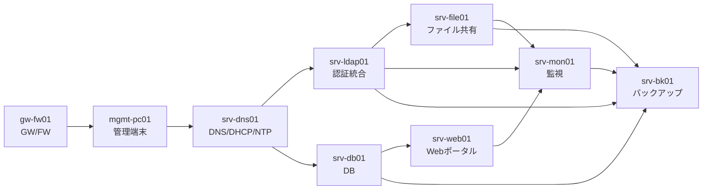
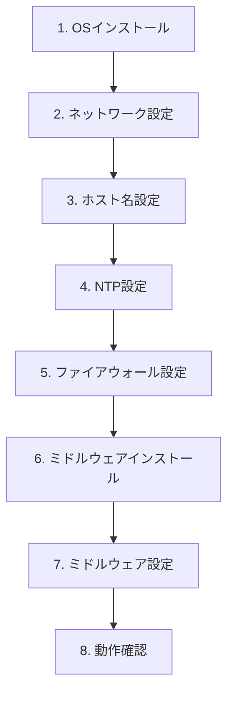

# 構築手順書

> **📘 学習ポイント**
> この文書は、設計書(DOC-03〜DOC-08)で決めた「あるべき姿」を、実際に手を動かしてサーバとして組み上げるための作業手順書です。現場のサーバ構築エンジニアは、思いつきでコマンドを打つのではなく、こうした手順書に沿って「誰が作業しても同じ結果になる」ことを大切にします。本書では代表例としてDNS/DHCPサーバ(srv-dns01)とWebサーバ(srv-web01)の構築を手取り足取り解説し、残りのサーバは同じ型に値を当てはめれば構築できることを示します。ポートフォリオとしては「設計を読める」だけでなく「設計を手順に落とし込める」ことを示す文書になります。

## 改訂履歴

| 版数 | 日付 | 内容 | 作成者 |
|---|---|---|---|
| v0.1 | 2026-08-01 | 初版ドラフト作成(標準作業フローと代表構築手順の骨子を記載) | 〇〇 〇〇 |
| v1.0 | 2026-08-20 | レビュー指摘を反映し正式版として確定(コマンド例・チェックリストを追記) | 〇〇 〇〇 |

## 文書情報

| 項目 | 内容 |
|---|---|
| 文書番号 | DOC-09 |
| 文書名 | 構築手順書 |
| 対応ファイル名 | 09_構築手順書.md |
| 作成日 | 2026年8月1日 |
| 最終改訂日 | 2026年8月20日 |
| バージョン | v1.0 |
| 作成者 | 〇〇 〇〇(氏名を記入) |
| レビュー者 | (レビュー担当者名を記入) |
| 関連文書 | DOC-04, DOC-05, DOC-06, DOC-07, DOC-08, DOC-10, DOC-11, DOC-12 |

---

## 1. 本書の目的と使い方

本書は、DOC-05(基本設計書_サーバ設計編)およびDOC-06(基本設計書_セキュリティ設計編)で定めた設計内容を、実際のサーバ構築作業に落とし込んだ手順書である。設計書が「何を、なぜそうするか」を定義する文書であるのに対し、構築手順書は「実際に何を打つか」を定義する文書であり、両者は役割が異なる。

本書の構成は以下の通りである。

- 第3章: 全サーバに共通する標準作業フロー(8ステップ)
- 第4章・第5章: 代表例としてsrv-dns01・srv-web01の詳細な構築手順
- 第6章: 残り7台のサーバへの手順の展開方法(DOC-08 詳細設計書_パラメータシートとの連携)
- 第7章: 作業チェックリスト
- 第8章: 構築中によく発生するトラブルとその対処

具体的なIPアドレスやポート番号などの値そのものは本書では極力繰り返さず、一次情報源であるDOC-08 詳細設計書_パラメータシートを参照する運用とする。ただし、代表例(srv-dns01、srv-web01)についてはコマンド例の理解を優先し、DOC-05・DOC-08にある確定値をそのまま使用して記載する。

> 💡 **なぜこう設計するのか**
> 手順書に個別の値をすべて書き込んでしまうと、パラメータが変わるたびに手順書そのものを書き直す必要が出てきます。そこで「手順の型(何をどの順番で行うか)」と「値(IPアドレスやホスト名などの具体的な数値)」を分離し、値はDOC-08に一本化しています。これは実務でもよく使われる考え方で、手順書の保守性を高め、値の転記ミスを防ぐ効果があります。

## 2. 構築の前提条件

### 2.1 仮想化基盤

本演習(学習環境)ではVirtualBox 7.x上に仮想マシン(VM。物理的な1台のコンピュータの上に、ソフトウェア的に独立した複数のコンピュータを作り出す技術、またはその1台分を指す。(※用語集(12_用語集.md)参照))を構築し、自宅PC1台で全構成を再現する。本番想定ではオンプレミス物理サーバ2台上にVMware ESXi(サーバ仮想化専用のハイパーバイザーOS。物理サーバに直接インストールし、その上に複数のVMを集約して稼働させる商用製品。(※用語集(12_用語集.md)参照))を導入し、同じ台数のVMを集約して稼働させる想定である。

本書に記載するOS内部のコマンド(nmcli、systemctl等)は、VirtualBox上のVMでもESXi上のVMでも共通である。差分が出るのはVMの新規作成やネットワークアダプタの割り当てといった「ハイパーバイザー側の操作」のみであり、これらはOS構築手順書である本書の対象外とする(DOC-03 基本設計書_システム構成編を参照)。

> 💡 **なぜこう設計するのか**
> 「自宅PC1台でも再現できる」ことと「本番に近い設計を経験できる」ことは一見両立しないように思えますが、OSより上のレイヤー(ネットワーク設定・ミドルウェア構築)を仮想化基盤に依存しない書き方にしておけば、学習環境で身につけた手順がそのまま本番相当の環境でも通用します。採用担当者に対しても「学習環境と本番の対応関係を理解した上で構築している」ことを示せるポイントです。

### 2.2 ネットワークセグメント設計(参照用・厳守)

構築作業でネットワーク設定を行う際は、以下のセグメント設計を厳守する。値の変更は行わない(詳細はDOC-04 基本設計書_ネットワーク設計編を参照)。

| セグメント名 | VLAN ID | CIDR(ネットワーク部とホスト部の区切り位置を示すIPアドレスの表記方法。(※用語集(12_用語集.md)参照)) | 用途 | GW(ゲートウェイ。異なるセグメント間の通信を中継する機器・IPアドレス。(※用語集(12_用語集.md)参照))IP |
|---|---|---|---|---|
| WAN | - | 203.0.113.0/24 ※1 | インターネット接続用(演習では疑似) | 203.0.113.1(ISP側) |
| 管理LAN | VLAN10(1本の物理ネットワークをソフトウェア的に分割し、独立したセグメントとして扱う技術。(※用語集(12_用語集.md)参照)) | 192.168.10.0/24 | サーバ管理・SSH踏み台用 | 192.168.10.1 |
| サーバLAN | VLAN20 | 192.168.20.0/24 | 各種業務サーバ設置用 | 192.168.20.1 |
| 内部LAN | VLAN30 | 192.168.30.0/24 | 社員PC・クライアント端末用 | 192.168.30.1 |
| DMZ | VLAN40 | 192.168.40.0/24 | 将来の外部公開用(本演習では未使用領域として設計のみ行う) | 192.168.40.1 |

※1 203.0.113.0/24はRFC 5737(TEST-NET-3)により文書・例示専用として予約されているアドレス範囲であり、実在のインターネット上のIPアドレスとは重複しない。設計書中の例示・演習用アドレスとして安全に使用できるものである(詳細はDOC-04を参照)。

### 2.3 サーバ一覧(参照用・厳守)

以下は本プロジェクトで構築する全9台のサーバの正となる一覧である。台数・役割・IPアドレス・スペックはいかなる文書でも変更しない(詳細はDOC-05 基本設計書_サーバ設計編を参照)。

| No | ホスト名 | 役割 | 設置セグメント | IPアドレス | OS | 主要ミドルウェア | スペック(vCPU/メモリ/ディスク) |
|---|---|---|---|---|---|---|---|
| 1 | gw-fw01 | ゲートウェイ/ファイアウォール(セグメント間ルーティング・NAT) | 全セグメントに接続(マルチホーム) | 各セグメントの.1(2.2節参照) | AlmaLinux 9.4 | firewalld, nftables | 2vCPU/2GBメモリ/20GBディスク |
| 2 | mgmt-pc01 | 管理端末(踏み台サーバ) | 管理LAN | 192.168.10.11 | AlmaLinux 9.4 | OpenSSH | 2vCPU/2GBメモリ/20GBディスク |
| 3 | srv-dns01 | DNS/DHCPサーバ(社内NTPサーバも兼務) | サーバLAN | 192.168.20.11 | AlmaLinux 9.4 | BIND 9.18, Kea DHCP 2.4, chrony | 2vCPU/2GBメモリ/20GBディスク |
| 4 | srv-ldap01 | 認証統合サーバ | サーバLAN | 192.168.20.12 | AlmaLinux 9.4 | OpenLDAP 2.6 | 2vCPU/4GBメモリ/30GBディスク |
| 5 | srv-web01 | 社内業務ポータルWebサーバ | サーバLAN | 192.168.20.13 | AlmaLinux 9.4 | Apache HTTP Server 2.4, PHP 8.2 | 2vCPU/4GBメモリ/40GBディスク |
| 6 | srv-db01 | データベースサーバ | サーバLAN | 192.168.20.14 | AlmaLinux 9.4 | MariaDB 10.11 | 4vCPU/8GBメモリ/60GBディスク |
| 7 | srv-file01 | ファイル共有サーバ | サーバLAN | 192.168.20.15 | AlmaLinux 9.4 | Samba 4.19(LDAP連携認証) | 4vCPU/8GBメモリ/200GBディスク |
| 8 | srv-mon01 | 監視サーバ | サーバLAN | 192.168.20.16 | AlmaLinux 9.4 | Zabbix Server/Web 6.4, 各サーバにZabbix Agent2 | 2vCPU/4GBメモリ/50GBディスク |
| 9 | srv-bk01 | バックアップサーバ | サーバLAN | 192.168.20.17 | AlmaLinux 9.4 | rsync, cron | 2vCPU/4GBメモリ/500GBディスク(バックアップ保存用) |

全サーバ共通事項: NTP(ネットワーク経由でサーバ間の時刻を同期させる仕組み。(※用語集(12_用語集.md)参照))はsrv-dns01(chrony)を参照する。タイムゾーンはAsia/Tokyoとする。DNS(ホスト名とIPアドレスを相互に変換する仕組み。(※用語集(12_用語集.md)参照))参照先はすべてsrv-dns01(192.168.20.11)とする。SSH(暗号化された通信路でサーバへ遠隔ログインするための仕組み。(※用語集(12_用語集.md)参照))は公開鍵認証(パスワードの代わりに鍵ペアを用いて本人確認を行うSSHの認証方式。(※用語集(12_用語集.md)参照))のみとし、rootログインは禁止する。

### 2.4 命名規則

内部ドメインはsample-trading.localとする。ホスト名は原則 `srv-<役割略称>01.sample-trading.local` の形式とし、管理端末のみ `mgmt-pc01.sample-trading.local` とする(2.3節の一覧を参照)。

### 2.5 推奨構築順序

9台のサーバは独立に構築できるわけではなく、DNS・認証・DBなど「他のサーバから参照される基盤サービス」を先に構築する必要がある。推奨する構築順序を以下に示す。



> 💡 **なぜこう設計するのか**
> gw-fw01がなければどのセグメントも外部・他セグメントと通信できず、srv-dns01がなければ他のサーバは名前解決も時刻同期もできません。このように「土台となるサービスから先に作る」のはインフラ構築の基本です。srv-mon01(監視)とsrv-bk01(バックアップ)を最後にしているのは、監視・バックアップの対象となるサーバが先に存在していないと設定のしようがないためです。ただし実務ではZabbix Agent2のように「監視サーバ自体は先に建てておき、各サーバの構築が終わるたびにエージェントを追加登録していく」進め方も一般的です。

## 3. サーバ構築 標準作業フロー(共通手順)

全9台のサーバに共通する標準作業フローを以下の8ステップと定義する。個々のサーバで異なるのは「ステップ6・7で何をインストール・設定するか」のみであり、それ以外の流れはすべてのサーバで共通である。



| ステップ | 目的 | 代表コマンド |
|---|---|---|
| 1. OSインストール | AlmaLinux 9.4を最小構成でインストールし、管理者ユーザーを作成する | (インストーラのGUI/TUI操作) |
| 2. ネットワーク設定 | 固定IPアドレス・GW・DNSを設定し、他サーバと疎通できる状態にする | `nmcli` |
| 3. ホスト名設定 | 命名規則に沿ったFQDN(完全修飾ドメイン名。ホスト名とドメイン名を組み合わせた、ネットワーク上で一意になる名前。(※用語集(12_用語集.md)参照))を設定する | `hostnamectl` |
| 4. NTP設定 | srv-dns01を参照して時刻同期する(srv-dns01自身は例外) | `chronyc` |
| 5. ファイアウォール設定 | 必要最小限のサービス・ポートのみ許可する | `firewall-cmd` |
| 6. ミドルウェアインストール | 役割に応じたパッケージを導入する | `dnf install` |
| 7. ミドルウェア設定 | 設定ファイルを編集し、サービスを有効化・起動する | `systemctl` |
| 8. 動作確認 | 想定通りに動作しているかコマンドで確認する | サービス個別のコマンド |

なお、ステップ1のOSインストール完了直後、ステップ2に進む前提として全サーバ共通で以下の初期設定を行う。

```bash
# 一般ユーザーの作成とsudo権限の付与(インストーラで作成済みの場合は省略可)
useradd admin
passwd admin
usermod -aG wheel admin

# mgmt-pc01で生成した管理者公開鍵をコピーし、公開鍵認証を有効化
mkdir -p /home/admin/.ssh
# (mgmt-pc01からssh-copy-id、または公開鍵の手動貼り付けで配布)

# パスワード認証禁止・rootログイン禁止に変更
vi /etc/ssh/sshd_config
#   PasswordAuthentication no
#   PermitRootLogin no
systemctl restart sshd
```

> 💡 **なぜこう設計するのか**
> なぜ「ネットワーク設定→ホスト名設定→NTP設定→ファイアウォール設定→ミドルウェア」という順番なのでしょうか。ネットワークが繋がらなければ以降の作業(パッケージ取得やリモートログイン)ができないため最初に行います。時刻がずれた状態でログを取り始めると、後で障害調査をする際にログの前後関係が信用できなくなるため、ミドルウェアを入れる前にNTPを合わせておきます。ファイアウォールをミドルウェアのインストールより先に設定するのは、「まず閉じておいて、必要な穴だけ開ける」という最小権限の原則(DOC-06参照)を、構築作業そのものにも徹底するためです。インストール直後の一瞬でも無防備な状態を作らない、という考え方です。

## 4. 代表例1: srv-dns01(DNS/DHCP/NTPサーバ)の構築手順

### 4.0 対象サーバの仕様

| 項目 | 値 |
|---|---|
| ホスト名 | srv-dns01.sample-trading.local |
| 設置セグメント | サーバLAN(VLAN20) |
| IPアドレス | 192.168.20.11 |
| OS | AlmaLinux 9.4 |
| 主要ミドルウェア | BIND 9.18, Kea DHCP 2.4, chrony |
| スペック | 2vCPU/2GBメモリ/20GBディスク |

srv-dns01は社内の名前解決(DNS)・IPアドレス自動払い出し(DHCP。ネットワークに接続した機器に自動でIPアドレスなどの情報を割り当てる仕組み。(※用語集(12_用語集.md)参照))・時刻同期(NTP)を1台で兼務する、社内インフラの土台となるサーバである。他の全サーバがこのサーバを参照するため、2.5節の通り最初期に構築する。

### 4.1 ネットワーク設定

```bash
# 現在のNIC(ネットワークインタフェース)名を確認する
# VirtualBox学習環境ではenp0s3/enp0s8等、ESXi本番環境ではens192等になることが多いため、
# 必ず実機で確認してから読み替えること
ip a
nmcli con show

# 固定IPアドレスを設定する(接続名は環境により異なるため ip a / nmcli con show の結果に読み替える)
nmcli con mod ens192 ipv4.addresses 192.168.20.11/24
nmcli con mod ens192 ipv4.gateway 192.168.20.1
nmcli con mod ens192 ipv4.method manual

# DNS参照先は一時的にパッケージ取得用の値としておく(後述の4.8で自分自身に切り替える)
nmcli con mod ens192 ipv4.dns 192.168.10.1

nmcli con up ens192
ip a
```

> 💡 **なぜこう設計するのか**
> srv-dns01自身がDNSサーバなので、最終的にはDNS参照先を自分自身(192.168.20.11)にします。しかし構築中はまだBINDが動いていないため、自分自身を参照先に設定すると名前解決ができずパッケージ取得等に失敗してしまいます(いわゆる「鶏が先か卵が先か」の問題)。そこで構築中は暫定的にgw-fw01(192.168.10.1)などを参照先にしておき、BINDの動作確認が取れた後で正式な値に切り替える、という手順にしています。この「一時設定→最終設定への切り替え」を忘れないよう、チェックリスト(7章)にも項目を用意しています。

### 4.2 ホスト名設定

```bash
hostnamectl set-hostname srv-dns01.sample-trading.local
hostnamectl status
```

### 4.3 NTP設定(chrony)

srv-dns01は他サーバへ時刻を配信する側であり、他サーバのようにsrv-dns01自身を参照することはできない。学習環境ではWANが疑似構成(2.2節参照)であるため、外部の時刻源を持たない「ローカル基準時刻(local stratum)」として動作させる。

```bash
dnf install -y chrony
timedatectl set-timezone Asia/Tokyo

vi /etc/chrony.conf
```

```conf
# /etc/chrony.conf の変更例(学習環境:閉域網のためローカル基準時刻を採用)
# 既定のpool行は使用しない場合コメントアウトする
# pool 2.almalinux.pool.ntp.org iburst

# 外部NTPに到達できない閉域網向けに、自分自身を基準時刻源として振る舞わせる
local stratum 10

# 管理LAN・サーバLAN・内部LANからの時刻参照を許可する
allow 192.168.10.0/24
allow 192.168.20.0/24
allow 192.168.30.0/24
```

```bash
systemctl enable --now chronyd
chronyc sources
chronyc tracking
```

> 💡 **なぜこう設計するのか**
> 本番環境(ESXi上)では、gw-fw01経由で実在のインターネットに接続できるため、srv-dns01は外部の公開NTPサーバ(例: pool.ntp.org)を参照して正確な時刻を取得します。しかし本演習ではWANが疑似構成(実在のインターネットに接続しない設計)であるため、外部の時刻源を参照できません。そこで `local stratum 10` という設定で「自分自身を時刻の基準にする」ことで、学習環境内では時刻がずれない状態を作っています。本番と学習環境で設定が変わる箇所を意図的に切り分けて理解しておくことが、面接で「なぜそうしたか」を説明できる力につながります。

### 4.4 ファイアウォール設定(firewalld)

```bash
systemctl enable --now firewalld
firewall-cmd --get-active-zones

# DNS(53/tcp,udp)・NTP(123/udp)・DHCP(67/udp)を許可する
firewall-cmd --permanent --add-service=dns
firewall-cmd --permanent --add-service=ntp
firewall-cmd --permanent --add-service=dhcp
firewall-cmd --reload
firewall-cmd --list-all
```

> 💡 **なぜこう設計するのか**
> firewalld(Linuxのファイアウォールをゾーン単位で管理するツール。(※用語集(12_用語集.md)参照))には`dns`や`ntp`のように、あらかじめ必要なポートがまとめられた「サービス」定義が用意されています。ポート番号を1つずつ`--add-port`で指定するより、目的が名前で分かる`--add-service`を使う方が設定ミスを防ぎやすく、後から見返したときの可読性も高くなります。ここではまず構築に最低限必要な穴だけを開けており、SSHアクセス元を管理LANに限定するといった詳細なゾーン間ポリシーはDOC-06で定義する。

### 4.5・4.6 ミドルウェアのインストールと設定

```bash
dnf install -y bind bind-utils kea
```

BINDのゾーン設定例(内部ドメインsample-trading.localの正引きゾーン。マルチホーム構成のgw-fw01については登録するIPアドレスの選定がDOC-08で確定するため、ここでは単一IPで完結するサーバのみ例示する)。

```conf
# /etc/named.conf の zone 定義部分(抜粋)
zone "sample-trading.local" IN {
    type master;
    file "sample-trading.local.zone";
    allow-update { none; };
};
```

```conf
# /var/named/sample-trading.local.zone の例
$TTL 3600
@   IN  SOA  srv-dns01.sample-trading.local. admin.sample-trading.local. (
        2026082001 ; serial
        3600       ; refresh
        900        ; retry
        604800     ; expire
        3600 )     ; minimum
    IN  NS   srv-dns01.sample-trading.local.

mgmt-pc01   IN  A   192.168.10.11
srv-dns01   IN  A   192.168.20.11
srv-ldap01  IN  A   192.168.20.12
srv-web01   IN  A   192.168.20.13
srv-db01    IN  A   192.168.20.14
srv-file01  IN  A   192.168.20.15
srv-mon01   IN  A   192.168.20.16
srv-bk01    IN  A   192.168.20.17
```

Kea DHCPの設定例(対象は内部LAN(VLAN30)の社員PC。DHCPはブロードキャストのため、セグメントを越えて配信するにはgw-fw01でのDHCPリレー設定が別途必要になる。DOC-04を参照)。

```json
{
  "Dhcp4": {
    "interfaces-config": {
      "interfaces": [ "ens192" ]
    },
    "subnet4": [
      {
        "subnet": "192.168.30.0/24",
        "pools": [ { "pool": "192.168.30.100 - 192.168.30.200" } ],
        "relay": { "ip-addresses": [ "192.168.30.1" ] },
        "option-data": [
          { "name": "routers", "data": "192.168.30.1" },
          { "name": "domain-name-servers", "data": "192.168.20.11" },
          { "name": "domain-name", "data": "sample-trading.local" }
        ]
      }
    ],
    "lease-database": {
      "type": "memfile",
      "persist": true
    }
  }
}
```

```bash
named-checkconf
named-checkzone sample-trading.local /var/named/sample-trading.local.zone
kea-dhcp4 -t /etc/kea/kea-dhcp4.conf

systemctl enable --now named
systemctl enable --now kea-dhcp4-server
```

> 💡 **なぜこう設計するのか**
> DHCP(IPアドレスの自動払い出し)はブロードキャストという「同一セグメント内にしか届かない通信」を使う仕組みです。ところがKea DHCPサーバはサーバLAN(192.168.20.11)に置かれ、配りたい相手の社員PCは内部LAN(VLAN30)にいます。セグメントが違うため、ゲートウェイであるgw-fw01に「DHCPリレー」という中継機能を持たせ、内部LANのDHCP要求をサーバLANのKeaまで転送してもらう必要があります。設定ファイルの`relay`欄はそのための宛先情報です。この「ブロードキャストはルータを越えない」という性質は、ネットワーク設計の基本でありながら初心者がつまずきやすいポイントです。

### 4.7 動作確認

```bash
systemctl status named
systemctl status kea-dhcp4-server

# 自分自身への正引き確認
dig @192.168.20.11 srv-web01.sample-trading.local
nslookup srv-file01.sample-trading.local 192.168.20.11

# NTPの状態確認
chronyc tracking
```

### 4.8 一時設定の切り戻し

BINDの動作確認が取れたら、4.1で暫定設定していたDNS参照先を、正式な値である自分自身に切り替える。

```bash
nmcli con mod ens192 ipv4.dns 192.168.20.11
nmcli con up ens192
```

## 5. 代表例2: srv-web01(社内業務ポータルWebサーバ)の構築手順

### 5.0 対象サーバの仕様

| 項目 | 値 |
|---|---|
| ホスト名 | srv-web01.sample-trading.local |
| 設置セグメント | サーバLAN(VLAN20) |
| IPアドレス | 192.168.20.13 |
| OS | AlmaLinux 9.4 |
| 主要ミドルウェア | Apache HTTP Server 2.4, PHP 8.2 |
| スペック | 2vCPU/4GBメモリ/40GBディスク |

srv-web01は社内向け業務ポータル(社員が社内から利用するWebアプリケーション)を稼働させるサーバであり、バックエンドのデータベースとしてsrv-db01を利用する。2.5節の通り、srv-dns01・srv-db01の構築が完了した後に構築する。

### 5.1 ネットワーク設定

```bash
nmcli con mod ens192 ipv4.addresses 192.168.20.13/24
nmcli con mod ens192 ipv4.gateway 192.168.20.1
nmcli con mod ens192 ipv4.dns 192.168.20.11
nmcli con mod ens192 ipv4.method manual
nmcli con up ens192
```

> 💡 **なぜこう設計するのか**
> srv-dns01ですでにBINDが稼働しているため、srv-web01の構築ではDNS参照先を最初から本来の値(192.168.20.11)に設定できます。srv-dns01の手順(4.1)で発生した「一時設定→切り戻し」の手間がここでは不要になっている点に注目してください。これはまさに「構築順序を工夫することで後続作業がシンプルになる」という設計の効果であり、2.5節で示した推奨構築順序の意義そのものです。

### 5.2 ホスト名設定

```bash
hostnamectl set-hostname srv-web01.sample-trading.local
```

### 5.3 NTP設定

```bash
dnf install -y chrony
timedatectl set-timezone Asia/Tokyo

vi /etc/chrony.conf
```

```conf
# /etc/chrony.conf の変更例(全サーバ共通:srv-dns01を参照する)
server 192.168.20.11 iburst
```

```bash
systemctl enable --now chronyd
chronyc sources -v
```

### 5.4 ファイアウォール設定

```bash
systemctl enable --now firewalld
firewall-cmd --add-service=http --permanent
firewall-cmd --reload
firewall-cmd --list-all
```

SSHサービスはAlmaLinuxの最小インストールでは既定のpublicゾーンに含まれていることが多いため、`firewall-cmd --list-all` の出力で `services:` 欄に `ssh` が含まれることを必ず確認する。含まれていない場合は `firewall-cmd --add-service=ssh --permanent` を追加する。

### 5.5・5.6 ミドルウェアのインストールと設定

```bash
dnf install -y httpd php php-mysqlnd php-mbstring php-xml php-json
```

```bash
# ドキュメントルートに動作確認用ページを作成
cat <<'EOF' > /var/www/html/index.php
<?php
echo "<h1>Sample Trading 社内業務ポータル(構築確認用)</h1>";
echo "PHP version: " . phpversion();
EOF

systemctl enable --now httpd
```

AlmaLinux 9.4は既定でSELinux(Linuxカーネルに、通常のパーミッションとは別の強制アクセス制御を追加するセキュリティ機構。(※用語集(12_用語集.md)参照))がenforcingモードで動作しているため、ApacheからsrvDB(srv-db01)へネットワーク接続する場合は、専用のブール値を有効化する必要がある。

```bash
setsebool -P httpd_can_network_connect 1
```

> 💡 **なぜこう設計するのか**
> 「ファイアウォールは開けたのにアプリからDBに繋がらない」という現象は、SELinuxが原因であることが非常に多いです。SELinuxはfirewalldとは別のレイヤーで動くセキュリティ機構で、Apacheプロセスが外部ネットワークへ接続すること自体を初期状態では制限しています。ここで安易に`setenforce 0`(SELinuxを無効化するコマンド)を使ってしまう例が初心者にありがちですが、それはセキュリティを丸ごと無効化する行為であり、最小権限の原則(DOC-06参照)に反します。必要な機能だけを許可するブール値(`httpd_can_network_connect`)を使うのが正しい対処です。

### 5.7 動作確認

```bash
systemctl status httpd
curl -I http://192.168.20.13/
curl http://192.168.20.13/
php -v
```

ブラウザから `http://192.168.20.13/` にアクセスし、動作確認用ページが表示されることを確認する。srv-db01との接続確認、およびLDAP連携部分の試験項目はDOC-10 テスト仕様書を参照する。

## 6. 他のサーバへの手順の展開方法(DOC-08との連携)

第4章・第5章の2例はいずれも第3章の8ステップに沿って構築している。残り7台のサーバも同じ8ステップの型に、DOC-08 詳細設計書_パラメータシートに記載された各サーバの確定値を当てはめれば構築できる。

### 6.1 汎用テンプレート

```bash
# 汎用テンプレート(<...>部分をDOC-08 詳細設計書_パラメータシートの値に置き換えて使用する)
nmcli con mod <接続名> ipv4.addresses <IPアドレス>/24
nmcli con mod <接続名> ipv4.gateway <セグメントのGW IP>
nmcli con mod <接続名> ipv4.dns 192.168.20.11
nmcli con mod <接続名> ipv4.method manual
nmcli con up <接続名>

hostnamectl set-hostname <ホスト名>.sample-trading.local

dnf install -y chrony
timedatectl set-timezone Asia/Tokyo
# /etc/chrony.conf に "server 192.168.20.11 iburst" を追記
systemctl enable --now chronyd

systemctl enable --now firewalld
firewall-cmd --permanent --add-service=<必要なサービス名>
firewall-cmd --reload

dnf install -y <役割に応じたミドルウェアパッケージ>
# ミドルウェア個別の設定ファイル編集
systemctl enable --now <サービス名>
```

例えばsrv-ldap01(No.4, IP 192.168.20.12)であれば、`<接続名>`は実機で確認したNIC名、`<IPアドレス>`は`192.168.20.12`、`<ホスト名>`は`srv-ldap01`、`<必要なサービス名>`は`ldap`(389/tcp)といったように、2.3節の一覧とDOC-08の値をそのまま当てはめる。

### 6.2 残り7台の構築パターン早見表

| ホスト名 | 役割 | 近い構築パターン | 個別の留意点 |
|---|---|---|---|
| gw-fw01 | GW/FW | 本書の範囲外 | マルチホーム構成のためNIC設定・nftables/firewalldでのルーティング・NAT設定が必要。DOC-04・DOC-05の手順に準拠し、全サーバに先立って構築する |
| mgmt-pc01 | 管理端末(踏み台サーバ。外部から社内サーバ群へ直接アクセスさせず、管理者が一度経由してから各サーバへSSH接続するための中継用サーバ。(※用語集(12_用語集.md)参照)) | srv-dns01型に近い(常駐業務ミドルウェアなし) | OpenSSHのみで構成。ここで管理者用の鍵ペアを生成し、他サーバへ公開鍵を配布する起点となるため2番目に構築する |
| srv-ldap01 | 認証統合 | srv-dns01型(単体ミドルウェアでLAN内サービス提供) | OpenLDAPのインストール・ディレクトリ情報ツリー(DIT)設計・管理者DN設定。srv-file01のSamba認証と連携するため先に構築する |
| srv-db01 | DB | srv-web01型に近い(バックエンドミドルウェア) | MariaDBインストール後、srv-web01用のDBアカウントを作成しGRANTを設定。srv-web01構築前に完了させる |
| srv-file01 | ファイル共有 | srv-dns01型+LDAP連携 | Samba設定とsrv-ldap01との認証連携が必要(詳細はDOC-06参照) |
| srv-mon01 | 監視 | srv-web01型に近い(Web UIあり) | Zabbix Server/Web構築後、既存の全サーバにZabbix Agent2を追加インストール・登録する。監視対象が揃うまで登録作業を継続する |
| srv-bk01 | バックアップ | srv-dns01型(常駐サービスは持たずcron中心) | rsync・cronの設定。バックアップ元(srv-file01・srv-db01・srv-ldap01)が先に存在している必要があるため最後に構築する(詳細はDOC-07参照) |

> 💡 **なぜこう設計するのか**
> すべてのサーバに同じ「型」(第3章の8ステップ)を適用できるのは、AlmaLinux 9.4というOSを統一し、命名規則・ネットワーク構成・NTP/DNS参照先をプロジェクト全体で標準化しているからです。もし各サーバでOSやネットワークの考え方がバラバラだったら、サーバごとに手順を1から作り直すことになり、構築ミスも増えます。標準化(共通化)は、構築のスピードだけでなく、後から見返したときの分かりやすさ、そして新しいメンバーが加わったときの引き継ぎやすさにも直結します。

## 7. 作業チェックリスト

### 7.1 構築前 共通チェックリスト

- [ ] DOC-08 詳細設計書_パラメータシートで対象サーバのホスト名・IPアドレス・役割を確認した
- [ ] DOC-05 基本設計書_サーバ設計編で対象サーバの詳細仕様(vCPU/メモリ/ディスク)を確認した
- [ ] 仮想化基盤(VirtualBox/ESXi)上に指定スペック通りのVMが準備されている
- [ ] AlmaLinux 9.4のインストールメディア(ISO)が準備されている
- [ ] mgmt-pc01で生成した管理者用公開鍵が手元にある
- [ ] 2.5節の推奨構築順序に沿って、依存する前段のサーバの構築が完了している

### 7.2 OS構築 共通チェックリスト(全サーバ共通)

- [ ] OSインストールが完了し、コンソールログインができる
- [ ] 一般ユーザーが作成され、sudo権限(wheelグループ)が付与されている
- [ ] SSHが公開鍵認証のみに設定され、パスワード認証・rootログインが禁止されている
- [ ] 固定IPアドレスが設定され、疎通確認(ping)ができる
- [ ] ホスト名が `srv-<略称>01.sample-trading.local`(またはmgmt-pc01.sample-trading.local)の形式で設定されている
- [ ] タイムゾーンがAsia/Tokyoに設定されている
- [ ] chronydが有効化され、srv-dns01(またはローカル基準時刻)と同期している(`chronyc sources` で確認)
- [ ] firewalldが有効化され、必要最小限のサービス・ポートのみ許可されている

### 7.3 srv-dns01 個別チェックリスト

- [ ] BIND(named)が起動し、`named-checkconf` / `named-checkzone` がエラーなく通っている
- [ ] Kea DHCPサーバが起動し、`kea-dhcp4 -t` で設定ファイルの構文エラーがない
- [ ] 他サーバから `dig @192.168.20.11 <ホスト名>.sample-trading.local` による正引きが成功する
- [ ] 4.1で暫定設定したDNS参照先を、自分自身(192.168.20.11)に切り戻した

### 7.4 srv-web01 個別チェックリスト

- [ ] Apache(httpd)が起動し、curl/ブラウザで動作確認用ページが表示できる
- [ ] PHPが動作している(`php -v` およびページ内のバージョン表示で確認)
- [ ] `setsebool -P httpd_can_network_connect 1` が設定され、SELinuxがDB接続をブロックしていない
- [ ] srv-db01への疎通確認(DOC-10参照)が完了している

### 7.5 全サーバ共通 最終確認チェックリスト

- [ ] DOC-10 テスト仕様書の該当項目に沿った動作確認が完了している
- [ ] 構築中に一時的に変更した設定(仮のDNS参照先など)が正式な値に戻されている
- [ ] `firewall-cmd --list-all` の内容がDOC-06のゾーンポリシーと矛盾していない
- [ ] 構築ログ・作業メモが保管され、DOC-11 運用保守設計書への引き継ぎ準備ができている

## 8. よくあるつまづきポイントとその対処

| 症状 | 主な原因 | 対処の方向性 |
|---|---|---|
| dnfでパッケージがインストールできない | ネットワーク未疎通、DNS未解決、リポジトリ設定不備 | `ping`で疎通確認→一時的なDNS参照先(4.1参照)を確認→リポジトリ設定を確認 |
| SSHで接続できない | firewalldでsshが未許可、sshd_configの設定誤り、公開鍵未配布 | `firewall-cmd --list-all`で許可状況を確認、`ssh -vvv`で詳細ログを確認 |
| firewalldで許可しているのに他セグメントから届かない | 各サーバのfirewalld設定は正しくても、セグメントを跨ぐ通信はgw-fw01側のルーティング/NAT設定も必要 | DOC-04・DOC-06のゲートウェイ側の設定を確認する |
| Webアプリからデータベースに接続できない | SELinuxのブール値未設定、MariaDB側のユーザー権限(GRANT)不足 | `setsebool`の設定確認、MariaDB側のGRANT文を確認 |
| DHCPでクライアントにIPが払い出されない | ブロードキャストはセグメントを越えられないため、gw-fw01のDHCPリレーが未設定 | DOC-04を参照し、gw-fw01のDHCPリレー設定を確認する |
| 時刻がずれてログの前後関係がおかしい | chronydが未起動、または参照先がsrv-dns01(あるいはローカル基準時刻)になっていない | `chronyc sources`で参照先・同期状態を確認する |

> 💡 **なぜこう設計するのか**
> トラブルシューティングの多くは「どのレイヤーで止まっているか」を切り分ける作業です。OS(ネットワーク・SELinux)、firewalld(サーバ単体のファイアウォール)、gw-fw01(セグメント間のルーティング)というように、通信を妨げうる場所は何層にも分かれています。エラーメッセージを見て一つ原因を決めつけるのではなく、「疎通→ポート到達性→アプリの認証」のように、下のレイヤーから順に確認していく習慣をつけることが、未経験からエンジニアを目指す上で最も実務に近い力になります。

## 9. 関連文書・用語集

- DOC-04 基本設計書_ネットワーク設計編(セグメント設計・ルーティング・DHCPリレーの詳細)
- DOC-05 基本設計書_サーバ設計編(サーバごとの詳細仕様)
- DOC-06 基本設計書_セキュリティ設計編(ファイアウォールのゾーンポリシー、SSH/sudo運用方針)
- DOC-07 基本設計書_可用性バックアップ設計編(バックアップ設計の背景)
- DOC-08 詳細設計書_パラメータシート(全パラメータ値の一次情報源)
- DOC-10 テスト仕様書(構築後に実施する試験項目)
- DOC-11 運用保守設計書(構築後の運用引き継ぎ)
- DOC-12 用語集(本書中の専門用語の解説一覧)

> 🎓 **ひとことコラム**
> 構築手順書は「作って終わり」の文書ではなく、次にサーバを作り直す人(将来の自分自身を含む)のための資産です。実務では機器の故障やクラウド移行のたびに同じ構築を繰り返すことがあり、手順書の精度がそのまま作業時間とミスの少なさに直結します。ポートフォリオとして提示する際も、「なぜこの順番か」「なぜこの設定か」を自分の言葉で説明できるようにしておくと、面接での技術的な質問にも自信を持って答えられるようになります。
