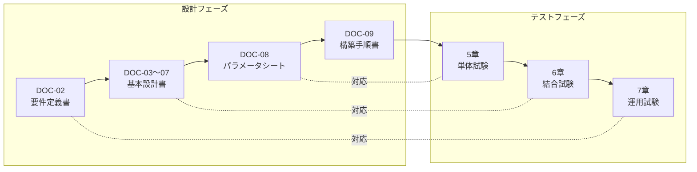
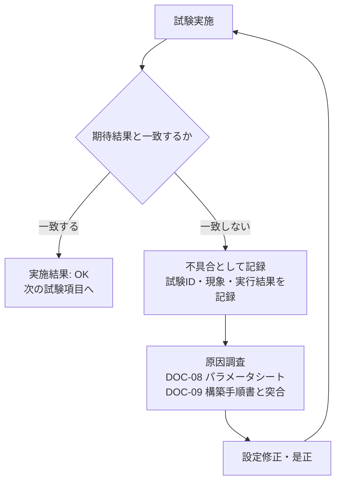

# テスト仕様書

> **公開記録の状態（2026年9月11日）**：本書は架空案件の試験計画です。実施結果欄は未記入で、本人のVMでの試験証跡は未掲載です。期待結果や移行判定条件は、合格・本番移行済みの記録ではありません。
>
> **📘 学習ポイント**
> この文書は、DOC-03〜DOC-09で設計・構築したシステムが「設計どおりに正しく動いているか」を確認するためのテスト計画書です。実務では、構築が終わったサーバをそのまま本番投入することはなく、必ずこの文書のような試験項目に沿って一つひとつ動作確認を行い、記録を残してから本番リリースの判定を行います。未経験者がまず陥りやすいのは「動いたからOK」という正常系だけの確認で満足してしまうことです。本書では正常系に加えて境界値・異常系の試験も扱い、「なぜそこまで確認するのか」を理由とともに説明します。採用担当者の方には、著者が単に手順を実行できるだけでなく、品質保証の観点を持って構築作業に取り組めることの証跡としてご覧いただければ幸いです。

## 改訂履歴

| 版数 | 日付 | 内容 | 作成者 |
|---|---|---|---|
| v0.1 | 2026年8月1日 | 初版ドラフト作成(テスト方針・試験項目の洗い出し) | 〇〇 〇〇 |
| v1.0 | 2026年8月20日 | DOC-01〜DOC-09との整合確認、レビュー指摘反映のうえ正式版として確定 | 〇〇 〇〇 |

## 文書基本情報

| 項目 | 内容 |
|---|---|
| 案件名 | 中堅卸売企業向け社内ITインフラ刷新プロジェクト(サーバー構築エンジニア ポートフォリオ用 基礎演習案件) |
| 発注者(架空) | 株式会社サンプル物産 |
| 文書番号 | DOC-10 |
| 文書名 | テスト仕様書 |
| ファイル名 | 10_テスト仕様書.md |
| 作成日 | 2026年8月1日 |
| 最終改訂日 | 2026年8月20日 |
| バージョン | v1.0 |
| 作成者 | 〇〇 〇〇 |
| レビュー者 | |
| 関連文書 | DOC-02 要件定義書、DOC-03〜07 基本設計書各編、DOC-08 詳細設計書_パラメータシート、DOC-09 構築手順書、DOC-11 運用保守設計書、DOC-12 用語集 |

---

## 1. 本書の目的と位置づけ

本書は、DOC-09 構築手順書に従って構築した各サーバ・ネットワーク機器が、DOC-02 要件定義書およびDOC-03〜DOC-07の基本設計書に記載した仕様どおりに動作することを検証するための試験仕様を定めるものである。試験の合否結果は、本番環境(または本演習における学習環境の完成版)への移行可否を判断する材料として用いる。

試験対象は、DOC-05 サーバ設計編に定義された9台のサーバおよびDOC-04 ネットワーク設計編に定義されたネットワークセグメント全体である。値の正誤判定に用いるIPアドレス・ホスト名・ポート番号等はすべてDOC-08 詳細設計書_パラメータシートの値を正とする。

> **💡 なぜこう設計するのか**
> 「作ったら終わり」ではなく「作ったものが仕様どおりであることを第三者にも説明できる状態にする」ことが、現場のサーバ構築エンジニアに求められる基本動作です。試験仕様書を作成しておくことで、構築者本人以外(レビュー担当者や引き継ぎ先の運用担当者)でも同じ手順で同じ結果を再現・確認できるようになります。これは属人化を防ぐという意味でも重要な設計です。

## 2. テスト対象範囲

本書の試験対象サーバ一覧を以下に示す。値はDOC-05 サーバ設計編のマスター一覧をそのまま転記したものであり、本書内では変更しない。

| No | ホスト名 | 役割 | 設置セグメント | IPアドレス | OS | 主要ミドルウェア | スペック(vCPU/メモリ/ディスク) |
|---|---|---|---|---|---|---|---|
| 1 | gw-fw01 | ゲートウェイ/ファイアウォール(セグメント間ルーティング・NAT) | 全セグメントに接続(マルチホーム) | 各セグメントの.1 | AlmaLinux 9.4 | firewalld, nftables | 2vCPU/2GBメモリ/20GBディスク |
| 2 | mgmt-pc01 | 管理端末(踏み台サーバ) | 管理LAN | 192.168.10.11 | AlmaLinux 9.4 | OpenSSH | 2vCPU/2GBメモリ/20GBディスク |
| 3 | srv-dns01 | DNS/DHCPサーバ(社内NTPサーバも兼務) | サーバLAN | 192.168.20.11 | AlmaLinux 9.4 | BIND 9.18, Kea DHCP 2.4, chrony | 2vCPU/2GBメモリ/20GBディスク |
| 4 | srv-ldap01 | 認証統合サーバ | サーバLAN | 192.168.20.12 | AlmaLinux 9.4 | OpenLDAP 2.6 | 2vCPU/4GBメモリ/30GBディスク |
| 5 | srv-web01 | 社内業務ポータルWebサーバ | サーバLAN | 192.168.20.13 | AlmaLinux 9.4 | Apache HTTP Server 2.4, PHP 8.2 | 2vCPU/4GBメモリ/40GBディスク |
| 6 | srv-db01 | データベースサーバ | サーバLAN | 192.168.20.14 | AlmaLinux 9.4 | MariaDB 10.11 | 4vCPU/8GBメモリ/60GBディスク |
| 7 | srv-file01 | ファイル共有サーバ | サーバLAN | 192.168.20.15 | AlmaLinux 9.4 | Samba 4.19(LDAP連携認証) | 4vCPU/8GBメモリ/200GBディスク |
| 8 | srv-mon01 | 監視サーバ | サーバLAN | 192.168.20.16 | AlmaLinux 9.4 | Zabbix Server/Web 6.4, 各サーバにZabbix Agent2 | 2vCPU/4GBメモリ/50GBディスク |
| 9 | srv-bk01 | バックアップサーバ | サーバLAN | 192.168.20.17 | AlmaLinux 9.4 | rsync, cron | 2vCPU/4GBメモリ/500GBディスク(バックアップ保存用) |

ネットワークセグメントの試験対象は以下のとおりである(DOC-04 ネットワーク設計編より転記)。

| セグメント名 | VLAN ID | CIDR | 用途 | GW(ゲートウェイ)IP |
|---|---|---|---|---|
| WAN | - | 203.0.113.0/24(例示用アドレス、RFC5737 TEST-NET-3。実在のIPを使わない安全な設計書用の例示アドレス) | インターネット接続用(演習では疑似) | 203.0.113.1(ISP側) |
| 管理LAN | VLAN10 | 192.168.10.0/24 | サーバ管理・SSH踏み台用 | 192.168.10.1 |
| サーバLAN | VLAN20 | 192.168.20.0/24 | 各種業務サーバ設置用 | 192.168.20.1 |
| 内部LAN | VLAN30 | 192.168.30.0/24 | 社員PC・クライアント端末用 | 192.168.30.1 |
| DMZ | VLAN40 | 192.168.40.0/24 | 将来の外部公開用(本演習では未使用領域として設計のみ行う) | 192.168.40.1 |

**試験範囲外とする事項**: WANセグメント(203.0.113.0/24)は例示用アドレスであり実際のインターネット接続は行わないため、実回線を用いた疎通試験は対象外とする。DMZ(VLAN40)は本演習では設計のみで実機を配置しないため、実サーバを用いた機能試験は対象外とし、通信が許可されていないことの確認(遮断確認)のみを行う。

## 3. テスト方針

本書では、一般的なシステム開発・インフラ構築の現場で用いられる「単体試験(たんたいしけん。個々のサーバ・機能を単独で確認する試験)(※用語集(12_用語集.md)参照)」「結合試験(けつごうしけん。複数のサーバ・機能を連携させて確認する試験)(※用語集(12_用語集.md)参照)」「運用試験(うんようしけん。実際の運用シナリオに沿って一連の動作を確認する試験)(※用語集(12_用語集.md)参照)」の3段階でテストを実施する。

> **💡 なぜこう設計するのか**
> 上図のように、細かい仕様(パラメータシート)に対応するのが単体試験、サーバ間の連携設計(基本設計書)に対応するのが結合試験、そして「利用者が実際に困る場面を想定した要件」に対応するのが運用試験、という関係になっています。これは俗に「V字モデル」と呼ばれる考え方で、設計の粒度とテストの粒度を対応させることで、抜け漏れのない試験計画を立てやすくする狙いがあります。いきなり全体を一気にテストしようとすると、不具合が起きたときにどこが原因か切り分けられません。段階を分けることで「どのレイヤーで壊れているか」を素早く特定できるのです。

### 3.1 単体試験(コンポーネントテスト)

各サーバ単体で、そのサーバが担うべき機能(DNS応答、DHCP払い出し、LDAP認証応答など)が単独で正しく動作するかを確認する。他サーバとの連携は最小限にとどめ、確認対象のサーバに問題があるかどうかを切り分けやすくすることを目的とする。

### 3.2 結合試験(インテグレーションテスト)

複数のサーバを連携させ、業務の流れに沿った通信・処理が正しく行われるかを確認する。例えば「WebサーバがDBサーバへ接続してデータを取得できるか」「ファイル共有サーバがLDAPサーバに認証を問い合わせ、部門ごとのアクセス権が正しく適用されるか」など、単体試験だけでは見つからない連携部分の不具合を検出することを目的とする。ファイアウォール(gw-fw01)によるセグメント間の許可・遮断もこの段階で確認する。

### 3.3 運用試験(運用シナリオテスト)

構築したシステムを実際の運用と同じ条件(定例バックアップ、監視、パッチ適用など)で動かし、業務運用に耐えられるかを確認する。バックアップからのリストアやZabbixによる障害検知など、日々の運用の中で実際に起こり得るシナリオを再現して試験する。

### 3.4 テストの網羅性についての考え方

> **💡 なぜこう設計するのか**
> 初心者がテストというと「正しい入力をして正しい結果が返ってくることを確認する(正常系)」だけをイメージしがちですが、現場の設計書としてはそれだけでは不十分です。境界値(範囲の端やギリギリの条件)と異常系(誤った操作や障害が起きた場合)まで含めて初めて「試験仕様書」と呼べます。理由は単純で、実際の障害の多くは正常系ではなく境界値・異常系で発生するためです。詳細は8章で具体例とともに解説する。

## 4. テスト環境

学習環境ではVirtualBox 7.x上に仮想マシンを構築し、自宅PC1台で本書の試験項目をすべて再現できる構成とする。本番を想定した場合は、オンプレミス物理サーバ2台上にVMware ESXiを導入し、サーバ仮想化基盤としてゲスト9台(gw-fw01〜srv-bk01)を稼働させる構成に置き換わる。試験の内容・確認方法自体は学習環境・本番想定環境のいずれでも同一である。

| 項目 | 学習環境 | 本番想定環境 |
|---|---|---|
| 仮想化基盤 | VirtualBox 7.x(自宅PC1台) | VMware ESXi(物理サーバ2台) |
| ネットワーク構成 | VirtualBoxの内部ネットワーク機能でVLANセグメントを模擬 | 物理スイッチ・タグVLANによるセグメント分離 |
| WAN接続 | 疑似(実回線には接続しない) | ISP回線に接続(本演習では対象外) |
| 試験実施者 | 構築者本人 | 構築者+レビュー担当者(第三者確認を推奨) |

全サーバの時刻はsrv-dns01(chrony)を基準に同期し、タイムゾーンはAsia/Tokyoに統一されていることを前提として各試験を実施する。時刻がずれているとLDAP認証やログの前後関係の確認に支障が出るため、試験開始前に3.1節のNTP同期試験(UT-03)を最初に行うことを推奨する。

## 5. 単体試験項目一覧

各サーバ単独の機能確認を行う。実施結果欄は試験実施時に「OK」「NG」および実施日を記入する。

| 試験ID | 試験対象 | 試験内容 | 期待結果 | 確認方法 | 実施結果 |
|---|---|---|---|---|---|
| UT-01 | srv-dns01(BIND) | 内部ドメインsample-trading.localの名前解決(正引き・逆引き)を行う | 登録済みホスト名(例: srv-web01.sample-trading.local)がIPアドレス192.168.20.13へ正しく解決される。逆引きも同様に成功する | 管理端末(mgmt-pc01)から`dig srv-web01.sample-trading.local`および`dig -x 192.168.20.13`を実行し応答を確認する | |
| UT-02 | srv-dns01(Kea DHCP) | 内部LAN(VLAN30)のクライアントPCへDHCPでIPアドレスが払い出されるか確認する | 192.168.30.100〜192.168.30.200の範囲内でIPアドレスが払い出され、DNSサーバ・デフォルトゲートウェイ(192.168.30.1)の情報も併せて配布される | クライアント端末(または模擬クライアント)でDHCPリース取得を実行し、`ip a`および`journalctl -u kea-dhcp4`でリース内容を確認する | |
| UT-03 | 全9台のサーバ(chrony) | NTPクライアントがsrv-dns01(192.168.20.11)を時刻同期元として参照しているか確認する | 各サーバの時刻がsrv-dns01と同期しており、ずれが許容範囲(数秒以内)である | 各サーバで`chronyc sources`および`chronyc tracking`を実行し、参照元とオフセットを確認する | |
| UT-04 | srv-ldap01(OpenLDAP) | LDAP(軽量ディレクトリアクセスプロトコル。ユーザーアカウント情報などを一元管理する仕組み)(※用語集(12_用語集.md)参照)への単体での認証応答を確認する | 登録済みユーザーでの`ldapwhoami`が成功し、正しいDN(識別名)が返る。未登録ユーザー・誤パスワードでは認証エラーとなる | mgmt-pc01から`ldapwhoami -x -D "uid=testuser,ou=People,dc=sample-trading,dc=local" -W`を実行し結果を確認する | |
| UT-05 | srv-web01(Apache/PHP) | Webサーバプロセスの単体起動、およびポータルトップページの応答を確認する | Apacheサービスがactive(running)であり、`curl http://192.168.20.13/`がHTTPステータス200を返す | サーバ上で`systemctl status httpd`、`curl -I http://localhost/`を実行して確認する | |
| UT-06 | srv-db01(MariaDB) | データベースサーバプロセスの単体起動、およびローカル接続を確認する | MariaDBサービスがactive(running)であり、管理ユーザーでのログインおよび簡単なSELECT文が成功する | サーバ上で`systemctl status mariadb`、`mysql -u root -p -e "SELECT 1;"`を実行して確認する | |
| UT-07 | srv-file01(Samba) | Samba単体でのサービス起動、および共有フォルダの構成が反映されているかを確認する | Sambaサービスがactive(running)であり、`testparm`でSambaの設定ファイル(smb.conf)にエラーがなく、部門別共有フォルダ(例: 営業部、総務部)が定義どおり存在する | サーバ上で`systemctl status smb`、`testparm -s`を実行して構成を確認する | |
| UT-08 | srv-mon01(Zabbix Server/Web)、全サーバ(Zabbix Agent2) | Zabbix ServerおよびWebフロントエンドの単体起動、各サーバのAgent2プロセス起動を確認する | Zabbix Server/Webサービスがactive(running)であり、管理画面にログインできる。全サーバでAgent2がactive(running)である | srv-mon01で`systemctl status zabbix-server zabbix-agent2`、各サーバで`systemctl status zabbix-agent2`を実行して確認する | |
| UT-09 | srv-bk01(rsync/cron) | バックアップ用のrsyncスクリプトを手動実行し、単体で正常終了するか確認する | スクリプトがエラーなく終了し、終了コードが0である。ログにrsync実行結果が記録される | サーバ上でバックアップスクリプトを手動実行し、`echo $?`で終了コード、ログファイルの内容を確認する | |
| UT-10 | 全9台のサーバ(SSH) | SSHが公開鍵認証のみで、パスワード認証・rootでの直接ログインが拒否されることを単体で確認する | パスワード認証での接続要求は拒否される。root宛のSSH接続は拒否される。公開鍵を登録した一般ユーザーでの接続は成功する | 各サーバに対しパスワード指定でのSSH接続、root宛のSSH接続を試行し拒否されることを確認したうえで、公開鍵での一般ユーザー接続が成功することを確認する | |

> **💡 なぜこう設計するのか**
> UT-10は正常系(公開鍵認証での接続成功)だけでなく、あえて「失敗するはずの操作」(パスワード認証、rootログイン)を試して、それが確かに拒否されることまで確認しています。セキュリティ設定は「正しい人が入れること」だけでなく「正しくない方法では絶対に入れないこと」を確認して初めて完成です。これはDOC-06 セキュリティ設計編で定義した最小権限の原則を、実機で裏付ける試験です。

## 6. 結合試験項目一覧

複数サーバの連携、およびファイアウォール(gw-fw01)によるセグメント間通信制御を確認する。

| 試験ID | 試験対象 | 試験内容 | 期待結果 | 確認方法 | 実施結果 |
|---|---|---|---|---|---|
| IT-01 | srv-web01 → srv-db01 | Webポータル(PHP)からMariaDBサーバへのDB接続(疎通)を確認する | srv-web01からsrv-db01の3306ポートへ接続でき、PHPアプリケーションからのクエリが正常に実行される | srv-web01で`mysql -h 192.168.20.14 -u <ポータル用DBユーザー> -p`を実行し接続確認する。あわせてポータル画面上でDB参照を伴う操作を行い正しくデータが表示されることを確認する | |
| IT-02 | srv-web01 → srv-ldap01 | 業務ポータルへのログイン時にLDAP認証と連携し、社内アカウントでログインできるか確認する | LDAPに登録済みのアカウントでポータルにログインでき、未登録アカウントおよび誤パスワードではログイン失敗となる | ブラウザ(または管理端末経由)からポータルのログイン画面にアクセスし、正規アカウント・誤アカウントの双方でログインを試行する | |
| IT-03 | srv-file01 → srv-ldap01 | ファイル共有サーバがLDAP認証と連携し、部門ごとのアクセス制御(ACL。アクセス制御リスト。誰がどのフォルダに読み書きできるかを定義する仕組み)(※用語集(12_用語集.md)参照)が適用されるか確認する | LDAPに登録された部門情報に基づき、自部門の共有フォルダには読み書きでき、他部門の共有フォルダにはアクセスできない(権限エラーとなる) | クライアント端末からSambaに接続(`smbclient //192.168.20.15/<部門フォルダ> -U <ユーザー名>`)し、自部門・他部門の双方のフォルダへのアクセスを試行する | |
| IT-04 | 内部LAN端末 → srv-dns01 | クライアントPCがDHCPでIP・DNS情報を取得したのち、その情報をもとに社内ドメインの名前解決ができるかを一連の流れで確認する | DHCPで取得したDNSサーバ(192.168.20.11)を用いて、srv-web01などの社内ホスト名が正しく解決できる | クライアント端末でDHCP取得後、`nslookup srv-web01.sample-trading.local`を実行し応答を確認する | |
| IT-05 | 管理LAN → サーバLAN(gw-fw01) | 管理LAN(踏み台サーバ mgmt-pc01)からサーバLAN上の各サーバへSSH(管理用ポート)で接続できることを確認する | mgmt-pc01からサーバLAN上の全サーバ(192.168.20.11〜17)へSSH接続が許可される | mgmt-pc01から各サーバへ`ssh <ユーザー名>@<IPアドレス>`を実行し、接続が確立することを確認する | |
| IT-06 | 内部LAN → サーバLAN(gw-fw01) | 内部LAN(社員PC)からサーバLANの管理用ポート(SSH等)への直接アクセスが、DOC-06で定義されたとおり拒否されることを確認する | 内部LANのクライアントから各サーバへのSSH接続は拒否(タイムアウトまたは接続拒否)となる。業務で必要な通信(Webポータルの80/443、Samba共有の445等、DOC-06で許可された通信)のみが到達する | クライアント端末から各サーバのSSHポートへ接続を試行し拒否されることを確認する。あわせてWebポータル・Samba共有への接続は成功することを確認する | |
| IT-07 | DMZ(gw-fw01) | DMZ(VLAN40)が現時点で未使用領域として設計されており、他セグメントとの通信が許可されていないことを確認する | 他セグメントからDMZ宛の通信、DMZから他セグメント宛の通信のいずれもデフォルトで拒否される(現時点でDMZに稼働ホストがないため、疎通試験は成立しないことを含めて確認する) | gw-fw01の設定(`firewall-cmd --list-all --zone=<DMZに対応するゾーン>`)を確認し、DOC-06の許可ルールにDMZ関連の許可設定が存在しないことを確認する | |
| IT-08 | srv-mon01 → 各サーバ | Zabbix Serverが各サーバのZabbix Agent2からメトリクス(CPU・メモリ・ディスク使用率等)を正しく収集できているかを確認する | Zabbixの管理画面(Web)上で全9台のホストが「監視中」として表示され、直近のデータが取得できている | srv-mon01のZabbix Web画面にログインし、「監視データ」または「最新データ」画面で各ホストのデータ受信状況を確認する | |

> **💡 なぜこう設計するのか**
> IT-06は「許可されるべき通信が通ること」と「許可されていない通信が拒否されること」の両方をセットで確認しています。ファイアウォールの設定は、許可ルールを1つ追加するたびに、意図せず他の通信まで通してしまう(設定ミス)リスクがあります。「拒否されるはずの通信が本当に拒否されているか」を試験で確認しないと、設定ファイルを見ただけでは気づけない抜け穴を見逃す可能性があります。これが多層防御(1か所の設定ミスがあっても被害を最小限にとどめる考え方)の実効性を担保するための試験です。

## 7. 運用試験項目一覧

実運用を想定したシナリオに基づき、バックアップ・監視・パッチ適用などの一連の運用動作を確認する。

| 試験ID | 試験対象 | 試験内容 | 期待結果 | 確認方法 | 実施結果 |
|---|---|---|---|---|---|
| OT-01 | srv-file01, srv-db01, srv-ldap01 → srv-bk01 | 日次差分バックアップ(毎日23:00実行)が設計どおりに動作するかを確認する | cronにより23:00にrsyncジョブが起動し、前回バックアップからの差分データがsrv-bk01(192.168.20.17)へ転送される。ログにエラーが記録されない | srv-bk01側で`crontab -l`によるジョブ登録確認、実行後にバックアップ先ディレクトリの内容とログを確認する | |
| OT-02 | srv-file01, srv-db01, srv-ldap01 → srv-bk01 | 週次フルバックアップ(毎週日曜23:00実行)が設計どおりに動作するかを確認する | 日曜23:00にフルバックアップが実行され、対象データ全体がsrv-bk01へ転送される | srv-bk01側でジョブ実行後のバックアップ先ディレクトリ容量・ファイル数・ログを確認し、対象データ全体が含まれていることを確認する | |
| OT-03 | srv-bk01 | バックアップデータの世代管理(4世代保持)が正しく機能しているか確認する | 5世代目のバックアップが作成されたタイミングで、最も古い世代のバックアップが自動的に削除され、常に4世代分が保持される | 複数回バックアップを実行(または日付を進めてシミュレート)し、`ls`でバックアップ先の世代ディレクトリ数が4を超えないことを確認する | |
| OT-04 | srv-file01, srv-db01, srv-ldap01(リストア) | バックアップデータからのリストア(復元)が、目標復旧時間(RTO。目標復旧時間。障害発生からどれだけの時間で復旧させるかの目標値)(※用語集(12_用語集.md)参照)4時間以内で完了するかを確認する | 意図的に対象データを削除・破損させた状態から、srv-bk01のバックアップデータを用いて復元でき、復元開始から4時間以内に業務再開可能な状態に戻る。復元後のデータが最新バックアップ時点(目標復旧時点(RPO)24時間以内)の内容と一致する | 試験用に共有フォルダの一部ファイル・DBの1テーブル・LDAPエントリの一部を削除し、rsyncによる復元手順を実施のうえ、復元に要した時間とデータの整合性を確認する | |
| OT-05 | 全9台のサーバ | 月次パッチ適用(第1月曜に`dnf update`を実施する運用ルール)が手順どおりに実施できるかを確認する | `dnf update`が正常終了し、適用後にサービスが正常に再起動・稼働することを確認できる。再起動が必要なパッチの場合は計画的な再起動が行える | 各サーバで`dnf update`を実行し、完了後に主要サービス(httpd, mariadb, smb, zabbix-agent2等)の稼働状況を確認する | |
| OT-06 | srv-mon01(Zabbix) | ディスク使用率が閾値を超過した場合に、Zabbixがアラートを正しく発報するか確認する | 監視対象サーバのディスク使用率が設定閾値(例: 80%)を超えた際に、Zabbix管理画面上で警告(Warning以上)のトリガーが発火する | 試験用に大容量のダミーファイルを作成してディスク使用率を意図的に閾値超過させ、Zabbix画面上でアラート発生を確認したのち、ダミーファイルを削除してアラートが解消することを確認する | |
| OT-07 | srv-mon01 → 各サーバ | いずれかのサーバが停止(サービス停止またはサーバダウン)した場合に、Zabbixが検知しアラートを発報するまでの時間を確認する | サービス停止・サーバダウンから、あらかじめ設定した監視間隔(例: 1分〜数分程度)以内にZabbix画面上で異常(Not availableまたは障害トリガー)として検知される | 試験対象サーバで該当サービスを意図的に停止(例: `systemctl stop httpd`)し、Zabbix画面上でアラートが表示されるまでの時間を計測する。試験後は忘れずにサービスを再開する | |

> **💡 なぜこう設計するのか**
> OT-04(リストア試験)は本書の中でも特に重要です。バックアップは「取得できていること」を確認しただけでは不十分で、「実際に復元できること」まで確認して初めて意味を持ちます。現場では「バックアップは毎日取れていたが、いざ復元しようとしたら壊れていて使えなかった」という事故が実際に起こります。株式会社サンプル物産の現状課題である「バックアップの世代管理がされていない」状態から脱却する、というプロジェクトゴールを本当に達成できているかは、このリストア試験でしか証明できません。

## 8. 試験実施時のポイント

### 8.1 正常系・境界値・異常系を分けて考える

| 観点 | 説明 | 本書での具体例 |
|---|---|---|
| 正常系 | 想定どおりの入力・操作で、想定どおりの結果が得られることを確認する | UT-04: 正しいユーザー名・パスワードでLDAP認証が成功する |
| 境界値 | 範囲の端(上限・下限ぎりぎり)の値で正しく動作するかを確認する | UT-02: DHCP払い出し範囲の下限(192.168.30.100)・上限(192.168.30.200)付近での払い出し動作、および範囲を使い切った場合(201台目)にエラーとなることの確認 |
| 異常系 | 誤った操作、想定外の状況、障害が発生した場合に、想定どおりの拒否・エラー・復旧動作となることを確認する | UT-10: パスワード認証・rootログインの拒否、IT-06: 許可されていないセグメント間通信の拒否、OT-04: データ破損時のリストア |

> **💡 なぜこう設計するのか**
> 未経験のうちは「正しく動くことを1回確認できれば試験は完了」と考えがちです。しかし実際の障害の多くは「想定していなかった操作をされた」「想定していた範囲を超えた」ときに発生します。境界値・異常系まで確認しておくことで、本番運用が始まってからのトラブルを事前に減らせます。本書のUT-02・UT-10・IT-06・OT-04・OT-06・OT-07はいずれも異常系・境界値を含む試験として設計している。

### 8.2 実施順序についての考え方

試験は5章(単体試験)→6章(結合試験)→7章(運用試験)の順に実施することを基本とする。特に、時刻同期(UT-03)とDNS名前解決(UT-01)は他の多くの試験の前提条件となるため、最初に確認しておくことが望ましい。時刻がずれているとLDAP認証やログ確認で誤った判断をしてしまう可能性があり、DNSが正しく引けないと結合試験の多くが正しく評価できないためである。

### 8.3 試験記録の残し方

各試験項目の「実施結果」欄には、実施日・実施者・対象環境・コマンドと終了コード・実際に得られた出力の保存先を残す。OKは期待結果を満たした `PASS`、NGは `FAIL` に対応する。未着手は `NOT RUN`、環境や権限などの前提不足は `BLOCKED` と記入する。空欄は合格として扱わず、確認できた試験IDだけを実施済みとして示す。NGとなった場合は9章の不具合管理フローに従って対応する。AIや第三者の支援がある場合は、提案・操作・結果確認を誰が担当したかも記録する。

## 9. 不具合発見時の対応フロー

不具合を発見した場合は、当該試験IDと現象、実際に得られた結果を記録したうえで、DOC-08 詳細設計書_パラメータシートおよびDOC-09 構築手順書の該当箇所と突合し、設定値の誤りか手順の誤りかを切り分ける。修正後は同一試験項目を再実施し、OKとなることを確認してから次の項目に進む。

> **💡 なぜこう設計するのか**
> 「NGだったのでとりあえず直した」で終わらせず、原因を設計書(DOC-08・DOC-09)まで遡って確認する理由は、同じ不具合が他のサーバでも起きていないかを合わせて確認するためです。例えば1台のサーバでファイアウォールの許可設定漏れが見つかった場合、同じ手順で構築した他のサーバにも同様の漏れがある可能性が高いため、横展開して確認する習慣をつけることが実務では重要になります。

## 10. 合否判定基準・本番移行判定

以下の基準をすべて満たした場合に、本システムが本番相当環境(または学習環境における完成版)へ移行可能と判定する。

- 5章(単体試験)の全10項目が「OK」であること
- 6章(結合試験)の全8項目が「OK」であること。特にIT-06(不許可通信の遮断確認)は最重要項目として扱い、NGの場合は移行不可とする
- 7章(運用試験)の全7項目が「OK」であること。特にOT-04(リストア試験)がRTO4時間以内で完了しない場合は、DOC-07 可用性バックアップ設計編の見直しを行ったうえで再試験とする
- NGとなった項目がある場合は、9章のフローに従い是正後に再試験を行い、OKとなっていること

判定結果および試験実施記録は、DOC-11 運用保守設計書における定例点検・障害対応の初期ベースラインとしても活用する。

## 11. 用語集・関連文書

本書で用いた専門用語の詳細な説明はDOC-12 用語集を参照のこと。本書と併せて参照すべき関連文書は以下のとおりである。

| 文書番号 | 文書名 | 本書との関係 |
|---|---|---|
| DOC-02 | 要件定義書 | 運用試験(7章)の元になった業務要件を確認できる |
| DOC-03 | 基本設計書_システム構成編 | システム全体構成と本書の試験対象範囲の対応関係を確認できる |
| DOC-04 | 基本設計書_ネットワーク設計編 | 6章の結合試験(セグメント間通信)の設計根拠を確認できる |
| DOC-05 | 基本設計書_サーバ設計編 | 2章のサーバ一覧、5章の単体試験の設計根拠を確認できる |
| DOC-06 | 基本設計書_セキュリティ設計編 | 6章のファイアウォール遮断確認(IT-05〜07)の許可・拒否ルールの根拠を確認できる |
| DOC-07 | 基本設計書_可用性バックアップ設計編 | 7章のバックアップ・リストア試験(OT-01〜04)の設計根拠を確認できる |
| DOC-08 | 詳細設計書_パラメータシート | 各試験項目の期待値(IPアドレス・ポート番号等)の正となる値を確認できる |
| DOC-09 | 構築手順書 | 試験対象を構築した手順を確認できる。不具合原因の切り分けに用いる |
| DOC-11 | 運用保守設計書 | 本番稼働後の定例試験・点検作業への引き継ぎ関係を確認できる |
| DOC-12 | 用語集 | 本書中の専門用語の説明を確認できる |
