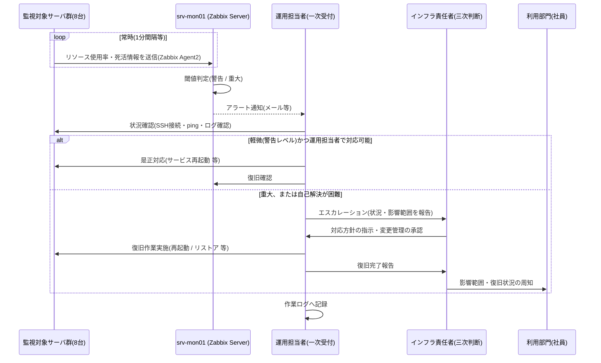
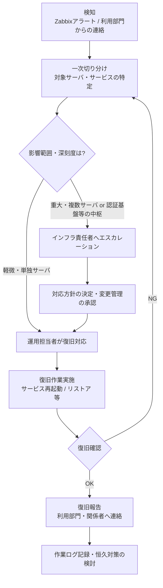

# 運用保守設計書

> **📘 学習ポイント**
>
> この文書は、システムを「構築して終わり」にしないための設計書です。サーバーは動き始めてからが本番であり、日々の監視・定期作業・障害対応・パッチ適用・バックアップからの復旧までを、誰が見ても同じ手順で実施できるように定めるのが運用保守設計書の役割です。実務では、この文書がそのまま運用マニュアルの土台になったり、面接で「構築して終わりではなく運用まで考えられる人材か」を見極める材料として読まれたりします。特に監視の閾値設計や障害対応フローは、経験の浅いエンジニアが評価者から必ず質問される部分なので、丸暗記ではなく「なぜその設計にしたか」まで説明できるようにしておくことが重要です。

## 改訂履歴

| 版数 | 日付 | 内容 | 作成者 |
|---|---|---|---|
| v0.1 | 2026-08-01 | 初版ドラフト作成(章立て・骨子のみ) | 〇〇 〇〇 |
| v1.0 | 2026-08-20 | 監視閾値表・障害対応フロー・リストア手順を精緻化し、確定版として発行 | 〇〇 〇〇 |

## 文書情報

| 項目 | 内容 |
|---|---|
| 文書番号 | DOC-11 |
| ファイル名 | `11_運用保守設計書.md` |
| 作成日 | 2026年8月1日 |
| 最終改訂日 | 2026年8月20日 |
| バージョン | v1.0 |
| 作成者 | 〇〇 〇〇 |
| レビュー者 | (記入欄) |
| 対象案件 | 中堅卸売企業向け社内ITインフラ刷新プロジェクト(サーバー構築エンジニア ポートフォリオ用 基礎演習案件) |
| 発注者 | 株式会社サンプル物産 |
| 関連文書 | DOC-05 サーバ設計編 / DOC-06 セキュリティ設計編 / DOC-07 可用性バックアップ設計編 / DOC-08 詳細設計書_パラメータシート / DOC-10 テスト仕様書 / DOC-12 用語集 |

## 目次

1. 本書の目的と位置づけ
2. 運用体制
3. 定型作業(日次・週次・月次)
4. 監視項目と閾値
5. 障害対応フロー
6. ログ管理方針
7. パッチ適用方針
8. バックアップ・リストア運用
9. 変更管理・作業ログの運用
10. 関連文書・用語集
11. 付録A: ネットワークセグメント一覧(参考)

---

## 1. 本書の目的と位置づけ

本書は、DOC-05(サーバ設計編)・DOC-06(セキュリティ設計編)・DOC-07(可用性バックアップ設計編)で設計したシステムを、実際にサービスインした後どのように「運用」し「保守」していくかを定める文書である。設計・構築フェーズの成果物がDOC-01〜DOC-10であるのに対し、本書はその後の日常運用フェーズを対象とする点で性格が異なる。

対象範囲は以下のとおりである。

- 日常監視の体制と、障害検知から復旧・報告までの一連の流れ
- 日次・週次・月次の定型作業
- 監視項目としきい値(閾値。監視対象が正常か異常かを判断する基準となる数値。※用語集(12_用語集.md)参照)
- 障害発生時の対応フロー(検知〜切り分け〜エスカレーション(自分の権限や対応範囲を超える問題を、より上位の担当者・責任者に引き継ぐこと。※用語集(12_用語集.md)参照)〜復旧〜報告)
- ログの保管方針、OSパッチの適用方針
- バックアップからのリストア(復元)手順
- 変更管理・作業記録の運用ルール

> **💡 なぜこう設計するのか**
>
> 設計書や構築手順書はプロジェクト完了時点で「作って終わり」になりがちですが、実際のシステムは稼働してからのほうが期間がずっと長く続きます。採用面接でも「構築はできても、その後の運用まで考えられているか」は重要な評価ポイントになります。この文書を用意しておくことで、単発の構築作業だけでなく、継続的にシステムを安定稼働させる視点を持っていることを示せます。

---

## 2. 運用体制

### 2.1 体制と役割分担

株式会社サンプル物産は従業員60名規模の企業であり、大規模な情報システム部門を持つことは想定していない。そのため、24時間365日のオペレーションセンターのような体制ではなく、限られた人員で現実的に回せる体制を設計する。

| 役割 | 想定される担当 | 主な責務 | 対応時間帯の目安 |
|---|---|---|---|
| 利用部門(社員) | サンプル物産 各部門社員 | 不具合・異常に気づいた際の一次連絡(通報) | 主稼働時間(平日9:00〜19:00) |
| 運用担当者(一次受付・二次対応) | インフラ運用担当者(本演習ではポートフォリオ作成者が担う役割) | Zabbixアラートの受信、一次切り分け、軽微な障害の復旧対応、定型作業の実施 | 主稼働時間中心。重大アラートは夜間・休日もメール等で受信し、翌営業日または即時に確認 |
| インフラ責任者(三次対応・意思決定) | 情報システム責任者(社内 or 委託先リーダー) | 重大障害時の対応方針決定、変更管理の承認、対外報告の可否判断 | 必要時随時 |
| 発注者側情シス窓口 | 株式会社サンプル物産 情報システム担当 | 業務影響の最終確認、利用部門への周知、経営層への報告要否判断 | 主稼働時間 |

> **💡 なぜこう設計するのか**
>
> 障害対応をすべて一人がその場の判断で行ってしまうと、対応の抜け漏れや、権限を超えた判断による二次被害のリスクが高まります。そこで「気づいて連絡する人」「まず切り分ける人」「重大時に方針を決める人」を役割として分けておきます。これにより、担当者が不在でも役割単位で引き継ぎができ、対応スピードと責任範囲の明確さを両立できます。またRTO(目標復旧時間。障害発生からサービス復旧までに許容される時間。※用語集(12_用語集.md)参照)は4時間と定義していますが、これは24時間体制を前提にしなくても、主稼働時間帯(平日9:00〜19:00)を基準に設計すれば、60名規模の企業として現実的に達成可能な水準になります。

### 2.2 監視〜障害対応の基本フロー

日常監視から障害対応までの流れを、監視対象サーバ群・監視サーバ(srv-mon01)・運用担当者・インフラ責任者・利用部門の間でのやり取りとして示す。



> **💡 なぜこう設計するのか**
>
> 監視は「異常を検知して終わり」ではなく、検知したあとに誰が何を判断し、誰に伝えるかまでが一連の流れとして設計されている必要があります。この図のように役割ごとの矢印で描いておくと、「アラートは来たが誰も見ていなかった」「対応したが記録が残っていない」といった運用上のありがちな抜け漏れを事前に防ぐことができます。

### 2.3 運用対象システム一覧

本設計の監視・運用対象は、以下のサーバ一覧(マスター仕様と同一)のとおりである。値はDOC-03〜DOC-08と完全に一致させており、本書内で独自に変更することはない。

| No | ホスト名 | 役割 | 設置セグメント | IPアドレス | OS | 主要ミドルウェア | スペック(vCPU/メモリ/ディスク) |
|---|---|---|---|---|---|---|---|
| 1 | gw-fw01 | ゲートウェイ/ファイアウォール(セグメント間ルーティング・NAT) | 全セグメントに接続(マルチホーム) | 各セグメントの.1 | AlmaLinux 9.4 | firewalld, nftables | 2vCPU/2GBメモリ/20GBディスク |
| 2 | mgmt-pc01 | 管理端末(踏み台サーバ) | 管理LAN | 192.168.10.11 | AlmaLinux 9.4 | OpenSSH | 2vCPU/2GBメモリ/20GBディスク |
| 3 | srv-dns01 | DNS/DHCPサーバ(社内NTPサーバも兼務) | サーバLAN | 192.168.20.11 | AlmaLinux 9.4 | BIND 9.18, Kea DHCP 2.4, chrony | 2vCPU/2GBメモリ/20GBディスク |
| 4 | srv-ldap01 | 認証統合サーバ | サーバLAN | 192.168.20.12 | AlmaLinux 9.4 | OpenLDAP 2.6 | 2vCPU/4GBメモリ/30GBディスク |
| 5 | srv-web01 | 社内業務ポータルWebサーバ | サーバLAN | 192.168.20.13 | AlmaLinux 9.4 | Apache HTTP Server 2.4, PHP 8.2 | 2vCPU/4GBメモリ/40GBディスク |
| 6 | srv-db01 | データベースサーバ | サーバLAN | 192.168.20.14 | AlmaLinux 9.4 | MariaDB 10.11 | 4vCPU/8GBメモリ/60GBディスク |
| 7 | srv-file01 | ファイル共有サーバ | サーバLAN | 192.168.20.15 | AlmaLinux 9.4 | Samba 4.19(LDAP連携認証) | 4vCPU/8GBメモリ/200GBディスク |
| 8 | srv-mon01 | 監視サーバ | サーバLAN | 192.168.20.16 | AlmaLinux 9.4 | Zabbix Server/Web 6.4, 各サーバにZabbix Agent2 | 2vCPU/4GBメモリ/50GBディスク |
| 9 | srv-bk01 | バックアップサーバ | サーバLAN | 192.168.20.17 | AlmaLinux 9.4 | rsync, cron | 2vCPU/4GBメモリ/500GBディスク(バックアップ保存用) |

全サーバ共通事項として、NTPはsrv-dns01(chrony)を参照し、タイムゾーンはAsia/Tokyo、DNS参照先はすべてsrv-dns01(192.168.20.11)である。SSHは公開鍵認証のみでrootログインは禁止しており、運用担当者はすべてmgmt-pc01を踏み台としてアクセスする(詳細はDOC-06セキュリティ設計編を参照)。

---

## 3. 定型作業(日次・週次・月次)

運用担当者が実施する定型作業を、頻度別に一覧化する。すべての作業結果は9章で定める作業ログに記録する。

### 3.1 日次作業

| 作業項目 | 対象 | 実施タイミング目安 | 担当 | 確認・対応ポイント |
|---|---|---|---|---|
| 監視ダッシュボード確認 | 全9台(Zabbix) | 始業時(9:00頃) | 運用担当者 | 前日夜間〜早朝のアラート有無、警告レベルの継続有無 |
| バックアップジョブ結果確認 | srv-bk01(file01/db01/ldap01分) | 始業時 | 運用担当者 | 23:00日次差分バックアップの成功可否、rsyncログのエラー有無(DOC-07参照) |
| 主要ログの確認 | srv-dns01, srv-ldap01, gw-fw01 等 | 始業時 | 運用担当者 | 認証失敗の急増、firewalldの拒否ログ急増など異常の兆候 |
| ディスク使用率トレンド確認 | srv-file01, srv-bk01, srv-db01 | 終業前 | 運用担当者 | 閾値(80%)接近の有無、増加ペースの急変有無 |

### 3.2 週次作業

| 作業項目 | 対象 | 実施タイミング目安 | 担当 | 確認・対応ポイント |
|---|---|---|---|---|
| 週次フルバックアップ結果確認 | srv-bk01 | 月曜始業時(日曜23:00分) | 運用担当者 | フルバックアップの完了、4世代保持の状況(DOC-07参照) |
| セキュリティ更新情報の事前確認 | 全9台 | 金曜 | 運用担当者 | `dnf check-update` で適用候補パッチを事前把握(適用自体は月次) |
| LDAPアカウント棚卸し | srv-ldap01 | 金曜 | 運用担当者 | 退職・異動者のアカウント無効化漏れがないか |
| 一時領域・不要ファイル確認 | 全9台 | 金曜 | 運用担当者 | `/tmp` 等の肥大化有無 |

### 3.3 月次作業

| 作業項目 | 対象 | 実施タイミング目安 | 担当 | 確認・対応ポイント |
|---|---|---|---|---|
| 定例パッチ適用(`dnf update`) | 全9台 | 第1月曜(夜間) | 運用担当者(承認: インフラ責任者) | 変更管理台帳への事前申請、適用後の主要サービス疎通確認 |
| 監視閾値・アラート履歴レビュー | srv-mon01 | 第1月曜以降 | インフラ責任者 | 誤検知(いわゆる「アラート疲れ」)の有無、閾値の妥当性 |
| リストアテスト(サンプリング) | srv-file01 / srv-db01 / srv-ldap01のいずれか | 第3週目安 | 運用担当者 | バックアップから実際に復元できるかの実地確認(8章参照) |
| 変更管理台帳・作業ログの棚卸し | 全体 | 月末 | インフラ責任者 | 記録漏れ・未クローズ案件の確認 |
| キャパシティ状況確認 | 全9台(特にsrv-file01, srv-bk01) | 月末 | インフラ責任者 | ディスク使用量の増加傾向、増設要否の判断材料化 |

> **💡 なぜこう設計するのか**
>
> 定型作業を「毎日なんとなくログを見る」ではなく、頻度・対象・確認ポイントまで表に落とし込んでおくと、担当者が変わっても同じ品質で運用を継続できます。特に月次の「リストアテスト」は見落とされがちですが、バックアップは取得できていることと、実際に戻せることは別物です。定期的に試すことで初めて「使えるバックアップ」だと言えます。

---

## 4. 監視項目と閾値

監視サーバsrv-mon01(Zabbix Server/Web 6.4)が、各サーバに導入したZabbix Agent2を通じてリソース使用率とサービスの死活監視(サーバやサービスが正常に動作しているかを一定間隔で確認する監視。※用語集(12_用語集.md)参照)を行う。監視項目・閾値の詳細な個別パラメータ(トリガー式等)はDOC-08 詳細設計書_パラメータシートで定義し、本書ではその設計方針としきい値の一覧を示す。

### 4.1 リソース監視(全9台共通)

| 監視項目 | 監視間隔目安 | 警告(Warning) | 重大(High) | 補足 |
|---|---|---|---|---|
| CPU使用率 | 1分 | 80%以上(5分平均) | 90%以上(5分平均) | 継続的な高負荷はプロセス単位での原因特定が必要 |
| メモリ使用率 | 1分 | 80%以上 | 90%以上 | スワップ発生の有無も併せて確認 |
| ディスク使用率(`/`、`/var` 等) | 5分 | 80%以上 | 90%以上 | srv-file01・srv-bk01は増加ペースが速いため週次でも傾向確認を行う |
| ICMP死活(ping応答) | 1分 | ー | 3回連続で応答なしの場合に重大 | サーバ単位のネットワーク到達性そのものの異常 |

### 4.2 サービス死活監視(ホスト別・主要サービス)

| No | ホスト名 | 監視対象サービス | 停止時の重大度 | 停止時の主な影響 |
|---|---|---|---|---|
| 1 | gw-fw01 | firewalld | 致命的(Disaster) | セグメント間ルーティング・NATが遮断され全社に影響 |
| 2 | mgmt-pc01 | sshd | 警告(Warning) | 踏み台経由の運用作業ができなくなる |
| 3 | srv-dns01 | named, kea-dhcp4, chronyd | 致命的(Disaster) | 名前解決・DHCP払い出し・時刻同期が全社的に停止 |
| 4 | srv-ldap01 | slapd | 致命的(Disaster) | 認証基盤停止により全社員がログイン不可となる |
| 5 | srv-web01 | httpd, php-fpm | 重大(High) | 社内業務ポータルが利用不可 |
| 6 | srv-db01 | mariadb | 致命的(Disaster) | ポータルのデータ参照・更新が全面停止 |
| 7 | srv-file01 | smb, nmb | 重大(High) | 部門別ファイル共有が利用不可 |
| 8 | srv-mon01 | zabbix-server | 重大(High) | 監視そのものが機能停止するため早期検知が難しい(下記コラム参照) |
| 9 | srv-bk01 | crond(cronの実行デーモン。cronはLinuxで定期的にコマンドを自動実行するためのスケジューラ機能。※用語集(12_用語集.md)参照) | 警告(Warning) | 即時の業務影響は小さいがバックアップ取得が止まる |

> **💡 なぜこう設計するのか(2段階しきい値と「監視の死角」)**
>
> しきい値を80%と90%の2段階にしているのは、100%になってから初めて気づくのでは対応が後手に回るためです。80%で「そろそろ危ないので様子を見よう」という警告を出し、90%で「早急に対応が必要」という重大アラートに切り替えることで、計画的な対応ができます。逆にしきい値を厳しくしすぎると、誤検知が増えて担当者が本当に重要なアラートを見逃す「アラート疲れ」を招くため、運用しながら閾値を調整していくことも重要です。また、srv-mon01自体が停止すると監視の目そのものが失われる「監視の死角」が生まれます。この演習ではsrv-mon01の死活はサーバ一覧確認・利用部門からの申告など人手での気づきに頼る設計としていますが、本番運用では外部からの外形監視サービスの併用や、監視サーバ自体の冗長化が検討課題になる点を理解しておくとよいでしょう。

---

## 5. 障害対応フロー

### 5.1 対応ステップ

障害対応は「検知→切り分け→エスカレーション→復旧→報告」の順で進める。切り分けの結果、影響範囲や深刻度に応じてエスカレーションの要否を判断する。



### 5.2 重大度(深刻度)の判断基準

| 深刻度 | 目安 | 対応方針 |
|---|---|---|
| 警告(Warning) | 単一サーバのリソース閾値超過、非中枢サービスの一時的な不安定化 | 運用担当者が主稼働時間内に確認・対応。エスカレーション不要 |
| 重大(High) | 業務ポータル(srv-web01)や共有サーバ(srv-file01)など、特定部門・業務に影響するサービス停止 | 運用担当者が一次対応しつつ、状況をインフラ責任者へ報告 |
| 致命的(Disaster) | 認証基盤(srv-ldap01)、DNS/DHCP(srv-dns01)、DB(srv-db01)、ゲートウェイ(gw-fw01)など全社的な中枢機能の停止 | 直ちにインフラ責任者へエスカレーションし、RTO4時間以内の復旧を最優先で対応 |

> **💡 なぜこう設計するのか**
>
> すべての障害を同じ重さで扱ってしまうと、本当に緊急対応が必要な障害への対応が遅れてしまいます。逆に何でもエスカレーションしていると、インフラ責任者の負荷が増え、判断のスピードも落ちてしまいます。そこで「どのサーバが止まると全社に影響するか」をあらかじめサーバ一覧・ネットワーク設計(DOC-04・DOC-05)から整理し、深刻度の判断基準として明文化しておくことで、誰が対応しても同じ基準でエスカレーション判断ができるようにしています。

---

## 6. ログ管理方針

### 6.1 ログローテーション方針

各サーバのログは、`logrotate` によって自動的にローテーション(ログファイルが際限なく肥大化しないよう、一定サイズや期間で自動的に切り替え・世代管理・削除する仕組み。※用語集(12_用語集.md)参照)する。ログの種類ごとに保持期間を分けており、セキュリティ監査や障害調査に必要なログは長めに、通常運用ログはディスク容量とのバランスを見て短めに設定する。

| ログ種別 | 対象ホスト/ファイル例 | ローテーション周期 | 保持期間の目安 | 圧縮 | 用途・備考 |
|---|---|---|---|---|---|
| OS標準ログ(`/var/log/messages`, `secure` 等) | 全9台 | 日次(daily) | 14日分 | 3世代目以降gzip圧縮 | logrotateの標準的な設定に準拠 |
| 認証ログ(SSHログイン記録等) | 全9台(特にgw-fw01, mgmt-pc01) | 日次 | 90日分 | あり | 不正アクセス調査・セキュリティ監査のため長期保持 |
| Webアクセス/エラーログ | srv-web01(Apache) | 日次 | 30日分 | あり | 障害調査およびアクセス傾向の確認に利用 |
| DBログ(スロークエリ等) | srv-db01(MariaDB) | 週次 | 8週間分 | あり | 性能調査用途。平常時のログレベルは最小限に設定 |
| ファイル共有ログ | srv-file01(Samba) | 日次 | 30日分 | あり | アクセス権限トラブルの調査に使用 |
| 監視サーバログ | srv-mon01(Zabbix) | 日次 | 30日分 | あり | Zabbix自体の稼働証跡として保持 |
| firewalldログ | gw-fw01 | 日次 | 90日分 | あり | 不正通信の調査・監査証跡として長期保持(DOC-06参照) |
| バックアップジョブログ | srv-bk01(rsync実行ログ) | 日次 | 90日分 | あり | RPO達成状況のエビデンスとして保持(DOC-07参照) |

> **💡 なぜこう設計するのか**
>
> ログをすべて同じ期間で保持しようとすると、ディスクを圧迫するか、逆に調査に必要な期間分が残っていないかのどちらかになりがちです。「何のためにこのログを残すのか」という目的をログ種別ごとに考え、認証ログやファイアウォールログのようにセキュリティ調査で使うものは長めに、日々の動作確認にしか使わないものは短めに、とメリハリをつけて設計するのが実務での基本的な考え方です。

---

## 7. パッチ適用方針

OSパッチ(セキュリティ更新等)の適用は、毎月第1月曜を定例日として全9台に対して実施する。

| 項目 | 内容 |
|---|---|
| 適用頻度 | 月次定例(毎月第1月曜) |
| 適用対象 | 全9台(gw-fw01を含む) |
| 適用コマンド | `dnf update`(AlmaLinux 9.4のパッケージ管理コマンド。ソフトウェアの導入・更新・削除を行う。※用語集(12_用語集.md)参照) |
| 事前承認 | 変更管理台帳への事前申請とインフラ責任者の承認が必要(9章参照) |
| 緊急時の例外 | ゼロデイ脆弱性等、月次定例を待てない重大なセキュリティ更新は随時適用とし、事後に変更管理台帳へ記録する |

適用作業の流れの例を示す。

```bash
# 1. 事前確認(何が更新されるかを一覧化するのみで、まだ適用しない)
sudo dnf check-update

# 2. 変更管理台帳での承認後、本適用を実施
sudo dnf update -y

# 3. カーネル更新が含まれていた場合は再起動要否を確認する
sudo needs-restarting -r

# 4. 再起動が必要な場合のみ実施
sudo reboot
```

適用順序は依存関係の少ないサーバから段階的に進め、1台ずつ疎通確認を行いながら次のサーバへ進める。特に認証基盤(srv-ldap01)とデータベース(srv-db01)は影響範囲が大きいため、他のサーバでの適用結果を確認したうえで慎重に実施する。適用後の疎通確認は、DOC-10テスト仕様書の死活確認相当の項目を用いて簡易的に再実施する。

> **💡 なぜこう設計するのか**
>
> パッチ適用を「気づいたときに気まぐれに」実施すると、社員への周知が行き届かず業務中に予期せぬ再起動が発生したり、逆に適用自体が後回しになり脆弱性が放置されたりします。「第1月曜」と固定の定例にしておくことで、利用部門への事前周知がしやすくなり、変更管理の承認フローとも組み合わせやすくなります。一方で、頻度を上げすぎると検証負荷や調整コストが増えるため、通常時は月次、緊急時のみ随時対応という2段構えにするのが現実的なバランスです。
>
> なお本演習ではVirtualBox上に9台の仮想マシンをまとめて構築しているため、全VMを同時に再起動すると学習用PC1台への負荷が大きくなります。1台ずつ順番に適用する運用は、この学習環境における現実的な工夫でもあります。本番想定である物理サーバ2台+VMware ESXi環境では、パッチ適用前にESXiのスナップショット機能(仮想マシンのある時点の状態を丸ごと保存し、必要な時にその時点へ戻せる機能。※用語集(12_用語集.md)参照)で状態を保存しておき、万一問題が発生した場合に直前の状態へ戻せるようにする運用が一般的である。学習環境でも同様にVirtualBoxのスナップショット機能を作業直前に取得しておくことを推奨する。

---

## 8. バックアップ・リストア運用

### 8.1 バックアップ運用の要点(DOC-07との対応)

バックアップの設計自体はDOC-07 可用性バックアップ設計編で定義しており、本書ではその運用面(日々の確認、および実際の復旧手順)を扱う。要点を以下に再掲する。

| 項目 | 内容 |
|---|---|
| RPO(目標復旧時点。障害発生時に「どの時点のデータまで復旧できればよいか」を示す指標。※用語集(12_用語集.md)参照) | 24時間 |
| RTO(目標復旧時間。障害発生からサービス復旧までに許容される時間。※用語集(12_用語集.md)参照) | 4時間 |
| バックアップ対象 | srv-file01(共有データ)、srv-db01(DBダンプ)、srv-ldap01(LDAPデータ) |
| バックアップ先 | srv-bk01(192.168.20.17、500GBディスク) |
| バックアップ方式 | rsync(差分/フル転送を行うコマンド。※用語集(12_用語集.md)参照)による日次差分(23:00)+週次フル(日曜23:00) |
| 保持世代(世代管理。バックアップを「何世代前まで残すか」管理する考え方。※用語集(12_用語集.md)参照) | 4世代 |

### 8.2 リストア手順

障害発生時は、対象データごとに以下の手順でリストア(復元)を行う。いずれの手順も**必ずインフラ責任者への状況報告・承認を経てから本番影響のある操作を実施する**(5章の障害対応フロー、9章の変更管理を参照)。

#### (1) 共有データ(srv-file01)のリストア

| 手順 | 内容 |
|---|---|
| ① 世代特定 | srv-bk01上のバックアップ世代(日次差分または週次フル)から、復旧目的の時点に最も近い世代を特定する |
| ② 対象範囲確定 | 全体復旧か、特定フォルダ・ファイルのみの部分復旧かを利用部門・インフラ責任者と確認する |
| ③ 事前確認(dry-run) | 実際に書き戻す前に `--dry-run` オプションで差分内容を確認する |
| ④ リストア実行 | srv-bk01からsrv-file01へrsyncで書き戻す |
| ⑤ 権限確認 | Sambaサービスを再起動し、部門別アクセス制御(ACL。アクセス制御リスト。誰が何をできるかを細かく設定する仕組み。※用語集(12_用語集.md)参照)が正しく反映されているか確認する |
| ⑥ 動作確認・報告 | 共有フォルダへのアクセスとLDAP認証連携を確認し、利用部門・インフラ責任者へ復旧を報告する |

```bash
# ③ 事前確認(書き換え内容の確認のみ。実際には反映しない)
sudo rsync -avh --dry-run /backup/srv-file01/<復旧対象日>/ /srv/samba/

# ④ リストア実行(内容確認後に実施)
sudo rsync -avh /backup/srv-file01/<復旧対象日>/ /srv/samba/

# ⑤ サービス再起動と権限確認
sudo systemctl restart smb nmb
sudo getfacl /srv/samba/<対象部門フォルダ>
```

#### (2) データベース(srv-db01)のリストア

| 手順 | 内容 |
|---|---|
| ① 世代特定 | srv-bk01に保管されたmysqldump(MariaDB/MySQLのデータをSQL文形式で書き出す=バックアップするコマンド。※用語集(12_用語集.md)参照)のダンプファイルから復旧対象世代を特定する |
| ② 退避 | 必要に応じて現行データベースを別名で退避しておく(誤操作時の切り戻し用) |
| ③ サービス確認 | MariaDBサービスの状態を確認し、影響範囲(対象DB・テーブル)を確定する |
| ④ リストア実行 | ダンプファイルからデータベースを復元する |
| ⑤ 整合性確認 | テーブル件数や主要データの整合性を確認する |
| ⑥ 動作確認・報告 | srv-web01(業務ポータル)からの接続・表示を確認し、復旧を報告する |

```bash
# ① バックアップファイルの確認
ls -la /backup/srv-db01/<復旧対象日>/

# ④ リストア実行
mysql -u root -p < /backup/srv-db01/<復旧対象日>/dump.sql

# ⑤ 整合性確認の例(件数確認)
mysql -u root -p -e "SELECT COUNT(*) FROM <対象データベース>.<対象テーブル>;"
```

#### (3) LDAPデータ(srv-ldap01)のリストア

| 手順 | 内容 |
|---|---|
| ① 世代特定 | srv-bk01に保管されたslapcat(OpenLDAPのディレクトリデータをエクスポートするコマンド。※用語集(12_用語集.md)参照)によるエクスポートファイルから復旧対象世代を特定する |
| ② サービス停止 | slapdサービスを停止する(認証基盤のため、社内周知を行ったうえで実施) |
| ③ データ初期化・投入 | 既存データベースファイルを退避し、slapaddでバックアップデータを投入する |
| ④ 権限調整 | データベースファイルの所有者・パーミッションを適切に設定する |
| ⑤ サービス起動・疎通確認 | slapdを起動し、ldapsearchで検索できることを確認する |
| ⑥ 依存サービス確認・報告 | srv-file01(Samba認証)、srv-web01(ポータルログイン)からの認証が正常に行えることを確認し、復旧を報告する |

```bash
# ② サービス停止
sudo systemctl stop slapd

# ③ データ投入
sudo slapadd -l /backup/srv-ldap01/<復旧対象日>/export.ldif

# ④ 権限調整
sudo chown -R ldap:ldap /var/lib/ldap

# ⑤ サービス起動・疎通確認
sudo systemctl start slapd
ldapsearch -x -H ldap://192.168.20.12 -b "dc=sample-trading,dc=local"
```

> **💡 なぜこう設計するのか**
>
> バックアップは「取得できていること」と「実際に戻せること」がイコールではありません。取得ジョブが成功していても、リストア手順が整備されていなければ、いざという時に復旧できない可能性があります。だからこそ8章のように対象ごとに具体的なコマンドレベルで手順化しておき、月次の定型作業(3.3節)でリストアテストをサンプリング実施することが重要になります。また、共有データ・DB・LDAPの3つはそれぞれ性質が異なる(ファイルのコピー、SQLの再投入、ディレクトリデータの再構築)ため、リストア手順も個別に用意しておく必要があります。

---

## 9. 変更管理・作業ログの運用

システムに影響を与える作業(パッチ適用、ミドルウェア設定変更、ファイアウォールルール変更、リストア対応など)は、事前申請・承認・記録のプロセスに沿って管理する「変更管理」の対象とする。一方、日次の監視確認のような定型的で影響の小さい作業は、変更管理台帳への事前申請は不要とし、実施結果のみを作業ログに記録する。

### 9.1 変更管理台帳(様式例)

| 変更No | 申請日 | 申請者 | 変更内容 | 対象サーバ | 影響範囲 | 実施予定日時 | 承認者 | 実施結果 | 切り戻し手順の要否 |
|---|---|---|---|---|---|---|---|---|---|
| CHG-2026-0801 | 2026-08-03 | 運用担当者 | 月次定例パッチ適用 | 全9台 | 主稼働時間外のため業務影響小 | 2026-08-04 夜間 | インフラ責任者 | 成功 | 要(スナップショット取得済) |

### 9.2 作業ログ(様式例)

| 実施日 | 開始時刻 | 終了時刻 | 実施者 | 実施内容 | 結果 | 関連変更No | 備考 |
|---|---|---|---|---|---|---|---|
| 2026-08-04 | 21:00 | 22:15 | 運用担当者 | 全9台へ`dnf update`適用、再起動要否確認 | 成功(全台正常起動・サービス疎通確認済) | CHG-2026-0801 | 特記事項なし |

> **💡 なぜこう設計するのか**
>
> 口頭やチャットの会話だけで作業を進めてしまうと、「誰が」「いつ」「何を」変更したのかが後から追えなくなり、障害発生時の原因切り分けが難航します。変更管理台帳は「事前に何をする予定か」を残す記録、作業ログは「実際に何をしたか」を残す記録という役割分担になっており、この2つを揃えておくことで、属人化を防ぎ、監査対応やトラブルシューティングの起点として機能させることができます。すべての作業に重厚な申請フローを課すと現場が回らなくなるため、影響度に応じて「変更管理が必要な作業」と「作業ログのみで足りる作業」を切り分けている点も、実務における現実的な工夫です。

---

## 10. 関連文書・用語集

本書は単独では完結せず、以下の文書とあわせて参照することを前提とする。

| 文書番号 | 文書名 | 本書との関係 |
|---|---|---|
| DOC-04 | 04_基本設計書_ネットワーク設計編 | 障害対応時のセグメント・経路確認に利用 |
| DOC-05 | 05_基本設計書_サーバ設計編 | サーバ一覧・役割の一次情報源 |
| DOC-06 | 06_基本設計書_セキュリティ設計編 | SSHアクセス方針、firewalldルールとログ監査の前提 |
| DOC-07 | 07_基本設計書_可用性バックアップ設計編 | バックアップ方式・RPO/RTOの一次情報源(本書8章はこれを運用面から補足) |
| DOC-08 | 08_詳細設計書_パラメータシート | Zabbix監視トリガー、logrotate設定等の個別パラメータ |
| DOC-10 | 10_テスト仕様書 | パッチ適用後・リストア後の疎通確認に活用するテスト項目 |
| DOC-12 | 12_用語集 | 本書中の専門用語の定義一覧 |
| DOC-13 | 13_学習ガイド | 本書を学習素材として読む際の補助ガイド |

本書内で初出の専門用語(RPO/RTO、閾値、ログローテーション、世代管理、cron、rsync、dnf、スナップショット、mysqldump、slapcat/slapadd、ACL、エスカレーション、死活監視 等)は、初出箇所に簡潔な説明を括弧書きで付し、詳細はDOC-12 用語集(12_用語集.md)を参照する形とした。

---

## 付録A: ネットワークセグメント一覧(参考)

障害対応時に切り分けの参考とするため、ネットワークセグメント設計(マスター仕様と同一。詳細はDOC-04を参照)を再掲する。

| セグメント名 | VLAN ID | CIDR | 用途 | GW(ゲートウェイ)IP |
|---|---|---|---|---|
| WAN | - | 203.0.113.0/24(例示用アドレス。RFC5737 TEST-NET-3で定められた、実在のネットワークには割り当てられない安全な文書用の例示アドレス。演習ではインターネット接続を疑似的に表現している) | インターネット接続用(演習では疑似) | 203.0.113.1(ISP側) |
| 管理LAN | VLAN10 | 192.168.10.0/24 | サーバ管理・SSH踏み台用 | 192.168.10.1 |
| サーバLAN | VLAN20 | 192.168.20.0/24 | 各種業務サーバ設置用 | 192.168.20.1 |
| 内部LAN | VLAN30 | 192.168.30.0/24 | 社員PC・クライアント端末用 | 192.168.30.1 |
| DMZ | VLAN40 | 192.168.40.0/24 | 将来の外部公開用(本演習では未使用領域として設計のみ) | 192.168.40.1 |

以上
