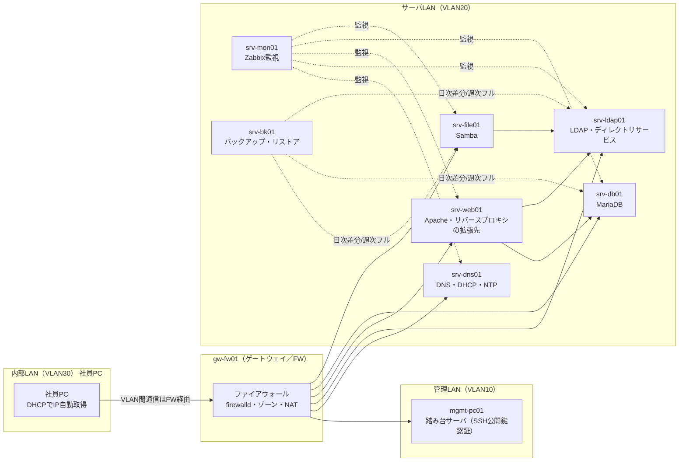

# DOC-12 用語集

> ### 📘 学習ポイント
>
> この用語集は、DOC-01〜DOC-11およびDOC-13に登場する専門用語を一箇所にまとめた「辞書」です。現場の設計書では、初出の専門用語にいちいち長い説明を書くと本文が読みにくくなるため、詳しい説明は用語集に切り出し、本文からは「（※用語集(12_用語集.md)参照）」という形で参照するのが一般的なやり方です。学習者の方は、他の設計書を読んでいて分からない言葉が出てきたら、まずこの文書に戻ってきて確認してください。採用担当者・面接官の方には、応募者が用語を「暗記」ではなく「なぜそれが必要か」まで理解して使い分けていることが伝わる構成にしています。

## 改訂履歴

| 版数 | 日付 | 内容 | 作成者 |
|---|---|---|---|
| v0.1 | 2026-08-01 | 初版ドラフト作成。プロジェクトで使用する用語を洗い出し | 〇〇 〇〇 |
| v1.0 | 2026-08-20 | 全13文書との用語・数値整合を確認し、解説文とたとえ話を追加のうえ確定 | 〇〇 〇〇 |

## 文書情報

| 項目 | 内容 |
|---|---|
| 文書番号 | DOC-12 |
| 文書名 | 用語集（12_用語集.md） |
| 対象プロジェクト | 中堅卸売企業向け社内ITインフラ刷新プロジェクト（株式会社サンプル物産） |
| 作成日 | 2026年8月1日 |
| 最終改訂日 | 2026年8月20日 |
| バージョン | v1.0 |
| 作成者 | 〇〇 〇〇 |
| レビュー者 | （レビュー者名を記入） |
| 関連文書 | DOC-01〜DOC-11、DOC-13（全文書から参照される共通用語集） |

---

## 第1章 本書の目的と使い方

### 1.1 目的

本書は、本プロジェクトの設計書一式（DOC-01〜DOC-13）に登場するIT専門用語・ネットワーク用語・サーバ/OS用語・セキュリティ用語・可用性/バックアップ用語を1つの文書に集約し、初心者でも自力で読み解けるようにすることを目的とする。各用語には、可能な限り「身近な例え話」を添え、丸暗記ではなく仕組みのイメージで理解できるよう配慮した。

### 1.2 掲載方針・並び順

用語は表記の種類に応じて次の2部構成とする。

- **第2章**: 英字・アルファベット表記の用語（VLAN、DNS、firewalldなど）を、アルファベット順に掲載する。
- **第3章**: 日本語表記の用語（サブネットマスク、冗長化など）を、五十音順に掲載する。

この2部構成は、JIS規格の用語集など実務の技術文書でもよく使われる整理方法である。英字略語と日本語の単語を1つの辞書順に無理やり並べると探しにくくなるため、表記の種類で分けたうえでそれぞれを機械的に並べる方が、読み手にとって「探しやすい」用語集になる。

### 1.3 表の見方

各用語の表は次の4列で構成する。

| 列名 | 内容 |
|---|---|
| 用語 | 見出しとなる用語（略語の場合は正式名称も併記） |
| 分類 | ネットワーク／サーバ・OS／セキュリティ／ミドルウェア／可用性・バックアップ／一般 のいずれか |
| 解説 | 初心者向けの平易な解説（1〜3行）。可能な限り本プロジェクトでの具体的な使われ方や身近な例えを含む |
| 関連文書 | この用語を詳しく扱っている本プロジェクトの設計書番号 |

> 💡 **なぜこう設計するのか**
> 用語集にわざわざ「関連文書」列を用意しているのは、実務の設計書でも「この言葉、どこに詳しく書いてあるんだっけ？」と探し回ることが非常に多いからです。用語の意味だけを知っても、実際の設計判断の背景（なぜその値にしたか）までは分かりません。意味を知ったら、必ず関連文書に戻って「この案件ではどう使われているか」まで確認する習慣をつけると、面接で用語の意味を聞かれたときにも、案件の文脈込みで説明できるようになります。

---

## 第2章 英数字・略語用語（アルファベット順）

| 用語 | 分類 | 解説 | 関連文書 |
|---|---|---|---|
| Apache（Apache HTTP Server） | ミドルウェア | 世界中で広く使われているオープンソースのWebサーバソフトウェア。ブラウザからのリクエストを受け取り、Webページ（HTMLやPHPで作られた画面）を返す役割を持つ。本プロジェクトではsrv-web01にApache HTTP Server 2.4とPHP 8.2を導入し、社内業務ポータルを稼働させる。例えるなら「注文を受けて料理を出す店員」のような窓口役である。 | DOC-05 |
| chrony／NTP | サーバ・OS | NTP（Network Time Protocol）はネットワーク経由でコンピュータ同士の時刻を正確に合わせるための通信規約であり、chronyはそれを実現するLinux用ソフトウェアである。本プロジェクトではsrv-dns01がchronyによる社内NTPサーバを兼務し、全サーバがここを時刻の基準として参照する（タイムゾーンはAsia/Tokyo）。時刻がずれると、ログの前後関係が分からなくなったり、認証エラーの原因になったりするため、地味だが重要な仕組みである。 | DOC-05、DOC-08 |
| CIDR（Classless Inter-Domain Routing） | ネットワーク | IPアドレスの範囲を「IPアドレス／プレフィックス長」という形式（例: 192.168.20.0/24）で簡潔に表す記法。「/24」は「先頭24ビットがネットワーク部である」ことを意味し、これはサブネットマスク255.255.255.0と同じ内容を短く表記したものである。 | DOC-04 |
| DHCP（Dynamic Host Configuration Protocol） | ネットワーク | PCなどの端末が起動時にIPアドレスなどのネットワーク設定を自動的に受け取るための仕組み。本プロジェクトでは内部LAN（VLAN30）の社員PC向けに、srv-dns01が兼務するKea DHCPサーバが192.168.30.100〜192.168.30.200の範囲を動的に払い出す。ホテルのチェックイン時に部屋番号を割り当ててもらうイメージに近い。 | DOC-04、DOC-05 |
| dnf | サーバ・OS | AlmaLinuxなどRed Hat系Linuxで使われるパッケージ管理コマンド。ソフトウェアのインストール・更新・削除をまとめて行う。本プロジェクトでは`dnf update`によるセキュリティパッチ適用を月次定例（第1月曜）で実施する運用としている。 | DOC-06、DOC-11 |
| DNS（Domain Name System） | ネットワーク | 「srv-web01.sample-trading.local」のような人間が読みやすい名前（ホスト名／FQDN）と、コンピュータが通信に使うIPアドレス（例: 192.168.20.13）を相互に変換する仕組み。本プロジェクトではsrv-dns01が全サーバ・全社員PCのDNSサーバとなる。電話帳で「名前」から「電話番号」を調べる仕組みに近い。 | DOC-04、DOC-05 |
| firewalld | セキュリティ | Linux（AlmaLinuxなど）で標準的に使われるファイアウォール管理サービス。内部的にはnftables（パケットフィルタリングの実行エンジン）を制御し、「ゾーン」という単位で通信ルールをまとめて管理できる。本プロジェクトでは全サーバでfirewalldにより必要最小限のポートのみを開放する（ゾーン間の許可・拒否の詳細はDOC-06で定義）。 | DOC-06 |
| FQDN（Fully Qualified Domain Name、完全修飾ドメイン名） | ネットワーク | ホスト名からドメインの最上位までを省略せずにすべて含めた名前。本プロジェクトの命名規則では「srv-〈役割略称〉01.sample-trading.local」の形式（管理端末のみmgmt-pc01.sample-trading.local）で統一している。姓と名をフルネームで名乗るようなものと考えるとイメージしやすい。 | DOC-04 |
| IPアドレス | ネットワーク | ネットワーク上の機器を識別するための番号。本プロジェクトでは「192.168.20.14」のようなプライベートIPアドレス（社内だけで通用する住所）を使用する。郵便物を届けるための「住所」に相当する。 | DOC-04、DOC-05 |
| LDAP（Lightweight Directory Access Protocol） | セキュリティ | ユーザーアカウントや組織情報などをまとめて管理する「ディレクトリサービス」にアクセスするための通信プロトコル。本プロジェクトではsrv-ldap01（OpenLDAP 2.6）が全社員のアカウント情報を一元管理し、srv-file01（ファイル共有）などがこれを参照してログイン認証を行う。各PCにバラバラにアカウントを作る現状の課題を解消するための中心的な仕組みである。 | DOC-05、DOC-06 |
| MariaDB | ミドルウェア | MySQL互換のオープンソースリレーショナルデータベース管理システム（RDBMS）。表形式でデータを保存・検索するためのソフトウェアである。本プロジェクトではsrv-db01にMariaDB 10.11を導入し、社内業務ポータルが扱うデータを保存する。 | DOC-05 |
| NAT（Network Address Translation） | ネットワーク | 社内だけで使うプライベートIPアドレスを、インターネット上で使うグローバルIPアドレスに変換する技術。本プロジェクトではgw-fw01がこの変換を担い、内部LANの端末が直接インターネット側から見えないようにする（演習ではインターネット接続は疑似的な扱い）。マンションの各部屋番号（内線）を、外線にかけるときは代表番号に変換するイメージに近い。 | DOC-04、DOC-06 |
| OpenLDAP | ミドルウェア | LDAPプロトコルを実装したオープンソースのディレクトリサービスソフトウェア。本プロジェクトではsrv-ldap01に導入し、社員アカウントの統合管理基盤として利用する。 | DOC-05、DOC-06 |
| RAID（Redundant Array of Independent Disks） | サーバ・OS | 複数台のディスクを組み合わせて構成する技術の総称で、1台が故障してもデータが失われないようにする「耐障害性」の向上や、読み書き速度の向上を目的とする。本演習の学習環境（VirtualBoxの仮想ディスク1本）では直接は構成しないが、本番想定の物理サーバでは、ディスク故障による障害を防ぐために構成するのが一般的である。 | DOC-05、DOC-07 |
| RFC5737／例示アドレス | ネットワーク | RFC5737は、文書やマニュアルの中で「例」として安全に使えるよう予約されたIPアドレス範囲を定めた技術文書（RFC）である。192.0.2.0/24・198.51.100.0/24・203.0.113.0/24（TEST-NET-1〜3）の3ブロックが割り当てられており、これらは実在の組織に割り当てられることがないため、設計書のサンプルとして安心して使用できる。本プロジェクトのWANセグメントに使用している203.0.113.0/24は、このうちのTEST-NET-3である。 | DOC-04 |
| RPO（Recovery Point Objective、目標復旧時点） | 可用性・バックアップ | 障害が発生したときに「どの時点のデータまで復旧できればよいか」を示す指標。本プロジェクトではRPO＝24時間、すなわち最悪の場合でも前日分のデータまで復旧できればよいという目標にしている。「1日1回のセーブポイントまでは戻れるゲーム」に近いイメージである。 | DOC-07 |
| RTO（Recovery Time Objective、目標復旧時間） | 可用性・バックアップ | 障害の発生からシステムを復旧させるまでに許容される時間。本プロジェクトではRTO＝4時間と定義している。RPOが「どこまで戻すか」であるのに対し、RTOは「どれだけ早く戻すか」を表す指標である点に注意する。 | DOC-07 |
| Samba | ミドルウェア | Linuxサーバ上でWindowsのファイル共有プロトコル（SMB/CIFS）を実現するソフトウェア。本プロジェクトではsrv-file01にSamba 4.19を導入し、LDAP（srv-ldap01）と連携した認証付きファイル共有基盤を構築する。社員は普段のWindows PCの操作感のまま、部門別にアクセス権が制御された共有フォルダを利用できる。 | DOC-05 |
| SSH公開鍵認証 | セキュリティ | パスワードの代わりに「公開鍵」と「秘密鍵」という対になる鍵を使ってサーバへログインする認証方式。秘密鍵は本人だけが持ち、公開鍵はサーバ側に登録しておく。本プロジェクトでは全サーバでSSHのパスワード認証を禁止し、公開鍵認証のみを許可、かつrootでの直接ログインも禁止している。玄関の鍵を「合鍵（公開鍵）を渡した相手だけ」開けられるようにし、しかも「管理人（root）の直接出入りは禁止して、必ず名前を名乗ってから（sudoで）作業する」運用に近い。 | DOC-06、DOC-09 |
| sudo | セキュリティ | 一般ユーザーが一時的に管理者権限（root権限）で特定のコマンドを実行するための仕組み。本プロジェクトではrootへの直接ログインを禁止し、作業者は自分のユーザーアカウントでログインしたのちsudoで必要な操作のみ管理者権限に昇格する運用とする。「誰が」「いつ」管理者権限を使ったかが記録に残るため、rootで直接作業するより安全である。 | DOC-06 |
| systemd | サーバ・OS | Linuxにおいてサービス（Webサーバやデータベースなどの常駐プログラム）の起動・停止・自動再起動などを管理する仕組み。本プロジェクトの構築手順書では、Apacheやchronyなどのミドルウェアをsystemdのサービスとして起動・自動起動設定する。 | DOC-09、DOC-11 |
| VLAN（Virtual LAN） | ネットワーク | 1本の物理LANケーブルや1台のスイッチを、複数の独立したネットワークであるかのように論理的に分割する技術。本プロジェクトでは管理LAN（VLAN10）・サーバLAN（VLAN20）・内部LAN（VLAN30）・DMZ（VLAN40）の4つに分割している。1つのオフィスフロアをパーティションで区切って部署ごとの部屋に分けるイメージに近い。 | DOC-04 |
| VM（仮想マシン） | サーバ・OS | 「仮想化」技術によって1台の物理コンピュータの上に作られる、独立したコンピュータのように振る舞うソフトウェア上の実体。本プロジェクトの学習環境ではVirtualBox上に9台のVMを作成し、それぞれをgw-fw01やsrv-web01などのサーバとして動作させる。 | DOC-03 |
| Zabbix | ミドルウェア | サーバやネットワーク機器の稼働状況（生存確認、CPU・メモリ・ディスク使用率など）を監視するためのオープンソース監視ソフトウェア。本プロジェクトではsrv-mon01にZabbix Server/Web 6.4を導入し、他の全サーバにZabbix Agent2を配置して監視する。倒れたら誰かに気づいてもらえる「見守りサービス」のようなものである。 | DOC-05、DOC-07、DOC-11 |

> 💡 **なぜこう設計するのか**
> インフラの世界には英字の略語が非常に多く登場します。最初は覚えることが多く感じますが、多くの略語は正式名称（フルスペル）を直訳すると意味が分かるようになっています。例えばDHCPは「Dynamic（動的に）Host（端末に）Configuration（設定を）Protocol（渡す規約）」であり、名前の通りの機能です。丸暗記ではなく「フルスペル→直訳→本プロジェクトでの実例」の順に理解すると、初めて見る略語に出会ったときにも意味を推測しやすくなります。

---

## 第3章 日本語表記用語（五十音順）

| 用語 | 分類 | 解説 | 関連文書 |
|---|---|---|---|
| 仮想化 | サーバ・OS | 1台の物理的なコンピュータ（ハードウェア）の上に、複数の独立した仮想的なコンピュータ（VM／仮想マシン）を作り出す技術。本プロジェクトの学習環境では、自宅PC1台の上にVirtualBoxで9台のVMを構築し、本番を模擬する。本番想定では、物理サーバ2台の上にVMware ESXiというハイパーバイザーを導入し、同様に仮想化を行う。1つの土地（物理サーバ）の上に、複数のテナント（VM）が入居しているビルをイメージすると分かりやすい。 | DOC-03 |
| 可用性 | 可用性・バックアップ | システムが「使いたいときにきちんと使える」度合いのこと。可用性を高める手段には、後述の「冗長化」「バックアップ」「負荷分散」などがある。本プロジェクトでは、平日9:00〜19:00を主稼働時間とし、この時間帯にサーバが止まらないことを重視した設計とする（演習では常時稼働として扱う）。 | DOC-02、DOC-07 |
| サブネットマスク | ネットワーク | IPアドレスのうち「ネットワーク部（住所の町名にあたる部分）」と「ホスト部（住所の番地にあたる部分）」を区別するための値。例えば255.255.255.0（CIDR表記では/24）は「先頭24ビットまでがネットワークを表す」ことを示す。本プロジェクトの各セグメントはすべて/24（255.255.255.0）で設計されている。 | DOC-04 |
| 冗長化 | 可用性・バックアップ | システムを構成する部品の一部が故障しても、システム全体が止まらないように、あらかじめ予備を用意しておく設計の考え方。本プロジェクトでは学習用途・小規模構成のため機器の二重化までは行わないが、「バックアップによるデータの冗長化」（日次差分・週次フル、4世代保持）という形で考え方を取り入れている。自転車の補助輪のように、片方が転んでももう一方が支える仕組みだとイメージすると分かりやすい。 | DOC-07 |
| スワップ領域 | サーバ・OS | サーバの物理メモリ（RAM）が不足したときに、ディスクの一部を一時的にメモリの代わりとして使うために確保しておく領域。メモリより読み書きが遅いため、あくまで緊急避難用の領域である。本プロジェクトの各サーバでは、OSインストール時のパーティション設計の中でスワップ領域を確保する（詳細はDOC-08参照）。 | DOC-08 |
| ゾーン（ファイアウォール） | セキュリティ | firewalldにおいて、通信の信頼度に応じてネットワークインターフェースや通信ルールをグループ化する単位。「このインターフェースから来る通信は信頼できるので広く許可する」「このインターフェースは外部に近いので必要最小限しか許可しない」といった形で、ルールをまとめて管理できる。本プロジェクトの具体的なゾーン設計・許可ポートはDOC-06で定義する。 | DOC-06 |
| ディレクトリサービス | セキュリティ | 組織内のユーザー・グループ・コンピュータなどの情報を、階層構造でまとめて管理する仕組み。本プロジェクトではLDAP（OpenLDAP）を使ってこれを実現し、各PCでバラバラに管理されていたアカウントを、srv-ldap01への統合管理に置き換える。会社の「社員名簿」をシステム化したものだとイメージすると分かりやすい。 | DOC-05 |
| デフォルトゲートウェイ | ネットワーク | 自分の所属するセグメント（VLAN）の外にある宛先へ通信したいときに、最初の送り先となるルータのIPアドレス。本プロジェクトでは各セグメントの「.1」のアドレス（例: サーバLANなら192.168.20.1）がgw-fw01のインターフェースであり、これが各セグメントのデフォルトゲートウェイとなる。自分の町から他の町へ出かけるときにまず通る「町の出口」に相当する。 | DOC-04 |
| ハイパーバイザー | サーバ・OS | 「仮想化」を実現するための基盤ソフトウェア。1台の物理サーバのCPU・メモリ・ディスクなどのハードウェア資源を複数のVMに割り振る役割を持つ。学習環境ではVirtualBox 7.xを、本番想定ではVMware ESXiをハイパーバイザーとして使用する（対応関係の詳細はDOC-03参照）。 | DOC-03 |
| バックアップ（フル・差分・増分） | 可用性・バックアップ | 障害やデータ消失に備えて、データを別の場所にコピーして保存しておくこと。バックアップには主に3種類あり、フルバックアップは対象データすべてをコピーするもの、差分バックアップは前回のフルバックアップ以降に変更があった部分だけをコピーするもの、増分バックアップは前回のバックアップ（フルまたは増分）以降に変更があった部分だけをコピーするものである。本プロジェクトでは、srv-file01・srv-db01・srv-ldap01を対象に、日次差分（毎日23:00）＋週次フル（日曜23:00）を組み合わせ、srv-bk01へrsyncで4世代保持する方式を採用している。 | DOC-07 |
| パーティション | サーバ・OS | 1台のディスクを論理的に複数の区画に分割すること。OS領域とデータ領域を分けるなど、用途に応じて区画を分けることで、障害発生時の影響範囲を限定したり、管理をしやすくしたりする効果がある。本プロジェクトの各サーバのパーティション設計はDOC-08で定義する。 | DOC-08 |
| ファイアウォール | セキュリティ | ネットワークの出入り口で通信内容を監視し、あらかじめ許可された通信だけを通す仕組み。本プロジェクトではgw-fw01（nftables／firewalld）がセグメント間の通信を制御する門番の役割を担う。マンションの入口にいる管理人が、来訪者リストにある人だけを中に通すイメージに近い。 | DOC-04、DOC-06 |
| 負荷分散 | 可用性・バックアップ | 1台のサーバに処理が集中しないよう、複数のサーバに処理を分散させる仕組み。従業員60名規模の本プロジェクトでは、各サーバへのアクセス量が少ないため負荷分散の仕組みは導入していないが、利用者数やアクセス量が増えた場合に備えて、Webサーバなどを増設し「リバースプロキシ」経由で振り分ける、という将来の拡張方針として理解しておくとよい。レジが混雑してきたら別のレジを開けるイメージに近い。 | DOC-03 |
| 踏み台サーバ | セキュリティ | 社内の他サーバへSSHで直接アクセスさせず、いったん経由させることで、アクセス経路を一本化し、監査・管理をしやすくするための中継サーバ。本プロジェクトではmgmt-pc01（管理LAN、VLAN10）がこの役割を担い、作業者はまずmgmt-pc01にログインしたのち、そこからサーバLAN（VLAN20）の各サーバへSSH接続する。マンションの正面玄関を1つに絞り、管理人のいる受付を必ず通らせるイメージに近い。 | DOC-04、DOC-06、DOC-09 |
| ホスト名 | ネットワーク | ネットワーク上でコンピュータを識別するために付けられた名前。本プロジェクトでは「srv-〈役割略称〉01」（例: srv-web01、srv-db01）という命名規則で統一し、役割がひと目で分かるようにしている。人間でいう「名字＋名前」のうち、名前の部分に近い。 | DOC-04 |
| ポート番号 | ネットワーク | 1台のサーバの中で、どのサービス（アプリケーション）宛の通信かを区別するための番号。例えばSSHは22番、Webサーバ（HTTP）は80番といったように、サービスごとに使うポート番号が決まっていることが多い。本プロジェクトのファイアウォール設計では、サーバごとに必要最小限のポート番号のみを開放する（詳細はDOC-06・DOC-08参照）。マンションの「部屋番号」に相当し、IPアドレスという「住所」だけでは届かない、部屋（サービス）単位の宛先を表す。 | DOC-06、DOC-08 |
| リストア | 可用性・バックアップ | バックアップとして保存しておいたデータを使って、システムやデータを元の状態に戻すこと。バックアップは「取って終わり」ではなく、実際にリストアできて初めて意味を持つ。本プロジェクトでは、定期的なリストア訓練の考え方を運用保守設計書（DOC-11）で扱う。 | DOC-07、DOC-11 |
| リバースプロキシ | ネットワーク | クライアントからのリクエストをいったん受け取り、裏側にある1台または複数台のサーバへ振り分ける仕組み。外部からは裏側のサーバ構成が見えないため、セキュリティ向上や負荷分散の目的で使われることが多い。本プロジェクトの現行構成ではsrv-web01が直接リクエストを受ける単純な構成のため導入していないが、将来的にDMZ（VLAN40）を使って外部公開する際の拡張ポイントとして、システム構成編（DOC-03）で将来構想として触れている。 | DOC-03 |

> 💡 **なぜこう設計するのか**
> 「冗長化」「可用性」「バックアップ」「リストア」「RPO」「RTO」は、すべて1つのテーマ（＝止まらない・失わないシステムをどう作るか）でつながっている用語です。バラバラに覚えるのではなく、「①壊れにくくする（冗長化）→②壊れても失われないようにする（バックアップ）→③失われたら戻せるようにする（リストア）→④その目標値を数字で決める（RPO・RTO）」という一連の流れとしてつなげて理解すると、面接で「可用性設計で工夫した点は？」と聞かれたときにも、単語の説明ではなく設計の物語として答えられるようになります。

---

## 第4章 用語同士のつながり（全体像）

本章では、第2章・第3章で個別に解説した用語が、実際のネットワーク構成の中でどのように関係し合っているかを図で示す。個々の用語を「点」として覚えるのではなく、下図のような「線」でつながったイメージを持つことで理解が定着しやすくなる。

図の要点は次の3つである。

1. すべてのセグメント間通信は、必ずgw-fw01（ファイアウォール／デフォルトゲートウェイ）を経由する（VLANによるセグメント分割の効果）。
2. 認証系サービス（LDAP／ディレクトリサービス）を中心に、Webポータル・ファイル共有が「同じアカウントで」利用できるようにつながっている。
3. 監視（Zabbix）とバックアップ（rsync）は、通常業務の通信経路とは別に、すべての主要サーバへ横断的に関わる「縁の下」の仕組みである。

> 💡 **なぜこう設計するのか**
> 初心者のうちは、用語を1つずつ独立したものとして覚えがちです。しかし実際の設計では、「この用語は誰と誰をつなぐためのものか」「壊れたらどこに影響するか」という関係性の理解のほうが重要です。例えば「LDAP」を単体で覚えるより、「LDAPが止まると、srv-web01のログインもsrv-file01の共有フォルダアクセスもできなくなる」という影響範囲まで理解しているほうが、実務でもポートフォリオの説明でも説得力が増します。

---

## 第5章 学習の進め方（コラム）

このコラムでは、学習者の方向けに、本用語集の活用方法をご紹介します。

- まずは第2章・第3章の表をざっと眺めて、知っている言葉と知らない言葉を仕分けしてみてください。知らない言葉がゼロになることを目指す必要はありません。むしろ「知らない言葉に出会ったら、いつでもここに戻ってくればよい」という安心材料として使っていただくのが正しい使い方です。
- 面接対策としては、各用語の「解説」だけでなく「関連文書」列に書かれた設計書番号までセットで説明できると、単なる知識ではなく「案件の中でどう使ったか」を語れるようになり、評価されやすくなります。
- 実際の現場でも、プロジェクトが進むにつれて用語集は更新されていくものです。本プロジェクトでも、新しい設計要素が追加された際にはこの用語集にも追記していく、という運用を想定しています（詳細な改訂ルールはDOC-11 運用保守設計書を参照）。

---

## 関連文書一覧

| 文書番号 | ファイル名 | 文書名 |
|---|---|---|
| DOC-01 | 01_プロジェクト概要書.md | プロジェクト概要書 |
| DOC-02 | 02_要件定義書.md | 要件定義書 |
| DOC-03 | 03_基本設計書_システム構成編.md | 基本設計書（システム構成編） |
| DOC-04 | 04_基本設計書_ネットワーク設計編.md | 基本設計書（ネットワーク設計編） |
| DOC-05 | 05_基本設計書_サーバ設計編.md | 基本設計書（サーバ設計編） |
| DOC-06 | 06_基本設計書_セキュリティ設計編.md | 基本設計書（セキュリティ設計編） |
| DOC-07 | 07_基本設計書_可用性バックアップ設計編.md | 基本設計書（可用性・バックアップ設計編） |
| DOC-08 | 08_詳細設計書_パラメータシート.md | 詳細設計書（パラメータシート） |
| DOC-09 | 09_構築手順書.md | 構築手順書 |
| DOC-10 | 10_テスト仕様書.md | テスト仕様書 |
| DOC-11 | 11_運用保守設計書.md | 運用保守設計書 |
| DOC-12 | 12_用語集.md | 用語集（本書） |
| DOC-13 | 13_学習ガイド.md | 学習ガイド |
