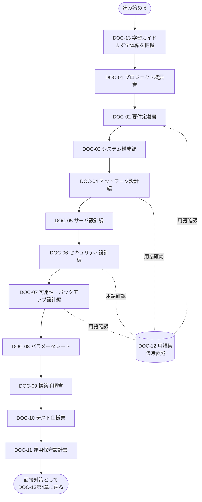
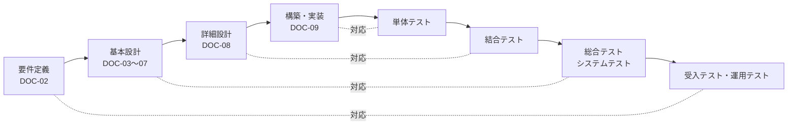
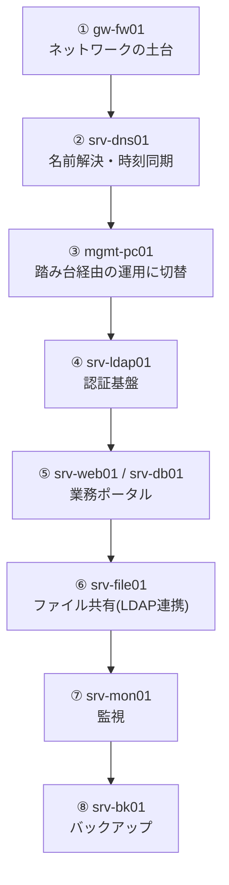

# DOC-13 学習ガイド(このポートフォリオの使い方)

> **実施状況の読み方（2026年9月11日）**：本書は架空案件の教材です。文書内の日付・担当者・レビュー履歴は演習上の記入例を含みます。本人のVM構築・試験・独力説明の記録は未掲載です。以下の面接例は説明練習の材料であり、実施済みの本人実績を表すものではありません。公開資料で確認できる範囲は[README](../README.md)にまとめています。
>
> ### 📘 学習ポイント
> この文書は、DOC-01からDOC-12までの設計書一式を「どの順番で読み」「面接でどう使うか」をまとめた案内書です。実務のプロジェクトでも、新しく参画したメンバーのために文書体系全体を俯瞰させるオンボーディング資料や、成果物の一覧を示す文書管理台帳が用意されることがあり、本書はその役割を模しています。学習者ご本人にとっては構築の進め方の指針として、採用担当者・面接官の方にとってはこのポートフォリオ一式の全体像を短時間で把握するための地図として、それぞれ活用いただけます。まずは本書に目を通してから、他の設計書を開くことをおすすめします。

## 改訂履歴

| 版数 | 日付 | 内容 | 作成者 |
|---|---|---|---|
| v0.1 | 2026-08-01 | 初版ドラフト作成(全体構成・読了順の骨子作成) | 〇〇 〇〇 |
| v1.0 | 2026-08-20 | レビュー反映、面接逆引きガイド・FAQ・ロードマップを追記して確定 | 〇〇 〇〇 |

## 文書基本情報

| 項目 | 内容 |
|---|---|
| 文書番号 | DOC-13 |
| 文書名 | 学習ガイド(このポートフォリオの使い方) |
| 対象ファイル | 13_学習ガイド.md |
| 作成日 | 2026年8月1日 |
| 最終改訂日 | 2026年8月20日 |
| バージョン | v1.0 |
| 作成者 | 〇〇 〇〇(要記入) |
| レビュー者 | (要記入) |

---

## 1. この文書の位置づけと使い方

本書(DOC-13)は、DOC-01からDOC-12までの設計書一式の読み方・使い方をまとめた案内文書である。実務においても、大規模なプロジェクトでは新規参画メンバー向けに文書体系全体を俯瞰させるオンボーディング資料や、成果物一覧を示す文書管理台帳が用意されることが多く、本書はその役割を模したものである。

本演習における発注者は架空企業「株式会社サンプル物産」(従業員60名、卸売業、東京都内に本社1拠点)である。老朽化したWindows Server 2012の共有フォルダのみで運用しており、アカウントは各PCローカル管理でバラバラ、サーバの死活監視の仕組みがなく、バックアップも手動のUSB HDDコピーで世代管理がされていないという課題を抱えている。この課題を解決するために、DOC-01〜DOC-11の一連の設計書が作成された。本書はそれらを俯瞰する立場の文書であり、個々の技術仕様は記載しない。

本書の想定読者は次の2者である。

- **学習者本人(ポートフォリオ作成者)**: 構築を進める際の手順の指針として、また面接で聞かれたときの受け答えの準備として活用する。
- **採用担当者・面接官**: このポートフォリオ一式がどのような意図・構成で作られているかを短時間で把握するためのガイドとして活用する。

> 💡 **なぜこう設計するのか**
> 設計書は「読む人が迷わないこと」がとても大切です。実務のプロジェクトでも、何十ページもある設計書一式をいきなり渡されると、どこから読めばよいのか分からず時間を無駄にしてしまうことがあります。そこで本演習では、あえて「読み方の説明書」であるDOC-13を独立した1文書として用意しました。これは、面接という限られた時間の中で相手を的確に案内するための工夫でもあります。「自分が作ったものを、他人が迷わず理解できるように整理する」という姿勢そのものが、インフラエンジニアに求められる資質の一つです。

---

## 2. 設計書パック全体の構成と読む順番

本演習で作成する設計書一式は、DOC-01からDOC-13までの13文書で構成される。各文書は独立して読めるように作られているが、初めて全体を読む場合は番号順に読み進めることを推奨する。

| 文書番号 | ファイル名 | 内容 | 主な読者 |
|---|---|---|---|
| DOC-01 | 01_プロジェクト概要書.md | プロジェクトの背景・課題・ゴール・体制 | 採用担当者/学習者 |
| DOC-02 | 02_要件定義書.md | 機能要件・非機能要件の定義 | 学習者 |
| DOC-03 | 03_基本設計書_システム構成編.md | システム全体構成(サーバ一覧・構成図) | 学習者/面接官 |
| DOC-04 | 04_基本設計書_ネットワーク設計編.md | ネットワークセグメント設計・VLAN設計 | 学習者/面接官 |
| DOC-05 | 05_基本設計書_サーバ設計編.md | 各サーバの役割・ミドルウェア設計 | 学習者/面接官 |
| DOC-06 | 06_基本設計書_セキュリティ設計編.md | 認証・アクセス制御・ファイアウォール方針 | 学習者/面接官 |
| DOC-07 | 07_基本設計書_可用性バックアップ設計編.md | 可用性・RPO/RTO・バックアップ設計 | 学習者/面接官 |
| DOC-08 | 08_詳細設計書_パラメータシート.md | 実機に設定する値の一覧(パラメータシート) | 学習者(構築時) |
| DOC-09 | 09_構築手順書.md | 実際の構築コマンド・作業手順 | 学習者(構築時) |
| DOC-10 | 10_テスト仕様書.md | 単体・結合・総合・受入の各テスト仕様 | 学習者(検証時) |
| DOC-11 | 11_運用保守設計書.md | 運用ルール・監視・障害対応・保守 | 学習者/面接官 |
| DOC-12 | 12_用語集.md | 全文書共通の専門用語辞書(随時参照) | 学習者 |
| DOC-13 | 13_学習ガイド.md | 本書。読み方・使い方の案内 | 学習者/採用担当者(最初に) |

DOC-12(用語集)とDOC-13(本書)は、上から下に読み進める一連の流れの中にはなく、必要なタイミングで随時開く「レファレンス」に位置づけられる。読む順番のイメージは以下の通りである。



採用担当者・面接官が短時間で全体像だけを把握したい場合は、DOC-13(本書)→DOC-01(概要)→DOC-03(システム構成)の3文書だけでも要点はつかめる構成にしている。

> 💡 **なぜこう設計するのか**
> 実務の設計書は「要件→基本設計→詳細設計→構築→テスト→運用」という工程の順に並べるのが一般的です。これは、後工程の文書ほど内容が具体的・技術的になり、前工程の合意事項を前提に読む必要があるためです。用語集を独立させたのも理由があります。専門用語の説明を各文書に毎回長々と書くと本文が読みにくくなる一方、説明を省くと初心者や非エンジニアの採用担当者が置いていかれてしまいます。そこで「初出時に一言だけ添えて、詳しくは用語集へ」という二段構えにすることで、両方の読者に対応しています。

---

## 3. 開発工程(ウォーターフォール/V字モデル)と各文書の対応関係

現場のシステム開発では、要件定義から運用まで工程を上流から下流へ順に進めるウォーターフォールモデル(工程を1つずつ完了させながら段階的に進める開発手法。前工程の成果物を確定させてから次工程に進む)(※用語集(12_用語集.md)参照)が、特にインフラ構築案件では広く採用されている。さらに、設計工程と対応するテスト工程を対にして図示した考え方をV字モデル(左側に要件定義・設計・実装を上から下に並べ、右側に対応する受入テスト・総合テスト・結合テスト・単体テストを下から上に並べて、両者の対応関係をV字型で表現したモデル)(※用語集(12_用語集.md)参照)と呼ぶ。「どの設計内容を、どのテストで検証するか」を対応づけることで、設計漏れやテスト漏れを防ぐ狙いがある。

本ポートフォリオのDOC-01〜DOC-11は、このV字モデルに沿って作成されている。対応関係は以下の通りである。



| 開発工程 | 対応文書 | 対応するテスト工程(V字右側) | 検証内容の例 |
|---|---|---|---|
| 要件定義 | DOC-02 要件定義書 | 受入テスト・運用テスト | 部門別アクセス制御やRPO/RTOなど、発注者の要求を満たしているか |
| 基本設計 | DOC-03〜DOC-07 | 総合テスト(システムテスト) | ネットワーク・サーバ・セキュリティ・可用性がシステム全体として機能するか |
| 詳細設計 | DOC-08 パラメータシート | 結合テスト | サーバ間連携(LDAP認証連携、DB接続など)が設計値通りに動くか |
| 構築・実装 | DOC-09 構築手順書 | 単体テスト | 個々のサーバ・サービスが単体で正しく動作するか |
| (運用移行後) | DOC-11 運用保守設計書 | (継続的な監視・保守) | サーバ監視(srv-mon01)やバックアップ(srv-bk01)が継続的に機能しているか |

すべてのテスト内容(単体・結合・総合・受入)の具体的な項目はDOC-10 テスト仕様書にまとめている。

> 💡 **なぜこう設計するのか**
> 個人のポートフォリオ演習であれば、正直なところ「設計してすぐ作る」という進め方でも構築自体は可能です。それでもあえてウォーターフォール/V字モデルの形式を踏襲したのは、チーム開発の現場で必ず求められる「工程を分けて合意を取りながら進める」進め方に慣れておくためです。面接では「なぜ一人称の演習なのに、ここまで工程を分けたのか」と聞かれることがありますが、その際は「実際のチーム開発を想定して、後から他の人が読んでも設計意図が追える文書構成にした」と説明すると納得感が生まれます。

---

## 4. 面接での「逆引き」活用ガイド

本章では、面接でよくある質問と、それに対してどの文書のどの部分を見せながら、どう説明するとよいかを具体例で示す。プロジェクトゴールの5項目(ファイル共有基盤・認証基盤・業務ポータル基盤・監視体制・バックアップ体制)に対応させて整理した。

### 本人の判断を短く残す記録欄

以下をコピーし、実際に行った一つの作業について本人の言葉で記入する。説明例やAIの提案をそのまま本人の判断として埋めず、支援を受けた箇所を明記する。未着手は `NOT RUN`、結果が期待と異なる場合は `FAIL`、前提不足で進められない場合は `BLOCKED` とし、確認できた範囲に限って `PASS` とする。

| 項目 | 本人の記入欄（未記入のテンプレート） |
| --- | --- |
| 対象・実施日・環境・結果 | 未記入。対象ホストと試験IDを特定する |
| なぜその設定にしたか | 未記入。要件・別案・選んだ理由を一言ずつ書く |
| 正常・異常を何で判断したか | 未記入。期待値と実際の出力、ログや画像の保存先を書く |
| 最初の仮説が外れたときに調べたこと | 未記入。該当する出来事がなければ、その旨を書く |
| 失敗したらどう戻すか | 未記入。戻す対象・手順・確認方法、実施したか予定かを書く |
| 自分の担当と支援の範囲 | 未記入。本人操作・AI提案・第三者助言を分ける |
| 資料を閉じて説明した結果 | 未記入。説明した日、説明できた点・詰まった点を書く |

記録がない項目については「教材ではこの設計を扱っています。本人環境での実行結果は未記録です」と説明する。RTO/RPOなどの設計目標は、実測していなければ目標として伝える。

### 例1:「ネットワーク構成について説明してください」

- **見せる文書**: DOC-04 基本設計書_ネットワーク設計編(ネットワークセグメント設計表、構成図)
- **説明のしかた**: 「社内ネットワークを役割ごとに5つのセグメントに分割しました」と述べ、下表を見せながら、管理LAN(VLAN10・192.168.10.0/24)・サーバLAN(VLAN20・192.168.20.0/24)・内部LAN(VLAN30・192.168.30.0/24)・DMZ(VLAN40・192.168.40.0/24、将来の外部公開用として設計のみ実施)の役割を説明する。VLAN(Virtual LANの略。1台の物理スイッチを論理的に複数のネットワークへ分割する技術)(※用語集(12_用語集.md)参照)によってセグメントを分けている点、および全セグメント間の通信をgw-fw01(ゲートウェイ/ファイアウォール)が中継・制御している点を強調する。

| セグメント名 | VLAN ID | CIDR | 用途 | GW(ゲートウェイ)IP |
|---|---|---|---|---|
| WAN | - | 203.0.113.0/24(RFC5737 TEST-NET-3の例示用アドレス) | インターネット接続用(演習では疑似) | 203.0.113.1(ISP側) |
| 管理LAN | VLAN10 | 192.168.10.0/24 | サーバ管理・SSH踏み台用 | 192.168.10.1 |
| サーバLAN | VLAN20 | 192.168.20.0/24 | 各種業務サーバ設置用 | 192.168.20.1 |
| 内部LAN | VLAN30 | 192.168.30.0/24 | 社員PC・クライアント端末用 | 192.168.30.1 |
| DMZ | VLAN40 | 192.168.40.0/24 | 将来の外部公開用(本演習では未使用領域として設計のみ) | 192.168.40.1 |

WAN欄の203.0.113.0/24は、RFC5737という技術文書で「文書・例示専用」と定められたTEST-NET-3という範囲のアドレスである。実在のインターネット上のIPアドレスを設計書に書いてしまうと、意図せず他者の環境と混同したり、公開したポートフォリオが誤解を招いたりする恐れがある。そのため本演習ではあえてこの例示用アドレスを使用しており、この配慮自体も面接で説明できるポイントである。

### 例2:「なぜこの認証方式(LDAP)を選んだのですか」

- **見せる文書**: DOC-05 サーバ設計編、DOC-06 セキュリティ設計編(srv-ldap01の設計)
- **説明のしかた**: 「刷新前は各PCにローカルアカウントがバラバラに存在しており、退職者アカウントの削除漏れなど統制上のリスクがありました」という現状課題(株式会社サンプル物産の課題)から入り、srv-ldap01(192.168.20.12、OpenLDAP 2.6)でアカウントを一元管理する設計にしたことを説明する。LDAP(Lightweight Directory Access Protocolの略。組織内のユーザーやコンピュータの情報を一元管理するための仕組み)(※用語集(12_用語集.md)参照)を導入することで、srv-file01(ファイル共有)やsrv-web01(業務ポータル)など複数のサーバが同じ認証基盤を参照できるようにした点がポイントである。

### 例3:「社内ポータルとDBの構成について教えてください」

- **見せる文書**: DOC-03 システム構成編、DOC-05 サーバ設計編
- **説明のしかた**: srv-web01(192.168.20.13、Apache HTTP Server 2.4 + PHP 8.2)とsrv-db01(192.168.20.14、MariaDB 10.11)を分離配置した理由(Webサーバとデータベースサーバの役割を分けることで、負荷分散や障害切り分けをしやすくするため)を説明する。db01のスペックが4vCPU/8GBメモリと他のサーバより高めに設定されている点にも触れ、「データベース処理は相対的に負荷が高いため、余裕を持たせた」と補足すると設計意図が伝わりやすい。

### 例4:「サーバの死活監視はどのように設計しましたか」

- **見せる文書**: DOC-07 可用性バックアップ設計編、DOC-11 運用保守設計書
- **説明のしかた**: 刷新前は「サーバの死活監視の仕組みがない」という課題があったことに触れたうえで、srv-mon01(192.168.20.16)にZabbix Server/Web 6.4を導入し、各サーバにZabbix Agent2(監視対象のサーバに常駐させ、CPU・メモリ・ディスク・サービス稼働状況などの情報を監視サーバへ送るソフトウェア)(※用語集(12_用語集.md)参照)を配置して一元監視する構成にしたと説明する。「障害の発生に気づけない状態」から「異常を検知できる状態」に変えたことが刷新の価値だと伝えると効果的である。

### 例5:「バックアップ設計の考え方を教えてください」

- **見せる文書**: DOC-07 可用性バックアップ設計編
- **説明のしかた**: 刷新前は「手動でUSB HDDにコピーするのみで世代管理がされていない」という課題があったことに触れる。刷新後はRPO(目標復旧時点。障害発生時に、どの時点のデータまで復旧できればよいかを示す指標)(※用語集(12_用語集.md)参照)を24時間、RTO(目標復旧時間。障害発生からシステム復旧までに許容される時間を示す指標)(※用語集(12_用語集.md)参照)を4時間と定義し、srv-file01(共有データ)・srv-db01(DBダンプ)・srv-ldap01(LDAPデータ)をrsync(差分のみを効率よく転送できるファイル同期コマンド)(※用語集(12_用語集.md)参照)でsrv-bk01(192.168.20.17)へ日次差分(23:00)+週次フル(日曜23:00)、4世代保持する設計にしたと説明する。数値(RPO/RTO、世代数)を具体的に言えることが「なんとなくバックアップした」演習と一線を画すポイントである。

> 💡 **なぜこう設計するのか**
> 面接で技術的な深掘り質問をされたとき、手順の丸暗記だけでは条件が変わった場合の説明が難しくなります。本章では「架空の発注者の課題→設計判断の理由→採用した技術」という順番で整理しました。数値(IPアドレスやRPO/RTOなど)に加えて、設計目標と実測結果の違い、その設計を選ぶ理由を自分の言葉で説明する練習に使ってください。

---

## 5. 学習ロードマップ:実際に手を動かす場合の構築順序

学習環境ではVirtualBox 7.x(ホストOS上で動作する仮想化ソフトウェア。1台の物理PCの中に複数の仮想マシンを作ることができる、いわゆるType2ハイパーバイザ)(※用語集(12_用語集.md)参照)を用い、自宅PC1台でサーバ9台を再現する。本番を想定する場合は、オンプレミスの物理サーバ2台とVMware ESXi(物理サーバに直接インストールして動作するType1ハイパーバイザ。VirtualBoxよりも本番運用向けの機能を備える)(※用語集(12_用語集.md)参照)による仮想化基盤に置き換わる、という対応関係を意識しておくとよい。

サーバ一覧(DOC-03/DOC-05に掲載の正の一覧)は以下の通りである。構築の際はこの一覧の値をそのまま使用する。

| No | ホスト名 | 役割 | 設置セグメント | IPアドレス | OS | 主要ミドルウェア | スペック(vCPU/メモリ/ディスク) |
|---|---|---|---|---|---|---|---|
| 1 | gw-fw01 | ゲートウェイ/ファイアウォール(セグメント間ルーティング・NAT) | 全セグメントに接続(マルチホーム) | 各セグメントの.1 | AlmaLinux 9.4 | firewalld, nftables | 2vCPU/2GBメモリ/20GBディスク |
| 2 | mgmt-pc01 | 管理端末(踏み台サーバ) | 管理LAN | 192.168.10.11 | AlmaLinux 9.4 | OpenSSH | 2vCPU/2GBメモリ/20GBディスク |
| 3 | srv-dns01 | DNS/DHCPサーバ(社内NTPサーバも兼務) | サーバLAN | 192.168.20.11 | AlmaLinux 9.4 | BIND 9.18, Kea DHCP 2.4, chrony | 2vCPU/2GBメモリ/20GBディスク |
| 4 | srv-ldap01 | 認証統合サーバ | サーバLAN | 192.168.20.12 | AlmaLinux 9.4 | OpenLDAP 2.6 | 2vCPU/4GBメモリ/30GBディスク |
| 5 | srv-web01 | 社内業務ポータルWebサーバ | サーバLAN | 192.168.20.13 | AlmaLinux 9.4 | Apache HTTP Server 2.4, PHP 8.2 | 2vCPU/4GBメモリ/40GBディスク |
| 6 | srv-db01 | データベースサーバ | サーバLAN | 192.168.20.14 | AlmaLinux 9.4 | MariaDB 10.11 | 4vCPU/8GBメモリ/60GBディスク |
| 7 | srv-file01 | ファイル共有サーバ | サーバLAN | 192.168.20.15 | AlmaLinux 9.4 | Samba 4.19(LDAP連携認証) | 4vCPU/8GBメモリ/200GBディスク |
| 8 | srv-mon01 | 監視サーバ | サーバLAN | 192.168.20.16 | AlmaLinux 9.4 | Zabbix Server/Web 6.4, 各サーバにZabbix Agent2 | 2vCPU/4GBメモリ/50GBディスク |
| 9 | srv-bk01 | バックアップサーバ | サーバLAN | 192.168.20.17 | AlmaLinux 9.4 | rsync, cron | 2vCPU/4GBメモリ/500GBディスク(バックアップ保存用) |

推奨する構築順序は以下の通りである。依存関係(あるサーバが別のサーバの機能に依存すること)を踏まえ、土台となるサーバから着手する。



| 順序 | 対象サーバ | 主な作業 | なぜこの順番か |
|---|---|---|---|
| ① | gw-fw01 | セグメント間ルーティング・NAT・firewalldの基本設定 | これがないと他のセグメントが互いに通信できず、インターネット接続(演習では疑似)もできないため、最初に土台を作る必要がある |
| ② | srv-dns01 | DNS・DHCP(Kea)・NTP(chrony)の設定 | 名前解決とサーバ間の時刻同期は全サーバ共通の基盤である。特に認証系のログ突き合わせやTLS証明書の有効期限判定は時刻がずれると正しく機能しないため、早い段階で固めておく |
| ③ | mgmt-pc01 | 踏み台サーバ(バスチオンホスト。外部から直接サーバ本体へアクセスさせず、一度経由させることで通信経路を絞り込む中継サーバ)(※用語集(12_用語集.md)参照)としてのSSH設定 | 以降の作業を管理LAN経由のSSHで行うようにすることで、本番に近い運用形態(サーバLANへ直接ログインしない)に早めに移行できる |
| ④ | srv-ldap01 | OpenLDAPのインストール・スキーマ設定・初期アカウント登録 | 後続のsrv-file01がLDAP連携認証を行うため、認証の受け皿を先に用意しておく必要がある |
| ⑤ | srv-web01 / srv-db01 | Apache/PHP、MariaDBのインストールと業務ポータルの動作確認 | 認証基盤ができたら、次はアプリケーション層(業務ポータル)を組み立てる。WebとDBは相互に依存するため同じ段階でまとめて着手する |
| ⑥ | srv-file01 | Sambaのインストールと部門別アクセス制御(LDAP連携) | LDAPと連携した権限設計を行うため、認証基盤(④)が先に完成している必要がある |
| ⑦ | srv-mon01 | Zabbix Server/Webの構築、各サーバへのAgent2配布 | 監視対象のサーバがまだ存在しない段階では監視項目を具体的に検討しづらい。対象が出そろってから監視設計を行う方が効率的である |
| ⑧ | srv-bk01 | rsyncスクリプトとcronによる日次差分・週次フルの設定 | バックアップ対象のデータ(共有ファイル・DBダンプ・LDAPデータ)が実際に存在してから、世代管理を含めた動作検証ができる |

踏み台サーバ(mgmt-pc01)経由でサーバLAN上のサーバへ接続する際のイメージは以下の通りである。

```bash
# 管理LAN上の踏み台(mgmt-pc01: 192.168.10.11)経由で
# サーバLAN上のsrv-web01(192.168.20.13)へSSH接続する例
ssh -J admin@192.168.10.11 admin@192.168.20.13
```

> 💡 **なぜこう設計するのか**
> 「土台→認証→アプリケーション→周辺機能」という順序には理由があります。特につまずきやすいのが認証基盤の順序で、先にsrv-file01やsrv-web01を作ってしまうと、後からLDAP連携を追加する際に「一度作ったローカル設定をLDAP前提に作り直す」という手戻りが発生しがちです。これは実務でもよくある「鶏と卵」の問題(認証基盤がないとアプリが作れないが、アプリがないと認証基盤の必要性が実感しにくい)で、先に依存される側(認証・名前解決・ネットワーク)から作るという原則を体で覚えておくと、将来別の案件でも応用が利きます。

---

## 6. 初心者がつまずきやすいポイント Q&A

**Q1. なぜ全部Linux(AlmaLinux)で構築するのですか。Windows Serverは使わないのですか。**

刷新前の環境がWindows Server 2012であったことを踏まえると、Windows Serverで刷新する選択肢もあり得る。しかし本演習では、無償で利用できるAlmaLinux(Red Hat Enterprise Linuxと互換性を持つ無償のLinuxディストリビューション)(※用語集(12_用語集.md)参照)を採用し、あえてOpenLDAPによる認証基盤を構築している。これは、サーバ構築エンジニアとして需要の高いLinux操作スキルを示せること、また実務ではActive Directory(Windowsサーバによるディレクトリサービス)を使う現場も多い中で、OpenLDAPを扱っておくことでディレクトリサービス全般の考え方(アカウントを一元管理する仕組み)を汎用的に理解できることが理由である。面接では「Windowsの現場でも、LDAPで学んだ一元管理の考え方は応用できます」と説明するとよい。

**Q2. VLANでネットワークを分ける理由がよく分かりません。1つのネットワークにまとめてはいけないのですか。**

技術的には1つのネットワークにまとめることも可能だが、そうすると社員PCから直接サーバへ、あるいは万一侵入された端末から他の全サーバへ、無制限にアクセスできてしまう。これは多層防御(1つの対策が破られても被害が全体に及ばないよう、複数の防御層を重ねる考え方)(※用語集(12_用語集.md)参照)の考え方に反する。VLANでセグメントを分け、gw-fw01でセグメント間の通信を必要最小限に絞ることで、仮に内部LAN(社員PC側)で問題が起きても、サーバLANへの影響を限定できる。詳細はDOC-04・DOC-06を参照のこと。

**Q3. RPOとRTOの違いがよく分かりません。**

RPO(目標復旧時点)は「バックアップからどの時点のデータまで戻ってよいか」を表す指標で、本演習では24時間としている。つまり、最悪の場合でも24時間分のデータ損失までは許容する設計である。一方RTO(目標復旧時間)は「障害発生からシステムを復旧させるまでに許容される時間」を表す指標で、本演習では4時間としている。「データがどこまで戻るか」がRPO、「どれだけ早く戻すか」がRTOと覚えるとよい。詳細はDOC-07を参照のこと。

**Q4. 本番はESXiを想定しているのに、なぜ学習はVirtualBoxで進めてよいのですか。**

ESXiは物理サーバに直接インストールして動作するType1ハイパーバイザ、VirtualBoxはWindowsやmacOSなどのホストOS上で動作するType2ハイパーバイザという違いはあるが、「1台の物理機材の上に複数の仮想マシンを作り、それぞれを独立したサーバとして扱う」という仮想化の基本概念自体は共通している。学習目的においてはVirtualBoxで十分に構築・検証ができる。面接では「学習環境ではVirtualBoxを使用しましたが、本番運用ではESXiのような本番向けハイパーバイザへの置き換えを想定しています」と、対応関係を明確に説明できれば問題ない。

**Q5. 転職活動でこのポートフォリオをどう見せればよいか分かりません。全部暗記しないといけませんか。**

全文書・全設定値を暗記する必要はない。本書(DOC-13)第4章の「面接での逆引き活用ガイド」を使い、想定される質問ごとに「どの設計書のどの部分を開くか」をあらかじめ決めておくことをおすすめする。面接の場でIPアドレスや設定値を諳んじる必要はなく、設計書を画面共有しながら「なぜこの設計にしたか」を自分の言葉で語れることの方が重要である。

---

## 7. 学習を深めるための次のステップ

本ポートフォリオで扱った領域(サーバ構築、ネットワーク、セキュリティ、DB、監視)は、それぞれ関連する資格・学習キーワードが存在する。詳細な試験制度の説明は割愛し、名称のみを分野別に紹介する。今後の学習の道しるべとして活用されたい。

| 分野 | 関連資格・キーワード |
|---|---|
| Linux/インフラ全般 | LPIC-1, LPIC-2, LinuC, 基本情報技術者試験, 応用情報技術者試験 |
| ネットワーク | CCNA, ネットワークスペシャリスト試験 |
| クラウド | AWS認定 ソリューションアーキテクト – アソシエイト(AWS SAA), Microsoft Azure Fundamentals(AZ-900) |
| データベース | OSS-DB技術者認定 |
| セキュリティ | 情報セキュリティマネジメント試験, CompTIA Security+ |
| 運用・サービスマネジメント | ITIL Foundation |

> 💡 **なぜこう設計するのか**
> 資格はゴールではなく、学習した内容を体系的に整理し直すための道具として位置づけるとよいでしょう。このポートフォリオで「手を動かして構築した経験」と、資格学習で得られる「体系立った知識の裏付け」を組み合わせることで、面接での説得力が大きく増します。特にネットワーク(CCNA)とLinux(LPIC)は、本ポートフォリオの内容と直結する分野なので、次の学習ステップとして着手しやすいはずです。

---

## 8. 付録:面接直前に見返すマスタ数値早見表

面接直前の見直し用に、全文書で共通して使用しているマスタ数値をまとめる。値はDOC-03〜DOC-07に記載のものと完全に一致しており、変更してはならない。

**ネットワークセグメント設計**(詳細はDOC-04 基本設計書_ネットワーク設計編を参照)

| セグメント名 | VLAN ID | CIDR | 用途 | GW(ゲートウェイ)IP |
|---|---|---|---|---|
| WAN | - | 203.0.113.0/24(RFC5737 TEST-NET-3の例示用アドレス) | インターネット接続用(演習では疑似) | 203.0.113.1(ISP側) |
| 管理LAN | VLAN10 | 192.168.10.0/24 | サーバ管理・SSH踏み台用 | 192.168.10.1 |
| サーバLAN | VLAN20 | 192.168.20.0/24 | 各種業務サーバ設置用 | 192.168.20.1 |
| 内部LAN | VLAN30 | 192.168.30.0/24 | 社員PC・クライアント端末用 | 192.168.30.1 |
| DMZ | VLAN40 | 192.168.40.0/24 | 将来の外部公開用(本演習では未使用領域として設計のみ) | 192.168.40.1 |

**サーバ一覧**(詳細はDOC-03 システム構成編・DOC-05 サーバ設計編を参照)

| No | ホスト名 | 役割 | 設置セグメント | IPアドレス | OS | 主要ミドルウェア | スペック(vCPU/メモリ/ディスク) |
|---|---|---|---|---|---|---|---|
| 1 | gw-fw01 | ゲートウェイ/ファイアウォール(セグメント間ルーティング・NAT) | 全セグメントに接続(マルチホーム) | 各セグメントの.1 | AlmaLinux 9.4 | firewalld, nftables | 2vCPU/2GBメモリ/20GBディスク |
| 2 | mgmt-pc01 | 管理端末(踏み台サーバ) | 管理LAN | 192.168.10.11 | AlmaLinux 9.4 | OpenSSH | 2vCPU/2GBメモリ/20GBディスク |
| 3 | srv-dns01 | DNS/DHCPサーバ(社内NTPサーバも兼務) | サーバLAN | 192.168.20.11 | AlmaLinux 9.4 | BIND 9.18, Kea DHCP 2.4, chrony | 2vCPU/2GBメモリ/20GBディスク |
| 4 | srv-ldap01 | 認証統合サーバ | サーバLAN | 192.168.20.12 | AlmaLinux 9.4 | OpenLDAP 2.6 | 2vCPU/4GBメモリ/30GBディスク |
| 5 | srv-web01 | 社内業務ポータルWebサーバ | サーバLAN | 192.168.20.13 | AlmaLinux 9.4 | Apache HTTP Server 2.4, PHP 8.2 | 2vCPU/4GBメモリ/40GBディスク |
| 6 | srv-db01 | データベースサーバ | サーバLAN | 192.168.20.14 | AlmaLinux 9.4 | MariaDB 10.11 | 4vCPU/8GBメモリ/60GBディスク |
| 7 | srv-file01 | ファイル共有サーバ | サーバLAN | 192.168.20.15 | AlmaLinux 9.4 | Samba 4.19(LDAP連携認証) | 4vCPU/8GBメモリ/200GBディスク |
| 8 | srv-mon01 | 監視サーバ | サーバLAN | 192.168.20.16 | AlmaLinux 9.4 | Zabbix Server/Web 6.4, 各サーバにZabbix Agent2 | 2vCPU/4GBメモリ/50GBディスク |
| 9 | srv-bk01 | バックアップサーバ | サーバLAN | 192.168.20.17 | AlmaLinux 9.4 | rsync, cron | 2vCPU/4GBメモリ/500GBディスク(バックアップ保存用) |

**その他の共通数値**

| 項目 | 値 |
|---|---|
| 内部ドメイン名 | sample-trading.local |
| ホスト名命名規則 | srv-<役割略称>01.sample-trading.local(管理端末のみmgmt-pc01.sample-trading.local) |
| 社員PCのDHCP払い出し範囲 | 192.168.30.100〜192.168.30.200(Kea DHCP、srv-dns01が兼務) |
| NTP参照先 | srv-dns01(chrony)、タイムゾーンはAsia/Tokyo |
| DNS参照先 | すべてsrv-dns01(192.168.20.11) |
| SSH認証方式 | 公開鍵認証のみ・rootログイン禁止・sudoによる権限昇格運用 |
| パッチ適用サイクル | dnf updateを月次定例(第1月曜)で実施 |
| RPO(目標復旧時点) | 24時間 |
| RTO(目標復旧時間) | 4時間 |
| バックアップ方式 | rsyncによる日次差分(23:00)+週次フル(日曜23:00)、4世代保持 |
| バックアップ対象 | srv-file01(共有データ)、srv-db01(DBダンプ)、srv-ldap01(LDAPデータ) |

---

本書はDOC-01〜DOC-12の内容を前提に書かれている。個々の設計値の根拠や技術的な詳細については、各章で示した参照先の文書(例:「※詳細はDOC-08 詳細設計書_パラメータシートを参照」)を直接確認されたい。専門用語で分からないものがあれば、その都度DOC-12 用語集.mdを参照することを推奨する。
